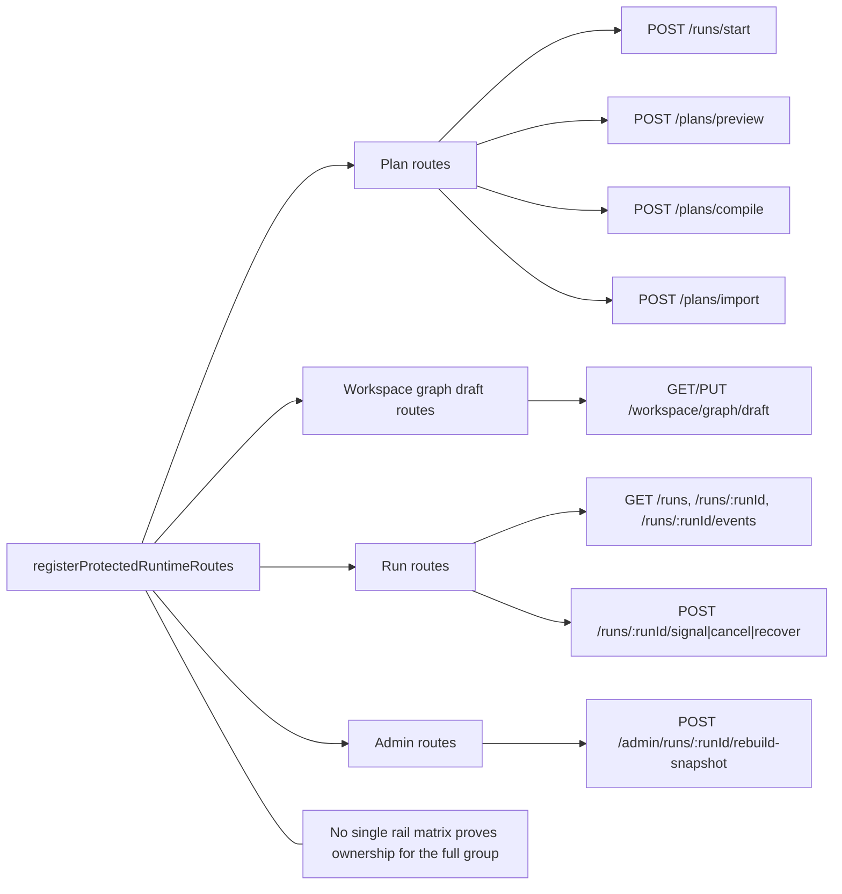
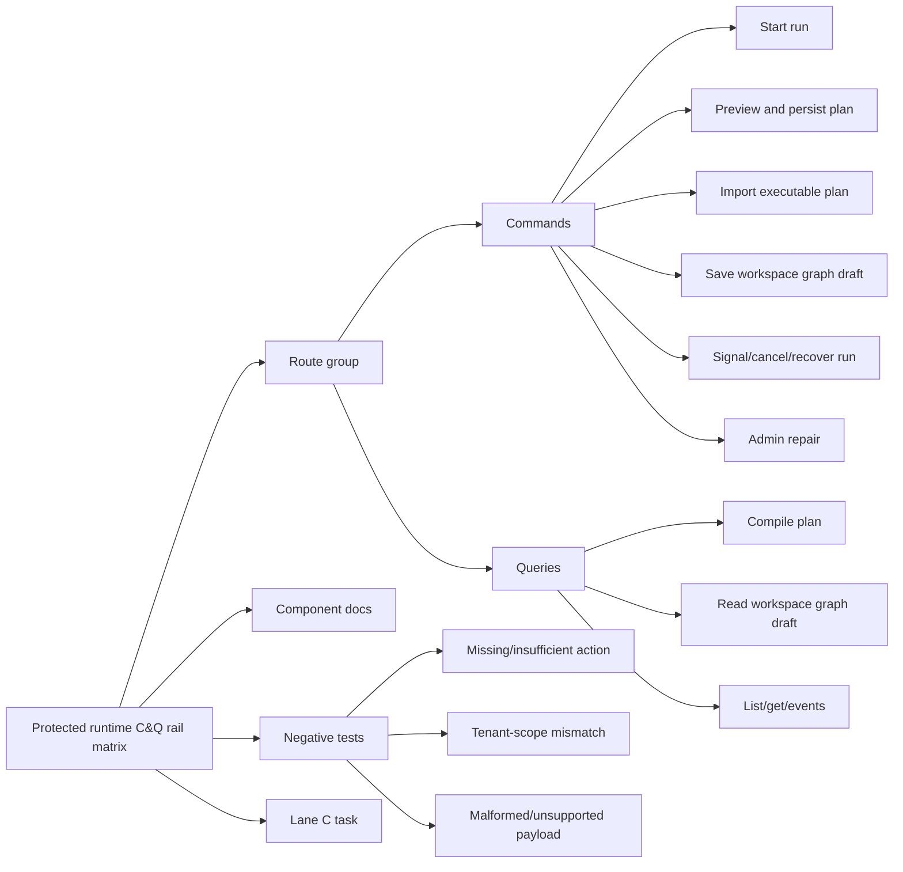

# Protected runtime rail closure plan

## Summary

`R-20260503-PROTECTED-RUNTIME-RAIL-CLOSURE` records that the protected runtime
HTTP surface is implemented, but the complete route group is not yet governed
as one executable command/query rail closure task.

This plan registers that work without changing behavior. The next
implementation slice must make the protected runtime route group mechanically
traceable from command/query rail to DDD owner, application port, adapter
surface, authorization rule, negative tests, and component documentation.

## Governing sources

- `AGENTS.md`
- `docs/planning/status/governance-document-rule-inventory.md`
- `docs/guides/ai-work-protocol.md`
- `docs/architecture/command-query-rail-governance.md`
- `docs/architecture/fowler-opportunity-planning-governance.md`
- `docs/planning/state/agent-lane-c.yaml`
- `docs/risk-register/quality/R-20260503-PROTECTED-RUNTIME-RAIL-CLOSURE.yaml`
- `docs/planning/proposals/mandatory/runtime-and-contracts/tenant-run-identity-platform-owned-run-id-plan-20260423.md`
- `docs/adr/adr-0050-platform-owned-start-run-identity.md`
- `docs/adr/ADR-0051-access-decision-service-and-openfga-adapter.md`
- `apps/api/src/entrypoints/http/registerProtectedRuntimeRoutes.ts`
- `apps/api/src/entrypoints/http/runtimeRoutes.constants.ts`
- `apps/api/test/entrypoints/http/registerProtectedRuntimeRoutes.test.ts`
- `apps/api/test/integration/protectedRuntime.integration.test.ts`

## Think-First Analysis

### Problem statement

The route group under `registerProtectedRuntimeRoutes` currently exposes a
real protected runtime control plane:

- plan build/import operations,
- workspace graph draft persistence,
- run listing and detail queries,
- run command operations,
- admin repair routes when explicitly enabled.

The code is already split into route handlers and use cases, and recent work
closed critical individual rails such as start-run identity and access-decision
ownership. The remaining gap is that the complete protected runtime surface is
not represented as one governed rail matrix. That makes it too easy for future
changes to add a route, dependency, mock behavior, or compatibility mode without
first answering which DDD object and command/query rail owns it.

### Root cause

The implementation evolved route by route. That produced useful local seams,
but no single executable planning artifact that says:

1. which route maps to which command or query,
2. which bounded context owns the behavior,
3. which application service or read model is the allowed owner,
4. which adapter surface is permitted,
5. which negative tests must exist before closure can be claimed.

### Fowler opportunity

This is a boundary-clarity refactoring and governance closure opportunity, not
feature expansion.

- **Fowler category**: clarify interface and extract/cohere component boundary.
- **DDD intent**: keep protected runtime as an application ingress over runtime,
  planner, workspace-draft, and admin-repair bounded contexts; do not let the
  HTTP entrypoint become a shadow domain model.
- **Hexagonal intent**: routes remain adapters, use cases remain application
  services, ports/adapters remain behind composition, and authorization remains
  a policy-enforcement point over canonical access decisions.

## Current State



Current good signals:

- `runtimeRoutes.constants.ts` centralizes the route list.
- route handlers are already separate files for start, preview, compile,
  import, list, get, events, signal, cancel, and recover.
- command routes share `executeAuthorizedRunCommandRoute`.
- AR-C7/AR-C8/AR-C9 already closed platform-owned run identity and access
  decision vocabulary.
- architecture tests exist for start-run and protected runtime composition.

Current closure gap:

- no canonical protected-runtime rail matrix covers the full route group,
- no lane task owns closure across all protected runtime routes,
- negative authorization and tenant-scope requirements are not summarized in a
  single acceptance matrix,
- compatibility posture for `CANCEL` through `/signal` is not governed as a
  deprecation/compatibility rail in the route group plan.

## Target State



The implementation PR after this plan must be able to answer, mechanically, for
each protected runtime route:

- route path and method,
- command or query kind,
- bounded context,
- DDD object/read model,
- application port or service,
- adapter surface,
- authorization action and tenant scope,
- required negative tests,
- component documentation owner,
- legacy/drift posture.

## Protected Runtime Rail Matrix

| Route                                      | Rail    | Bounded context              | DDD object/read model       | Application owner                                | Adapter surface                             | Authorization                                                 | Required negative tests                                                                    |
| ------------------------------------------ | ------- | ---------------------------- | --------------------------- | ------------------------------------------------ | ------------------------------------------- | ------------------------------------------------------------- | ------------------------------------------------------------------------------------------ |
| `POST /runs/start`                         | Command | Runtime safety and admission | `Run` command admission     | `StartRunAuthorizedFacade` / start-run use cases | protected HTTP route                        | `run:start`, tenant scope                                     | missing token, missing action, tenant mismatch, client `runId`, invalid plan source        |
| `POST /plans/preview`                      | Command | Planner/runtime admission    | executable plan draft       | `PreviewPlanUseCase`                             | protected HTTP route                        | planner/runtime command scope, tenant scope                   | missing token, missing action, tenant mismatch, invalid graph source, invalid selection    |
| `POST /plans/compile`                      | Query   | Planner boundary             | compiled plan response      | `CompilePlanUseCase`                             | protected HTTP route                        | planner query/action scope, tenant scope                      | missing token, missing action, tenant mismatch, unsupported adapter                        |
| `POST /plans/import`                       | Command | Runtime plan ingestion       | imported executable plan    | `ImportPlanUseCase`                              | protected HTTP route                        | plan import command scope, tenant scope                       | missing token, missing action, tenant mismatch, invalid plan ref                           |
| `GET /workspace/graph/draft`               | Query   | Workspace graph drafting     | workspace draft read model  | `getWorkspaceGraphDraftUseCase`                  | protected HTTP route                        | workspace draft read scope                                    | missing token, missing action, tenant/workspace mismatch                                   |
| `PUT /workspace/graph/draft`               | Command | Workspace graph drafting     | workspace draft aggregate   | `saveWorkspaceGraphDraftUseCase`                 | protected HTTP route                        | workspace draft save scope                                    | missing token, missing action, tenant/workspace mismatch, stale authority                  |
| `GET /runs`                                | Query   | Runtime read model           | run list read model         | `ListRunsUseCase`                                | protected HTTP route                        | `run:list`, tenant scope                                      | missing token, missing action, tenant mismatch                                             |
| `GET /runs/:runId`                         | Query   | Runtime read model           | run status read model       | `GetRunStatusUseCase`                            | protected HTTP route                        | `run:view`, tenant scope                                      | missing token, missing action, tenant mismatch, unknown run                                |
| `GET /runs/:runId/events`                  | Query   | Runtime read model           | run event stream read model | `GetRunEventsUseCase`                            | protected HTTP route                        | `run:logs:view`, tenant scope                                 | missing token, missing action, tenant mismatch, unknown run                                |
| `POST /runs/:runId/signal`                 | Command | Runtime control              | run signal command          | `SignalRunUseCase`                               | protected HTTP route                        | `run:signal`, or `run:cancel` only for compatibility `CANCEL` | missing token, missing action, tenant mismatch, unsupported signal, compatibility disabled |
| `POST /runs/:runId/cancel`                 | Command | Runtime control              | run cancel command          | `CancelRunUseCase`                               | protected HTTP route                        | `run:cancel`, tenant scope                                    | missing token, missing action, tenant mismatch, non-empty reason                           |
| `POST /runs/:runId/recover`                | Command | Runtime recovery             | run recovery command        | `RecoverRunUseCase`                              | protected HTTP route                        | recovery command scope, tenant scope                          | missing token, missing action, tenant mismatch, invalid recovery source                    |
| `POST /admin/runs/:runId/rebuild-snapshot` | Command | Runtime repair operations    | snapshot rebuild command    | `registerAdminRoutes` / maintenance port         | admin HTTP route behind explicit enablement | admin repair action, tenant/admin scope                       | disabled route, missing token, missing action, tenant mismatch                             |

The implementation slice must verify the exact action names in code before
turning this plan into acceptance evidence. If a row differs from current code,
the code or the matrix must be reconciled in the same PR; parallel semantics are
not allowed.

## Allowed Implementation Surface

Allowed code surfaces for the next implementation slice:

- `apps/api/src/entrypoints/http/registerProtectedRuntimeRoutes.ts`
- `apps/api/src/entrypoints/http/runtimeRoutes.constants.ts`
- protected runtime route handlers and parsers under
  `apps/api/src/entrypoints/http/*Route*.ts`
- shared route executors under `apps/api/src/entrypoints/http/`
- application services already named in the matrix
- local API component docs under `apps/api/docs/`
- route, integration, and architecture tests under `apps/api/test/`

Disallowed without a separate plan:

- changing engine contracts,
- changing planner contracts,
- introducing a new authorization backend,
- adding a second route for the same product intent,
- removing `CANCEL` compatibility through `/signal` without a governed
  deprecation plan,
- adding fake adapters, stubs, or local-only success paths.

## Implementation Decomposition

### AR-C10-A: rail matrix and component map hardening

- add or update API component documentation for the protected runtime route
  group,
- make each route row in this plan point to a concrete source file and test
  file,
- add architecture tests that fail if a protected runtime route exists outside
  the rail matrix or route summary.

### AR-C10-B: negative coverage closure

- inventory existing negative tests for each matrix row,
- add missing authorization, tenant-scope, malformed payload, and compatibility
  negative tests,
- keep test helpers shared where they express the same protected runtime
  contract, not copy-pasted per route.

### AR-C10-C: legacy and compatibility closure

- identify any compatibility route behavior that remains intentionally active,
- document whether it is canonical or temporary compatibility,
- remove stale docs or test wording that implies legacy semantics are accepted
  without a governing owner.

## Acceptance Criteria

- Lane C has one explicit protected runtime rail closure task.
- `open-task-route.md` shows that task until closure is implemented.
- Every protected runtime route in `runtimeRoutes.constants.ts` has a matrix
  row and component owner.
- Every matrix row has at least one positive test and the required negative
  tests, or an explicit blocker tracked in the lane task.
- No route handler owns domain behavior that belongs in an application service.
- No new command, query, service, route, or mock semantics are introduced for an
  intent that already has a rail.
- The risk entry `R-20260503-PROTECTED-RUNTIME-RAIL-CLOSURE` can move from open
  only after implementation evidence proves the matrix.

## Validation Plan

Planning PR:

- `pnpm docs:workboard:generate`
- `pnpm docs:sync`
- `pnpm verify:prepush`

Implementation PR:

- `pnpm --filter dvt-api exec vitest run test/entrypoints/http/registerProtectedRuntimeRoutes.test.ts`
- `pnpm --filter dvt-api exec vitest run test/entrypoints/http/*Route*.test.ts`
- `pnpm --filter dvt-api exec vitest run test/integration/protectedRuntime.integration.test.ts`
- `pnpm --filter dvt-api exec vitest run test/modules/protectedRuntimeAndPlanCompileArchitecture.cases.ts test/modules/protectedRuntimeDependencyBuilders.cases.ts`
- `pnpm --filter dvt-api typecheck`
- `pnpm verify:prepush`

## Feature Mechanization Manifest

```feature-mechanization
version: 1
featureId: PROTECTED-RUNTIME-RAIL-CLOSURE
mechanizationStatus: implemented
noHumanDecisionsRemaining: true
implementationPlan: docs/planning/proposals/mandatory/runtime-and-contracts/protected-runtime-rail-closure-plan-20260503.md
componentGuides:
  - docs/planning/proposals/mandatory/runtime-and-contracts/protected-runtime-rail-closure-plan-20260503.md
userStories:
  - docs/planning/proposals/web-user-stories-20260429.md
governingSources:
  - AGENTS.md
  - docs/planning/status/governance-document-rule-inventory.md
  - docs/guides/ai-work-protocol.md
  - docs/architecture/command-query-rail-governance.md
  - docs/architecture/fowler-opportunity-planning-governance.md
  - docs/planning/state/agent-lane-c.yaml
  - docs/risk-register/quality/R-20260503-PROTECTED-RUNTIME-RAIL-CLOSURE.yaml
allowedImplementationSurfaces:
  - apps/api/docs/protected-runtime-route-group-component.md
  - apps/api/src/application/ports/protectedRuntimeCommandQueryRails.ts
  - apps/api/test/entrypoints/http/protectedRuntimeRouteGroup.architecture.test.ts
  - docs/planning/proposals/mandatory/runtime-and-contracts/protected-runtime-rail-closure-plan-20260503.md
  - docs/planning/state/agent-lane-c.yaml
  - docs/planning/state/agent-lane-c.md
  - docs/planning/state/execution-workboard.md
  - docs/planning/state/open-task-route.md
  - docs/planning/status/**
  - docs/risk-register/quality/R-20260503-PROTECTED-RUNTIME-RAIL-CLOSURE.yaml
forbiddenImplementationSurfaces:
  - apps/web/**
  - packages/**
  - specs/**
  - .github/**
  - scripts/**
  - tools/**
commandQueryRails:
  - name: RegisterProtectedRuntimeRailClosureTask
    type: command
    dddOwner: Runtime safety planning state
  - name: ClassifyProtectedRuntimeRouteRails
    type: query
    dddOwner: Protected runtime rail matrix
  - name: UpdateProtectedRuntimeRailRiskMitigation
    type: command
    dddOwner: Protected runtime risk register
domainObjects:
  - name: ProtectedRuntimeRailMatrix
    type: component map
    owner: Architecture / API / Runtime
  - name: AR-C10ProtectedRuntimeRailClosureTask
    type: planning aggregate
    owner: Lane C
  - name: ProtectedRuntimeRailClosureRisk
    type: risk register entry
    owner: Architecture / API / Runtime
fowlerSignals:
  - Boundary drift
  - Divergent change
  - Shotgun surgery risk
architectureGuards:
  - pnpm docs:feature-mechanization --feature PROTECTED-RUNTIME-RAIL-CLOSURE
  - pnpm docs:feature-mechanization:implementation
cypressFlows:
  - N/A - protected runtime planning and governance only
completionGate:
  - pnpm docs:workboard:generate
  - pnpm docs:sync
  - pnpm docs:governance:file-component-index:check
  - pnpm docs:governance:coverage-report:check
  - pnpm docs:governance:file-fingerprint-baseline:check
  - pnpm docs:feature-mechanization --feature PROTECTED-RUNTIME-RAIL-CLOSURE
  - pnpm docs:feature-mechanization:implementation
  - pnpm verify:prepush
redGreenCycles:
  - id: protected-runtime-rail-planning-registration
    redTest: pnpm docs:feature-mechanization:implementation
    expectedFailure: Protected runtime rail planning files are outside allowedImplementationSurfaces before this manifest declares them.
    patchSurfaces:
      - docs/planning/proposals/mandatory/runtime-and-contracts/protected-runtime-rail-closure-plan-20260503.md
      - docs/planning/state/agent-lane-c.yaml
      - docs/risk-register/quality/R-20260503-PROTECTED-RUNTIME-RAIL-CLOSURE.yaml
    greenTest: pnpm docs:feature-mechanization:implementation
symbols:
  - name: ProtectedRuntimeRailClosurePlan
    path: docs/planning/proposals/mandatory/runtime-and-contracts/protected-runtime-rail-closure-plan-20260503.md
    dddOwner: Protected runtime rail matrix
    cqRails:
      - RegisterProtectedRuntimeRailClosureTask
      - ClassifyProtectedRuntimeRouteRails
      - UpdateProtectedRuntimeRailRiskMitigation
    fowlerSignals:
      - Boundary drift
      - Divergent change
      - Shotgun surgery risk
    architectureGuard: pnpm docs:feature-mechanization:implementation
    cypressCoverage: N/A - protected runtime planning and governance only
    unitTests:
      - pnpm docs:feature-mechanization --feature PROTECTED-RUNTIME-RAIL-CLOSURE
      - pnpm docs:feature-mechanization:implementation
  - name: DOC_PATH
    path: apps/api/test/entrypoints/http/protectedRuntimeRouteGroup.architecture.test.ts
    dddOwner: Protected runtime route group architecture test
    cqRails:
      - ClassifyProtectedRuntimeRouteRails
    fowlerSignals:
      - Boundary drift
    architectureGuard: pnpm --filter dvt-api exec vitest run test/entrypoints/http/protectedRuntimeRouteGroup.architecture.test.ts
    cypressCoverage: N/A - API architecture guard
    unitTests:
      - pnpm --filter dvt-api exec vitest run test/entrypoints/http/protectedRuntimeRouteGroup.architecture.test.ts
  - name: CATALOG_PATH
    path: apps/api/test/entrypoints/http/protectedRuntimeRouteGroup.architecture.test.ts
    dddOwner: Protected runtime route group architecture test
    cqRails:
      - ClassifyProtectedRuntimeRouteRails
    fowlerSignals:
      - Boundary drift
    architectureGuard: pnpm --filter dvt-api exec vitest run test/entrypoints/http/protectedRuntimeRouteGroup.architecture.test.ts
    cypressCoverage: N/A - API architecture guard
    unitTests:
      - pnpm --filter dvt-api exec vitest run test/entrypoints/http/protectedRuntimeRouteGroup.architecture.test.ts
  - name: PROTECTED_RUNTIME_COMMAND_QUERY_RAILS
    path: apps/api/src/application/ports/protectedRuntimeCommandQueryRails.ts
    dddOwner: Protected runtime rail matrix
    cqRails:
      - ClassifyProtectedRuntimeRouteRails
    fowlerSignals:
      - Boundary drift
      - Divergent change
    architectureGuard: pnpm --filter dvt-api exec vitest run test/entrypoints/http/protectedRuntimeRouteGroup.architecture.test.ts
    cypressCoverage: N/A - API architecture guard
    unitTests:
      - pnpm --filter dvt-api exec vitest run test/entrypoints/http/protectedRuntimeRouteGroup.architecture.test.ts
  - name: ProtectedRuntimeCommandQueryRail
    path: apps/api/src/application/ports/protectedRuntimeCommandQueryRails.ts
    dddOwner: Protected runtime rail matrix
    cqRails:
      - ClassifyProtectedRuntimeRouteRails
    fowlerSignals:
      - Boundary drift
    architectureGuard: pnpm --filter dvt-api exec vitest run test/entrypoints/http/protectedRuntimeRouteGroup.architecture.test.ts
    cypressCoverage: N/A - API architecture guard
    unitTests:
      - pnpm --filter dvt-api exec vitest run test/entrypoints/http/protectedRuntimeRouteGroup.architecture.test.ts
  - name: ProtectedRuntimeNegativeCoverage
    path: apps/api/src/application/ports/protectedRuntimeCommandQueryRails.ts
    dddOwner: Protected runtime rail matrix
    cqRails:
      - ClassifyProtectedRuntimeRouteRails
    fowlerSignals:
      - Boundary drift
      - Divergent change
    architectureGuard: pnpm --filter dvt-api exec vitest run test/entrypoints/http/protectedRuntimeRouteGroup.architecture.test.ts
    cypressCoverage: N/A - API architecture guard
    unitTests:
      - pnpm --filter dvt-api exec vitest run test/entrypoints/http/protectedRuntimeRouteGroup.architecture.test.ts
  - name: ProtectedRuntimeRailKind
    path: apps/api/src/application/ports/protectedRuntimeCommandQueryRails.ts
    dddOwner: Protected runtime rail matrix
    cqRails:
      - ClassifyProtectedRuntimeRouteRails
    fowlerSignals:
      - Boundary drift
    architectureGuard: pnpm --filter dvt-api exec vitest run test/entrypoints/http/protectedRuntimeRouteGroup.architecture.test.ts
    cypressCoverage: N/A - API architecture guard
    unitTests:
      - pnpm --filter dvt-api exec vitest run test/entrypoints/http/protectedRuntimeRouteGroup.architecture.test.ts
  - name: GOVERNED_ROUTE_RAILS
    path: apps/api/test/entrypoints/http/protectedRuntimeRouteGroup.architecture.test.ts
    dddOwner: Protected runtime route group architecture test
    cqRails:
      - ClassifyProtectedRuntimeRouteRails
    fowlerSignals:
      - Boundary drift
      - Divergent change
    architectureGuard: pnpm --filter dvt-api exec vitest run test/entrypoints/http/protectedRuntimeRouteGroup.architecture.test.ts
    cypressCoverage: N/A - API architecture guard
    unitTests:
      - pnpm --filter dvt-api exec vitest run test/entrypoints/http/protectedRuntimeRouteGroup.architecture.test.ts
  - name: PROTECTED_RUNTIME_ADAPTER_SURFACES
    path: apps/api/test/entrypoints/http/protectedRuntimeRouteGroup.architecture.test.ts
    dddOwner: Protected runtime route group architecture test
    cqRails:
      - ClassifyProtectedRuntimeRouteRails
    fowlerSignals:
      - Boundary drift
      - Divergent change
    architectureGuard: pnpm --filter dvt-api exec vitest run test/entrypoints/http/protectedRuntimeRouteGroup.architecture.test.ts
    cypressCoverage: N/A - API architecture guard
    unitTests:
      - pnpm --filter dvt-api exec vitest run test/entrypoints/http/protectedRuntimeRouteGroup.architecture.test.ts
```
