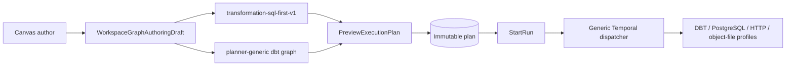
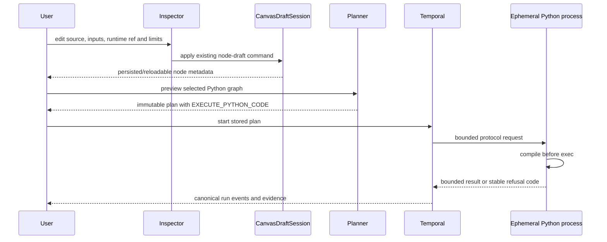

# Governed Python Code-Node Vertical

## Think-First Analysis

### Problem summary

DVT has a governed SQL-first transformation flow and several independently
composed Temporal step plugins, but it has no contract for code-bearing nodes.
A direct implementation such as executing Python in the browser, spawning an
interpreter in the API process, or retaining one shared notebook kernel would
create one or more of the following defects:

- a second execution authority beside the stored immutable plan;
- hidden cross-node state that is not represented by graph edges;
- an unsafe code-execution boundary inside a general-purpose service;
- plugin-specific branches in the generic Temporal dispatcher;
- unbounded source, stdout, stderr, result, time, or process lifetime;
- a misleading claim that an interpreter flag is a security sandbox; or
- a Python-specific model that cannot later admit R and SQL without duplication.

The existing `transformation-sql-first-v1` contract is intentionally closed to
one `source -> sql_transform -> sink` chain. Python MUST NOT be added by making
that contract conditional or by changing the meaning of `sql_transform`.

### Governing constraints

- `WorkspaceGraphAuthoringDraft` and `CanvasDraftSession` remain the Canvas
  authoring authority.
- The Inspector command seam applies code-node changes; passive plugin panels
  remain read-only.
- The UI projects code and configuration but never performs authoritative
  execution.
- `PreviewExecutionPlan` produces the immutable plan consumed by `StartRun`.
- The generic Temporal adapter dispatches by composed step profile and does not
  know Python-specific step kinds.
- Runtime capability is explicit and fail-closed.
- Every execution is stateless from the workflow point of view: a fresh process
  receives explicit input and emits explicit output.
- User code, input values, credentials, and unbounded output MUST NOT enter run
  errors, logs, workflow history, or event payloads.

### Repository findings

1. `PluginContributions` already supports backend-gated node kinds, Canvas kinds,
   renderers, connection policy, ports, and capabilities. A dynamic plugin
   manager is unnecessary.
2. `GenericGraphSourceV1` already carries a versioned `stepKind`, dependencies,
   and a typed `stepTypeConfig` admitted by the canonical step registry.
3. `TemporalStepPluginProfile` already composes independent execution profiles
   and rejects duplicate step-kind ownership.
4. The Canvas Inspector already owns the route draft and delegates plugin fields
   to small presentation components.
5. The current workflow records bounded `StepResultEvidence`, but it does not
   pass arbitrary prior step results to downstream activities. Dynamic data
   binding MUST therefore be a separate contract rather than an implicit v1
   behavior.

## Options And Proven Tools

<!-- markdownlint-disable MD060 -->

| Option | Proven mechanism | Strengths | Risks / costs | Disposition |
| --- | --- | --- | --- | --- |
| Dedicated native process in a hardened worker | CPython `compile`, `python -I`, OS process lifecycle, Temporal cancellation | Smallest dependency surface, real Python parser/compiler, deterministic one-process-per-step lifecycle, easy local and CI testing | `-I` is not a sandbox; host filesystem/network remain reachable unless the worker deployment removes them; package image governance is required | **Selected v1 adapter**, enabled only in a dedicated explicitly configured worker profile |
| Jupyter kernel protocol | Jupyter `execute_request`, IOPub streams, interrupt and shutdown messages | Mature multi-language protocol, structured rich results, Python/R kernels, replaceable remote topology | Persistent kernels invite hidden state; WebSocket/session lifecycle and message correlation add complexity | Supported target adapter; production posture requires one ephemeral kernel per step or a proven reset contract |
| Jupyter Enterprise Gateway | REST kernel lifecycle plus remote process proxies for Kubernetes and other launchers | Central multi-language gateway, remote kernels, resource scheduling, Kubernetes process proxies | Enterprise Gateway relies on upstream authentication; version/dependency and operational topology are additional platform commitments | Preferred managed multi-language adapter candidate after the v1 port is stable |
| Kubernetes Job / sandbox runtime | Kubernetes Jobs, security contexts, network policies; gVisor/Kata/Firecracker-class isolation | Stronger workload separation, resource quotas, immutable images, deny-by-default networking | Higher startup latency, artifact/result transport, image lifecycle, cluster and sandbox operations | Preferred high-assurance execution provider for untrusted multi-tenant code |
| Browser WASM | Pyodide for Python; webR for R | Fast advisory feedback, no host Python/R installation, useful offline demo or syntax assistance | Package compatibility and performance limits; interrupt requirements; JavaScript bridges mean this is not the production security boundary | Advisory editor/preview only, never the execution authority |
| SQL parser plus direct database engine | SQLGlot/tree-sitter for editor feedback; target DB `PREPARE`/`EXPLAIN` and execution | Dialect-aware UX plus authoritative engine semantics | Parsers are intentionally tolerant and cannot validate schema, privileges, functions, or engine behavior | SQL remains a separate runtime adapter; do not execute SQL through Python by default |

<!-- markdownlint-enable MD060 -->

### Primary references

- Python `compile`: <https://docs.python.org/3/library/functions.html#compile>
- Python isolated mode: <https://docs.python.org/3/using/cmdline.html#cmdoption-I>
- Jupyter messaging protocol: <https://jupyter-client.readthedocs.io/en/stable/messaging.html>
- Jupyter Enterprise Gateway: <https://jupyter-enterprise-gateway.readthedocs.io/en/latest/>
- Enterprise Gateway security: <https://jupyter-enterprise-gateway.readthedocs.io/en/latest/operators/security.html>
- Kubernetes Jobs: <https://kubernetes.io/docs/concepts/workloads/controllers/job/>
- Kubernetes security contexts: <https://kubernetes.io/docs/tasks/configure-pod-container/security-context/>
- Kubernetes network policies: <https://kubernetes.io/docs/concepts/services-networking/network-policies/>
- gVisor architecture: <https://gvisor.dev/docs/architecture_guide/>
- Pyodide Web Worker guidance: <https://pyodide.org/en/stable/usage/webworker.html>
- webR JavaScript API: <https://docs.r-wasm.org/webr/latest/>
- R `parse`: <https://stat.ethz.ch/R-manual/R-devel/library/base/html/parse.html>
- SQLGlot parser errors and dialects: <https://sqlglot.com/sqlglot.html>
- Tree-sitter incremental parsing: <https://tree-sitter.github.io/tree-sitter/>
- Apache Arrow C data interface: <https://arrow.apache.org/docs/format/CDataInterface.html>

## Decision

### Runtime architecture

The domain contract is runtime-provider neutral, but the first executable
adapter is a dedicated native Python process owned by an optional Temporal
worker profile.

The selected profile MUST:

1. be disabled by default;
2. require an opaque allowlisted runtime reference;
3. launch one fresh `python -I` process for each validation/execution request;
4. send one bounded JSON request through stdin;
5. compile source with `compile(source, '<dvt-python-node>', 'exec')` before
   executing any user statement;
6. execute with explicit `inputs` and require a JSON-serializable `result`;
7. capture stdout and stderr away from the protocol channel;
8. enforce source, input, stdout, stderr, result, protocol, and timeout limits;
9. terminate the process on timeout or Temporal cancellation;
10. dispose the process in every outcome; and
11. map failures to stable codes that never include source, input, secrets, or
    raw output.

The adapter does **not** make Python safe by itself. Production deployment MUST
place the enabled profile in a dedicated worker image and apply operating-system
or workload-level controls: non-root identity, read-only filesystem except a
bounded temporary directory, dropped capabilities, resource limits, and
network deny-by-default. Stronger sandbox providers can replace the process
adapter behind the same port.

### Authoring and planning architecture

A new optional `dvt.python` Web plugin owns:

- node kind `python:code`;
- Canvas kind `python`;
- code-node rendering and connection policy;
- Python authoring fields; and
- projection into `GenericGraphSourceV1` with source family `python-code` and
  source version `python-code-v1`.

The Python Canvas is separate from `transformation-sql-first-v1`. It reuses the
same Canvas route, Graph Draft aggregate, Inspector apply command, plan preview,
run start, status, events, and operational drawer.

In v1, graph edges express execution ordering only. Each Python node carries its
own bounded JSON `inputs`. Dynamic downstream binding is deliberately absent
because the current workflow does not transport arbitrary step results between
activities. A later artifact-binding contract may use Arrow and immutable
artifact references; it must not be simulated by hidden kernel variables.

## Current Architecture



Gap: no code-node contract, no Python step schema, no runtime capability, and no
independent Python profile.

## Target Architecture




## Domain Model

### `PythonCodeNodeSpec`

Authoring value object persisted in canonical node metadata:

```text
source: string
inputsJson: string
runtimeRef: python-runtime:<id>
limits:
  timeoutMs
  maxStdoutBytes
  maxStderrBytes
  maxResultBytes
```

### `PythonCodeStepTypeConfig`

Immutable plan value object:

```text
scope:
  tenantId
  projectId
  environmentId
runtimeRef
source
inputs: JSON value
limits
protocolVersion: python-json-v1
```

The contract has strict upper bounds and rejects unknown fields. Plan ownership
must match the step scope.

### `PythonExecutionDiagnostic`

```text
phase: compile | execute | serialize | protocol
code: stable refusal code
line?: positive integer
column?: positive integer
```

Diagnostic messages are controlled summaries. The raw source line and raw
exception representation are not evidence fields.

### `PythonCodeExecutionEvidence`

```text
evidenceType: python-code-execution
environmentId
runtimeRef
protocolVersion
result: bounded JSON value
stdoutBytes
stderrBytes
startedAt
completedAt
durationMs
```

Raw stdout/stderr are not persisted as canonical evidence in v1. Their byte
counts prove bounds without turning workflow history into an output store.

## Phase Model

### Phase 1 — authoring validation

The Web model validates required fields, runtime-ref namespace, JSON syntax, and
numeric limits before applying the draft. This validation is structural and
must not claim Python syntactic authority.

### Phase 2 — plan admission

The canonical registry validates the strict step config, ownership scope,
capability requirement, source/input bounds, and execution policy. Unknown or
disabled Python capability fails before run start.

### Phase 3 — authoritative compile

The process adapter invokes the real Python compiler before user execution.
`SyntaxError` is mapped to bounded line/column metadata and a stable
`PYTHON_SOURCE_INVALID` code. Compilation success is necessary but not
sufficient for execution success.

### Phase 4 — execution

The compiled object runs in a fresh namespace with explicit `inputs`. The code
must assign `result`. The wrapper captures stdout/stderr, serializes `result`,
and emits one protocol envelope. Timeout/cancellation terminates the process.

### Phase 5 — observation

The plugin maps successful bounded data to typed evidence and failures to
stable permanent/transient outcomes. Run status and events remain canonical;
provider internals and raw user material remain absent.

## Command And Query Rails

<!-- markdownlint-disable MD060 -->

| Intent | Rail | Type | DDD owner | Implementation posture |
| --- | --- | --- | --- | --- |
| Edit Python node properties | `ConfigureCanvasPythonNode` | command | `PythonCodeNodeAuthoringMetadata` | Existing Inspector apply seam mutates Graph Draft |
| Project selected Python nodes | `BuildPythonPlannerGraphSource` | query | `PythonCanvasGraphSourceProjection` | Pure deterministic Web projection |
| Preview and persist executable plan | `PreviewExecutionPlan` | command | Canvas execution preview/readiness | Existing protected rail |
| Start immutable plan | `StartRun` / `WorkflowEngine.startRun` | command | Run execution aggregate | Existing protected rail |
| Execute one Python step | `ExecutePythonCode` | command | Python runtime plugin | Temporal activity delegates to runtime port |
| Read progress and result evidence | `GetRunStatus` / `GetRunEvents` | query | Run operational read models | Existing protected rails |

<!-- markdownlint-enable MD060 -->

No new public transport route is required for v1. Interactive compile-on-edit is
an optional later query once the runtime service boundary is available; it must
reuse the same authoritative runtime port and cannot run inside the API process.

## Fowler Opportunity Matrix

<!-- markdownlint-disable MD060 -->

| Scenario | Opportunity | Fowler pattern | DDD owner | Guard |
| --- | --- | --- | --- | --- |
| UI or API executes Python directly | Boundary drift | Separated Interface / Gateway | Python runtime plugin and worker adapter | Architecture test rejects Python process imports outside worker adapter |
| Shared kernel variables affect later nodes | Hidden authority | Explicit Parameter / Immutable Data | `PythonCodeStepTypeConfig` | Fresh-process test and no kernel/session id in plan |
| Python, R, and SQL duplicate lifecycle code | Parallel hierarchy | Bridge / Plugin profile | Code runtime port vocabulary | Architecture study plus provider-neutral port; only Python concrete code in v1 |
| Unlimited stdout/result enters history | Large payload and data leak | Value Object / Metadata Mapper | Python execution evidence | Contract bounds and event-payload negative tests |
| Python branches enter Temporal core | Shotgun surgery | Plugin / Registry composition | `TemporalStepPluginProfile` | Core source negative import/string guard |
| SQL-first contract grows language switches | Divergent change | Replace Conditional with Polymorphism | Canvas execution projection | Separate `python-code-v1` source family |
| Parser-only success is treated as executable | False confidence | Introduce Assertion / Two-stage validation | Python process adapter | compile then execute tests; environment/runtime failures remain distinct |

<!-- markdownlint-enable MD060 -->

## Security And Operational Posture

- `python -I` removes user-site and environment-variable influence but is not a
  sandbox.
- Runtime binaries are server-owned allowlist bindings. Plans carry only
  `python-runtime:*` references.
- The enabled worker profile MUST NOT share the general worker deployment when
  untrusted code is admitted.
- Production image and deployment policy own installed packages, non-root UID,
  read-only root filesystem, dropped Linux capabilities, temporary storage,
  CPU/memory/PID limits, and network policy.
- Source, inputs, and raw output never appear in logs or refusal messages.
- Process timeout is less than or equal to the plan step timeout.
- Cancellation first requests graceful termination and then forces termination
  after a bounded grace period.
- Every protocol envelope is size-bounded before JSON parsing.
- Output is a JSON value, not arbitrary pickle, Python object, file path, or
  executable artifact.

## R And SQL Adaptation

### R

R can implement the same lifecycle through a dedicated runtime profile:
`parse(text=source)` for authoritative syntax, `Rscript --vanilla` or an
R kernel/provider for execution, explicit JSON/Arrow inputs, explicit result,
and fresh process/kernel state. R package libraries remain image/provider
configuration, not node-authored installation commands.

### SQL

SQL must remain dialect and engine aware. Tree-sitter or SQLGlot may provide
advisory editor diagnostics, but the target database adapter owns authoritative
parse/prepare/privilege/schema behavior. A SQL node therefore carries a target
adapter/dialect reference and delegates to the actual engine; it is not run
through the Python adapter.

### Arrow phase

Apache Arrow is the preferred future tabular interchange because Python and R
can consume a common language-neutral columnar representation. The later
contract must use immutable artifact references and declared input/output ports.
It is not added to v1 because the current Temporal workflow does not bind prior
arbitrary step results into downstream input.

## Pre-Implementation Brief

- Mode: Full.
- Issue: <https://github.com/dunay2/dvt/issues/2253>.
- Expected outcome: one Python node can be authored, persisted, projected to a
  governed plan, executed by an independently composed Temporal plugin, and
  observed through bounded typed evidence.
- Primary risk: arbitrary code execution escapes the intended worker boundary
  or leaks source/input/output through events and logs.
- Mitigation: disabled-by-default dedicated profile, explicit runtime binding,
  fresh process, protocol and resource bounds, stable refusal codes, architecture
  guards, and deployment isolation requirements.
- Out of scope: dynamic edge result binding, Arrow artifacts, package install,
  persistent kernels, R execution, SQL execution, and browser execution as
  authority.

## Validation Plan

- Contracts: valid/invalid config, ownership, capability, source/input/result
  bounds, evidence schema and secret/source negative assertions.
- Planner: canonical kind registration and fail-closed unavailable capability.
- Plugin: schema admission, compile/execute/error mapping, evidence bounds,
  cancellation and no Python branch in generic Temporal core.
- Worker: disabled-by-default profile, runtime binding allowlist, timeout,
  process protocol, output bounds and process disposal.
- Web: plugin availability, node authoring create/apply/reload parity, graph
  projection, deterministic signature, read-only refusal and no SQL-contract
  modification.
- Regression: existing SQL, dbt, HTTP JSON and object-file profiles.
- Repository: docs synchronization, architecture checks, mechanization gate,
  changed-slice checks and `verify:prepush`.

```feature-mechanization
version: 1
featureId: PYTHON-CODE-NODE-VERTICAL-20260808
mechanizationStatus: planned
noHumanDecisionsRemaining: true
owner: Contracts / Temporal Runtime / Web
implementationPlan: docs/planning/proposals/mandatory/runtime-and-contracts/python-code-node-vertical-plan-20260808.md
componentGuides:
  - docs/architecture/reference-architecture.md
  - docs/planning/execution-model/dvt-execution-model.md
  - docs/architecture/components/engine/adapters/temporal/temporal-step-plugin-profile.md
  - docs/architecture/components/web/plugins/plugin-ux-integration-contract.md
  - docs/architecture/components/web/graph/canvas-inspector-authoring-component.md
  - docs/architecture/components/web/graph/canvas-workbench-command-query-catalog.md
userStories:
  - https://github.com/dunay2/dvt/issues/2253
governingSources:
  - AGENTS.md
  - docs/planning/status/governance-document-rule-inventory.md
  - docs/guides/ai-work-protocol.md
  - docs/architecture/reference-architecture.md
  - docs/planning/execution-model/dvt-execution-model.md
  - docs/architecture/command-query-rail-governance.md
  - docs/architecture/fowler-opportunity-planning-governance.md
  - docs/adr/ADR-0003-execution-model.md
  - docs/adr/ADR-0035-planner-public-contract-evolution-protocol.md
  - docs/adr/ADR-0057-temporal-step-activity-routing-by-capability.md
  - docs/adr/ADR-0064-governed-code-runtime-provider.md
allowedImplementationSurfaces:
  - packages/@dvt/contracts/src/**
  - packages/@dvt/contracts/test/**
  - packages/@dvt/planner/test/**
  - packages/@dvt/adapter-temporal/test/**
  - packages/@dvt/temporal-python-plugin/**
  - apps/temporal-worker/src/**
  - apps/temporal-worker/test/**
  - apps/temporal-worker/package.json
  - apps/web/src/app/plugins/**
  - apps/web/src/app/views/canvas/**
  - apps/web/src/app/types/**
  - apps/web/cypress/e2e/canvas/**
  - package.json
  - pnpm-lock.yaml
  - docs/adr/ADR-0064-governed-code-runtime-provider.md
  - docs/adr/README.md
  - docs/adr/index.md
  - docs/architecture/components/web/graph/canvas-workbench-command-query-catalog.md
  - docs/architecture/components/engine/adapters/temporal/python-code-runtime-plugin.md
  - docs/planning/proposals/mandatory/runtime-and-contracts/python-code-node-vertical-plan-20260808.md
  - docs/evidence/ED-20260808-python-code-node-vertical.md
  - docs/risk-register/quality/R-20260808-PYTHON-CODE-RUNTIME.yaml
  - docs/planning/closeouts/20260808-python-code-node-vertical-closeout.md
  - tools/planning-db/state/canonical-state.json
forbiddenImplementationSurfaces:
  - packages/@dvt/engine/src/**
  - apps/api/src/entrypoints/http/**
  - packages/@dvt/temporal-dbt-plugin/src/**
  - packages/@dvt/temporal-http-json-plugin/src/**
  - packages/@dvt/temporal-object-file-postgres-plugin/src/**
commandQueryRails:
  - name: ConfigureCanvasPythonNode
    type: command
    dddOwner: PythonCodeNodeAuthoringMetadata
  - name: BuildPythonPlannerGraphSource
    type: query
    dddOwner: PythonCanvasGraphSourceProjection
  - name: PreviewExecutionPlan
    type: command
    dddOwner: Canvas execution preview/readiness
  - name: StartRun
    type: command
    dddOwner: RunExecutionAggregate
  - name: ExecutePythonCode
    type: command
    dddOwner: Python runtime plugin
  - name: GetRunStatus
    type: query
    dddOwner: RunOperationalReadModel
  - name: GetRunEvents
    type: query
    dddOwner: RunEventFeedReadModel
domainObjects:
  - name: PythonCodeNodeSpec
    type: value object
    owner: Canvas Python authoring
  - name: PythonCodeStepTypeConfig
    type: value object
    owner: contracts step registry
  - name: PythonRuntimePort
    type: outbound port
    owner: temporal Python plugin
  - name: PythonCodeExecutionEvidence
    type: receipt
    owner: contracts run evidence
fowlerSignals:
  - Boundary drift
  - Hidden authority
  - Divergent change
  - Shotgun surgery
  - Large payload
  - Test-only confidence
architectureGuards:
  - packages/@dvt/temporal-python-plugin/test/pythonPluginBoundary.architecture.test.ts
  - apps/web/src/app/views/canvas/canvasPythonAuthoringRun.architecture.test.ts
cypressFlows:
  - apps/web/cypress/e2e/canvas/canvas-python-code-node-live.cy.ts
completionGate:
  - pnpm --filter @dvt/contracts test
  - pnpm --filter @dvt/planner test
  - pnpm --filter @dvt/temporal-python-plugin test
  - pnpm --filter dvt-temporal-worker test
  - pnpm --filter @dvt/web test:canvas
  - pnpm --filter @dvt/web typecheck
  - pnpm --filter @dvt/web lint
  - pnpm docs:feature-mechanization:implementation -- --feature PYTHON-CODE-NODE-VERTICAL-20260808
  - pnpm governance:refresh
  - pnpm verify:prepush
redGreenCycles:
  - id: python-step-contract
    redTest: pnpm --filter @dvt/contracts test -- python-code-step
    expectedFailure: EXECUTE_PYTHON_CODE and its strict config/evidence schemas are absent.
    patchSurfaces:
      - packages/@dvt/contracts/src/**
      - packages/@dvt/contracts/test/python-code-step.contract.test.ts
    greenTest: pnpm --filter @dvt/contracts test
  - id: python-temporal-profile
    redTest: pnpm --filter @dvt/temporal-python-plugin test
    expectedFailure: The independent Python activity, runner and runtime port do not exist.
    patchSurfaces:
      - packages/@dvt/temporal-python-plugin/**
    greenTest: pnpm --filter @dvt/temporal-python-plugin test
  - id: python-worker-process-adapter
    redTest: pnpm --filter dvt-temporal-worker test -- python
    expectedFailure: The disabled-by-default worker profile and bounded ephemeral process adapter are absent.
    patchSurfaces:
      - apps/temporal-worker/src/**
      - apps/temporal-worker/test/**
      - apps/temporal-worker/package.json
    greenTest: pnpm --filter dvt-temporal-worker test
  - id: python-canvas-authoring-projection
    redTest: pnpm --filter @dvt/web test:canvas -- python
    expectedFailure: Python node metadata cannot survive Inspector apply/reload or project to a generic plan.
    patchSurfaces:
      - apps/web/src/app/plugins/**
      - apps/web/src/app/views/canvas/**
    greenTest: pnpm --filter @dvt/web test:canvas
symbols: []
```
