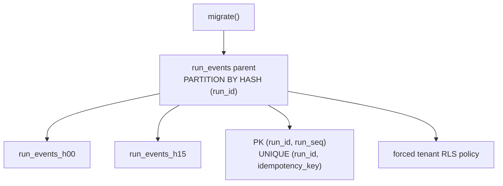
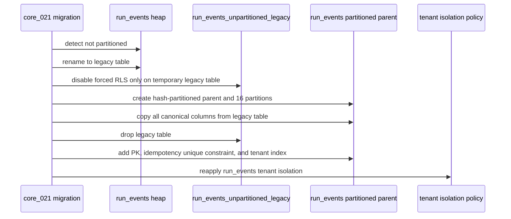

# Run Events Hash Partitioning Plan

## Think-First Analysis

Problem summary:

- `run_events` is the authoritative append-only run event log and is expected to
  grow faster than the metadata, snapshot, and outbox tables.
- The current physical table shape concentrates all inserts, index maintenance,
  and vacuum pressure on one heap and its indexes.
- The planning task `run_events partitioning` names this as Lane D scale work:
  "Partitioned event log storage" to reduce storage and write-path pressure.

Root cause:

- The adapter already has domain-level ordering and idempotency invariants, but
  the physical table did not yet express a scalable partition boundary.
- Historical retention planning in ADR-0037 uses `persisted_at_day` for archive
  units, while the current hot write path uses `(run_id, run_seq)` and
  `(run_id, idempotency_key)` as immediate correctness constraints.

Constraints and invariants:

- ADR-0004: `run_events` remains append-only authoritative history.
- ADR-0008: idempotency must remain deterministic for duplicate delivery.
- ADR-0013: adapter migration must stay explicit, idempotent, and safe to call
  before use.
- ADR-0031: tenant isolation remains enforced by table-scoped RLS.
- ADR-0037: hot storage can be physically managed, but archival lifecycle and
  deletion remain explicit later lifecycle work.
- PostgreSQL partitioned unique constraints must include the partition key.

Options considered:

<!-- markdownlint-disable MD060 -->

| Option                                  | Result      | Reason                                                                  |
| --------------------------------------- | ----------- | ----------------------------------------------------------------------- |
| Hash partition `run_events` by `run_id` | Selected    | Preserves current primary key, idempotency key, append path, and reads. |
| Range partition by `persisted_at`       | Rejected    | Breaks current unique idempotency unless the contract is redesigned.    |
| Tenant-time composite partitioning      | Later scope | Useful for retention, but changes archive and tenant-bucket semantics.  |
| External event store                    | Rejected    | Violates adapter-owned storage boundary for this scale slice.           |

<!-- markdownlint-enable MD060 -->

Selected option and rationale:

- Create `run_events` as a hash-partitioned parent by `run_id` with 16 child
  partitions.
- Preserve the public adapter contract and SQL write path:
  `PRIMARY KEY (run_id, run_seq)` and `UNIQUE (run_id, idempotency_key)`.
- Add a named migration that converts legacy heap deployments to the
  partitioned parent without changing columns.
- Reapply tenant RLS and tenant-leading read indexes after conversion.

Rejected alternatives:

- Time-range partitioning is the expected future shape for archive-drop
  efficiency, but it is not compatible with the current idempotency uniqueness
  contract without a larger ADR-level change.
- Adding a shadow table or view would create duplicate semantics and a long
  migration tail for no current product behavior.

Libraries evaluated:

- None. PostgreSQL declarative partitioning is the native mechanism and the
  repository already owns the adapter DDL.

## Command And Query Rail Impact

<!-- markdownlint-disable MD060 -->

| Rail                                       | Type    | Bounded context         | DDD owner                     | Intent                                                  | Port / adapter surface                         | Scope and auth                                  | Negative tests                                        |
| ------------------------------------------ | ------- | ----------------------- | ----------------------------- | ------------------------------------------------------- | ---------------------------------------------- | ----------------------------------------------- | ----------------------------------------------------- |
| `PostgresStateStoreSchemaMigrationCommand` | command | State-store persistence | `PostgresSchemaManager`       | Bring adapter storage to the current physical contract. | `PostgresStateStoreAdapter.migrate()`          | Repo/runtime operation; no product tenant input | legacy heap conversion, rollback, RLS reapplication   |
| `AppendRunEventsCommand`                   | command | Engine state store      | `IRunStateStore.append*` path | Append ordered idempotent events for a run.             | `PostgresRunEventStore` and `run_events` table | Tenant-scoped write transaction                 | duplicate idempotency keeps existing unique semantics |

<!-- markdownlint-enable MD060 -->

No new public product command or query is introduced. This slice changes the
storage implementation behind existing adapter rails.

## Fowler Opportunity Matrix

<!-- markdownlint-disable MD060 -->

| Scenario                                      | Opportunity          | Fowler pattern                                  | DDD owner                | Rail                                       | Implementation surfaces                     | Test                                              | Out of scope                                     |
| --------------------------------------------- | -------------------- | ----------------------------------------------- | ------------------------ | ------------------------------------------ | ------------------------------------------- | ------------------------------------------------- | ------------------------------------------------ |
| Hot run event table grows without subdivision | Responsibility drift | Repository plus physical storage partition      | `PostgresSchemaManager`  | `PostgresStateStoreSchemaMigrationCommand` | Postgres schema manager and migration tests | `PostgresStateStoreAdapter.migrate.test.ts`       | Cold archive lifecycle and drop scheduling       |
| Legacy heap deployment upgrades in place      | Data migration risk  | Expand/contract migration with rollback receipt | schema migration command | same                                       | migration runner                            | migration test for rename, copy, constraints, RLS | online zero-downtime swap for multi-writer nodes |
| Rollback after partitioning                   | Operational rollback | Reversible migration                            | schema migration command | same                                       | rollback planner                            | `PostgresSchemaManager.rollback.test.ts`          | data compaction or deletion                      |
| Future retention wants time partitions        | Documentation drift  | Explicit rejected alternative                   | ADR-0037 lifecycle owner | none                                       | component guide and proposal                | docs sync, ARC evidence, risk register            | time-range partition ADR and archive coordinator |

<!-- markdownlint-enable MD060 -->

## Diagrams

Fresh schema:



Legacy conversion:



## Feature Mechanization

```feature-mechanization
version: 1
featureId: RUN-EVENTS-HASH-PARTITIONING
mechanizationStatus: implemented
noHumanDecisionsRemaining: true
implementationPlan: docs/planning/proposals/mandatory/runtime-and-contracts/run-events-hash-partitioning-plan-20260513.md
componentGuides:
  - docs/architecture/components/engine/adapters/state-store/postgres/run-events-partitioning-component.md
userStories:
  - docs/architecture/components/engine/adapters/state-store/postgres/run-events-partitioning-user-stories.md
governingSources:
  - AGENTS.md
  - docs/planning/status/governance-document-rule-inventory.md
  - docs/guides/ai-work-protocol.md
  - docs/architecture/command-query-rail-governance.md
  - docs/architecture/fowler-opportunity-planning-governance.md
  - docs/adr/ADR-0004-event-sourcing-strategy.md
  - docs/adr/ADR-0008_Signal_Idempotency.md
  - docs/adr/ADR-0013-run-state-store-bootstrapRunTx.md
  - docs/adr/ADR-0031-adapter-tenant-isolation.md
  - docs/adr/ADR-0037-run-event-lifecycle-archival-verification-and-restore-model.md
allowedImplementationSurfaces:
  - docs/planning/proposals/mandatory/runtime-and-contracts/run-events-hash-partitioning-plan-20260513.md
  - docs/planning/closeouts/20260513-run-events-hash-partitioning-closeout.md
  - docs/architecture/components/engine/adapters/state-store/postgres/run-events-partitioning-component.md
  - docs/architecture/components/engine/adapters/state-store/postgres/run-events-partitioning-user-stories.md
  - docs/evidence/ed-20260513-run-events-hash-partitioning.md
  - docs/risk-register/quality/R-20260513-RUN-EVENTS-HASH-PARTITIONING.yaml
  - docs/**/index.md
  - docs/.manifest.json
  - docs/planning/status/generated-code-state.md
  - docs/planning/status/system-governance-*.md
  - docs/planning/status/system-governance-*.yaml
  - docs/planning/status/governance-components/**
  - packages/@dvt/adapter-postgres/src/PostgresSchemaManager.ts
  - packages/@dvt/adapter-postgres/test/PostgresStateStoreAdapter.migrate.test.ts
  - packages/@dvt/adapter-postgres/test/PostgresSchemaManager.rollback.test.ts
forbiddenImplementationSurfaces:
  - apps/**
  - packages/@dvt/engine/**
  - packages/@dvt/contracts/**
  - packages/@dvt/planner/**
  - packages/@dvt/adapter-temporal/**
commandQueryRails:
  - name: PostgresStateStoreSchemaMigrationCommand
    type: command
    dddOwner: PostgresSchemaManager
  - name: AppendRunEventsCommand
    type: command
    dddOwner: IRunStateStore.appendAndEnqueueTx
domainObjects:
  - name: PostgresSchemaManager
    type: adapter schema manager
    owner: packages/@dvt/adapter-postgres/src/PostgresSchemaManager.ts
  - name: run_events
    type: append-only event log table
    owner: docs/architecture/components/engine/adapters/state-store/postgres/run-events-partitioning-component.md
fowlerSignals:
  - Moves the hot event log from one overloaded heap to a partitioned storage boundary.
  - Keeps idempotency and run ordering semantics under the existing adapter contract.
  - Records rejected time-range partitioning to prevent hidden ADR-0037 drift.
architectureGuards:
  - pnpm --filter @dvt/adapter-postgres test -- PostgresStateStoreAdapter.migrate.test.ts PostgresSchemaManager.rollback.test.ts
  - pnpm docs:feature-mechanization:implementation
cypressFlows:
  - N/A - adapter storage implementation only
completionGate:
  - pnpm docs:feature-mechanization --feature RUN-EVENTS-HASH-PARTITIONING
  - pnpm --filter @dvt/adapter-postgres test -- PostgresStateStoreAdapter.migrate.test.ts PostgresSchemaManager.rollback.test.ts
  - pnpm --filter @dvt/adapter-postgres test
  - pnpm --filter @dvt/adapter-postgres typecheck
  - GIT_BASE=origin/main GIT_HEAD=HEAD node tools/ci/arc-check.mjs
  - pnpm docs:sync
  - pnpm governance:refresh
  - pnpm docs:feature-mechanization:implementation
  - pnpm verify:prepush
redGreenCycles:
  - id: run-events-fresh-schema-partitioning
    redTest: pnpm --filter @dvt/adapter-postgres test -- PostgresStateStoreAdapter.migrate.test.ts
    expectedFailure: fresh schema migration creates run_events without PARTITION BY HASH (run_id).
    patchSurfaces:
      - packages/@dvt/adapter-postgres/test/PostgresStateStoreAdapter.migrate.test.ts
      - packages/@dvt/adapter-postgres/src/PostgresSchemaManager.ts
    greenTest: pnpm --filter @dvt/adapter-postgres test -- PostgresStateStoreAdapter.migrate.test.ts
  - id: run-events-legacy-heap-conversion
    redTest: pnpm --filter @dvt/adapter-postgres test -- PostgresStateStoreAdapter.migrate.test.ts
    expectedFailure: partially applied schemas do not convert legacy heap run_events into a partitioned parent.
    patchSurfaces:
      - packages/@dvt/adapter-postgres/test/PostgresStateStoreAdapter.migrate.test.ts
      - packages/@dvt/adapter-postgres/src/PostgresSchemaManager.ts
    greenTest: pnpm --filter @dvt/adapter-postgres test -- PostgresStateStoreAdapter.migrate.test.ts
  - id: run-events-partition-rollback
    redTest: pnpm --filter @dvt/adapter-postgres test -- PostgresSchemaManager.rollback.test.ts
    expectedFailure: rollback planner does not include a reversible run_events partitioning step.
    patchSurfaces:
      - packages/@dvt/adapter-postgres/test/PostgresSchemaManager.rollback.test.ts
      - packages/@dvt/adapter-postgres/src/PostgresSchemaManager.ts
    greenTest: pnpm --filter @dvt/adapter-postgres test -- PostgresSchemaManager.rollback.test.ts
symbols:
  - name: RUN_EVENTS_HASH_PARTITION_COUNT
    path: packages/@dvt/adapter-postgres/src/PostgresSchemaManager.ts
    dddOwner: PostgresSchemaManager
    cqRails:
      - PostgresStateStoreSchemaMigrationCommand
    fowlerSignals:
      - Defines the bounded physical partition count for hot run event storage.
    architectureGuard: pnpm --filter @dvt/adapter-postgres test -- PostgresStateStoreAdapter.migrate.test.ts
    cypressCoverage: N/A - adapter storage only
    unitTests:
      - pnpm --filter @dvt/adapter-postgres test -- PostgresStateStoreAdapter.migrate.test.ts
  - name: RUN_EVENTS_LEGACY_TABLE
    path: packages/@dvt/adapter-postgres/src/PostgresSchemaManager.ts
    dddOwner: PostgresSchemaManager
    cqRails:
      - PostgresStateStoreSchemaMigrationCommand
    fowlerSignals:
      - Names the expand-contract temporary table for legacy conversion.
    architectureGuard: pnpm --filter @dvt/adapter-postgres test -- PostgresStateStoreAdapter.migrate.test.ts
    cypressCoverage: N/A - adapter storage only
    unitTests:
      - pnpm --filter @dvt/adapter-postgres test -- PostgresStateStoreAdapter.migrate.test.ts
  - name: RUN_EVENTS_ROLLBACK_TABLE
    path: packages/@dvt/adapter-postgres/src/PostgresSchemaManager.ts
    dddOwner: PostgresSchemaManager
    cqRails:
      - PostgresStateStoreSchemaMigrationCommand
    fowlerSignals:
      - Names rollback temporary storage before restoring heap shape.
    architectureGuard: pnpm --filter @dvt/adapter-postgres test -- PostgresSchemaManager.rollback.test.ts
    cypressCoverage: N/A - adapter storage only
    unitTests:
      - pnpm --filter @dvt/adapter-postgres test -- PostgresSchemaManager.rollback.test.ts
  - name: RUN_EVENTS_COLUMNS
    path: packages/@dvt/adapter-postgres/src/PostgresSchemaManager.ts
    dddOwner: PostgresSchemaManager
    cqRails:
      - PostgresStateStoreSchemaMigrationCommand
    fowlerSignals:
      - Centralizes the canonical copy column list to avoid data clump drift.
    architectureGuard: pnpm --filter @dvt/adapter-postgres test -- PostgresStateStoreAdapter.migrate.test.ts
    cypressCoverage: N/A - adapter storage only
    unitTests:
      - pnpm --filter @dvt/adapter-postgres test -- PostgresStateStoreAdapter.migrate.test.ts
  - name: runEventsColumnList
    path: packages/@dvt/adapter-postgres/src/PostgresSchemaManager.ts
    dddOwner: PostgresSchemaManager
    cqRails:
      - PostgresStateStoreSchemaMigrationCommand
    fowlerSignals:
      - Keeps copy SQL aligned to the canonical event-log column list.
    architectureGuard: pnpm --filter @dvt/adapter-postgres test -- PostgresStateStoreAdapter.migrate.test.ts
    cypressCoverage: N/A - adapter storage only
    unitTests:
      - pnpm --filter @dvt/adapter-postgres test -- PostgresStateStoreAdapter.migrate.test.ts
  - name: runEventsRelation
    path: packages/@dvt/adapter-postgres/src/PostgresSchemaManager.ts
    dddOwner: PostgresSchemaManager
    cqRails:
      - PostgresStateStoreSchemaMigrationCommand
    fowlerSignals:
      - Encapsulates schema-qualified run_events relation naming.
    architectureGuard: pnpm --filter @dvt/adapter-postgres test -- PostgresStateStoreAdapter.migrate.test.ts
    cypressCoverage: N/A - adapter storage only
    unitTests:
      - pnpm --filter @dvt/adapter-postgres test -- PostgresStateStoreAdapter.migrate.test.ts
  - name: runEventsHashPartitionName
    path: packages/@dvt/adapter-postgres/src/PostgresSchemaManager.ts
    dddOwner: PostgresSchemaManager
    cqRails:
      - PostgresStateStoreSchemaMigrationCommand
    fowlerSignals:
      - Gives partition names one deterministic owner.
    architectureGuard: pnpm --filter @dvt/adapter-postgres test -- PostgresStateStoreAdapter.migrate.test.ts
    cypressCoverage: N/A - adapter storage only
    unitTests:
      - pnpm --filter @dvt/adapter-postgres test -- PostgresStateStoreAdapter.migrate.test.ts
  - name: createRunEventsTableSql
    path: packages/@dvt/adapter-postgres/src/PostgresSchemaManager.ts
    dddOwner: PostgresSchemaManager
    cqRails:
      - PostgresStateStoreSchemaMigrationCommand
    fowlerSignals:
      - Encapsulates the partitioned and rollback heap table shapes.
    architectureGuard: pnpm --filter @dvt/adapter-postgres test -- PostgresStateStoreAdapter.migrate.test.ts
    cypressCoverage: N/A - adapter storage only
    unitTests:
      - pnpm --filter @dvt/adapter-postgres test -- PostgresStateStoreAdapter.migrate.test.ts
  - name: addRunEventsCanonicalConstraintsSql
    path: packages/@dvt/adapter-postgres/src/PostgresSchemaManager.ts
    dddOwner: PostgresSchemaManager
    cqRails:
      - PostgresStateStoreSchemaMigrationCommand
    fowlerSignals:
      - Keeps canonical run ordering and idempotency constraints reusable.
    architectureGuard: pnpm --filter @dvt/adapter-postgres test -- PostgresSchemaManager.rollback.test.ts
    cypressCoverage: N/A - adapter storage only
    unitTests:
      - pnpm --filter @dvt/adapter-postgres test -- PostgresSchemaManager.rollback.test.ts
  - name: createRunEventsHashPartitionSql
    path: packages/@dvt/adapter-postgres/src/PostgresSchemaManager.ts
    dddOwner: PostgresSchemaManager
    cqRails:
      - PostgresStateStoreSchemaMigrationCommand
    fowlerSignals:
      - Encapsulates native Postgres hash partition DDL.
    architectureGuard: pnpm --filter @dvt/adapter-postgres test -- PostgresStateStoreAdapter.migrate.test.ts
    cypressCoverage: N/A - adapter storage only
    unitTests:
      - pnpm --filter @dvt/adapter-postgres test -- PostgresStateStoreAdapter.migrate.test.ts
  - name: copyRunEventsSql
    path: packages/@dvt/adapter-postgres/src/PostgresSchemaManager.ts
    dddOwner: PostgresSchemaManager
    cqRails:
      - PostgresStateStoreSchemaMigrationCommand
    fowlerSignals:
      - Avoids repeated column copy semantics across migration and rollback.
    architectureGuard: pnpm --filter @dvt/adapter-postgres test -- PostgresStateStoreAdapter.migrate.test.ts
    cypressCoverage: N/A - adapter storage only
    unitTests:
      - pnpm --filter @dvt/adapter-postgres test -- PostgresStateStoreAdapter.migrate.test.ts
  - name: createRunEventsTenantRunIndexSql
    path: packages/@dvt/adapter-postgres/src/PostgresSchemaManager.ts
    dddOwner: PostgresSchemaManager
    cqRails:
      - PostgresStateStoreSchemaMigrationCommand
    fowlerSignals:
      - Keeps tenant-scoped run lookup index creation reusable.
    architectureGuard: pnpm --filter @dvt/adapter-postgres test -- PostgresStateStoreAdapter.migrate.test.ts
    cypressCoverage: N/A - adapter storage only
    unitTests:
      - pnpm --filter @dvt/adapter-postgres test -- PostgresStateStoreAdapter.migrate.test.ts
  - name: disableRunEventsTenantIsolationSql
    path: packages/@dvt/adapter-postgres/src/PostgresSchemaManager.ts
    dddOwner: PostgresSchemaManager
    cqRails:
      - PostgresStateStoreSchemaMigrationCommand
    fowlerSignals:
      - Narrows temporary RLS disabling to migration-only shadow tables.
    architectureGuard: pnpm --filter @dvt/adapter-postgres test -- PostgresStateStoreAdapter.migrate.test.ts
    cypressCoverage: N/A - adapter storage only
    unitTests:
      - pnpm --filter @dvt/adapter-postgres test -- PostgresStateStoreAdapter.migrate.test.ts
  - name: runEventsTenantIsolationTable
    path: packages/@dvt/adapter-postgres/src/PostgresSchemaManager.ts
    dddOwner: PostgresSchemaManager
    cqRails:
      - PostgresStateStoreSchemaMigrationCommand
    fowlerSignals:
      - Reuses the tenant-isolation catalog instead of duplicating RLS semantics.
    architectureGuard: pnpm --filter @dvt/adapter-postgres test -- PostgresStateStoreAdapter.migrate.test.ts
    cypressCoverage: N/A - adapter storage only
    unitTests:
      - pnpm --filter @dvt/adapter-postgres test -- PostgresStateStoreAdapter.migrate.test.ts
  - name: isRunEventsPartitioned
    path: packages/@dvt/adapter-postgres/src/PostgresSchemaManager.ts
    dddOwner: PostgresSchemaManager
    cqRails:
      - PostgresStateStoreSchemaMigrationCommand
    fowlerSignals:
      - Makes migration branch selection a schema inspection policy.
    architectureGuard: pnpm --filter @dvt/adapter-postgres test -- PostgresStateStoreAdapter.migrate.test.ts
    cypressCoverage: N/A - adapter storage only
    unitTests:
      - pnpm --filter @dvt/adapter-postgres test -- PostgresStateStoreAdapter.migrate.test.ts
  - name: ensureRunEventsHashPartitions
    path: packages/@dvt/adapter-postgres/src/PostgresSchemaManager.ts
    dddOwner: PostgresSchemaManager
    cqRails:
      - PostgresStateStoreSchemaMigrationCommand
    fowlerSignals:
      - Owns complete partition child creation for fresh and existing schemas.
    architectureGuard: pnpm --filter @dvt/adapter-postgres test -- PostgresStateStoreAdapter.migrate.test.ts
    cypressCoverage: N/A - adapter storage only
    unitTests:
      - pnpm --filter @dvt/adapter-postgres test -- PostgresStateStoreAdapter.migrate.test.ts
  - name: reapplyRunEventsTenantIsolation
    path: packages/@dvt/adapter-postgres/src/PostgresSchemaManager.ts
    dddOwner: PostgresSchemaManager
    cqRails:
      - PostgresStateStoreSchemaMigrationCommand
    fowlerSignals:
      - Keeps RLS reapplication coupled to partition conversion.
    architectureGuard: pnpm --filter @dvt/adapter-postgres test -- PostgresStateStoreAdapter.migrate.test.ts
    cypressCoverage: N/A - adapter storage only
    unitTests:
      - pnpm --filter @dvt/adapter-postgres test -- PostgresStateStoreAdapter.migrate.test.ts
  - name: disableRunEventsTenantIsolation
    path: packages/@dvt/adapter-postgres/src/PostgresSchemaManager.ts
    dddOwner: PostgresSchemaManager
    cqRails:
      - PostgresStateStoreSchemaMigrationCommand
    fowlerSignals:
      - Applies temporary RLS relaxation through one owned helper.
    architectureGuard: pnpm --filter @dvt/adapter-postgres test -- PostgresStateStoreAdapter.migrate.test.ts
    cypressCoverage: N/A - adapter storage only
    unitTests:
      - pnpm --filter @dvt/adapter-postgres test -- PostgresStateStoreAdapter.migrate.test.ts
  - name: ensureRunEventsPartitionedShape
    path: packages/@dvt/adapter-postgres/src/PostgresSchemaManager.ts
    dddOwner: PostgresSchemaManager
    cqRails:
      - PostgresStateStoreSchemaMigrationCommand
    fowlerSignals:
      - Makes already-partitioned schemas self-healing for children, index, and RLS.
    architectureGuard: pnpm --filter @dvt/adapter-postgres test -- PostgresStateStoreAdapter.migrate.test.ts
    cypressCoverage: N/A - adapter storage only
    unitTests:
      - pnpm --filter @dvt/adapter-postgres test -- PostgresStateStoreAdapter.migrate.test.ts
  - name: convertRunEventsHeapToHashPartitions
    path: packages/@dvt/adapter-postgres/src/PostgresSchemaManager.ts
    dddOwner: PostgresSchemaManager
    cqRails:
      - PostgresStateStoreSchemaMigrationCommand
    fowlerSignals:
      - Owns the expand-contract conversion for legacy heap deployments.
    architectureGuard: pnpm --filter @dvt/adapter-postgres test -- PostgresStateStoreAdapter.migrate.test.ts
    cypressCoverage: N/A - adapter storage only
    unitTests:
      - pnpm --filter @dvt/adapter-postgres test -- PostgresStateStoreAdapter.migrate.test.ts
  - name: rollbackRunEventsHashPartitionsToHeap
    path: packages/@dvt/adapter-postgres/src/PostgresSchemaManager.ts
    dddOwner: PostgresSchemaManager
    cqRails:
      - PostgresStateStoreSchemaMigrationCommand
    fowlerSignals:
      - Owns the reversible rollback path for partitioned deployments.
    architectureGuard: pnpm --filter @dvt/adapter-postgres test -- PostgresSchemaManager.rollback.test.ts
    cypressCoverage: N/A - adapter storage only
    unitTests:
      - pnpm --filter @dvt/adapter-postgres test -- PostgresSchemaManager.rollback.test.ts
  - name: QueryRow
    path: packages/@dvt/adapter-postgres/test/PostgresSchemaManager.rollback.test.ts
    dddOwner: PostgresSchemaManager.rollbackTo
    cqRails:
      - PostgresStateStoreSchemaMigrationCommand
    fowlerSignals:
      - Models rollback-recording query results needed to prove partition detection.
    architectureGuard: pnpm --filter @dvt/adapter-postgres test -- PostgresSchemaManager.rollback.test.ts
    cypressCoverage: N/A - adapter storage only
    unitTests:
      - pnpm --filter @dvt/adapter-postgres test -- PostgresSchemaManager.rollback.test.ts
```
