# Runtime hardening, shared-kernel, and operations roadmap

This roadmap sequences the next Fowler-style correction wave across runtime
correctness, shared-kernel ownership, worker-runtime structure, and operational
closure.

It governs the ordered execution of:

- `AR-C6` / Temporal cancel semantics bug `T-01`
- `AR-A12` / `EngineRunRef` boundary redesign
- `RC-G1-B` / engine-owned ports leaving `@dvt/contracts`
- `S05-TRUTH-SYNC` / payload-version closure truth sync
- `AR-A7` / delivery worker runtime harness
- `AR-C2-T2`, `AR-C2-T3`, `AR-C2-T4` / dashboard, alert, and sustained SLA
  evidence closure
- `AR-D8` and `TF-D1` / default retention and proof-environment reset
  discipline

## Why this sequence

The ordering is intentional:

1. fix the live bug before deeper refactors
2. separate logical identity from provider coordinates before migrating more
   ownership
3. continue shared-kernel cleanup only after that boundary is explicit
4. reconcile drifted status surfaces before they mis-sequence later work
5. extract repeated runtime orchestration only after runtime ownership is
   clearer
6. close operational evidence after the runtime and contract posture are stable
7. harden retention defaults and proof reset discipline after the operational
   surfaces are trustworthy

This avoids mixing product correctness, boundary design, and operational
closure into one large unfocused wave.

## Current-state concern map

```mermaid
flowchart LR
  classDef bug fill:#c62828,color:#fff,stroke:#8e0000
  classDef boundary fill:#1565c0,color:#fff,stroke:#0d47a1
  classDef ops fill:#2e7d32,color:#fff,stroke:#1b5e20
  classDef status fill:#ef6c00,color:#fff,stroke:#e65100

  T01["AR-C6 / T-01<br/>Temporal cancel semantics"]:::bug
  RR["AR-A12<br/>EngineRunRef boundary"]:::boundary
  RCG["RC-G1-B<br/>engine ports leave shared kernel"]:::boundary
  S05["S05-TRUTH-SYNC<br/>status truth alignment"]:::status
  A7["AR-A7<br/>worker runtime harness"]:::boundary
  ARC2["AR-C2-T2/T3/T4<br/>SLA wiring + evidence"]:::ops
  D8["AR-D8<br/>default retention"]:::ops
  TFD1["TF-D1<br/>proof reset discipline"]:::ops

  T01 --> RR --> RCG --> S05 --> A7 --> ARC2 --> D8 --> TFD1
```

## Phase plan

### Phase 1. Correctness first

#### Slice 1. `AR-C6`

Objective:

- correct Temporal cancel semantics so `cancelRun()` is not a signal-only path

Why first:

- this is the only concrete live runtime bug in the set
- it affects an implemented provider boundary, not just design hygiene

Expected design:

- document the canonical distinction between cooperative cancel and
  provider-native cancel
- make adapter behavior explicit at the contract and implementation level
- prove the chosen semantics with adapter integration coverage

Out of scope:

- generic adapter circuit breaking
- broader signal taxonomy redesign

### Phase 2. Identity and shared-kernel boundary correction

#### Slice 2. `AR-A12`

Objective:

- separate logical run identity from provider-owned execution coordinates

Why second:

- `EngineRunRef` is the next highest coupling risk after `T-01`
- delaying it encourages further widening of shared contracts

Expected design:

- define a logical run identity owned by the engine/runtime model
- define an owner-scoped provider execution reference for adapter operations
- route public engine contracts and internal adapter seams through the explicit
  split

Acceptance posture:

- new provider work must not widen the shared `EngineRunRef` bag
- architecture docs and contracts stop implying that one ref owns both meanings

#### Slice 3. `RC-G1-B`

Objective:

- move non-shared engine ports out of `@dvt/contracts` and into
  `@dvt/engine`

Why after `AR-A12`:

- ownership cleanup should follow explicit boundary correction, not precede it
- otherwise the migration risks preserving the same semantic leak under a new
  location

Expected design:

- keep only true cross-context DTOs in the shared kernel
- move engine-owned behavioral ports and owner-specific runtime seams to the
  engine package
- leave compatibility aliases explicit, temporary, and validated

### Phase 3. Status truth before more refactor

#### Slice 4. `S05-TRUTH-SYNC`

Objective:

- reconcile status surfaces that still describe `S05` as open after closure

Why now:

- planning and architecture surfaces should not disagree before more runtime and
  operations work is sequenced on top of them

Expected design:

- status docs, workboard, domain surfaces, and architecture summaries agree on
  the true posture of `payloadVersion` hardening
- any residual work is named precisely instead of smearing `S05` back into an
  open umbrella

### Phase 4. Runtime-orchestration cleanup

#### Slice 5. `AR-A7`

Objective:

- split delivery domain rules from worker runtime orchestration and extract a
  shared runtime harness where that abstraction is honest

Why here:

- once runtime boundaries and ownership are cleaner, the repeated loop skeleton
  can be extracted without hiding domain differences

Expected design:

- common loop mechanics (`start`, `stop`, abort, wait, backoff, loop control)
  move behind a reusable harness
- outbox, projector, and lineage keep their domain-specific work logic outside
  the harness
- no forced fake common abstraction for business behavior

Guardrail:

- do not collapse three workers into one generic worker type if their domain
  semantics are different

### Phase 5. Operational closure

#### Slice 6. `AR-C2-T2`, `AR-C2-T3`, `AR-C2-T4`

Objective:

- finish dashboard wiring, alert wiring, and sustained evidence for the already
  defined SLA model

Why now:

- SLA definitions already exist; what remains is operational closure
- this should follow runtime-boundary stabilization, not precede it

Expected design:

- each canonical SLA signal maps to dashboard evidence
- each threshold maps to alert evidence and routing posture
- sustained validation evidence closes the one-shot proof gap

#### Slice 7. `AR-D8` and `TF-D1`

Objective:

- make retention defaults mandatory in operations and make the PostgreSQL proof
  environment rerunnable without ambiguous residue

Why last:

- these are operational-discipline closures on top of already shipped retention
  and proof surfaces
- they benefit from the earlier runtime and SLA cleanup being stable

Expected design:

- default retention policy wiring is enabled as baseline, not optional folklore
- health and alert posture report when retention jobs are absent or stale
- proof runs get an owned reset, cleanup, and retention/reset discipline

## Detailed slice table

| Order | Slice            | Type         | Goal                                                         | Main risk reduced                              | Depends on                      |
| ----- | ---------------- | ------------ | ------------------------------------------------------------ | ---------------------------------------------- | ------------------------------- |
| 1     | `AR-C6`          | correctness  | fix live Temporal cancel semantics                           | uncancellable Temporal run                     | `WE-HX-4-B`                     |
| 2     | `AR-A12`         | architecture | split logical run identity from provider execution reference | provider detail leak into shared kernel        | `RC-G1-B`, `WE-HX-1`            |
| 3     | `RC-G1-B`        | ownership    | move engine behavioral ports out of shared kernel            | oversized shared contract surface              | `RC-G1-A`                       |
| 4     | `S05-TRUTH-SYNC` | status       | align status truth after payload-version closure             | roadmap and status drift                       | `S05`                           |
| 5     | `AR-A7`          | architecture | extract honest worker runtime harness                        | repeated loop orchestration and mixed concerns | none                            |
| 6     | `AR-C2-T2/T3/T4` | operations   | close dashboards, alerts, and sustained SLA evidence         | defined SLA with incomplete operational proof  | `AR-C2-T1`                      |
| 7     | `AR-D8`          | operations   | enforce default retention baseline                           | optional retention scheduling in operations    | `run event log retention + TTL` |
| 8     | `TF-D1`          | operations   | define proof reset/cleanup baseline                          | ambiguous residue in repeated proof runs       | `TF-C2-A`                       |

## Design constraints

- fix live behavior bugs before moving ownership or architecture boundaries
- do not widen `@dvt/contracts` to solve owner-local seams
- do not claim operational closure where only definitions exist
- do not extract a fake generic worker abstraction that hides different domain
  semantics
- keep architecture docs, lane YAML, and status surfaces aligned after each
  slice

## Recommended execution rule

Each slice should close with:

1. docs and diagrams updated first
2. task registry updated in the owning lane
3. implementation and validation for the touched scope
4. status and evidence sync before moving to the next slice

## Related surfaces

- [Runtime and shared-kernel risk triage review](../../reviews/architecture-and-governance/20260410-runtime-and-shared-kernel-risk-triage-review.md)
- [WorkflowEngine hexagonal derivation plan](./workflow-engine-hexagonal-derivation-plan-20260403.md)
- [Contracts domain ownership migration plan](./contracts-domain-ownership-migration-plan-20260327.md)
- [Transformation Flow Delivery Plan](./transformation-flow-delivery-plan-20260405.md)
