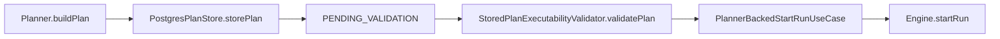
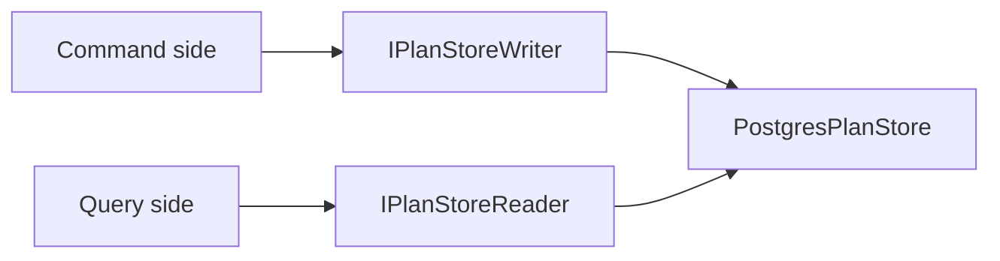
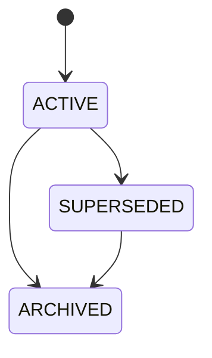
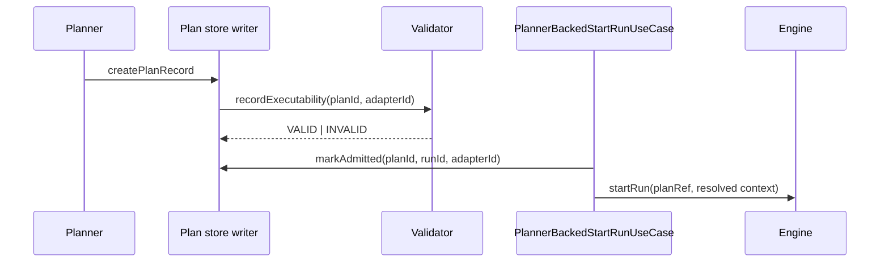

# S08 plan record and plan store execution plan

## Purpose

This is the executable planning surface for S08.

It replaces the vague "Plan Storage ADR + PostgresPlanStore" framing with a
code-grounded plan that is aligned with:

- Fowler-style operational artifact modeling
- Hexagonal DDD ownership boundaries
- SRP and ISP
- CQRS write/read separation

## Governing sources

- [ADR-0018](../../../../adr/ADR-0018_Shared_Kernel_Ownership_Governance.md)
- [ADR-0034](../../../../adr/ADR-0034-bounded-context-boundaries-and-communication-rules.md)
- [ADR-0035](../../../../adr/ADR-0035-planner-public-contract-evolution-protocol.md)
- [ADR-0039](../../../../adr/ADR-0039-hexagonal-port-hardening-and-solid-remediation.md)
- [ADR-0040](../../../../adr/ADR-0040-retry-ownership-and-attempt-authority.md)
- [ADR-0041](../../../../adr/ADR-0041-global-domain-state-model-and-boundary-contracts.md)
- [ADR-0042](../../../../adr/ADR-0042-execution-plan-canonical-identity-unification.md)
- [S08 gap review](../../../reviews/20260402-s08-plan-record-plan-store-gap-review.md)

## Problem statement

The repository already has a partial persisted-plan bridge, but it does not yet
have a mature operational model for:

- canonical persisted plan artifact truth
- adapter-scoped executability
- admission lineage
- supersession and archival
- artifacts-owned behavior ports

## Current state



Current strengths:

- a planner-backed persisted-plan admission path already exists
- Postgres-backed lifecycle persistence already exists
- executability validation already exists

Current weaknesses:

- ownership of artifact behavior is still contradictory in active sources
- the lifecycle model is still too coarse
- admission is not yet modeled as an explicit relation
- active status docs still contain stale S08 and S09 truth

## Target model

### Ownership split

```mermaid
flowchart TD
  A[Serializable planner-domain records] --> B[@dvt/contracts/src/contracts/planner]
  C[Behavior ports for plan storage] --> D[@dvt/artifacts/src/ports]
  E[Postgres implementation] --> F[@dvt/adapter-postgres]
  G[Admission orchestration] --> H[apps/api application services]
```

### CQRS split



### Runtime lifecycle



### Admission flow



## S08-v1 design rules

1. Persist one canonical plan artifact.
2. Do not make admission a plan state.
3. Do not introduce `bindingState` in S08-v1.
4. Keep Postgres as the first system of record.
5. Keep `IPlanValidationLifecycleStore` only as a migration facade.
6. Ship new serializable records with schemas, parsers, and contract docs.

## Planned contracts

### Records under `@dvt/contracts/src/contracts/planner`

- `PlanRecord.v1.ts`
- `PlanRecord.v1.schema.json`
- `PlanExecutabilityRecord.v1.ts`
- `PlanExecutabilityRecord.v1.schema.json`
- `PlanAdmissionLink.v1.ts`
- `PlanAdmissionLink.v1.schema.json`

### Key `PlanRecord` fields

- `planId`
- `canonicalPlanJson`
- `canonicalHash`
- `planVersion`
- `schemaVersion`
- `contractVersion`
- `sourceRef`
- `state`
- `createdAtIso`
- `updatedAtIso`
- `derivedFromPlanId?`
- `supersedesPlanId?`
- `archivedAtIso?`

### Key `PlanExecutabilityRecord` fields

- `planId`
- `adapterId`
- `state`
- `validatedAtIso?`
- `rejectionReport?`

### Key `PlanAdmissionLink` fields

- `planId`
- `runId`
- `adapterId`
- `admittedAtIso`

## Planned ports and implementations

### Ports under `@dvt/artifacts`

- `packages/@dvt/artifacts/src/ports/IPlanStoreWriter.ts`
- `packages/@dvt/artifacts/src/ports/IPlanStoreReader.ts`

### Key methods

Write side:

- `createPlanRecord(...)`
- `recordExecutability(planId, adapterId, result)`
- `markAdmitted(planId, runId, adapterId)`
- `markSuperseded(planId, supersededByPlanId, reason)`
- `archivePlan(planId)`

Read side:

- `getPlanRecord(planId)`
- `getPlanRecordByRef(planRef)`
- `listExecutabilityByAdapter(planId)`
- `getAdmissionLinks(planId)`
- `getSupersession(planId)`

### Implementation surfaces

- `packages/@dvt/adapter-postgres/src/PostgresPlanStore.ts`
- `apps/api/src/application/services/PlannerBackedStartRunUseCase.ts`
- `apps/api/src/application/services/StoredPlanExecutabilityValidator.ts`

## Workstreams

### S08-0 - Planning truth correction

Objective:

Correct active docs that still claim:

- `S09` is open
- `S08` is blocked by `S09`
- `PostgresPlanStore` does not exist

Definition of done:

- active status and roadmap docs are corrected
- Lane A carries S08 explicitly

### S08-1 - Ownership ADR

Objective:

Accept the ownership split:

- serializable planner-domain records in `@dvt/contracts`
- behavior ports in `@dvt/artifacts`

Definition of done:

- `ADR-0043` is accepted
- active docs no longer describe `IPlanStore` as shared-kernel behavior

### S08-2 - Contract layer

Objective:

Introduce versioned, schema-backed serializable records for plan artifact truth,
executability, and admission links.

Planned output files:

- `packages/@dvt/contracts/src/contracts/planner/PlanRecord.v1.ts`
- `packages/@dvt/contracts/src/contracts/planner/PlanExecutabilityRecord.v1.ts`
- `packages/@dvt/contracts/src/contracts/planner/PlanAdmissionLink.v1.ts`

Definition of done:

- schemas, parsers, docs, and tests ship together

### S08-3 - Artifacts-owned ports

Objective:

Introduce read/write ports in `@dvt/artifacts` without hardening new behavior
ports in `@dvt/contracts`.

Planned output files:

- `packages/@dvt/artifacts/src/ports/IPlanStoreWriter.ts`
- `packages/@dvt/artifacts/src/ports/IPlanStoreReader.ts`

Definition of done:

- no new plan-storage behavior port is introduced in `@dvt/contracts`

### S08-4 - Postgres implementation evolution

Objective:

Evolve `PostgresPlanStore` to implement the new ports while keeping the old
lifecycle facade available during migration.

Planned output files:

- `packages/@dvt/adapter-postgres/src/PostgresPlanStore.ts`
- new migrations for plan records, executability records, and admission links

Definition of done:

- Postgres persists the three-part model
- compatibility facade still supports existing callers

### S08-5 - Admission cutover

Objective:

Move planner-backed admission from the current global lifecycle facade to the
explicit three-part model.

Planned output files:

- `apps/api/src/application/services/PlannerBackedStartRunUseCase.ts`
- `apps/api/src/application/services/StoredPlanExecutabilityValidator.ts`

Definition of done:

- admission requires adapter-scoped `VALID` executability
- admission writes a `PlanAdmissionLink`

### S08-6 - Supersession and archival

Objective:

Add lineage-safe supersession and archival behavior without introducing
speculative binding lifecycle modeling.

Definition of done:

- `PlanRecord.state` supports `SUPERSEDED` and `ARCHIVED`
- lineage and supersession queries are explicit and tested

## Risks and mitigations

| Risk                                    | Why it matters                                           | Mitigation                                                  |
| --------------------------------------- | -------------------------------------------------------- | ----------------------------------------------------------- |
| Ownership drift persists                | S08 could harden the wrong package boundary              | Land `ADR-0043` before contract implementation              |
| Dual plan identity returns              | Would regress `ADR-0042`                                 | Keep one canonical plan artifact in S08-v1                  |
| Migration churn is too broad            | API and adapter callers already depend on the old facade | Keep `IPlanValidationLifecycleStore` as a migration adapter |
| S08 grows into speculative architecture | Would delay delivery and weaken model clarity            | Defer `bindingState` and object-storage plan blobs          |

## Acceptance criteria

- No active doc still says `S08` is blocked by `S09`.
- No active doc still says there is no `PostgresPlanStore`.
- `PlanRecord` is a single canonical persisted plan artifact.
- Executability is modeled per adapter.
- Admission is modeled as a relation, not as a plan state.
- Plan-storage behavior ports are owned by `@dvt/artifacts`.
- New serializable records ship with schema, parser, docs, and tests.

## Validation baseline for the planning package

- `pnpm docs:planning:lanes:generate`
- `pnpm docs:workboard:generate`
- `pnpm docs:sync`
- `pnpm verify:prepush`

## Related

- [S08 gap review](../../../reviews/20260402-s08-plan-record-plan-store-gap-review.md)
- [ADR-0043](../../../../adr/ADR-0043-plan-record-plan-store-and-artifacts-ownership.md)
