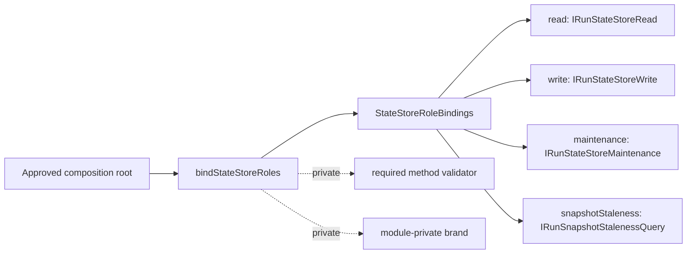
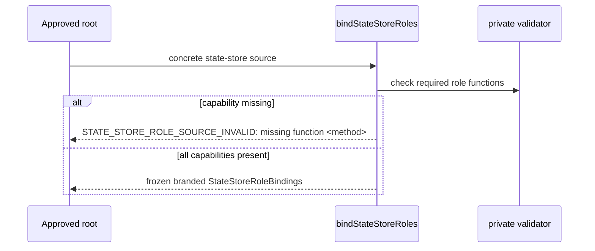

# S18-F1-C State Store Role Contract Shape Plan

## Think-First Analysis

### Problem Summary

`S18-F1-A` branded the API state-store role bundle and `S18-F1-B` added
architecture guards against convenience rewiring. The remaining gap is contract
shape clarity: consumers need an explicit runtime export rule and negative-path
coverage that explains which required role capability is missing.

### Root Cause

The module already exposes a narrow factory, but the component guide did not
state the export semantics separately from the general API table. The direct
unit tests also covered only one partial source and a null source, so future
changes could weaken role validation diagnostics while keeping broad tests
green.

### Fowler / SOLID Reading

| Signal                         | Current Risk                              | Applied Pattern                         |
| ------------------------------ | ----------------------------------------- | --------------------------------------- |
| Primitive aggregate rebuilding | Callers infer shape from object fields    | Encapsulate Value Object                |
| Hidden construction semantics  | Runtime exports and type-only exports mix | Explicit Module Boundary                |
| Weak error contract            | Partial sources fail without capability   | Fail Fast with diagnostic boundary text |
| Boundary drift                 | Docs omit export semantics                | Executable Architecture Guard           |

The mature-system posture is the same one used in hardened platform SDKs: a
single runtime constructor, private validation internals, type-only public
shapes, and negative tests per capability class.

## Command / Query Rail

- Rail: `StateStoreRoleBoundaryQuery`
- Type: query
- Owning bounded context: API runtime composition
- DDD object: `StateStoreRoleBindings`
- Application port: API composition modules that need state-store roles
- Adapter surface: concrete state-store adapter entering the API composition
  root
- Authorization/scope: internal composition only; no HTTP route, tenant, or
  persistence behavior changes
- Negative tests:
  - runtime export surface remains factory-only
  - missing read/write/maintenance/staleness functions fail at the boundary
  - non-function role members fail with the same diagnostic contract

## Diagrams





## Invariants

- `bindStateStoreRoles` is the only runtime export from
  `apps/api/src/modules/stateStoreRoles.ts`.
- `StateStoreRoleSource` and `StateStoreRoleBindings` remain type-only exports.
- The brand symbol, required-method list, and validator remain private.
- Invalid role sources fail before returning a bundle.
- Failure messages name the first missing or non-function required method.
- Component documentation and architecture guard must both describe export
  semantics.

## Implementation Plan

1. Add red tests for factory-only runtime exports and capability-specific
   negative paths.
2. Change the validator to return the first missing/non-function method and use
   that in the boundary error.
3. Add `Export Semantics` to the component guide and wire the architecture test
   to enforce it.
4. Run focused API tests, API typecheck, docs sync, and the repository pre-push
   gate.

## Acceptance Criteria

- `stateStoreRoles.test.ts` proves:
  - only `bindStateStoreRoles` is exported at runtime;
  - valid sources produce a frozen explicit role bundle;
  - missing read/write/maintenance/staleness functions fail;
  - non-function role members fail.
- `stateStoreRoleBoundary.architecture.test.ts` proves the component guide
  documents export semantics.
- `S18-F1-C` is updated in the planning DB with real evidence after validation.

## Feature Mechanization

```feature-mechanization
version: 1
featureId: S18-F1-C-STATE-STORE-ROLE-CONTRACT-SHAPE
mechanizationStatus: implemented
noHumanDecisionsRemaining: true
implementationPlan: docs/planning/proposals/mandatory/runtime-and-contracts/s18-f1-c-state-store-role-contract-shape-plan-20260515.md
componentGuides:
  - docs/architecture/components/api/state-store-role-boundary-component.md
userStories:
  - docs/planning/closeouts/20260324-s18-explicit-state-store-root-bindings-closeout.md
  - docs/planning/proposals/mandatory/runtime-and-contracts/s18-f1-a-state-store-role-boundary-plan-20260513.md
governingSources:
  - AGENTS.md
  - docs/planning/status/governance-document-rule-inventory.md
  - docs/guides/ai-work-protocol.md
  - docs/architecture/command-query-rail-governance.md
  - docs/architecture/fowler-opportunity-planning-governance.md
allowedImplementationSurfaces:
  - apps/api/src/modules/stateStoreRoles.ts
  - apps/api/test/modules/stateStoreRoles.test.ts
  - apps/api/test/architecture/stateStoreRoleBoundary.architecture.test.ts
  - docs/architecture/components/api/state-store-role-boundary-component.md
  - docs/planning/proposals/mandatory/runtime-and-contracts/s18-f1-c-state-store-role-contract-shape-plan-20260515.md
  - docs/planning/closeouts/20260515-s18-f1-c-state-store-role-contract-shape-closeout.md
forbiddenImplementationSurfaces:
  - packages/@dvt/contracts/**
  - packages/@dvt/engine/**
  - packages/@dvt/adapter-*/**
commandQueryRails:
  - name: StateStoreRoleBoundaryQuery
    type: query
    dddOwner: StateStoreRoleBindings
domainObjects:
  - name: StateStoreRoleBindings
    type: value object
    owner: API runtime composition
fowlerSignals:
  - Boundary drift
  - Primitive aggregate rebuilding
  - Hidden construction semantics
architectureGuards:
  - pnpm --filter dvt-api test -- stateStoreRoles.test.ts stateStoreRoleBoundary.architecture.test.ts
cypressFlows:
  - N/A - internal API composition boundary only
completionGate:
  - pnpm --filter dvt-api test -- stateStoreRoles.test.ts stateStoreRoleBoundary.architecture.test.ts
  - pnpm --filter dvt-api typecheck
  - pnpm docs:sync
  - pnpm verify:prepush
redGreenCycles:
  - id: state-store-role-contract-shape
    redTest: pnpm --filter dvt-api test -- stateStoreRoles.test.ts stateStoreRoleBoundary.architecture.test.ts
    expectedFailure: generic invalid-source error and missing Export Semantics component-guide section
    patchSurfaces:
      - apps/api/src/modules/stateStoreRoles.ts
      - apps/api/test/modules/stateStoreRoles.test.ts
      - apps/api/test/architecture/stateStoreRoleBoundary.architecture.test.ts
      - docs/architecture/components/api/state-store-role-boundary-component.md
    greenTest: pnpm --filter dvt-api test -- stateStoreRoles.test.ts stateStoreRoleBoundary.architecture.test.ts
symbols:
  - name: findMissingStateStoreRoleFunction
    path: apps/api/src/modules/stateStoreRoles.ts
    dddOwner: StateStoreRoleBindings
    cqRails: [StateStoreRoleBoundaryQuery]
    fowlerSignals: [Fail Fast with diagnostic boundary text]
    architectureGuard: pnpm --filter dvt-api test -- stateStoreRoles.test.ts
    cypressCoverage: N/A - internal API composition boundary only
    unitTests: [pnpm --filter dvt-api test -- stateStoreRoles.test.ts]
```
