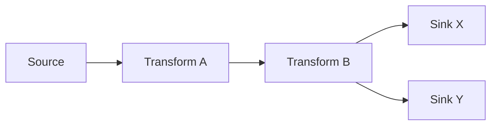
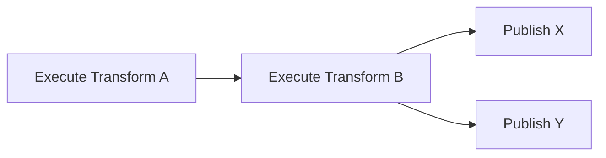
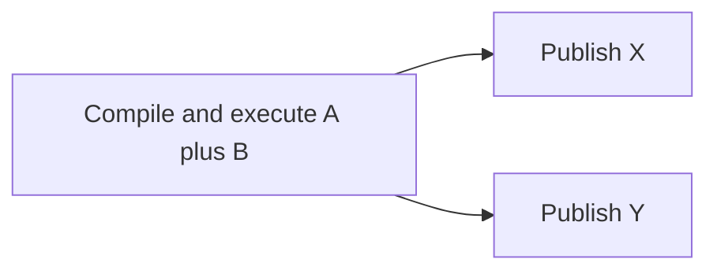
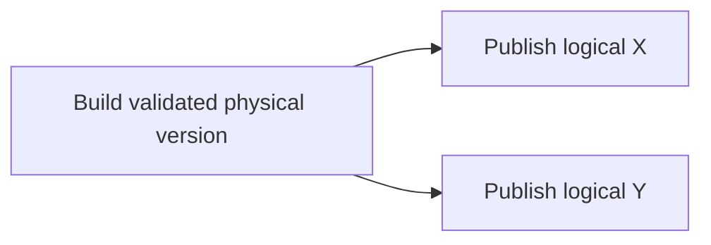

# SQL-first DAG And Transform Taxonomy Plan

## Decision request

This proposal asks for review of one architectural decision before implementation
under [#2524](https://github.com/dunay2/dvt/issues/2524):

> Should DVT keep adding concrete transform node kinds, or should one transform
> node act as a container?

The recommendation is a bounded hybrid:

1. Replace the native canonical kind `dvt:sql_transform` with
   **`dvt:transform`** in the next SQL-first contract version.
2. Define `dvt:transform` as a **typed semantic container for one transformation
   definition**, not as an arbitrary container for child workflow nodes.
3. Keep SQL and visual recipe as mutually exclusive authoring authorities of
   the same transform asset.
4. Allow the component catalog to expose useful presets such as SQL model,
   visual model, filter, join, aggregate, and union without making every preset
   a new canonical node kind.
5. Promote a distinct canonical node kind only when its graph interface,
   execution capability, lifecycle, or failure semantics are materially
   different.
6. Reserve arbitrary nested DAG composition for a future explicit
   `composite/subflow` concept with a versioned interface; do not overload
   `transform` with that responsibility.

This proposal deliberately separates three models:

```text
AUTHORING DAG
what the user means

        !=

EXECUTION DAG
which semantic units DVT schedules

        !=

ADAPTER PHASES
how a backend resolves, builds, validates, publishes, and records evidence
```

There is no invariant that one visible node equals one runtime step.

## Governing sources

- `AGENTS.md`;
- `docs/planning/status/governance-document-rule-inventory.md`;
- `docs/guides/ai-work-protocol.md`;
- ADR-0003, execution-model sovereignty;
- ADR-0005, contract formalization;
- ADR-0012, plan integrity ownership;
- ADR-0017, ExecutionPlan versioning;
- ADR-0018, shared-kernel ownership;
- ADR-0035, planner public-contract evolution;
- `WorkspaceGraphAuthoringDraft.v1.ts`;
- `ExecutableSubgraphDeriver.ts`;
- `VisualTransformRecipe.v1.ts`;
- issues #2523 and #2524.

The work is proposal-only. It does not change runtime behavior in this PR.

## Current-state findings

### The editable Graph Draft is already a real graph

`WorkspaceGraphAuthoringDraft` persists arbitrary semantic nodes and edges.
`ExecutableSubgraphDeriver` already supports explicit selection, upstream and
downstream closure, connected-component expansion, dependency-gap diagnostics,
cycle detection, and deterministic graph ordering.

The general authoring and planner infrastructure therefore does not require the
historical three-card chain.

### The DVT native plugin still exposes a fixed vocabulary

The current native catalog exposes only:

```text
dvt:source
dvt:sql_transform
dvt:sink
```

The current connection rules admit essentially:

```text
source -> sql_transform
sql_transform -> sink
sink -> terminal
```

There is no native `sql_transform -> sql_transform` rule, so the product cannot
truthfully express a chain of native transformations even though the Graph Draft
and planner graph can represent one.

### `sql_transform` already no longer means only SQL

`VisualTransformRecipeV1` defines two mutually exclusive authoring modes for the
same native transform:

```text
sql
visual recipe
```

A visual-authoritative transform generates SQL as a projection. Therefore the
canonical node kind `dvt:sql_transform` currently mixes the semantic asset with
one implementation and authoring language. The name has already become false.

### Preview truncates richer topology

The current SQL-first preview projection searches the selected scope using the
first node with each role:

```text
first input
first transform
first output
```

It then emits exactly three compiler entries: prepare, transform, and evidence.
A Graph Draft can therefore contain a richer shape while Preview silently
selects a partial chain. That is a correctness defect, not merely a missing
feature.

Before a real DAG compiler is shipped, any selected topology that cannot be
represented must fail closed with diagnostics. It must never be reduced by
`find()` to an arbitrary first node.

## Root cause

One field, `kind`, currently carries several independent meanings:

- product role: input, transform, output, check, or control;
- visible component identity;
- authoring language: SQL or visual recipe;
- logical operator shape;
- execution provider or capability;
- runtime step kind;
- physical publication strategy.

That coupling created both current failures:

1. a generic authoring DAG is forced into `source -> transform -> sink`;
2. a visual transform is still called `sql_transform` because SQL is also used
   as its current physical projection.

The solution is not to replace one overloaded type with a larger untyped blob.
The solution is to model the independent dimensions explicitly.

## Non-negotiable invariants

1. Graph Draft remains the editable graph authority.
2. The planner compiles the exact authorized selected subgraph.
3. No node or edge is silently discarded during Preview or compilation.
4. Node role is not a topological template.
5. SQL and visual recipe remain mutually exclusive authoring authorities.
6. Backend or dialect names do not become universal graph semantics.
7. A runtime step exists because it is an execution boundary, not because a UI
   card or instrumentation phase exists.
8. A new canonical node kind requires a real consumer and a materially distinct
   contract.
9. Nested workflows require an explicit interface and versioned ownership; they
   are not hidden inside a generic transform metadata object.
10. Existing PlanRefs and persisted Graph Drafts receive an explicit versioning
    and migration decision; no indefinite compatibility duality is allowed.

## Options considered

### Option A: add a canonical node kind for every operation

Examples:

```text
filter
select
rename
cast
join
aggregate
union
deduplicate
sort
```

Advantages:

- obvious cards for novice users;
- each operation can have a focused editor;
- graph visualization mirrors every operation.

Problems:

- creates card and edge explosion for operations that belong to one logical
  model;
- forces implementation details into the topology;
- increases persisted contract types, renderers, connection rules, tests, and
  compiler branches for every new operation;
- encourages one visual operation = one runtime activity;
- contradicts the existing visual recipe decision, where rename, cast,
  functions, and filters are intentionally one model definition.

Disposition: **rejected as the canonical domain model**. Some of these names may
remain useful as creation presets.

### Option B: one completely generic transform container

Example:

```text
kind: dvt:transform
config: Record<string, unknown>
children: arbitrary nodes
```

Advantages:

- superficially extensible;
- few top-level node kinds;
- can represent almost anything.

Problems:

- becomes a god object and an opaque escape hatch;
- loses compile-time contracts and capability admission;
- hides topology and dependency semantics;
- duplicates a nested Graph Draft without defining an interface;
- makes lineage, selection, retry, and failure boundaries ambiguous;
- creates a second planner inside transform metadata.

Disposition: **rejected**.

### Option C: typed transform asset plus catalog presets

The canonical node is one semantic transform asset. Its definition is a strict,
versioned discriminated union. SQL and visual recipe are authoring authorities,
not node kinds. Specialized user-facing entries initialize the same canonical
kind with a governed profile or recipe.

Advantages:

- preserves a small canonical vocabulary;
- keeps strict schemas and one authority;
- avoids card explosion;
- supports different editors without changing graph identity;
- permits new profiles only when they have consumers;
- fits current visual-recipe work;
- allows the planner to choose execution boundaries independently.

Disposition: **selected**.

### Option D: transform as an arbitrary nested subgraph

A nested graph can provide valuable reuse, variables, and procedure/subflow
compilation. However it also requires:

- an explicit input/output interface;
- nested identity and versioning;
- selection and lineage across boundaries;
- parameter binding;
- recursive validation;
- deployment and runtime semantics;
- independent persistence and reuse ownership.

Those are composite-workflow concerns, not ordinary transform concerns.

Disposition: **deferred to a separate canonical `composite/subflow` concept**.

## Proposed semantic model

The proposal separates six dimensions.

| Dimension | Example | Owner |
| --- | --- | --- |
| Role | `transform` | generic Graph Draft semantics |
| Canonical kind | `dvt:transform` | native DVT plugin |
| Interface shape | relational `N -> 1`, router `1 -> N` | node/profile contract |
| Authoring authority | SQL or visual recipe | transform definition |
| Execution capability | `relational.sql` | planner/adapter capability |
| Publication targets | zero, one, or several sinks | graph/compiler/publish policy |

A minimal next-version contract can be equivalent to:

```ts
type DvtTransformDefinitionV2 = {
  version: 'v2';
  profile: 'relational';
  authority:
    | {
        mode: 'sql';
        dialect: 'postgres';
        sqlArtifact: GitArtifactRef;
        entrypoint: string;
      }
    | {
        mode: 'visual';
        recipe: VisualTransformRecipeV1;
      };
};

type DvtTransformNodeV2 = {
  kind: 'dvt:transform';
  role: 'transform';
  metadata: {
    transform: DvtTransformDefinitionV2;
  };
};
```

The exact persisted shape must be decided through the normal contract review.
The important decision is that `profile` and `authority.mode` are not encoded in
`node.kind`.

### Why start with one `relational` profile

The first profile should express a tabular transformation that consumes one or
more tabular inputs and produces one main tabular output. SQL and the existing
visual recipe are two ways to define it.

The profile must not claim support for multiple inputs merely because the graph
can draw them. Until the compiled SQL and input-binding contract supports them,
admission must fail closed with an explicit capability diagnostic.

Future profiles are justified only when the graph interface is materially
different, for example:

- `router`: one input, multiple named outputs;
- `lookup/enrichment`: primary and lookup inputs with distinct contracts;
- a streaming transform with state/watermark semantics.

A join, aggregate, union, filter, or projection does not automatically require a
new canonical node kind. Most are definitions or presets within the relational
profile.

## Catalog presets are not canonical node kinds

The Add Component catalog may expose entries such as:

```text
SQL model
Visual model
Filter
Join
Aggregate
Union
```

These entries can initialize `dvt:transform` with different defaults,
authoring modes, or recipe templates. They do not need distinct persisted
`kind` values.

This gives the product useful vocabulary without multiplying architecture:

```text
user-facing component preset
        -> canonical dvt:transform
        -> strict transform definition
```

A preset becomes a canonical kind only after it proves a different lifecycle,
capability, interface, or product identity.

## Rule for promoting a distinct node kind

Create a separate canonical kind when at least one of these is true:

1. it has a different graph role;
2. it exposes a materially different input/output port contract;
3. it requires a different execution capability or provider;
4. it has an independent retry, timeout, cancellation, or recovery boundary;
5. it produces an independently addressable artifact or asset;
6. it can be selected or executed independently for a real product reason;
7. its failure has distinct workflow semantics;
8. its persistence authority belongs to another bounded context or plugin.

Do not create a separate kind only because it has a different editor, icon,
SQL clause, visual operation, or template.

### Recommended classification examples

| Product concept | Canonical treatment | Rationale |
| --- | --- | --- |
| Rename, cast, trim, filter | recipe/SQL inside `dvt:transform` | same semantic model boundary |
| SQL model and visual model | same `dvt:transform`, different authority mode | same asset, different authoring |
| Join preset | `dvt:transform` preset/profile configuration | specialized editor may be useful, lifecycle is still transform |
| Aggregate or union preset | `dvt:transform` preset/profile configuration | not automatically a distinct runtime boundary |
| Sink | distinct `dvt:sink` | publication target and policy are independently governed |
| Test/check | distinct check kind | failure and execution semantics differ |
| Python/Spark task | plugin-specific kind | different capability, runtime, and trust boundary |
| dbt model | `dbt:model` in dbt authority | file/project authority belongs to dbt plugin |
| Procedure or reusable subflow | future composite/subflow kind | nested interface/versioning/lifecycle differ |

## Port and edge evolution

A real DAG with fan-in, fan-out, joins, and routers eventually requires edge
endpoints, not only node IDs.

The target shape should be equivalent to:

```ts
type GraphEndpoint = {
  nodeId: string;
  portId: string;
};

type SemanticEdgeV2 = {
  id: string;
  source: GraphEndpoint;
  target: GraphEndpoint;
  relation: 'lineage' | 'validation' | 'consumption' | 'metric' | 'custom';
};
```

Migration can treat existing edges as `main -> main` where the profile permits
that default.

Ports solve different cases without inventing node kinds:

- ordinary fan-out: the same `main` output connects to multiple sinks;
- join: stable named input ports such as `left` and `right`;
- router: stable named outputs such as `matched` and `unmatched`;
- multi-output transforms: each output has an explicit contract and lineage.

Port IDs must be semantic and stable. Canvas position or edge order must never
define left/right or output identity.

The current `evaluateConnection()` remains the single edge-admission authority.
It should consume the declared profile/port policy rather than adding a second
React Flow validator.

## Authoring DAG and execution DAG

### Example: multiple transforms and two sinks



This authoring graph can compile to different execution shapes.

### Execution shape 1: one step per semantic transform and publication



### Execution shape 2: relational fusion



Fusion is an optimization, not authoring truth. It is allowed only when it
preserves lineage, results, policies, failure semantics, and deterministic plan
identity.

### Execution shape 3: one shared physical build with two logical publications



Whether X and Y publish atomically together is not inferred from the authoring
fan-out. It requires an explicit publish-group contract. The default must not
promise cross-asset atomicity silently.

## Proposed compiler stages

The SQL-first compiler should evolve through explicit stages.

### 1. Authorized subgraph input

Consume exactly the selected executable closure produced by existing graph
selection and authorization rails.

### 2. Semantic normalization

Normalize plugin-specific nodes into typed logical nodes and port contracts.
Do not reduce by role using `find()`.

### 3. Capability admission

Validate that the selected backend can execute every transform definition,
input shape, output shape, and publish target.

Examples:

- a single-input relational transform can be admitted now;
- multi-input SQL may remain rejected until the binding/compiler contract exists;
- a router is rejected until a router profile and runtime consumer exist.

### 4. Logical execution-unit derivation

Create semantic units according to real execution boundaries. Sources can be
bindings, transforms can be compute units, sinks can be publication targets,
and checks can be independent units.

### 5. Optimization

Optionally fuse compatible relational units or reuse a common physical build.
Optimization must never alter user-visible semantics or silently remove an
independent failure/retry boundary.

### 6. Versioned ExecutionPlan emission

Emit a deterministic plan with explicit dependencies, capabilities, outputs,
and provenance. Authoring node count and execution step count remain separate.

## Immediate fail-closed correction

The full DAG implementation is not required to correct the current silent
truncation defect.

Before V3 compilation, the current V2 Preview path should reject any selected
scope that is not exactly representable by V2. It should report the offending
nodes and edges. This bounded correction must not be presented as real DAG
support.

Required temporary invariant:

```text
V2 unsupported topology -> explicit diagnostic
V2 unsupported topology != choose first role match
```

## Multi-transform semantics

A transform-to-transform edge means the downstream transform consumes the
upstream logical dataset. It does not necessarily mean the upstream dataset is
published as a table.

The planner can choose among:

- inline CTE/subquery;
- ephemeral physical build;
- retained intermediate asset;
- independent step/materialization.

That choice belongs to compilation policy and adapter capability. The Canvas
must not force an intermediate table merely because two transform cards exist.

If a transform is independently addressable, tested, reused, or configured for
materialization, that can justify an explicit output/publication boundary.

## Multi-sink semantics

Two sink edges from one transform can mean one logical result is published to
two independently configured assets.

The compiler must preserve both sinks. It may not choose one.

For V1 of multi-sink support, the safest default is:

- share computation when the adapter can prove equivalence;
- keep each sink publication as an independently reported unit unless an
  explicit atomic publish group exists;
- return evidence per sink;
- do not mark a correctly published sink as absent because another sink fails;
- represent partial publication truthfully if independent publication is
  permitted.

If product requirements demand all-or-nothing publication across sinks, that is
a separate contract and capability decision coordinated with #2523.

## Relation to versioned publication (#2523)

The publication strategy remains per logical asset:

```text
build physical version
validate
publish logical pointer
retain previous
GC later
```

A transform can feed several sinks, but each sink remains a logical asset with
its own version history unless an explicit publish group says otherwise.

The transform taxonomy must not encode PostgreSQL views, Delta transaction logs,
or another adapter primitive into the core graph model.

## Relation to semantic runtime steps (#2524)

The removal of `PREPARE_POSTGRES_TRANSFORM` and
`CAPTURE_MATERIALIZATION_EVIDENCE` remains correct.

For every semantic SQL unit:

```text
resolve context
build
validate
publish
return StepCompleted.resultEvidence
```

Those phases are internal unless a real independent lifecycle boundary exists.

However the target is not “every workflow becomes one step.” The correct target
is:

```text
authoring nodes = N
runtime semantic steps = M
N and M are independently derived
```

## Composite/subflow boundary

A future reusable workflow container should be a separate concept, for example:

```ts
type CompositeNode = {
  kind: 'dvt:subflow';
  interface: {
    inputs: PortContract[];
    outputs: PortContract[];
    parameters: ParameterContract[];
  };
  definitionRef: VersionedGraphRef;
};
```

It may compile to:

- an expanded execution subgraph;
- a stored procedure;
- a provider-native workflow;
- a reusable plan fragment.

That decision requires its own ADR because it introduces nested identity,
versioning, variables, lineage, and deployment semantics.

`dvt:transform` must not contain arbitrary child nodes as a shortcut to this
future capability.

## Versioning and migration proposal

### Contract version

Do not change `transformation-sql-first-v2` silently. Introduce a new source and
compiler contract, preferably `transformation-sql-first-v3`, that freezes DAG
semantics rather than a three-step chain.

### Native node kind

New drafts should persist `dvt:transform`.

Existing `dvt:sql_transform` drafts require one explicit migration rule:

- normalize to `dvt:transform` while preserving current SQL/visual authority;
- perform the migration through the Graph Draft aggregate or a governed load
  boundary;
- do not keep both kinds active indefinitely;
- never infer a visual recipe from SQL.

### PlanRefs

Existing V2 PlanRefs remain executable according to their real retention/expiry
contract. New Preview emits V3. Legacy prepare/evidence step handlers remain only
for the bounded lifetime required by retained V2 plans and are then removed.

## Command and query rail impact

No new user intent is introduced by the taxonomy itself. Reuse existing rails:

| Intent | Rail | Type | Owner |
| --- | --- | --- | --- |
| Add/update transform | `ConfigureCanvasDvtNode` | command | native transform authoring |
| Connect graph endpoints | existing Canvas connect command | command | Graph Draft aggregate |
| Persist graph | `SaveCanvasAuthoringDraft` | command | Graph Draft aggregate |
| Select executable closure | existing execution-selection rail | command/query | Canvas/planner selection |
| Derive selected DAG | `ProjectSelectedExecutableSubgraph` | query | planner graph projection |
| Preview/compile | `PreviewExecutionPlan` / `CompilePlan` | command | planner/application boundary |
| Start immutable plan | `StartRun` | command | engine run lifecycle |

A future subflow feature would require separate rails and is outside this
proposal.

## Fowler opportunity matrix

| Scenario | Signal | Treatment | DDD owner | Evidence |
| --- | --- | --- | --- | --- |
| `sql_transform` contains visual authority | Misleading name / primitive type code | Rename to semantic `dvt:transform`; move mode to typed definition | native transform contract | migration and contract tests |
| Every operation becomes a card | Speculative generality / shotgun surgery | catalog presets over one canonical kind | component catalog and transform definition | catalog-to-kind tests |
| Generic transform stores arbitrary config | God object / hidden authority | strict discriminated definition union | contracts | schema negative tests |
| Preview chooses first role match | Data loss / hidden truncation | fail closed, then compile exact selected DAG | preview/compiler | multi-node negative and DAG tests |
| Canvas nodes become runtime activities | Representation coupling | separate authoring DAG from execution-unit derivation | planner | plan-shape tests |
| Nested graph is hidden in transform metadata | Boundary drift / duplicate planner | separate future subflow aggregate and interface | composite workflow context | architecture decision before implementation |
| Fan-in/out inferred from edge order | Temporal coupling / primitive obsession | stable typed ports | graph contract | port identity and reload tests |
| Multi-sink implies hidden atomicity | Implicit contract | explicit per-asset publication or publish group | publication policy | failure matrix and evidence tests |

## Proposed delivery sequence

### PR 0: proposal and ADR decision

- review this proposal;
- record the accepted decision in an ADR covering authoring DAG, semantic
  transform taxonomy, execution DAG separation, and composite boundary;
- register Planning DB component/capability relations through existing
  governance rails.

### PR 1: immediate V2 fail-closed hardening

- replace first-role selection with exact-cardinality validation;
- return diagnostics for unsupported richer topology;
- add regression tests proving no node/edge is silently ignored.

### PR 2: V3 graph endpoints and transform contract

- introduce V3 source/compiler contract;
- add stable ports with `main` migration defaults;
- add `dvt:transform` definition contract;
- define the bounded migration from `dvt:sql_transform`.

### PR 3: Canvas/catalog convergence

- allow `transform -> transform` where the active profile admits it;
- expose SQL and visual presets over `dvt:transform`;
- add other presets only with a current editor and compiler consumer;
- preserve one connection-rule authority.

### PR 4: real DAG compiler

- compile the exact selected subgraph;
- derive semantic execution units;
- support multiple transforms and fan-out to sinks;
- fail capability admission for unsupported fan-in/profile shapes;
- report `designNodeCount=N` and `executionStepCount=M`.

### PR 5: runtime and versioned publish integration

- integrate #2523 publication semantics;
- remove new-plan PREPARE/EVIDENCE steps;
- return evidence from semantic steps/publications;
- prove failure, retry, concurrency, and retained-version behavior.

Each PR must be finite and independently truthful. A temporary V2 diagnostic is
not presented as V3 DAG support.

## Open review questions and recommended answers

### Should `sql_transform` remain the canonical name?

**Recommendation: no.** Visual authority already makes the name inaccurate.
Use `dvt:transform` in V3 and migrate deliberately.

### Should filter, join, and aggregate become separate canonical kinds?

**Recommendation: not by default.** Expose them as presets or typed definition
variants while they share the transform role and lifecycle. Promote only when a
materially different port/lifecycle/capability contract exists.

### Should transform contain a nested graph?

**Recommendation: no.** Transform contains a typed definition. A nested graph is
a future `subflow/composite` asset with a separate ADR and interface.

### Should a visible transform always produce one runtime step?

**Recommendation: no.** Planner policy may fuse, split, or materialize semantic
units while preserving contracts and evidence.

### Should two sink edges publish atomically?

**Recommendation: no implicit promise.** Default to independently governed
logical assets. Add an explicit atomic publish-group contract only when a real
use case and adapter capability require it.

## Definition of Ready for implementation

- [ ] proposal reviewed against current main and overlapping PRs;
- [ ] Planning DB architecture-design query recorded in the governing issue/PR;
- [ ] ADR accepted for DAG/transform/composite boundaries;
- [ ] V2 PlanRef retention/expiry policy fixed;
- [ ] V3 contract/version identifier fixed;
- [ ] port migration and `dvt:sql_transform -> dvt:transform` migration fixed;
- [ ] multi-sink failure/atomicity semantics fixed;
- [ ] immediate fail-closed tests written before compiler expansion;
- [ ] no other issue or PR owns the same outcome.

## Definition of Done for the complete program

- [ ] Preview never silently ignores selected nodes or edges;
- [ ] native authoring supports multiple transforms in a real DAG;
- [ ] fan-out to multiple sinks is preserved and evidenced;
- [ ] `dvt:transform` has one strict versioned definition authority;
- [ ] SQL and visual modes remain mutually exclusive;
- [ ] presets do not multiply persisted canonical kinds without reason;
- [ ] named ports are stable and survive persistence/reload;
- [ ] authoring node count and execution step count are separately reported;
- [ ] PREPARE/EVIDENCE technical steps are absent from new plans;
- [ ] versioned publication guarantees from #2523 remain intact;
- [ ] legacy V2 compatibility is bounded and removable;
- [ ] no untyped transform escape hatch or hidden nested planner exists;
- [ ] no new store, graph authority, command bus, or duplicate edge validator is
      introduced;
- [ ] contract/planner/Web/API/adapter/worker/live tests and governance gates pass.

## Validation plan for this proposal PR

This PR is documentation-only. Expected validation:

- Markdown lint for this file;
- feature-mechanization validation for `PTH2-SQL-FIRST-DAG-TRANSFORM-TAXONOMY`;
- docs synchronization and governance refresh if required by the repository;
- PR title validation;
- `pnpm verify:prepush`.

No runtime behavior is claimed by this proposal.

```feature-mechanization
version: 1
featureId: PTH2-SQL-FIRST-DAG-TRANSFORM-TAXONOMY
mechanizationStatus: proposed
noHumanDecisionsRemaining: false
implementationPlan: docs/planning/proposals/mandatory/runtime-and-contracts/sql-first-dag-transform-taxonomy-plan-20260819.md
componentGuides:
  - docs/architecture/components/planner/executable-subgraph-derivation-component.md
  - docs/architecture/components/web/graph/canvas-authoring-draft-boundary-component.md
userStories:
  - https://github.com/dunay2/dvt/issues/2524
  - https://github.com/dunay2/dvt/issues/2523
governingSources:
  - AGENTS.md
  - docs/planning/status/governance-document-rule-inventory.md
  - docs/guides/ai-work-protocol.md
  - docs/architecture/command-query-rail-governance.md
  - docs/architecture/fowler-opportunity-planning-governance.md
  - docs/adr/ADR-0003-execution-model.md
  - docs/adr/ADR-0005-contract-formalization-tooling.md
  - docs/adr/ADR-0012-plan-integrity-ownership.md
  - docs/adr/ADR-0017_ExecutionPlan_Schema_Versioning.md
  - docs/adr/ADR-0018_Shared_Kernel_Ownership_Governance.md
  - docs/adr/ADR-0035-planner-public-contract-evolution-protocol.md
allowedImplementationSurfaces:
  - docs/planning/proposals/mandatory/runtime-and-contracts/sql-first-dag-transform-taxonomy-plan-20260819.md
  - docs/adr/**
  - packages/@dvt/contracts/src/contracts/planner/**
  - packages/@dvt/contracts/test/**
  - packages/@dvt/planner/src/**
  - packages/@dvt/planner/test/**
  - apps/web/src/app/plugins/dvt/**
  - apps/web/src/app/views/canvas/previewGraphNodePayloads.ts
  - apps/web/src/app/views/canvas/previewCompilerGraphSource.ts
  - apps/web/src/app/views/canvas/**
  - apps/api/src/modules/planCompileBoundary.ts
  - apps/api/test/**
  - packages/@dvt/adapter-postgres/**
  - packages/@dvt/adapter-temporal/**
  - apps/temporal-worker/**
  - docs/evidence/**
  - docs/risk-register/quality/**
forbiddenImplementationSurfaces:
  - new graph stores
  - new command buses
  - new React Flow edge validators
  - arbitrary untyped transform metadata
  - hidden nested Graph Drafts inside transform metadata
commandQueryRails:
  - name: ConfigureCanvasDvtNode
    type: command
    dddOwner: Native DVT transform authoring
  - name: SaveCanvasAuthoringDraft
    type: command
    dddOwner: WorkspaceGraphAuthoringDraft
  - name: ProjectSelectedExecutableSubgraph
    type: query
    dddOwner: Planner executable subgraph
  - name: PreviewExecutionPlan
    type: command
    dddOwner: Planner compile boundary
  - name: StartRun
    type: command
    dddOwner: Engine run lifecycle
domainObjects:
  - name: DvtTransformDefinitionV2
    type: proposed value object
    owner: Native DVT transform authoring
  - name: TransformPortContract
    type: proposed value object
    owner: Graph and planner contracts
  - name: SemanticExecutionUnit
    type: proposed planner model
    owner: Planner
  - name: CompositeSubflow
    type: deferred aggregate
    owner: Future composite workflow context
fowlerSignals:
  - Misleading node kind couples semantic transform to SQL authoring.
  - Fixed three-card topology conflicts with the generic Graph Draft.
  - Preview silently truncates richer topology by selecting first role matches.
  - Operation-per-node expansion would create shotgun surgery and speculative generality.
  - An untyped generic container would become a god object and hidden planner.
architectureGuards:
  - proposed: exact selected DAG is never silently truncated
  - proposed: one edge admission authority remains
  - proposed: transform metadata remains strict and versioned
cypressFlows:
  - proposed: Source -> Transform A -> Transform B -> Sink X and Sink Y
completionGate:
  - pnpm docs:feature-mechanization -- --feature PTH2-SQL-FIRST-DAG-TRANSFORM-TAXONOMY
  - pnpm docs:sync
  - pnpm governance:refresh
  - pnpm verify:prepush
redGreenCycles:
  - id: v2-preview-fail-closed
    redTest: focused Web/API test for a selected graph with two transforms or sinks
    expectedFailure: current Preview selects the first role match instead of rejecting unsupported topology
    patchSurfaces:
      - apps/web/src/app/views/canvas/previewGraphNodePayloads.ts
      - apps/web/src/app/views/canvas/previewCompilerGraphSource.ts
    greenTest: focused Web/API test proves explicit unsupported-topology diagnostics
  - id: v3-real-dag-compilation
    redTest: contract/planner test for Transform A -> Transform B -> Sink X and Sink Y
    expectedFailure: current V2 contract requires exactly prepare, transform, and evidence
    patchSurfaces:
      - packages/@dvt/contracts/src/contracts/planner/**
      - packages/@dvt/planner/src/**
    greenTest: contract/planner tests prove deterministic exact-DAG compilation
symbols:
  - name: SqlFirstDagTransformTaxonomyProposal
    path: docs/planning/proposals/mandatory/runtime-and-contracts/sql-first-dag-transform-taxonomy-plan-20260819.md
    dddOwner: Architecture / Planner / Contracts
    cqRails:
      - ProjectSelectedExecutableSubgraph
      - PreviewExecutionPlan
    fowlerSignals:
      - Separates node taxonomy, authoring authority, execution units, and adapter phases.
    architectureGuard: pnpm docs:feature-mechanization:implementation
    cypressCoverage: proposed multi-transform multi-sink flow
    unitTests:
      - pnpm docs:feature-mechanization -- --feature PTH2-SQL-FIRST-DAG-TRANSFORM-TAXONOMY
negativeTests:
  - Preview cannot silently discard a selected transform, source, sink, or edge.
  - Unknown transform definition variants cannot pass contract validation.
  - A transform cannot embed an arbitrary nested Graph Draft.
  - Multi-sink atomicity cannot be inferred without an explicit publish-group contract.
```

## Planning disposition

- GitHub issue #2524 remains the implementation and acceptance owner.
- GitHub issue #2523 owns versioned publication semantics.
- This proposal should remain a draft until the Planning DB architecture query
  and ADR decision are recorded.
- No implementation starts merely because this document exists.
