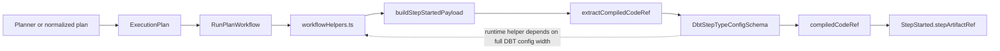
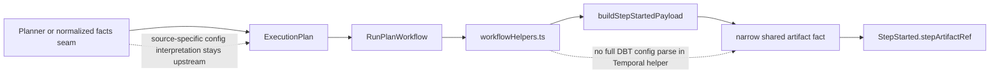

# Temporal workflow helper artifact facts narrowing slice 2026-04-10

## Summary

This proposal defines the next bounded implementation slice after planner
ingress compatibility.

The planner-side contract cleanup moves DBT-native ingress out of the shared
kernel. That still leaves one narrower but important component-level drift in
runtime orchestration:

- `workflowHelpers.ts` imports `DbtStepTypeConfigSchema`
- the helper parses full DBT config width only to read `compiledCodeRef`
- the Temporal adapter therefore knows more source-specific config semantics
  than it needs

This slice does not redesign the whole helper module.
It fixes the component boundary at the most important seam first:

- runtime helper code may consume narrow shared artifact facts
- runtime helper code may not parse full source-specific step config schemas
- DBT-specific config interpretation must happen earlier than the Temporal
  helper layer

## Governing Sources

- [ADR-0018](../../../adr/ADR-0018_Shared_Kernel_Ownership_Governance.md)
- [ADR-0034](../../../adr/ADR-0034-bounded-context-boundaries-and-communication-rules.md)
- [ADR-0035](../../../adr/ADR-0035-planner-public-contract-evolution-protocol.md)
- [Planner kernel DBT boundary extraction follow-up 2026-04-10](./planner-kernel-dbt-boundary-extraction-follow-up-20260410.md)
- [Planner generic ingress compatibility slice 2026-04-10](./planner-generic-ingress-compatibility-slice-20260410.md)
- [workflowHelpers.ts Architecture Review](../../reviews/execution-runtime/20260315-workflow-helpers-architecture-review.md)
- [MW-A2 GenericGraphSource plan](./mw-a2-generic-graph-source-plan-20260404.md)
- [ExecutionPlan.v1.ts](../../../../packages/@dvt/contracts/src/contracts/planner/ExecutionPlan.v1.ts)
- [StepTypeRegistry.ts](../../../../packages/@dvt/contracts/src/step-registry/StepTypeRegistry.ts)
- [workflowHelpers.ts](../../../../packages/@dvt/adapter-temporal/src/workflows/workflowHelpers.ts)

## Problem Summary

The repository already says that source-specific ingress belongs outside the
shared planner kernel.

The same architectural rule applies one layer later in execution runtime:

if a Temporal workflow helper needs one artifact fact, it should depend on that
fact, not on the full source-specific config envelope that happens to carry it.

Today the component still violates that rule:

- `buildStepStartedPayload()` gates on DBT step kinds
- `extractCompiledCodeRef()` parses `DbtStepTypeConfigSchema`
- `DbtStepTypeConfigSchema` includes unrelated DBT config width such as
  `stepTimeoutMs`, `retries`, `concurrency`, and `custom`
- runtime helper behavior is therefore coupled to DBT config evolution that is
  not part of the helper's real responsibility

## Component Decision

### Role of `workflowHelpers.ts`

`workflowHelpers.ts` is a deterministic support module for `RunPlanWorkflow`.
It is not a planner admission seam and it is not a source-plugin interpreter.

Its legitimate responsibilities are:

- workflow policy support
- continue-as-new state shaping
- gateway dependency support
- payload shaping from already normalized execution facts
- narrow parsing of workflow-owned invocation input

Its non-legitimate responsibilities are:

- parsing full DBT-specific config width
- acting as a second planner normalization seam
- reinterpreting source-specific caller semantics after plan admission

### Boundary Rule

Use one rule for this component:

if the helper only needs a shared artifact fact, the helper may depend only on
that fact or a narrow schema for that fact, not on the full source-specific
step config schema that contains it.

Applied here, that means:

- `CompiledCodeRef` or another narrow shared artifact fact is allowed
- `DbtStepTypeConfigSchema` is not an allowed dependency for runtime helper
  payload extraction
- source-specific config interpretation belongs upstream in planner
  normalization, plan validation, or a dedicated normalized-facts seam

## Current Component Shape

## Target Component Shape

## Ownership Matrix

| Concern                                      | Owner after this slice                             | Rationale                                                        |
| -------------------------------------------- | -------------------------------------------------- | ---------------------------------------------------------------- |
| Full DBT step config interpretation          | planner normalization or dedicated validation seam | source-specific config meaning does not belong to runtime helper |
| Shared artifact fact shape                   | shared kernel contracts                            | stable cross-package serializable fact                           |
| `StepStarted` payload shaping                | Temporal workflow helper                           | adapter-owned payload assembly from normalized facts             |
| DBT step-kind gating                         | Temporal adapter, temporarily                      | existing runtime taxonomy may remain while the seam is narrowed  |
| Full helper-module split by reason to change | deferred                                           | keep this slice bounded and executable                           |

## Think-First Options

### Option A: Keep full DBT schema parsing in the helper and only document the smell

Pros:

- zero code churn

Cons:

- keeps the wrong dependency in place
- leaves runtime coupled to unrelated DBT config evolution
- turns analysis into commentary with no architectural closure

### Option B: Narrow the helper to a shared artifact fact without redesigning the whole module

- remove `DbtStepTypeConfigSchema` from the helper seam
- use a narrow shared artifact fact or schema instead
- preserve existing helper file shape for now
- defer full helper decomposition to a later slice

Pros:

- fixes the most important ownership error now
- keeps the slice small enough to execute safely
- aligns runtime helper behavior with the planner boundary cleanup

Cons:

- does not complete the broader helper-module split
- may still leave temporary step-kind gating in the adapter

### Option C: Split the whole helper module and redesign plan normalization in one slice

Pros:

- reaches a cleaner end state faster on paper

Cons:

- mixes too many reasons to change
- expands from a component-boundary fix into a broad runtime refactor
- raises delivery risk without needing to

## Selected Direction

Select **Option B**.

The next clean move is to narrow the dependency width of the Temporal helper
without trying to complete every remaining architecture cleanup in the same
change.

That gives one bounded execution slice:

- no full DBT schema parsing in `workflowHelpers.ts`
- helper reads only the narrow shared artifact fact it actually needs
- broader helper decomposition stays explicit and deferred

## Architectural Consequences

- Runtime helper logic becomes less sensitive to DBT config evolution that is
  irrelevant to artifact emission.
- The planner/kernel cleanup and the runtime adapter cleanup now tell the same
  architectural story.
- The Temporal adapter remains replaceable because it depends on shared facts,
  not source-plugin config width.
- The file still remains a mixed helper bucket after this slice, so a later
  decomposition slice is still required.

## Pre-Implementation Brief

- mode: `Full`
- scope:
  remove `DbtStepTypeConfigSchema` from the Temporal workflow helper seam and
  replace it with a narrow shared artifact-fact dependency while preserving the
  current `StepStarted` behavior
- touched paths:
  `packages/@dvt/adapter-temporal/src/workflows/workflowHelpers.ts`,
  any narrow shared schema or parser location under `packages/@dvt/contracts/src/**` if needed,
  focused tests under `packages/@dvt/adapter-temporal/test/**` and
  `packages/@dvt/contracts/test/**`,
  and this proposal if implementation notes need cross-linking
- expected outcome:
  `workflowHelpers.ts` no longer imports or parses `DbtStepTypeConfigSchema`,
  and `buildStepStartedPayload()` consumes only a narrow shared artifact fact
- risks and mitigations:
  a narrow parser introduced in the wrong layer could become a hidden alias for
  DBT config; mitigate by reusing or introducing a schema for the artifact fact
  only, with tests that prove unrelated DBT config fields no longer drive helper
  behavior
- out of scope:
  removing DBT step kinds from runtime taxonomy,
  splitting `workflowHelpers.ts` into multiple files,
  broad execution-plan redesign,
  and planner ingress compatibility removal
- validation plan:
  `pnpm --filter @dvt/contracts test`,
  `pnpm --filter @dvt/adapter-temporal test`,
  `pnpm docs:sync`,
  `pnpm docs:workboard:generate`,
  `pnpm verify:prepush`
- test coverage plan:
  add positive and negative tests that prove valid compiled artifact extraction,
  malformed artifact facts fail closed,
  and unrelated DBT config width no longer controls runtime helper success when
  the artifact fact itself is valid
- libraries evaluated:
  `None evaluated - component boundary narrowing and dependency-width cleanup`

## Proposed Implementation Sequence

1. Identify the narrow shared artifact fact the helper actually needs.
2. Reuse or define a schema/parser for that fact only.
3. Update `workflowHelpers.ts` so `buildStepStartedPayload()` depends only on
   that narrow fact.
4. Keep current step-kind gating only if still required by runtime behavior.
5. Add tests that prove the helper no longer depends on unrelated DBT config
   width.
6. Defer helper-file decomposition to the next architecture slice.

## Exit Criteria

This slice is ready to implement when it yields:

1. one explicit component decision for `workflowHelpers.ts`
2. one bounded implementation task that removes `DbtStepTypeConfigSchema` from
   the Temporal helper seam
3. one validation matrix that covers contracts, Temporal helper behavior, and
   generated planning surfaces
4. one documented statement of what remains deferred after the slice
