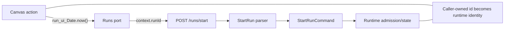
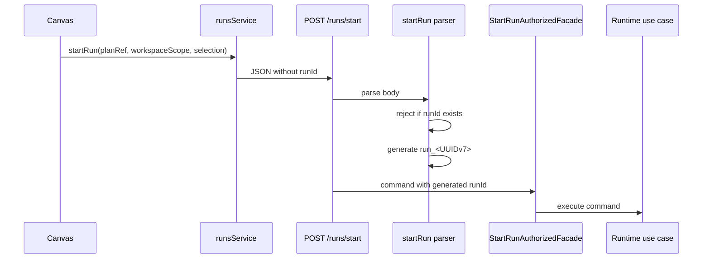
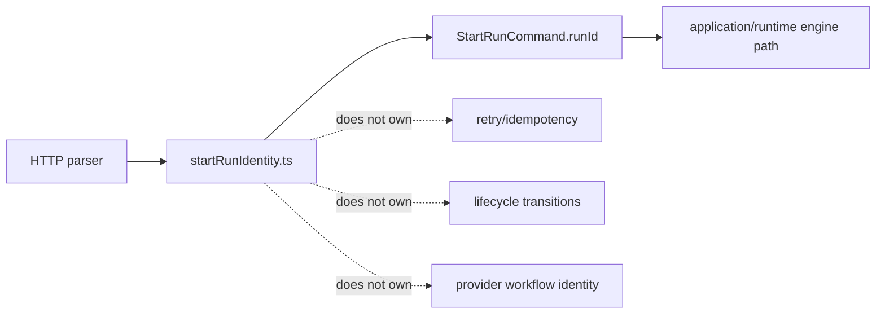

# Tenant/run identity platform-owned run id plan

## Summary

The 2026-04-23 DVT+ architecture review identified a P0 start-run identity
gap: the web canvas minted `run_ui_${Date.now()}` and the API accepted that
value as canonical runtime identity.

This plan closes the execution slice by making `runId` platform-owned at the
protected API boundary. The API allocates identity only; it does not become a
second engine or own lifecycle, retry, recovery, or duplicate-run semantics.

The selected decision is now captured in
`docs/adr/adr-0050-platform-owned-start-run-identity.md`.

## Governing sources

- `AGENTS.md`
- `docs/planning/status/governance-document-rule-inventory.md`
- `docs/guides/ai-work-protocol.md`
- `docs/planning/state/planning-control-tower.md`
- `docs/planning/reviews/architecture-and-governance/20260423-dvt-plus-system-architecture-review.md`
- `docs/adr/ADR-0004-event-sourcing-strategy.md`
- `docs/adr/ADR-0031-adapter-tenant-isolation.md`
- `docs/adr/adr-0050-platform-owned-start-run-identity.md`
- `packages/@dvt/contracts/src/contracts/engine/StartRunBoundary.v1.ts`
- `apps/api/src/entrypoints/http/startRunRoute.ts`
- `apps/api/src/entrypoints/http/startRunRouteParser.ts`
- `apps/api/src/entrypoints/http/startRunRouteCommandBuilder.ts`
- `apps/api/docs/start-run-http-entrypoint-component.md`
- `apps/api/docs/start-run-platform-identity-component.md`
- `apps/web/src/app/services/runs/runsService.api.ts`
- `apps/web/src/app/views/canvas/canvasRunStartAction.ts`
- `docs/architecture/components/web/runs/start-run-client-identity-boundary.md`

## Think-First Analysis

### Problem statement

Execution identity currently enters the system from the wrong side of the
boundary.

The browser generates a timestamp id, the web service forwards it, the API
accepts it, and the engine/runtime treat it as canonical run identity. That
undermines multi-tenant runtime safety because the caller controls a value that
drives duplicate detection, state bootstrapping, event ordering, snapshots, and
adapter run refs.

### Root cause

The internal `StartRunCommand` requires `runId`, and the HTTP parser previously
treated that as an external request requirement instead of inserting a
platform-owned identity between HTTP validation and application delegation.

The web port also mirrored the internal context shape, so the UI was allowed to
construct a `RunContext` for execution instead of sending only caller-owned
start-run inputs.

### Constraints and invariants

- `StartRunCommand` remains an internal API-to-runtime command with concrete
  `runId`.
- `ADR-0004` ordering and idempotency rules still depend on stable run ids.
- `ADR-0031` tenant-isolation rules still apply to tenant-owned storage rows.
- The UI must remain a client of API ports, not an execution host.
- The implementation must reject client-provided `runId`; it must not silently
  ignore the field.
- Generated `runId` values use the `run_<UUIDv7>` shape for time locality and
  multi-instance collision resistance, while consumers treat them as opaque.
- Persistence uniqueness remains the final collision guard.
- The API identity allocator must not import engine, state-store, provider
  adapter, or authenticated-facade semantics.
- No contract package change is required for this slice because the internal
  command continues to require `runId`.

### Selected option

Generate globally unique platform-owned `run_<UUIDv7>` values in `apps/api`
during `POST /runs/start` parsing.

The API will accept `planRef` or planner-backed plan input with scope,
`targetAdapter`, and `selection`, reject any request containing `runId`, and
then build the existing `StartRunCommand` with the generated value.

The web start-run port will stop accepting execution context and will send only
the plan reference, workspace scope, and selected step ids.

## Architecture

### Current state



### Target state

```mermaid
flowchart LR
  Canvas["Canvas action"] -->|"planRef + selection"| WebPort["Runs port"]
  WebPort -->|"scope + targetAdapter + selection"| ApiRoute["POST /runs/start"]
  ApiRoute -->|"rejects runId field"| Parser["StartRun parser"]
  Parser --> Generator["Platform run-id generator"]
  Generator -->|"run_<UUIDv7>"| Command["StartRunCommand"]
  Command --> Runtime["Runtime admission/state"]

  Authority["API owns execution identity"]
  Parser --- Authority
  Runtime --- Authority
```



### Sequence



### API is not a shadow engine



## Implementation plan

1. Add API route/parser tests for platform-generated `runId` and explicit
   rejection of client-provided `runId`.
2. Add web service and canvas tests proving start-run payloads do not include
   UI-generated execution ids.
3. Add an API-local `run_<UUIDv7>` generator seam with a collision-resistant
   default and deterministic injection for tests.
4. Thread the generator through `startRunRoute`, `parseStartRunBody`, and
   `parseStartRunCommand`.
5. Change `runsService.api` and the `StartRunInput` port so web start-run
   payloads carry caller-owned scope and selection, not execution context.
6. Change canvas start-run to pass the persisted plan ref, workspace scope, and
   plan-node selection without calling `buildRunContext`.
7. Extract plan-node selection into a named Canvas seam so run-start
   orchestration does not also own selection traversal.
8. Add semantic architecture tests for API and web identity ownership instead
   of relying only on route behavior tests.
9. Regenerate documentation surfaces and generated source inventory because
   the slice adds docs and a source module.
10. Run targeted API/web tests, type-checks, docs checks, and the pre-push gate.

## Acceptance criteria

- `POST /runs/start` succeeds when `runId` is omitted and delegates a generated
  `runId` to the start-run facade.
- `POST /runs/start` returns `400 bad_request` with a stable reason when the
  body includes `runId`.
- `apps/web` no longer sends `context.runId` or top-level `runId` in
  `/runs/start` requests.
- Canvas execution no longer mints `run_ui_*` ids.
- The internal runtime command still receives a concrete `runId`.
- The default API generator emits `run_<UUIDv7>` and stays independent of
  engine, persistence, adapter, and facade imports.
- Local component docs publish public API, invariants, transitions, and
  consumers for the API and web identity boundaries.
- The API allocator itself has a dedicated local component guide so the
  `run_<UUIDv7>` owned concern is not hidden inside the wider HTTP entrypoint
  guide.
- Architecture tests prove semantic identity ownership on both sides of the
  boundary.
- The review P0 item has an ADR, implementation evidence, and validation
  evidence.

## Out-of-scope boundaries

- This slice does not migrate runtime storage schemas because platform-owned
  generated ids preserve the existing global `run_id` key assumptions.
- This slice does not introduce start-run retry idempotency. Repeated admitted
  requests create distinct platform-owned run ids unless a later governed
  idempotency contract is added.
- This slice does not change plan-record tenant indexing. That remains a
  separate plan-store tenancy concern from the same architecture review.

## Validation plan

- `pnpm --filter dvt-api exec vitest run test/entrypoints/http/startRunRoute.authAndSuccess.test.ts test/entrypoints/http/startRunRoute.validation.test.ts test/entrypoints/http/startRunRoute.planSourcePolicy.test.ts`
- `pnpm --filter dvt-api exec vitest run test/entrypoints/http/startRunIdentity.architecture.test.ts`
- `pnpm --filter dvt-api exec vitest run test/app.test.ts`
- `pnpm --filter @dvt/web exec vitest run src/app/services/runs/runsService.test.ts src/app/views/canvas/useCanvasExecutionActions.runStart.test.tsx src/app/views/runs/useRunWorkspace.test.tsx`
- `pnpm --filter @dvt/web exec vitest run src/app/views/canvas/canvasRunStartIdentity.architecture.test.ts`
- `pnpm --filter dvt-api typecheck`
- `pnpm --filter @dvt/web typecheck`
- `pnpm docs:status:generate`
- `pnpm docs:planning:lanes:generate`
- `pnpm docs:workboard:generate`
- `pnpm docs:sync`
- `pnpm verify:prepush`

## AR-C11 canonization mechanization

This manifest records the 2026-05-23 AR-C11 follow-up that moved the
documented generated-id invariant into the start-run command-building boundary.

```feature-mechanization
version: 1
featureId: AR-C11-RUN-ID-CANON
mechanizationStatus: implemented
noHumanDecisionsRemaining: true
implementationPlan: docs/planning/proposals/mandatory/runtime-and-contracts/tenant-run-identity-platform-owned-run-id-plan-20260423.md
componentGuides:
  - apps/api/docs/start-run-http-entrypoint-component.md
  - apps/api/docs/start-run-platform-identity-component.md
  - docs/architecture/components/api/start-run-platform-identity-user-stories.md
  - docs/architecture/components/web/runs/start-run-client-identity-boundary.md
userStories:
  - docs/architecture/components/api/start-run-platform-identity-user-stories.md
governingSources:
  - AGENTS.md
  - docs/planning/status/governance-document-rule-inventory.md
  - docs/guides/ai-work-protocol.md
  - docs/architecture/command-query-rail-governance.md
  - docs/architecture/fowler-opportunity-planning-governance.md
  - docs/adr/adr-0050-platform-owned-start-run-identity.md
allowedImplementationSurfaces:
  - apps/api/src/entrypoints/http/startRunRouteCommandBuilder.ts
  - apps/api/test/entrypoints/http/planRouteParserHelpers.test.ts
  - apps/api/test/entrypoints/http/startRunIdentity.architecture.test.ts
  - apps/api/test/entrypoints/http/startRunRoute.authAndSuccess.test.ts
  - apps/api/test/entrypoints/http/startRunRoute.planSourcePolicy.test.ts
  - apps/api/test/entrypoints/http/startRunRoute.test.support.ts
  - apps/api/test/entrypoints/http/startRunRoute.validation.test.ts
  - apps/api/docs/start-run-http-entrypoint-component.md
  - apps/api/docs/start-run-platform-identity-component.md
  - buzon/20260523-codex-fowler-ar-c11-start-run-identity-follow-up.md
  - docs/architecture/components/api/start-run-platform-identity-user-stories.md
  - docs/planning/closeouts/20260423-tenant-run-identity-platform-owned-run-id-closeout.md
  - docs/planning/proposals/mandatory/runtime-and-contracts/tenant-run-identity-platform-owned-run-id-plan-20260423.md
forbiddenImplementationSurfaces:
  - packages/@dvt/contracts/**
  - packages/@dvt/engine/**
  - packages/@dvt/adapter-*/**
  - apps/web/**
commandQueryRails:
  - name: startRun
    type: command
    dddOwner: StartRunCommand
domainObjects:
  - name: StartRunCommand
    type: command
    owner: API / Runtime
  - name: PlatformStartRunIdentity
    type: value object invariant
    owner: apps/api HTTP entrypoint
fowlerSignals:
  - Documentation drift
  - Test-only confidence
  - Hidden authority
architectureGuards:
  - pnpm --filter dvt-api exec vitest run test/entrypoints/http/startRunIdentity.architecture.test.ts
cypressFlows:
  - Not applicable - protected API boundary invariant only
completionGate:
  - pnpm --filter dvt-api exec vitest run test/entrypoints/http/startRunRoute.validation.test.ts test/entrypoints/http/startRunIdentity.architecture.test.ts test/entrypoints/http/startRunRouteCommandBuilder.test.ts
  - pnpm --filter dvt-api typecheck
  - pnpm docs:sync
  - pnpm docs:status:generate
  - pnpm docs:feature-mechanization:implementation
  - pnpm verify:prepush
redGreenCycles:
  - id: generated-run-id-format-boundary
    redTest: pnpm --filter dvt-api exec vitest run test/entrypoints/http/startRunRoute.validation.test.ts -t "platform run-id generator"
    expectedFailure: The route calls the authenticated facade when an injected generated id is not run_<UUIDv7>.
    patchSurfaces:
      - apps/api/src/entrypoints/http/startRunRouteCommandBuilder.ts
      - apps/api/test/entrypoints/http/startRunRoute.validation.test.ts
      - apps/api/test/entrypoints/http/startRunIdentity.architecture.test.ts
    greenTest: pnpm --filter dvt-api exec vitest run test/entrypoints/http/startRunRoute.validation.test.ts -t "platform run-id generator"
symbols:
  - name: PLATFORM_START_RUN_ID_PATTERN
    path: apps/api/src/entrypoints/http/startRunRouteCommandBuilder.ts
    dddOwner: PlatformStartRunIdentity
    cqRails:
      - startRun
    fowlerSignals:
      - Documentation drift
      - Test-only confidence
    architectureGuard: pnpm --filter dvt-api exec vitest run test/entrypoints/http/startRunIdentity.architecture.test.ts
    cypressCoverage: Not applicable - protected API boundary invariant only
    unitTests:
      - pnpm --filter dvt-api exec vitest run test/entrypoints/http/startRunRoute.validation.test.ts
  - name: registryWith
    path: apps/api/test/entrypoints/http/startRunRoute.test.support.ts
    dddOwner: PlatformStartRunIdentity
    cqRails:
      - startRun
    fowlerSignals:
      - Test-only confidence
    architectureGuard: pnpm --filter dvt-api exec vitest run test/entrypoints/http/startRunIdentity.architecture.test.ts
    cypressCoverage: Not applicable - protected API boundary invariant only
    unitTests:
      - pnpm --filter dvt-api exec vitest run test/entrypoints/http/startRunRoute.validation.test.ts
  - name: VALID_GENERATED_RUN_ID
    path: apps/api/test/entrypoints/http/startRunRoute.test.support.ts
    dddOwner: PlatformStartRunIdentity
    cqRails:
      - startRun
    fowlerSignals:
      - Test-only confidence
    architectureGuard: pnpm --filter dvt-api exec vitest run test/entrypoints/http/startRunIdentity.architecture.test.ts
    cypressCoverage: Not applicable - protected API boundary invariant only
    unitTests:
      - pnpm --filter dvt-api test
  - name: VALID_GENERATED_RUN_ID_ALT
    path: apps/api/test/entrypoints/http/startRunRoute.test.support.ts
    dddOwner: PlatformStartRunIdentity
    cqRails:
      - startRun
    fowlerSignals:
      - Test-only confidence
    architectureGuard: pnpm --filter dvt-api exec vitest run test/entrypoints/http/startRunIdentity.architecture.test.ts
    cypressCoverage: Not applicable - protected API boundary invariant only
    unitTests:
      - pnpm --filter dvt-api test
```
