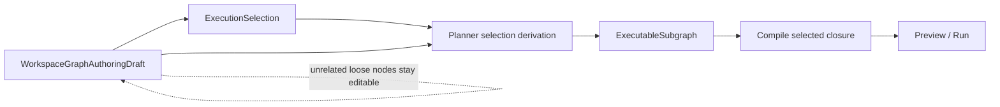
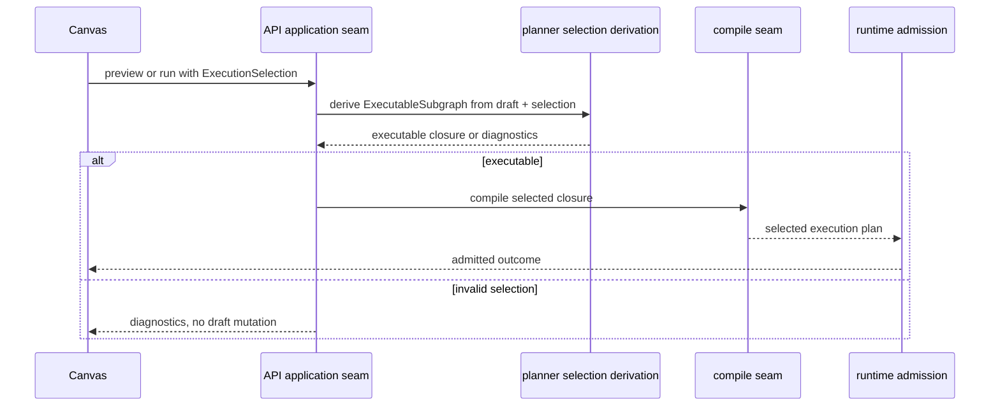

# TF-A2-C execution selection and executable subgraph plan

## Summary

The branch already corrected the persisted draft root:
`WorkspaceGraphAuthoringDraft` is now the editable protected truth and
`DesignGraphDraft` is no longer the save payload.

The remaining architectural gap is narrower and specific:

- preview and run still need one explicit command input that says what part of
  the editable draft the operator intends to execute;
- planner, api, and web still need one shared derived read model that says
  whether that selected closure is executable;
- without those two artifacts, the system can drift back to whole-draft compile
  semantics or UI-local selection logic.

This proposal freezes that missing seam as:

1. `ExecutionSelection`: command input for preview or run intent.
2. `ExecutableSubgraph`: derived selected-closure read model and diagnostics.

## Governing sources

- `AGENTS.md`
- `docs/planning/status/governance-document-rule-inventory.md`
- `docs/guides/ai-work-protocol.md`
- `docs/planning/state/planning-control-tower.md`
- `docs/planning/state/agent-lane-a.yaml`
- `docs/architecture/reference-architecture.md`
- `docs/contracts/planner/workspace-graph-draft-persistence-v1.md`
- `docs/architecture/components/planner/workspace-authoring-draft-aggregate.md`
- `docs/planning/proposals/mandatory/runtime-and-contracts/tf-a2-workspace-authoring-draft-aggregate-roots-plan-20260423.md`
- `docs/planning/proposals/mandatory/frontend-and-ux/tf-e2-canvas-target-architecture-execution-plan-20260417.md`
- `docs/planning/proposals/mandatory/frontend-and-ux/tf-e2-production-node-authoring-and-persistence-plan-20260416.md`

## Problem statement

The repository now has the correct authoring aggregate, but it still lacks one
dedicated architecture artifact for execution intent.

Today the idea exists in several places:

- the planner aggregate guide says run and preview must start from an explicit
  selection;
- the contract doc shows `ExecutionSelection` and an executable selected
  subgraph in diagrams;
- the TF-A2 aggregate-roots plan explains the seam conceptually.

What is still missing is one narrow proposal that allocates ownership, future
artifact paths, invariants, negative paths, and adoption order for the real
implementation slice.

Without that, three regressions stay likely:

1. preview or run falls back to "compile the whole draft";
2. web introduces a local selection DTO that diverges from contracts;
3. api or planner grows hidden execution policy at the wrong layer.

## Root cause

The execution seam was intentionally deferred while the branch fixed the more
urgent root problem: the persisted draft was compile-shaped instead of
authoring-shaped.

That sequence was correct, but it left the next boundary only partially frozen:

- aggregate root: now explicit
- protected read and write envelope: now explicit
- api application seam: now explicit
- execution-selection seam: still spread across larger plans and component docs

This is documentation and contract granularity drift, not a domain-model
contradiction.

## Constraints and invariants

- `WorkspaceGraphAuthoringDraft` remains the only editable persisted aggregate.
- `ExecutionSelection` expresses operator intent only; it does not mutate the
  draft.
- `ExecutableSubgraph` is derived from authoring truth plus selection; it is
  not a second persisted draft family.
- preview and run must consume the selected closure, not the whole editable
  draft by default.
- unrelated loose draft nodes must not block a selected executable SQL node.
- selecting an invalid node or incomplete closure must return explicit
  diagnostics.
- auth, capability, audit, compare-and-swap, and runtime admission remain
  application or runtime concerns, not selection-contract concerns.
- planner owns closure derivation and executability validation, not route
  handlers.

## Fowler reading

From a Fowler perspective this seam should be modeled as:

- `ExecutionSelection`: a command DTO with intention-revealing fields
- `ExecutableSubgraph`: a derived read model for validation and compilation
- planner derivation service: a domain/application service over the authoring
  aggregate, not a route script and not a UI-only helper

The design goal is to prevent the editable draft aggregate from becoming an
accidental execution aggregate.

## Mature-system comparison

This is consistent with mature graph-authoring systems:

- NiFi lets authors keep incomplete flows while running a selected processor
  group or component scope.
- Dagster separates asset graph authoring from the concrete materialization
  target.
- dbt editors allow incomplete project state while operators run selected
  models.

DVT needs the same split: authoring validity, selection validity, and execution
admission are different states.

## Options considered

### Option A: keep whole-draft compile as the default runtime boundary

Benefits:

- smallest immediate implementation delta

Rejected because:

- it makes loose unrelated nodes blockers again
- it reintroduces compile semantics into authoring posture
- it contradicts the authoring-aggregate reset already accepted

### Option B: define selection only inside `apps/web`

Benefits:

- quick local product movement

Rejected because:

- it creates a browser-local execution dialect
- api and planner would still lack one shared command boundary
- the repo would drift back into local DTO invention

### Option C: freeze a canonical `ExecutionSelection` plus

`ExecutableSubgraph` seam across contracts, planner, api, and web

Benefits:

- one shared operator-intent model
- one derived executability model
- keeps authoring, compile, and runtime admission responsibilities separate

Decision:

- accepted

## Target topology



## Proposed artifact set

The slice should introduce or converge on these owned artifacts:

- contract:
  `packages/@dvt/contracts/src/contracts/planner/ExecutionSelection.v1.ts`
- contract:
  `packages/@dvt/contracts/src/contracts/planner/ExecutableSubgraph.v1.ts`
- contract tests:
  `packages/@dvt/contracts/test/execution-selection.contract.test.ts`
  and
  `packages/@dvt/contracts/test/executable-subgraph.contract.test.ts`
- planner derivation service:
  `packages/@dvt/planner/src/...`
  owner path to be chosen during implementation, but it must stay planner-owned
- api adoption:
  preview and run application seams consume canonical selection contracts, not
  route-local DTOs
- web adoption:
  Canvas preview and run actions produce canonical `ExecutionSelection`

Interpretation rule:

- the proposal freezes ownership and artifact classes now
- exact planner source path can be chosen during implementation if it remains
  planner-owned and documented

## Contract sketch

`ExecutionSelection` should remain intentionally small:

```ts
type ExecutionSelection =
  | { mode: 'explicit'; nodeIds: string[] }
  | { mode: 'upstream'; nodeIds: string[] }
  | { mode: 'downstream'; nodeIds: string[] }
  | { mode: 'connected_component'; nodeIds: string[] };
```

`ExecutableSubgraph` should answer executability, closure, and diagnostics:

```ts
type ExecutableSubgraph = {
  selection: ExecutionSelection;
  nodeIds: string[];
  edgeIds: string[];
  executable: boolean;
  diagnostics: ExecutableSubgraphDiagnostic[];
};
```

The exact diagnostic taxonomy is still an implementation decision, but the
contract must at least express:

- selected node missing
- dependency gap
- cycle in selected closure
- unsupported selection mode input

## Ownership map

| Concern                               | Owner                        | Must not own                                   |
| ------------------------------------- | ---------------------------- | ---------------------------------------------- |
| selection intent contract             | `@dvt/contracts`             | route-local DTOs                               |
| selected-closure derivation           | `@dvt/planner`               | Fastify routes, React components               |
| auth and capability on preview or run | `apps/api` application layer | planner contract types                         |
| UI command production                 | `apps/web`                   | executability rules beyond contract validation |
| runtime admission                     | engine or runtime seams      | editable draft authority                       |

## Current-to-target sequence



## Negative paths to freeze

- selecting a node id that is not in the draft fails closed
- selecting a node whose required dependency closure cannot be satisfied fails
  closed with diagnostics
- cycle detection is evaluated on the selected closure
- selection validation must not rewrite the editable draft
- preview and run must not silently widen from selected scope to whole-draft
  scope

## Work packages

### TF-A2-C1. Contract pack

Freeze `ExecutionSelection` and `ExecutableSubgraph` as canonical planner
contracts with contract tests and negative-path diagnostics.

### TF-A2-C2. Planner derivation

Introduce the planner-owned derivation seam that resolves selected closure and
returns explicit executability diagnostics.

### TF-A2-C3. API adoption

Preview and run application boundaries consume canonical selection contracts and
planner-derived `ExecutableSubgraph` results instead of whole-draft compile
assumptions.

### TF-A2-C4. Web adoption

Canvas preview and run actions emit canonical `ExecutionSelection` without
inventing a second frontend-only DTO family.

## Definition of done

- `ExecutionSelection` exists as a canonical contract artifact
- `ExecutableSubgraph` exists as a canonical derived read-model contract
- planner owns the derivation and diagnostics seam
- preview or run of a valid selected SQL node succeeds even when unrelated
  loose nodes remain in the draft
- invalid selections return explicit diagnostics and do not mutate the draft
- api and web documentation no longer imply whole-draft compile as the default
  runtime path

## Validation baseline for the future implementation slice

```bash
pnpm --filter @dvt/contracts test -- execution-selection.contract.test.ts executable-subgraph.contract.test.ts
pnpm --filter @dvt/planner test
pnpm --filter dvt-api test
pnpm --filter @dvt/web test
pnpm verify:prepush
```
