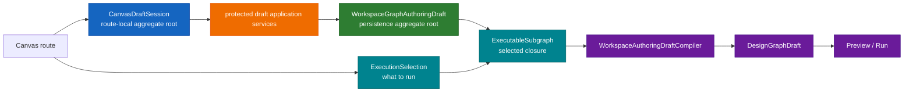
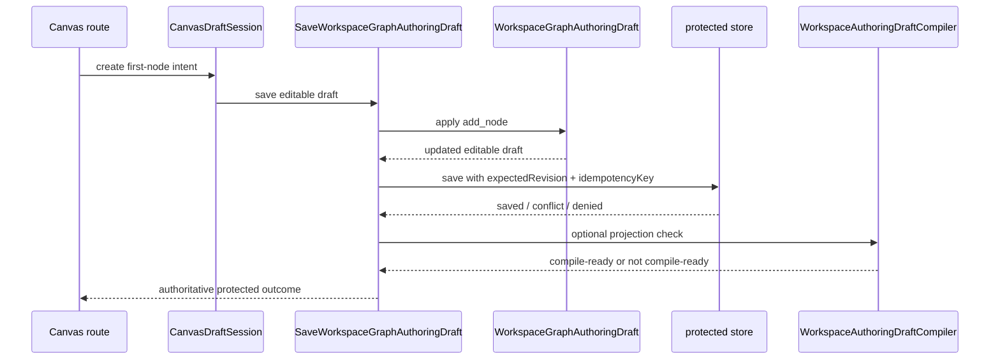
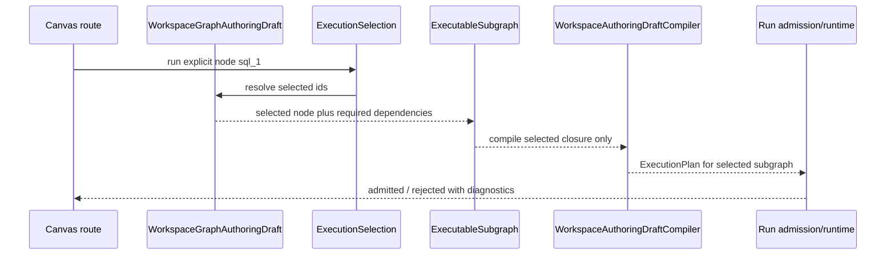
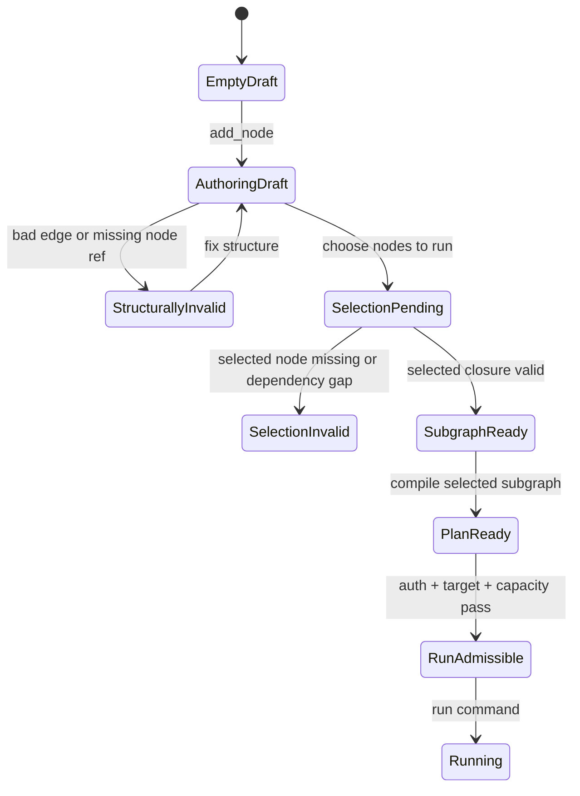

# TF-A2 workspace authoring draft aggregate roots and command plan

## Summary

`TF-A2` already froze the need for an editable workspace draft boundary, but it
still lacked one narrower decision: which aggregates exist, which one is the
true persistence aggregate root, and which commands belong to the aggregate
versus the application layer.

That gap is now the blocking architectural issue behind the current empty-graph
authoring dead end.

Before this branch, the active write path behaved as if the persisted draft
aggregate were a compile-ready `DesignGraphDraft`. That was the wrong root at
the wrong layer.

This proposal resets the model in Fowler/DDD terms:

1. `WorkspaceGraphAuthoringDraft` becomes the persistence aggregate root.
2. `CanvasDraftSession` remains the route-local interaction aggregate root.
3. `DesignGraphDraft` stays a derived compile artifact, never the editable
   aggregate itself.
4. compile validity is removed from the persistence contract.
5. compare-and-swap, idempotency, auth, and audit remain application concerns
   around the aggregate, not inside it.
6. execution starts from an explicit `ExecutionSelection`, not from the full
   editable draft by default.

This is a replace-and-converge plan, not a compatibility plan.

## Governing sources

- `AGENTS.md`
- `docs/planning/status/governance-document-rule-inventory.md`
- `docs/guides/ai-work-protocol.md`
- `docs/planning/state/planning-control-tower.md`
- `docs/planning/state/agent-lane-a.yaml` (`TF-A2`)
- `docs/planning/proposals/mandatory/runtime-and-contracts/tf-a2-workspace-graph-draft-persistence-boundary-plan-20260416.md`
- `docs/planning/proposals/mandatory/frontend-and-ux/tf-e2-canvas-empty-authoring-entrypoint-design-20260422.md`
- `docs/architecture/components/web/graph/canvas-draft-session-component.md`
- `docs/architecture/components/web/graph/graph-frontend-architecture.md`
- `docs/contracts/planner/workspace-graph-draft-persistence-v1.md`
- `docs/architecture/reference-architecture.md`

## Problem statement

The pre-slice system mixed four distinct concerns:

1. editable graph authoring truth
2. route-local interaction and sync posture
3. compile-ready graph shape
4. protected write orchestration

That mixing appeared as one concrete failure:

- the protected draft write path assumed `DesignGraphDraft`
- a graph-first authoring state such as `one node, zero edges` is a valid
  editing state but not a valid compile graph
- the UI therefore cannot persist the first meaningful authoring step through
  the canonical protected boundary

In Fowler terms, the system has a draft read model and local interaction
aggregate, but no explicit editable persistence aggregate root. The compile
artifact is filling that gap by accident.

## Root cause

The root cause is not the database and not React Flow.

The root cause is semantic ownership drift:

- pre-slice `WorkspaceGraphDraft.v1` embedded `DesignGraphDraft`
- the API save path persisted compile-shaped truth instead of authoring truth
- the web save path compiled before persisting
- Canvas therefore treats compile validity as a save precondition

That violates the intended split already described in `TF-A2`:

- authoring draft first
- compile projection second

## Constraints and invariants

- no browser-local authority may replace protected draft truth
- no compatibility wrapper or legacy route should be introduced
- one node, zero edges, and partially connected graphs are valid authoring
  states
- compile invariants belong to projection and preview/run seams, not to the
  persisted authoring aggregate
- execution validity is evaluated against a selected executable subgraph, not
  against every loose node present in the authoring draft
- compare-and-swap, idempotency, auth, audit, and telemetry remain mandatory at
  the protected boundary
- `CanvasDraftSession` must remain the authoritative route-local interaction
  aggregate for Canvas
- `DesignGraphDraft` must remain a derived artifact used by preview/run only

## Erosion path to prevent

The main architectural failure mode is letting the API become a shadow engine.
This branch must prevent the following drift sequence:

1. UI starts treating itself as a generic API client instead of an authoring
   shell over a local interaction aggregate.
2. API starts compiling, storing, validating, and admitting graph execution from
   the same path.
3. API adds run policy decisions that should belong to application/runtime
   ports or the engine boundary.
4. API adds retry and recovery semantics that should belong to runtime
   orchestration and state-store concerns.
5. API becomes a shadow engine with implicit lifecycle authority.

The stable split is:

- UI owns interaction intent and local draft session state.
- API owns protected application commands, auth, CAS, idempotency, and audit.
- Planner owns compile projection and executable-subgraph validation.
- Engine/runtime owns lifecycle, retry, recovery, admission, and execution
  policy.

## Options considered

### Option A: keep `DesignGraphDraft` as the persisted aggregate

Benefits:

- lowest immediate code churn
- no contract family split

Rejected because:

- graph-first authoring remains impossible
- compile invariants stay coupled to save
- the persistence boundary continues to misidentify the aggregate root

### Option B: persist a thin wrapper around `DesignGraphDraft`

Benefits:

- looks smaller than a full reset
- preserves current compiler-facing vocabulary

Rejected because:

- the wrapper would still inherit compile semantics
- authoring truth would still be represented indirectly
- web and api would keep performing compile-shaped projection work before save

### Option C: define an explicit editable persistence aggregate and keep compile

projection separate

Benefits:

- matches the original `TF-A2` intent
- supports first-node and partial-graph authoring
- keeps compile validity in the correct downstream seam
- aligns protected persistence with mature editor-like systems

Decision:

- accepted

## Aggregate and root model

### 1. Persistence aggregate root: `WorkspaceGraphAuthoringDraft`

This is the persisted workspace-owned aggregate.

It owns:

- visible node membership
- visible edge membership
- persisted node positions
- semantic node records
- semantic edge records
- authoring-schema version inside the protected draft envelope

It does not own:

- HTTP transport
- authorization policy
- compare-and-swap orchestration
- idempotency storage
- compile projection
- React Flow adapter fallout

### 2. Route-local aggregate root: `CanvasDraftSession`

This aggregate already exists and remains valid.

It owns:

- sync posture
- remote baseline reference
- local working-set visibility
- pending explicit-node admission
- route-local conflict or missing-remote posture

It does not replace the protected persistence aggregate. It is the route-local
interaction root, not the canonical persisted authoring root.

### 3. Derived compile artifact: `DesignGraphDraft`

`DesignGraphDraft` remains:

- compile-ready truth
- preview/run input
- a derived artifact from `WorkspaceGraphAuthoringDraft`

It is not:

- the persistence aggregate root
- the save payload for graph-first authoring
- the shape that defines whether an edit is storable

### 4. Execution seam: `ExecutionSelection`

`ExecutionSelection` is the command input that says what the operator intends
to execute from the editable draft.

It owns:

- selected node ids
- selection mode such as explicit, upstream, downstream, or connected component
- the fact that a run request is scoped to a subgraph intent

It does not own:

- editable draft truth
- persisted draft revisions
- adapter admission
- runtime lifecycle state

This seam matches mature graph-authoring systems such as NiFi, dbt, Dagster,
and Airflow: the canvas may contain incomplete or disconnected work, while a
valid selected processor/task/model/subgraph can still be compiled and run.

### 5. Derived execution read model: `ExecutableSubgraph`

`ExecutableSubgraph` is derived from `WorkspaceGraphAuthoringDraft` plus
`ExecutionSelection`.

It owns:

- closure of required dependencies for the selection
- selected nodes and selected edges
- validation diagnostics explaining why a selection is or is not executable

It is not:

- the persisted aggregate root
- a second editable draft DTO
- a compatibility wrapper around `DesignGraphDraft`

### 6. Read model: `WorkspaceGraphSnapshot`

`WorkspaceGraphSnapshot` stays a read model and should not regain aggregate
authority.

## Target topology



## Aggregate boundary choice

| Candidate                      | Role                                   | Accepted               | Why                                                                  |
| ------------------------------ | -------------------------------------- | ---------------------- | -------------------------------------------------------------------- |
| `WorkspaceGraphAuthoringDraft` | persisted authoring aggregate root     | yes                    | owns editable graph truth without compile invariants                 |
| `CanvasDraftSession`           | route-local interaction aggregate root | yes                    | owns sync and working-set policy, not persistence authority          |
| `ExecutionSelection`           | run/preview command input              | yes                    | says what part of the draft the operator intends to execute          |
| `ExecutableSubgraph`           | derived selection read model           | yes                    | validates selected closure without making loose draft nodes blockers |
| `DesignGraphDraft`             | compile artifact                       | yes                    | derived artifact only                                                |
| `WorkspaceGraphSnapshot`       | read model                             | yes                    | projection only                                                      |
| `ReactFlow` node/edge state    | visual projection                      | no aggregate authority | must not become semantic truth                                       |

## User stories by component

### `WorkspaceGraphAuthoringDraft`

As a data author, I want to save an empty, first-node, disconnected, or partial
graph so that I can build a workspace incrementally before it is compile-ready.

Acceptance:

- saving one node with zero edges is valid
- saving disconnected nodes is valid
- saving an edge to a missing node is invalid
- saving a compile-shaped `DesignGraphDraft` as the editable draft is invalid

### `WorkspaceGraphDraft` protected envelope

As a protected API caller, I want every draft read/write to carry scope,
capability, audit, schema-version, revision, and idempotency semantics so that
authorization, conflict handling, and recovery are deterministic.

Acceptance:

- save requires `scope`, `schemaVersion`, `expectedRevision`, and
  `idempotencyKey`
- stale saves return `conflict`, not silent overwrite
- denied saves/read return typed capability and audit posture
- corrupt or unsupported stored drafts fail closed through typed format errors

### `CanvasDraftSession`

As a Canvas operator, I want local edits, remote baseline, conflict state, and
sync posture tracked separately from protected persistence so that the route can
show honest state without pretending local edits are authoritative.

Acceptance:

- local route state never replaces protected draft truth
- conflict and missing-remote states are explicit
- visible working-set decisions stay route-local
- successful save still refreshes from the protected boundary

### `ExecutionSelection`

As an operator, I want to run a selected node or selected subgraph rather than
the whole editable draft so that unrelated loose work does not block useful
execution.

Acceptance:

- explicit selected node ids are required for run/preview intent
- loose nodes outside the selected closure do not block execution
- selecting a node with missing dependencies returns diagnostics
- selection does not mutate the editable draft

### `ExecutableSubgraph`

As the compiler boundary, I want a resolved selected closure so that compile
validity is evaluated against the intended run target instead of the whole
authoring draft.

Acceptance:

- selected nodes must exist in the editable draft
- required dependencies are present or derivable by selection mode
- diagnostics explain why a selected closure is invalid
- valid closures can produce `DesignGraphDraft`

### `DesignGraphDraft`

As preview/run infrastructure, I want a compile-ready artifact derived from a
valid selected subgraph so that runtime execution never depends on raw
authoring state.

Acceptance:

- `DesignGraphDraft` is derived only after selection validation
- compile invariants stay in projection/preview/run seams
- the protected draft save path never accepts `DesignGraphDraft` as authoring
  truth

### `WorkspaceGraphSnapshot` and React Flow state

As a read-model consumer, I want projected graph and viewport state separated
from the persisted aggregate so that UI layout and projections cannot drift into
semantic authority.

Acceptance:

- snapshots remain read models
- React Flow nodes/edges are viewport projections
- backend authoring payloads are not inferred from visual-only state without
  semantic node data

### Empty Canvas authoring entrypoint

As a user opening an empty workspace, I want a governed `Add first node`
entrypoint so that an empty graph is productive without creating fake startup
nodes or local-only success paths.

Acceptance:

- empty authorable state exposes first-node creation
- read-only empty state does not expose mutation CTAs
- first-node save round-trips through protected draft authority
- the viewport shows the node only after authoritative refresh

## Aggregate shape

The contract line should converge on the existing editable shape vocabulary
instead of inventing another wrapper:

```ts
type WorkspaceGraphAuthoringDraft = {
  nodeIds: string[];
  nodePositions: Record<string, { x: number; y: number }>;
  nodes: WorkspaceGraphAuthoringNode[];
  edges: WorkspaceGraphAuthoringEdge[];
};
```

That shape is allowed to represent:

- zero nodes
- one node
- disconnected subgraphs
- partially connected graphs
- nodes that are semantically valid but not yet compile-ready

## Aggregate invariants

`WorkspaceGraphAuthoringDraft` should enforce structural invariants only:

- `nodeIds` are unique
- `nodePositions` exist only for visible nodes and for all visible nodes
- declared visible nodes must exist in `nodes`
- semantic node ids are unique
- semantic edge ids are unique
- semantic edges must reference declared semantic nodes

It must not enforce compile invariants such as:

- exactly one source
- exactly one transform
- exactly one sink
- exactly two edges
- exact `source -> transform -> sink` chain
- preview provenance presence
- SQL artifact availability

Those belong to compile projection.

## Command taxonomy

### Aggregate commands

These commands mutate `WorkspaceGraphAuthoringDraft` state itself.

```ts
type WorkspaceGraphAuthoringCommand =
  | {
      type: 'add_node';
      node: WorkspaceGraphAuthoringNode;
      position: { x: number; y: number };
    }
  | {
      type: 'update_node';
      nodeId: string;
      patch: Partial<WorkspaceGraphAuthoringNode>;
    }
  | {
      type: 'remove_node';
      nodeId: string;
    }
  | {
      type: 'move_node';
      nodeId: string;
      position: { x: number; y: number };
    }
  | {
      type: 'connect_nodes';
      edge: WorkspaceGraphAuthoringEdge;
    }
  | {
      type: 'disconnect_nodes';
      edgeId: string;
    }
  | {
      type: 'apply_import';
      nodes: WorkspaceGraphAuthoringNode[];
      edges: WorkspaceGraphAuthoringEdge[];
    };
```

Interpretation rule:

- aggregate commands are pure authoring-state transitions
- they do not carry auth, correlation, retries, or HTTP details

### Application commands

These commands orchestrate protected boundary behavior around the aggregate.

```ts
type SaveWorkspaceGraphAuthoringDraft = {
  scope: WorkspaceGraphDraftScope;
  expectedRevision: string | null;
  idempotencyKey: string;
  draft: WorkspaceGraphAuthoringDraft;
};

type ProjectWorkspaceGraphAuthoringDraft = {
  scope: WorkspaceGraphDraftScope;
  draft: WorkspaceGraphAuthoringDraft;
};

type CompileWorkspaceGraphSelection = {
  scope: WorkspaceGraphDraftScope;
  draft: WorkspaceGraphAuthoringDraft;
  selection: ExecutionSelection;
};
```

Application commands own:

- auth
- capability outcomes
- compare-and-swap
- idempotency
- audit
- telemetry
- format-migration outcomes
- execution-selection orchestration

They do not redefine the aggregate.

### Execution selection commands

Execution commands never imply "run the whole authoring draft" unless the
selection explicitly says so.

```ts
type ExecutionSelection =
  | { mode: 'explicit'; nodeIds: string[] }
  | { mode: 'upstream'; nodeIds: string[] }
  | { mode: 'downstream'; nodeIds: string[] }
  | { mode: 'connected_component'; nodeIds: string[] };
```

Interpretation rule:

- loose nodes outside the selected dependency closure do not block execution
- selected nodes must exist in the editable draft
- required dependencies must be included or derivable by the selection mode
- compile and run admission evaluate the selected subgraph only

## Command-to-layer allocation

| Concern                     | Aggregate command | Application service     | Compiler/projection |
| --------------------------- | ----------------- | ----------------------- | ------------------- |
| add first node              | yes               | wrapped by save         | no                  |
| update node metadata        | yes               | wrapped by save         | no                  |
| move node                   | yes               | wrapped by save         | no                  |
| connect/disconnect          | yes               | wrapped by save         | no                  |
| compare-and-swap            | no                | yes                     | no                  |
| idempotency                 | no                | yes                     | no                  |
| authorization               | no                | yes                     | no                  |
| audit                       | no                | yes                     | no                  |
| compile validity            | no                | no                      | yes                 |
| choose executable selection | no                | yes                     | no                  |
| validate selected subgraph  | no                | maybe orchestrates call | yes                 |
| build `DesignGraphDraft`    | no                | maybe orchestrates call | yes                 |
| run selected SQL node       | no                | yes                     | yes                 |

## Sequence for the first node



Interpretation rule:

- save success does not require compile success
- compile-readiness is informative downstream state, not the save admission
  rule

## Sequence for a selected SQL node

This sequence covers the mature-system case: a valid SQL node exists in the
draft while another incomplete or disconnected node is also present. The loose
node remains editable but does not block the selected SQL node.



Selection rule:

- if `sql_1` is self-contained, another loose draft node does not block it
- if `sql_1` depends on another node, that dependency must be present in the
  selected closure
- selecting the loose node directly requires that loose node to be executable

## State model



## Relationship to web runtime

The web runtime should converge on this model:

- `CanvasDraftSession` remains the local interaction root
- `useCanvasCurrentDraftPayload` must answer "is this draft projectable from the
  current route state?" separately from "is this draft compile-ready?"
- `canvasDraftRepository.saveGraphDraft(...)` must persist
  `WorkspaceGraphAuthoringDraft`, not build `DesignGraphDraft`
- `canvasDraftAuthoring.ts` becomes a compile-projection seam, not a persistence
  prerequisite seam

## Relationship to api runtime

The API runtime should converge on this model:

- `saveWorkspaceGraphDraftUseCase` accepts `WorkspaceGraphAuthoringDraft`
- `getWorkspaceGraphDraftUseCase` returns `WorkspaceGraphAuthoringDraft`
- protected write/read ports keep capability, audit, format, CAS, and
  idempotency behavior unchanged
- compile projection becomes explicit and one-way

## No-go rules

- no saving `DesignGraphDraft` as the editable aggregate
- no compile-validity gate on authoring save
- no second editable DTO family in `apps/web`
- no "temporary" compatibility wrapper that allows both aggregate shapes
- no hidden local fallback that pretends a save succeeded before authoritative
  refresh

## Existing candidate contract

The repository already contains a candidate editable draft contract file:

- `packages/@dvt/contracts/src/contracts/planner/WorkspaceGraphAuthoringDraft.v1.ts`

This plan chooses convergence on that editable aggregate vocabulary rather than
introducing another parallel draft shape. The follow-up slice must review and
polish that file, then make it the active root behind `WorkspaceGraphDraft.v1`.

## Execution slices

### TF-A2-A: freeze aggregate root and command vocabulary

Scope:

- promote `WorkspaceGraphAuthoringDraft` to the active persisted draft shape
- define and document aggregate versus application command ownership
- add semantic architecture tests proving the persistence boundary no longer
  imports `DesignGraphDraft`
- document that run/preview must enter through `ExecutionSelection`, not the
  full editable draft

Definition of done:

- one editable aggregate root is canonical
- `WorkspaceGraphDraft.v1` embeds editable authoring draft, not compile draft
- docs and semantic tests agree on aggregate ownership
- selection semantics are documented as separate from authoring persistence

### TF-A2-B: reset API read/write boundaries around the editable aggregate

Scope:

- update API ports and use cases to read and write editable draft truth
- keep capability, audit, format, CAS, and idempotency semantics intact

Definition of done:

- protected API stores editable aggregate truth
- compile projection is separated from persistence
- no save path in `apps/api` depends on compile-shaped draft input

### TF-A2-C: introduce execution-selection projection

Scope:

- define `ExecutionSelection` as the command input for preview/run from a draft
- derive `ExecutableSubgraph` from the editable draft plus selection
- compile selected closures rather than the whole authoring draft by default

Definition of done:

- a valid selected SQL node can run while unrelated loose nodes remain in the
  draft
- selecting an invalid loose node returns diagnostics instead of blocking the
  entire workspace draft
- tests prove selection does not mutate or replace the authoring aggregate

### TF-E2-A follow-through: consume the corrected boundary in web authoring

Scope:

- remove compile-before-save from web draft persistence
- allow first-node and partial-graph persistence
- keep `CanvasDraftSession` as route-local aggregate

Definition of done:

- the first node on an empty protected draft is saveable
- web save path no longer compiles to persist
- route-visible success still waits for authoritative refresh

## Required semantic tests

- contract test: one-node editable draft is valid
- API architecture test: save/read path for protected draft does not depend on
  `DesignGraphDraft`
- web repository test: save path sends editable aggregate payload
- controller integration test: first-node authoring from empty remote draft
  autosaves through the protected boundary
- selection test: selected executable SQL node is compilable while unrelated
  loose draft node is ignored
- selection negative test: selecting a node with missing required dependencies
  returns diagnostics and does not mutate the draft
- documentation/architecture test: component docs mention both roots and their
  non-overlapping responsibilities

## Validation baseline

```bash
pnpm docs:sync
pnpm docs:workboard:generate
pnpm verify:prepush
```
