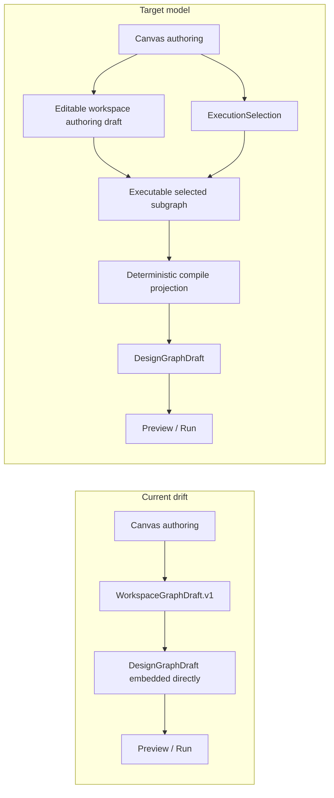

# TF-A2 Workspace Graph Draft Persistence Boundary Plan 2026-04-16

## Purpose

This proposal closes the contract gap between Canvas authoring and backend-owned
persistence.

The goal is not to add another frontend draft cache. The goal is to define one
typed, blocking, cross-lane boundary for editable workspace graph drafts so
`web`, `api`, and the persistence owner stop drifting behind local DTOs,
browser-only state, or route-local save heuristics.

The editable draft aggregate must stay distinct from the compiled
`DesignGraphDraft` artifact consumed by preview and run. The persistence
boundary owns authoring truth first and compiled projection second.

## Governing sources

- `docs/planning/status/governance-document-rule-inventory.md`
- `docs/guides/ai-work-protocol.md`
- `docs/architecture/reference-architecture.md`
- `docs/planning/execution-model/dvt-execution-model.md`
- `docs/architecture/components/engine/contracts/engine/SignalsAndAuth.v1.md`
- `docs/architecture/components/web/frontend-data-boundary-architecture.md`
- `docs/contracts/planner/TransformationFlowPreview.v1.md`
- `docs/planning/proposals/mandatory/frontend-and-ux/tf-e2-production-node-authoring-and-persistence-plan-20260416.md`

## Problem

Today the repo has a typed read boundary for `WorkspaceGraphSnapshot` through
`IWorkspacePort.getGraphSnapshot()`, but it does not yet have a canonical typed
write boundary for editable graph drafts.

Before the authoring-aggregate correction, the executable draft contract
drifted from the intended model: `WorkspaceGraphDraft.v1` embedded
`DesignGraphDraft`, which meant the shared persistence shape inherited
compile-time invariants such as exactly one `source`, one `sql_transform`, one
`sink`, and the governed two-edge chain.

That coupling means the current protected save path cannot represent:

- a first node on an empty graph
- a partially connected graph under active editing
- graph-first authoring flows that are valid editing states but not yet valid
  compile inputs

That creates three failure modes:

1. frontend-local draft state can appear more authoritative than backend truth
2. API/store behavior can be introduced later without a shared contract freeze
3. Canvas productization can proceed without mechanical boundary enforcement
4. the shared draft aggregate can accidentally become the compile artifact
   instead of the authoring source of truth

That is below the repo's architectural bar:

- domain behavior must sit behind ports
- tenant context must be explicit
- idempotency must be explicit on write boundaries
- UI must not become the execution or persistence authority

## Decision

Editable graph-draft persistence must extend the governed workspace boundary.

It must not introduce:

- a Canvas-only persistence service family
- route-local DTO contracts
- browser-local storage as product authority
- direct frontend ownership of persistence semantics
- compiled-graph invariants in the editable draft aggregate

The boundary chain is:

1. Lane A freezes the shared contract pack and port semantics
2. Lane C implements the protected API and store-facing write boundary
3. Lane E adopts the boundary and removes UI-local persistence authority

## Aggregate split

The canonical model is staged, not one-shape-for-everything.

### Stage 1: editable authoring draft

This is the persisted workspace-owned aggregate used by Canvas authoring.

It must permit:

- incomplete node sets
- incomplete edge sets
- intermediate graph topologies during editing
- node and edge metadata needed for authoring UX

It must not require compile-time graph validity.

### Stage 2: execution selection

Preview and run do not operate on the whole editable draft by default. They
operate on an explicit `ExecutionSelection`: selected node ids plus a governed
selection mode such as explicit, upstream, downstream, or connected component.

The selection is resolved into an executable subgraph. Loose nodes outside that
selected dependency closure do not block execution.

### Stage 3: compiled design-graph projection

`DesignGraphDraft` remains the compile-ready shared kernel used by preview and
run. It is a derived artifact built from the editable authoring draft plus an
execution selection only when the selected subgraph satisfies the governed
compile invariants.

### Ownership rule

- `WorkspaceGraphDraft` owns editable authoring truth
- `ExecutionSelection` owns run/preview intent
- `DesignGraphDraft` owns compile-ready truth
- the system must not persist `DesignGraphDraft` as if it were the editable
  aggregate

### Current-to-target topology



## Boundary shape

The active plan assumes the workspace family expands with one typed draft
surface alongside `WorkspaceGraphSnapshot`.

That draft surface is an editable authoring aggregate. It is not a thin wrapper
around `DesignGraphDraft`.

Minimum contract outputs:

- a typed editable graph-draft record
- a typed schema or contract version for the persisted draft shape
- a typed revision token for optimistic concurrency
- a typed write request and response envelope
- a caller-supplied idempotency key for logical write retries
- typed conflict and authorization outcomes
- typed capability outcomes for read, write, and read-only posture
- typed audit envelope or correlation data for protected decisions and writes
- explicit tenant, project, and environment scope

The active caller surface should remain in the workspace family, not a parallel
Canvas family.

Illustrative shape:

```text
IWorkspacePort
  - getGraphSnapshot()
  - getGraphDraft()
  - saveGraphDraft(...)
  - projectDesignGraphDraft(...)
```

Illustrative protected route family:

```text
GET /workspace/graph/draft
PUT /workspace/graph/draft
POST /workspace/graph/draft/project-design-graph (optional future seam)
```

The exact final names may be refined during implementation, but the family and
ownership must not drift.

## Authoring draft semantic requirements

The editable draft contract must preserve authoring semantics that are broader
than compile semantics.

Minimum semantic requirements:

- node identifiers stay stable across reload and save
- edge identifiers or deterministic edge identity stay stable enough for
  reconnect and delete operations
- the aggregate can represent zero nodes, one node, and partially connected
  graphs
- a runnable selected node or subgraph is evaluated separately from unrelated
  loose draft nodes
- authoring payloads do not require preview-only Git provenance or compile-only
  transform fields just to persist a user edit

The compile projection may require extra fields for the selected executable
subgraph. The editable draft must not.

## Exact minimum caller-visible envelopes

`TF-A2` does not need to freeze final package file names yet, but it does need
to freeze the minimum field-level shape that downstream lanes must preserve.

### Capability outcome

Every successful readable draft response and every typed authorization outcome
must carry a caller-visible capability envelope with this minimum shape:

```ts
type WorkspaceGraphDraftScope = {
  tenantId: string;
  projectId: string;
  environmentId: string;
};

type WorkspaceGraphDraftCapabilityMode = 'writable' | 'read_only' | 'forbidden';

type WorkspaceGraphDraftCapabilityReason =
  | 'authorized'
  | 'write_denied'
  | 'tenant_mismatch'
  | 'workspace_scope_denied'
  | 'unauthenticated';

type WorkspaceGraphDraftCapabilityOutcome = {
  scope: WorkspaceGraphDraftScope;
  mode: WorkspaceGraphDraftCapabilityMode;
  canRead: boolean;
  canWrite: boolean;
  reason: WorkspaceGraphDraftCapabilityReason;
};
```

Field rules:

- `scope` is the authoritative workspace scope seen by the protected boundary
- `mode` is the single UI-driving capability state for Canvas
- `canRead` and `canWrite` are not optional and must agree with `mode`
- `reason` belongs to a closed vocabulary so the frontend does not invent
  permission heuristics or ad-hoc string matching

### Audit reference

Every protected authorization outcome and every write attempt outcome must carry
or reference this caller-visible audit envelope:

```ts
type WorkspaceGraphDraftAuditOutcome = 'allowed' | 'read_only' | 'forbidden' | 'conflict';

type WorkspaceGraphDraftAuditRef = {
  correlationId: string;
  decisionId: string;
  action: 'draft_read' | 'draft_write';
  outcome: WorkspaceGraphDraftAuditOutcome;
  recordedAt: string;
};
```

Field rules:

- `correlationId` ties caller-visible behavior to backend evidence
- `correlationId` is also the canonical join key across audit artifacts,
  traces, and operator-facing recovery procedures
- `decisionId` identifies the protected authorization or mutation decision
- `decisionId` must be reusable as an observability attribute for protected
  route diagnosis
- `action` is closed to `draft_read` and `draft_write` for the v1 slice
- `outcome` is caller-visible and must match the protected decision outcome
- `recordedAt` is server-produced, not inferred by the browser

### Format evolution metadata

Every successful draft read response must carry caller-visible format metadata
with this minimum shape:

```ts
type WorkspaceGraphDraftMigrationState = 'native' | 'read_migrated';

type WorkspaceGraphDraftFormatMeta = {
  schemaVersion: string;
  storedSchemaVersion: string;
  migrationState: WorkspaceGraphDraftMigrationState;
};
```

Field rules:

- `schemaVersion` is the active current contract version returned to callers
- `storedSchemaVersion` is the version found in persistence before any
  read-time migration
- `migrationState` tells callers whether the response was already current or
  required governed migration on read
- the write path must only emit the active `schemaVersion`; it must not write
  older compatibility versions back into storage

Every typed read failure caused by persisted-format evolution must carry this
minimum outcome shape:

```ts
type WorkspaceGraphDraftFormatErrorReason =
  | 'unsupported_schema_version'
  | 'corrupt_payload'
  | 'migration_failed';

type WorkspaceGraphDraftFormatError = {
  reason: WorkspaceGraphDraftFormatErrorReason;
  storedSchemaVersion?: string;
};
```

Field rules:

- unsupported or corrupt persisted drafts must fail closed through one typed
  format error surface rather than degrading into an empty graph
- `storedSchemaVersion` is required when the version can be determined
- `migration_failed` is reserved for governed migrations that exist but do not
  complete successfully

### Minimum backend audit obligation

The contract also freezes the minimum audit data that the protected backend must
persist or emit, even if the final storage schema is implemented later:

- actor identity or subject reference
- workspace scope (`tenantId`, `projectId`, `environmentId`)
- action (`draft_read` or `draft_write`)
- outcome (`allowed`, `read_only`, `forbidden`, or `conflict`)
- `correlationId`
- `decisionId`
- server timestamp

This is the minimum auditable payload. Lane C may enrich it, but it must not
emit less.

### Minimum observability correlation obligation

The contract also freezes the minimum correlation semantics that runtime
observability must preserve for this boundary:

- protected draft read and write routes must emit traces that include
  `correlationId`, `decisionId`, action, and outcome
- protected draft read and write routes must emit outcome-oriented metrics for
  request count, failure count, conflict count, and latency
- raw tenant or workspace identifiers must not become high-cardinality metric
  labels; that scope belongs in traces, logs, and audit artifacts
- runbook-driven diagnosis must be able to join audit evidence and runtime
  telemetry through the same `correlationId` and `decisionId`

## Required contract semantics

### 1. Revision and conflict

- writes must carry a caller-visible revision or equivalent concurrency token
- writes must use compare-and-swap semantics against that revision
- stale writes must fail closed with a typed conflict outcome
- duplicate retries of the same logical write must not create a second semantic
  state transition

### 1.1 First merge posture

The first governed merge policy is explicit reject-on-stale, not implicit merge.

That means:

- the server does not attempt structural auto-merge for concurrent edits in v1
- stale saves return the current authoritative revision plus a typed conflict
  outcome
- the frontend must reload and reapply user intent instead of silently
  overwriting backend truth

### 1.2 Versioning posture

- the editable draft contract must carry an explicit schema or contract version
- the persisted record must carry a mutable revision for compare-and-swap
- schema evolution and mutable revision are separate concerns and must not be
  conflated into one field

### 1.2.1 Persisted format evolution posture

- the persisted draft must carry explicit `schemaVersion`
- the boundary must declare one active writer version and an explicit,
  governed backward-compatibility window for readable legacy versions
- compatibility is opt-in and enumerated; the read path must not accept
  unbounded historical versions by accident
- governed migrations must run before business logic, projection, or React Flow
  hydration consumes the draft payload
- successful reads may return `read_migrated`, but the returned payload must
  already conform to the active `schemaVersion`

### 1.2.2 Migration and backfill posture

- Lane C owns the protected read/write behavior for format migration and any
  write-back or batch backfill execution needed to converge stored drafts
- read-time migration may be used for the first compatible legacy window, but
  indefinite mixed-version persistence is not acceptable as steady state
- when a governed legacy version remains readable, the plan must also define
  how and when stored records are backfilled or rewritten to the active version
- migration logic must be deterministic, side-effect scoped, and separately
  testable from route orchestration

### 1.2.3 Corrupt and unsupported draft posture

- unsupported persisted versions must return typed
  `unsupported_schema_version` outcomes
- unparseable or semantically corrupt persisted drafts must return typed
  `corrupt_payload` outcomes
- callers must receive explicit degraded recovery posture rather than silent
  reset, empty-canvas fallback, or browser-local substitution
- recovery work, if supported later, belongs to governed runbook and
  operator-visible workflows rather than hidden client repair

### 1.3 Idempotent retry posture

- each logical save attempt must include a caller-supplied idempotency key
- the uniqueness boundary must be scoped tightly enough to prevent cross-tenant
  or cross-workspace collisions
- retrying the same logical save after timeout or transport failure must return
  the existing write result rather than appending a second semantic mutation

### 2. Tenant and scope

- draft reads and writes must be tenant-scoped
- project and environment scope must be explicit
- the contract must not rely on hidden frontend globals for workspace identity

### 3. Authorization

- read and write authorization outcomes must be explicit at the protected API
  boundary
- read-only posture must be caller-visible to the frontend
- the contract must not collapse `read allowed, write denied` into a generic
  failure outcome
- write authorization must remain tenant-scoped and workspace-scoped

### 3.1 Tenant and role posture

- tenant, project, and environment identity must be part of the authorization
  decision input
- the protected route must not infer edit capability from frontend route state
  or cached workspace selection
- callers with read permission and no write permission must receive an explicit
  read-only capability outcome rather than an ambiguous success or failure

### 3.2 Audit posture

- protected read and write authorization decisions must emit or reference an
  audit artifact
- successful graph-draft writes and rejected write attempts must carry enough
  metadata to correlate tenant scope, workspace scope, actor, action, and
  outcome
- the contract does not need to freeze a final audit storage schema in `TF-A2`,
  but it must freeze the audit obligation and the caller-visible correlation
  surface consumed by downstream implementations

### 4. Persistence ownership

- API validates and normalizes caller input through shared contracts
- persistence ownership stays behind the backend store boundary
- web consumes the shared boundary through `IWorkspacePort`, not through local
  DTO copies
- the write boundary must expose canonical revision and conflict data back to
  the caller; the frontend must not infer them from local timestamps or caches
- compile projection ownership is explicit and one-way; callers do not save a
  `DesignGraphDraft` directly as the editable authoring aggregate

### 5. Read-your-writes behavior

- the caller-visible read model for the editable draft must have an explicit
  freshness expectation
- Lane C must tie route behavior to the existing `read-your-writes contract`
  instead of leaving freshness implicit

## Cross-lane execution rule

`TF-E2` must not treat graph persistence as a frontend-owned slice.

Blocking sequence:

1. `TF-A2` freezes the shared contract and port semantics
2. `TF-C4` implements the protected API/store path
3. `TF-E2-A` adopts the shared workspace graph-draft boundary

`TF-E2-B..D` must not close on browser-local or visual-only persistence.

## Completion rule

This boundary slice is only ready when all of the following are true:

1. one shared contract pack defines editable workspace graph-draft semantics
2. that shared contract pack models an editable aggregate rather than embedding
   `DesignGraphDraft` directly
3. one workspace-family port exposes typed read and write operations
4. the write contract defines explicit schema-version, revision, compare-and-
   swap, and idempotency semantics
5. tenant, project, and environment scope plus explicit read, write, and
   read-only authorization outcomes are part of the governed boundary
6. capability outcomes and audit references use the exact minimum field-level
   shapes frozen above rather than lane-local aliases or stringly-typed drift
7. protected decisions and writes are required to emit or reference auditable
   outcomes instead of leaving audit behavior implicit
8. observability correlation semantics are frozen so runtime traces, metrics,
   and audit evidence can be joined without per-lane reinterpretation
9. format metadata, migration state, and typed format-error outcomes use the
   exact minimum field-level shapes frozen above
10. schemaVersion ownership, compatibility window, migration strategy, and
    backfill posture are explicit rather than left to implementation guesswork
11. one protected API/store path owns canonical authoring-draft persistence
12. `DesignGraphDraft` is produced through an explicit projection step instead
    of being the editable persistence payload
13. preview and run enter through explicit execution selection rather than
    whole-draft compile-by-default behavior
14. conflict, auth, freshness, retry, and format-evolution behavior are
    caller-visible and typed
15. Lane E depends on this chain instead of inventing local persistence

## Validation baseline

```bash
pnpm docs:planning:lanes:generate
pnpm docs:workboard:generate
pnpm docs:sync
pnpm verify:prepush
```
