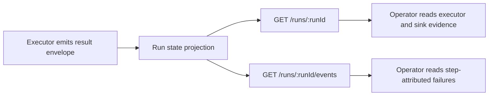

# TF-C2-B Runtime Read-Surface Evidence Plan 2026-04-08

## Purpose

Define the runtime read-surface contract for transformation execution outcomes so
operators can inspect materialization success and failure attribution directly
from API responses without backend log access.

## Governing sources

- [Transformation Flow Architecture And Contracts 2026-04-05](transformation-flow-architecture-and-contracts-20260405.md)
- [Transformation Flow Delivery Plan 2026-04-05](transformation-flow-delivery-plan-20260405.md)
- [Plan Creation Interface Route Proposal 2026-04-05](plan-creation-interface-route-proposal-20260405.md)
- [Lane C state](../../../state/agent-lane-c.yaml)

## Scope

This slice governs caller-visible evidence in:

- `GET /runs/:runId`
- `GET /runs/:runId/events`

Out of scope:

- executor implementation internals (`TF-C2-A`)
- new UI rendering behavior (`TF-E1-C`)
- dbt mode expansion (`TF-C3-A`)

## Current-state diagnostic

Today, run-read consumers cannot reliably answer:

- which executor produced the run result
- whether sink materialization happened and where
- how many rows were written
- which step failed and at what timestamp

## Target contract outcomes

Both read surfaces must expose, when available:

1. `executor.id` and executor mode metadata
2. sink materialization target identity (provider, dataset/table, schema when present)
3. rows written as numeric evidence (`rowsWritten`)
4. failure attribution to canonical step id (`failedStepId`) with failure reason/message
5. event and snapshot timestamps sufficient for operator timeline reconstruction

## Current-to-target map

## Contract seam and compatibility

- Keep existing fields backward compatible; add evidence fields as optional-first
  in transport and required-by-policy in transformation execution mode.
- Avoid embedding executor-private payloads; expose normalized contract fields only.
- Failure attribution must use canonical step ids generated by the persisted plan
  path, not display labels.

## Validation baseline for this slice

- `pnpm --filter @dvt/api test`
- focused contract/route tests for run snapshot and events serialization
- regression coverage for missing evidence and failed-step fallback behavior
- `pnpm verify:prepush`

## Delivery sequence

1. freeze read-surface field names and optionality rules
2. wire state projection mapping from execution outcome to run snapshot/events
3. add negative and compatibility tests for null or partial evidence
4. validate with package tests and prepush gate

## Exit criteria

1. run detail callers can identify executor and sink target from API payloads
2. run events include step-attributed failure diagnostics when execution fails
3. row-count evidence is present or explicitly unavailable with deterministic semantics
4. no route relies on backend log inspection for operator-level triage
