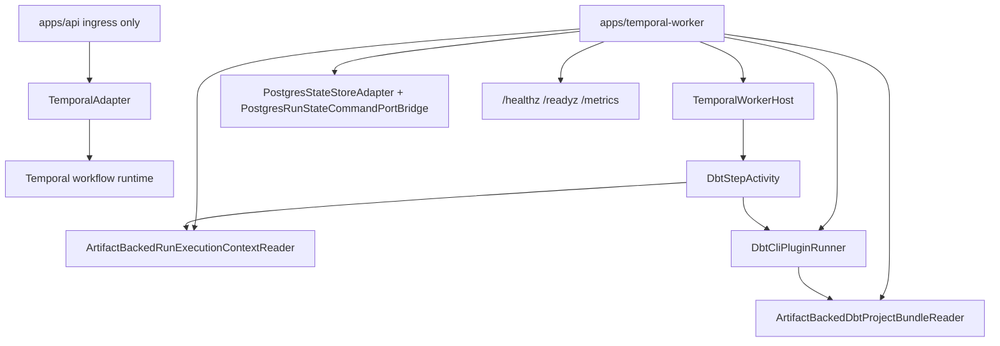
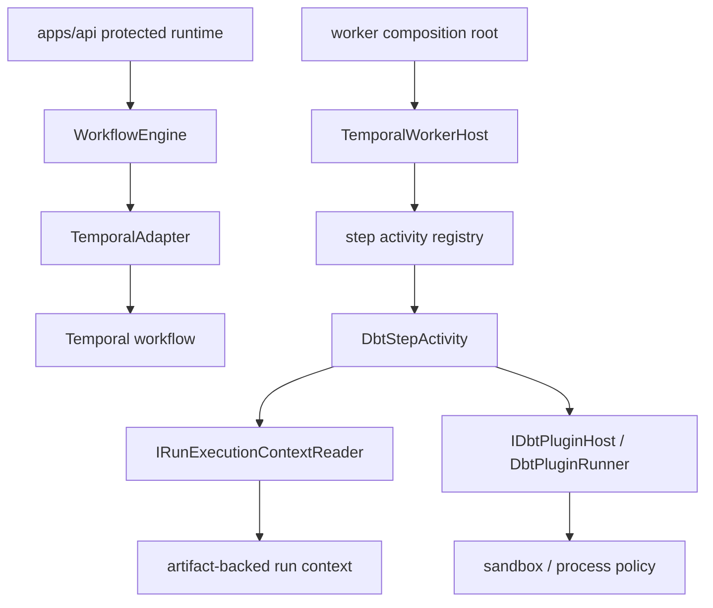
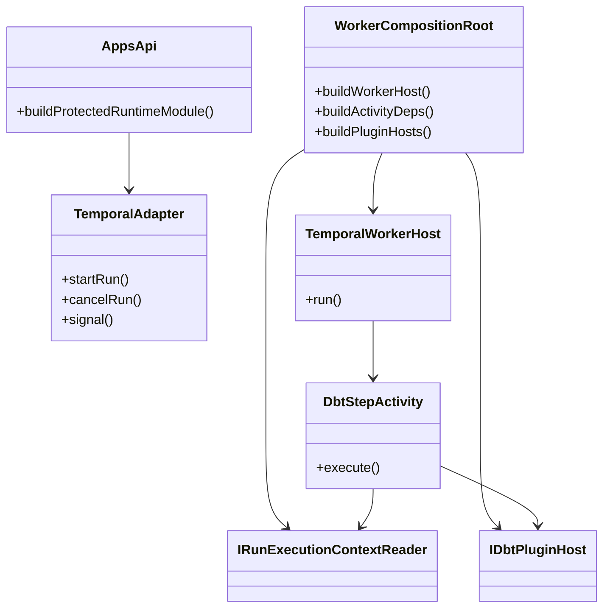

# TF-C3 Production Plugin Host Composition Plan 2026-04-14

## Purpose

Define and track the production composition model for phase-2 dbt execution.

`TF-C3` already landed two useful slices:

1. protected runtime resolves a governed `runExecutionContextRef`; and
2. `@dvt/adapter-temporal` exposes a fail-closed DBT projection seam at the
   adapter boundary.

At planning time, what was missing was the real product composition root that
wired those pieces into a production Temporal worker path without leaking dbt
semantics into `@dvt/engine` or inventing a second product loop.

The core implementation from this plan is now landed in-repo. This document
remains the rationale and decomposition reference for `TF-C3-B..TF-C3-E`.

## Implementation Status

### Landed on 2026-04-14

- `TF-C3-B` reader convergence in `@dvt/artifacts`
- `TF-C3-C` canonical `apps/temporal-worker` composition root
- `TF-C3-D` adapter-owned DBT CLI host behind `DbtPluginRunner`

### Still open

- `TF-C3-E` rollout hardening, acceptance evidence, and operational truth
  beyond the in-repo worker/runbook baseline

### Implemented topology

## Execution Breakdown

| Task      | Intent                                                                               | Effort | Current status |
| --------- | ------------------------------------------------------------------------------------ | ------ | -------------- |
| `TF-C3-B` | converge artifact-backed execution-context and bundle readers under `@dvt/artifacts` | `3pt`  | Landed         |
| `TF-C3-C` | create the canonical standalone Temporal worker composition root                     | `5pt`  | Landed         |
| `TF-C3-D` | run DBT through an adapter-owned CLI host behind `DbtPluginRunner`                   | `8pt`  | Landed         |
| `TF-C3-E` | rollout/runbook/acceptance hardening and truth-surface closure                       | `3pt`  | In progress    |

## Governing sources

- [AGENTS.md](../../../../../AGENTS.md)
- [AI Work Protocol](../../../../guides/ai-work-protocol.md)
- [DVT+ Execution Model Specification](../../../execution-model/dvt-execution-model.md)
- [IProviderAdapter Contract](../../../../architecture/components/engine/contracts/engine/IProviderAdapter.v1.md)
- [Plugin Sandbox Contract](../../../../architecture/components/engine/contracts/extensions/PluginSandbox.v1.md)
- [Transformation Flow Product Decisions 2026-04-05](./transformation-flow-product-decisions-20260405.md)
- [Transformation Flow Delivery Plan 2026-04-05](./transformation-flow-delivery-plan-20260405.md)
- [Execution Runtime domain](../../../domains/execution-runtime.md)
- [System Delivery Status](../../../../architecture/system-delivery-status.md)

## Think-First Analysis

### Original problem summary

The repo no longer lies about DBT being a kernel feature. That part was fixed
before this plan was implemented.

At plan time, the system still did not have a real in-repo production
composition path that injected:

- `IRunExecutionContextReader`; and
- an adapter-owned `DbtPluginRunner`

into the actual Temporal worker that executes `DbtStepActivity`.

That left the system in this posture:

- admission boundary: materially real
- adapter seam: materially real
- production worker composition: undefined

That was not a bug at one line. It was a missing composition model.

### Original root cause

The repository had a clean engine-to-adapter boundary, but not yet a clean
host-runtime boundary for extension execution.

More concretely:

- `apps/api` composes provider adapters for the protected runtime ingress
  surface;
- `@dvt/adapter-temporal` contains `TemporalAdapter`, `TemporalWorkerHost`,
  step-activity factories, and the DBT projection seam; but
- there was no canonical in-repo worker bootstrap that said where the DBT host
  runtime is built, how it receives artifacts/runtime readers, and how the
  worker lifecycle is owned operationally.

That gap was previously hidden by tests and by a tendency to treat
`TemporalWorkerHost` as an implementation detail instead of a first-class
composition boundary.

### Pre-implementation current-state model

### Why this mattered

Without a production composition model, the system was vulnerable to four bad
outcomes:

1. DBT runtime stays test-only.
2. Somebody wires DBT by reaching upward into kernel or API code.
3. A later bootstrap path injects the seam incorrectly and drifts from tests.
4. A second product loop appears because the missing host gets solved ad hoc.

### Constraints and invariants

- `dbt` must remain outside `@dvt/engine` semantics.
- `IProviderAdapter` remains the engine-facing runtime boundary.
- plugin runtime inputs must be explicit and deny-by-default.
- `RunExecutionContext` remains the immutable execution payload carrier.
- `TF-C3` must reuse the same outer loop:
  `design -> preview -> PlanRef -> run -> result`.
- one persisted plan still binds one provider/executor profile for that run.
- production composition must be explicit about process ownership, bootstrap,
  health, and failure mode.

### Options considered

#### Option A. Inject DBT runtime directly from `apps/api`

Have `apps/api` own the DBT runner and hand it downward into Temporal worker
internals.

**Why it is attractive**

- fewer moving parts at first glance
- no extra process/bootstrap artifact required immediately

**Why it is wrong**

- collapses ingress composition and worker composition into one place
- increases pressure to let API own provider runtime semantics
- does not model a mature worker-host boundary
- invites hidden coupling between HTTP startup and execution worker lifecycle

#### Option B. Push DBT semantics into `@dvt/engine`

Treat DBT mode as an engine concern and let the engine decide plugin behavior.

**Why it is attractive**

- one central place to reason about execution
- may appear to reduce host complexity

**Why it is wrong**

- directly violates the existing execution model and phase-2 product decisions
- turns provider/executor specifics into kernel semantics
- makes future provider growth harder, not easier

#### Option C. Define a dedicated worker composition root that owns plugin host wiring

Create a canonical worker-bootstrap boundary that:

- constructs `TemporalWorkerHost`;
- injects `IRunExecutionContextReader`;
- injects adapter-owned plugin runners such as DBT; and
- keeps runtime/process ownership outside engine core and HTTP ingress.

**Why it is attractive**

- matches the repo's hexagonal stance
- preserves the existing seam instead of bypassing it
- gives one place for operational ownership, health, rollout flags, and future
  sandbox policy
- copies a mature systems posture: explicit worker composition root, explicit
  plugin/runtime host, explicit process boundary

**Why it is not free**

- adds one more top-level composition concern
- forces clarity on worker lifecycle and deployment shape
- needs docs and operational truth before code

### Selected option and rationale

Select **Option C**.

The missing problem is not "how do we call DBT from a step activity". That part
already exists as a seam.

The missing problem is "where does the real worker runtime get composed, owned,
and operated".

That is a composition-root problem. Mature systems solve it with an explicit
runtime host boundary, not by smearing provider logic across HTTP startup,
engine core, and tests.

### Rejected alternatives

- API-owned DBT host injection: rejected because it collapses ingress and
  worker responsibilities.
- Engine-owned DBT behavior: rejected because it violates the provider/plugin
  boundary.
- "Just keep the seam and wire later": rejected because it is not a design; it
  is deferred ambiguity.

## Fowler-style System Model

### Primary separation

The model needs four layers, each with one job:

| Layer                     | Responsibility                                     | Must not own               |
| ------------------------- | -------------------------------------------------- | -------------------------- |
| Product ingress           | admit, authorize, persist, start by `PlanRef`      | worker runtime lifecycle   |
| Engine + provider adapter | execution policy plus provider dispatch boundary   | plugin-host process policy |
| Worker composition root   | construct worker host and runtime dependencies     | HTTP/API concerns          |
| Plugin host               | execute DBT-specific runtime behavior under policy | canonical run truth        |

### Target-state model

### Responsibility model

## Benchmark posture from mature systems

This is not about cloning one product. It is about borrowing the right shape.

| Mature posture                          | What to copy                                                         | What not to copy                                        |
| --------------------------------------- | -------------------------------------------------------------------- | ------------------------------------------------------- |
| Temporal-style worker model             | explicit worker bootstrap and lifecycle outside request-serving code | letting workflow SDK concerns define product boundaries |
| Dagster-style code location separation  | user/runtime execution lives behind an explicit host boundary        | broad asset-platform scope                              |
| Airbyte-style worker/process separation | connectors/executors run behind dedicated worker ownership           | connector sprawl and platform breadth                   |
| dbt-style artifact reviewability        | Git-first and artifact-first runtime inputs                          | making dbt project management the product surface       |

The common theme is the same:

- core orchestration stays small;
- execution hosts are explicit;
- plugin/connector code runs behind a dedicated boundary;
- operational lifecycle is owned by the host, not by the kernel.

## Proposed production composition model

### 1. Add a canonical worker composition root

Introduce an explicit in-repo composition root for Temporal worker startup.

It should own:

- worker config
- `TemporalWorkerHost` construction
- activity dependency construction
- `IRunExecutionContextReader` wiring
- plugin-host wiring for DBT

It must not own:

- HTTP route setup
- engine lifecycle truth
- UI contracts

### 2. Make DBT host runtime an adapter-owned host interface

Keep DBT-specific runtime behavior behind an adapter-owned host boundary such
as `IDbtPluginHost` or a stricter successor to `DbtPluginRunner`.

That boundary should own:

- invocation shape
- runtime failure mapping
- host-local policy hooks
- future sandbox/process delegation

It must not own:

- canonical run status
- event ordering
- engine retries or business lifecycle policy

### 3. Keep the step activity thin

`DbtStepActivity` should do only:

1. resolve immutable context
2. validate required DBT plugin payload
3. delegate to the plugin host
4. map result/failure back to activity result

It should not:

- bootstrap a host
- discover environment config
- open artifacts itself beyond the reader seam
- own sandbox/process policy

### 4. Treat plugin host policy as host-owned, not kernel-owned

The worker composition root and plugin host should become the place where later
policy lands:

- rollout flags
- sandbox tier
- resource limits
- health/readiness
- plugin runtime observability

That is consistent with `PluginSandbox.v1.md` and avoids retrofitting policy
into step activities.

## Implementation slice model

### Phase 2A. Design and bootstrap closure

Required outputs:

- canonical worker composition plan
- agreed process owner for Temporal worker startup
- explicit dependency model for `IRunExecutionContextReader` and DBT host

Current status:

- Landed through the shared artifact readers, the standalone worker app, and
  the DBT CLI host composition path.

### Phase 2B. Runtime host wiring

Required outputs:

- in-repo production worker bootstrap exists
- DBT host injected through that bootstrap
- fail-closed health behavior when host wiring is absent

Current status:

- Landed in `apps/temporal-worker` with DBT-on startup validation, fail-closed
  reader/runner composition, and dedicated operational endpoints.

### Phase 2C. Operational hardening

Required outputs:

- worker/bootstrap docs and runbook
- rollout and diagnostics surfaces
- tests for host composition, not only adapter seam behavior

Current status:

- Partially landed. The worker now ships `/healthz`, `/readyz`, `/metrics`,
  dedicated monitor/tests, and a runbook baseline. Remaining work is rollout
  evidence and broader environment acceptance, not missing in-repo topology.

## Pre-Implementation Brief

- Mode: Full
- Scope:
  - production Temporal worker composition root
  - adapter-owned plugin host boundary for DBT
  - operational documentation and rollout truth
- Expected outcome:
  - repo contains one truthful place where DBT runtime is composed
  - DBT stays adapter/plugin-owned rather than kernel-owned
  - worker lifecycle and plugin lifecycle become explicit and testable
- Risks and mitigations:
  - Risk: invent a second product loop
  - Mitigation: preserve `PlanRef` start and existing outer contract
  - Risk: push DBT semantics upward into API or engine
  - Mitigation: keep all DBT host logic below `IProviderAdapter`
  - Risk: hide the host in another implicit helper
  - Mitigation: require an explicit top-level composition root and runbook
- Out of scope:
  - marketplace packaging
  - full sandbox implementation
  - broad executor/plugin framework generalization beyond the DBT host seam
- Validation plan:
  - composition-root tests
  - adapter/worker integration proof
  - docs/planning regeneration
  - `pnpm verify:prepush`
- Test coverage plan:
  - worker startup with host wiring present
  - worker startup with host wiring absent
  - DBT step fails closed when host rejects invalid payload
  - DBT step succeeds through composed host path, not fixture-only wiring
- Libraries evaluated:
  - None adopted in this plan slice. The chosen posture borrows system shape
    from mature worker-host designs rather than introducing a new framework.

## Decision rules for implementation

Implementation is acceptable only if all of this stays true:

1. no DBT semantics move into `@dvt/engine`
2. no API route becomes the owner of worker/plugin lifecycle
3. there is one canonical worker composition root in-repo
4. tests cover the production-style composition path, not just helpers
5. planning/docs describe the same topology that code implements

## Not done if

This slice must still be treated as incomplete if any of these remain true:

1. the only DBT wiring path is in tests
2. `DbtStepActivity` can only run with helper-injected deps
3. no canonical worker bootstrap exists in repo
4. host policy is still buried in step activity code
5. docs still imply runtime closure without host composition
