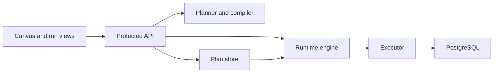
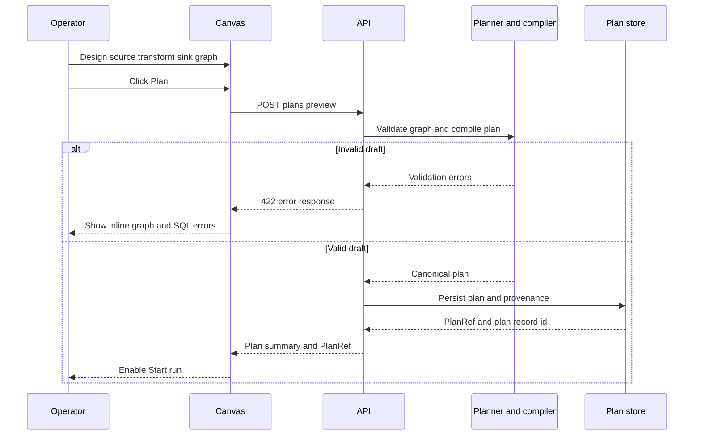
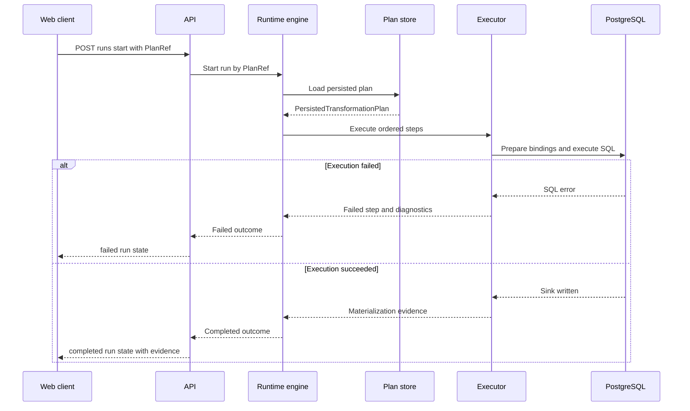

# Transformation Flow Architecture And Contracts 2026-04-05

## Purpose

This document defines the execution model, contracts, terms, and boundaries for
the first transformation vertical.

It answers four technical questions:

1. what the operator designs
2. what preview validates and persists
3. what the runtime actually executes
4. what the read surfaces must return afterward

## Current state and target state

| Surface         | Exists now                                           | Must be added for this vertical                            |
| --------------- | ---------------------------------------------------- | ---------------------------------------------------------- |
| Canvas          | Canvas shell and run actions already exist           | governed `source -> sql_transform -> sink` design contract |
| Web plan client | frontend already expects `/plans/preview`            | protected API route plus persisted-plan semantics          |
| Web run client  | frontend already uses `/runs/start` and run reads    | result UX aligned to materialization evidence              |
| Runtime routes  | run start and run read routes exist                  | preview-persist route and SQL-first execution path         |
| Planner         | deterministic planning boundary exists               | design-graph-to-step compiler for SQL-first flow           |
| Runtime         | `PlanRef` is the execution boundary                  | persisted plan issuance for this flow                      |
| Executor        | no PostgreSQL transformation executor is visible yet | governed PostgreSQL execution seam                         |

## Canonical terms for this vertical

### Design graph

The user-authored intent surface. In v1 it is exactly one:

- `source`
- `sql_transform`
- `sink`

### Plan

The immutable persisted execution contract derived from the design graph. It
contains:

- identity
- context
- ordered execution steps
- one provider or executor binding for the whole plan
- provenance

### Step

A runtime unit inside the plan. In v1, a meaningful plan is not a single opaque
blob. It is an ordered set of concrete units.

### Run

A runtime instance started from a persisted `PlanRef`.

### Materialization evidence

The runtime proof that the sink was written, how many rows were affected, and
under which executor and environment the write happened.

## Component responsibilities

| Component            | Responsibility                                                      |
| -------------------- | ------------------------------------------------------------------- |
| Canvas               | collect design intent and show validation, run, and result states   |
| Web services         | call preview and run routes and hold `PlanRef` between states       |
| API                  | authenticate, validate, persist, and return runtime-safe references |
| Planner and compiler | convert design graph to deterministic execution plan                |
| Plan store           | persist immutable plan bytes plus provenance and issue `PlanRef`    |
| Runtime engine       | start and track runs by `PlanRef`                                   |
| Executor             | execute the step payload against PostgreSQL or dbt in phase 2       |
| PostgreSQL           | first data target and first proof environment                       |

## System boundary



## V1 design graph contract

### Node types

```ts
type DesignNodeType = 'source' | 'sql_transform' | 'sink';
```

### Artifact provenance

```ts
type GitArtifactRef = {
  repo: string;
  path: string;
  ref: string;
  commitSha: string;
  contentSha256: string;
};
```

### Preview profile

`previewProfile` is the explicit request discriminator for `POST /plans/preview`.
It is required. There is no implicit default.

In v1 this document governs exactly one profile:

```ts
type PreviewProfile = 'transformation-sql-first-v1';

type TransformationSqlFirstPreviewPolicy = {
  previewProfile: 'transformation-sql-first-v1';
  executionProvider: 'postgres';
  provenance: 'required';
  persistWhenValid: true;
  providerModel: 'one-provider-per-plan';
};
```

Future profiles may add other whole-plan providers such as dbt or NiFi, but a
single persisted plan still binds exactly one provider profile for that run.
Non-transformation preview profiles, if exposed by the generic planner route,
are outside the scope of this vertical document and must be governed elsewhere.

### Nodes

```ts
type SourceNode = {
  id: string;
  type: 'source';
  payload: {
    kind: 'postgres_table';
    schema: string;
    table: string;
    alias: string;
  };
};

type SqlTransformNode = {
  id: string;
  type: 'sql_transform';
  payload: {
    dialect: 'postgres';
    sqlArtifact: GitArtifactRef;
    entrypoint: string;
  };
};

type SinkNode = {
  id: string;
  type: 'sink';
  payload: {
    kind: 'postgres_table';
    schema: string;
    table: string;
    materialization: 'table' | 'view';
    writeMode: 'replace' | 'append';
  };
};

type DesignNode = SourceNode | SqlTransformNode | SinkNode;

type DesignEdge = {
  fromNodeId: string;
  toNodeId: string;
};

type DesignGraphDraft = {
  context: {
    tenantId: string;
    projectId: string;
    environmentId: string;
    executionTarget: 'postgres';
    graphArtifact: GitArtifactRef;
    requestedBy?: string;
  };
  nodes: DesignNode[];
  edges: DesignEdge[];
};
```

## V1 invariants

1. exactly one source node
2. exactly one sql transform node
3. exactly one sink node
4. exactly two edges: `source -> sql_transform` and `sql_transform -> sink`
5. no cycles
6. `previewProfile` is required and explicit
7. `transformation-sql-first-v1` requires SQL artifact provenance
8. `transformation-sql-first-v1` binds execution to `postgres` only
9. one persisted plan binds exactly one provider profile
10. preview must persist when valid
11. start is blocked without a real `PlanRef`
12. multi-provider dispatch inside a single run is out of scope

## Graph to plan compiler mapping

The compiler is deterministic. It does not invent business logic. It maps the
three-node graph into an ordered execution plan.

The canonical `ExecutionPlan` contract remains open to heterogeneous step kinds,
but this vertical still binds one provider profile for the whole plan. All
emitted steps must therefore be executable on that single provider.

### Step kinds for v1

```ts
type ExecutionStepKind =
  | 'PREPARE_POSTGRES_TRANSFORM'
  | 'POSTGRES_SQL_TRANSFORM'
  | 'CAPTURE_MATERIALIZATION_EVIDENCE'
  | 'DBT_PLAN_EXECUTION';
```

### Mapping rule

| Design element                    | Execution output                                                        |
| --------------------------------- | ----------------------------------------------------------------------- |
| `source`                          | source binding data inside the prepare step                             |
| `sql_transform`                   | executable SQL reference and transform config inside the transform step |
| `sink`                            | sink binding and write mode inside transform and evidence steps         |
| `source -> sql_transform -> sink` | ordered dependencies between prepare, transform, and evidence           |

### Minimum plan shape

```ts
type ExecutionStep = {
  stepId: string;
  kind: ExecutionStepKind;
  dependsOnStepIds: string[];
  stepTypeConfig: Record<string, unknown>;
};

type PersistedTransformationPlan = {
  planId: string;
  planVersion: string;
  schemaVersion: string;
  executor: 'postgres' | 'dbt';
  steps: ExecutionStep[];
  provenance: {
    graphArtifact: GitArtifactRef;
    sqlArtifact: GitArtifactRef;
  };
};
```

## Preview and persistence contract

The preview route contract is explicit-profile-based, not inferred from the
compiled plan.

### Preview profile rules

| Preview profile               | Provider binding | Provenance | Notes                                     |
| ----------------------------- | ---------------- | ---------- | ----------------------------------------- |
| `transformation-sql-first-v1` | `postgres`       | required   | current v1 profile for the first vertical |

### Request

```ts
type PlanPreviewRequest = {
  previewProfile: 'transformation-sql-first-v1';
  context: {
    runId: string;
    tenantId: string;
    projectId: string;
    environmentId: string;
    targetAdapter: string;
  };
  selectedNodeIds: string[];
  graphSource: {
    kind: 'generic-graph-v1';
    sourceFamily: 'transformation-design-graph';
    sourceVersion: 'transformation-sql-first-v1';
    nodes: {
      nodeId: string;
      stepKind: string;
      dependsOn: string[];
      stepTypeConfig?: Record<string, unknown>;
      metadata?: {
        displayName?: string;
        sourceRef?: string;
        tags?: Record<string, string>;
      };
    }[];
  };
  provenance: {
    graphArtifact: GitArtifactRef;
    sqlArtifact: GitArtifactRef;
  };
  persist: true;
};
```

### Response

```ts
type PlanRef = {
  uri: string;
  sha256: string;
  schemaVersion: string;
  planId: string;
  planVersion: string;
  sizeBytes?: number;
  expiresAt?: string;
  requiresCapabilities?: string[];
};

type PlanPreviewPersistResponse = {
  previewProfile: 'transformation-sql-first-v1';
  plan: ExecutionPlan;
  planRef: PlanRef;
  planSummary: {
    executor: 'postgres';
    nodeCount: number;
    stepCount: number;
    sourceTables: string[];
    sinkTables: string[];
  };
  persisted: {
    planRecordId: string;
    canonicalPlanSha256: string;
  };
  validation: {
    valid: true;
    warnings: string[];
  };
  provenance: {
    graphArtifact: GitArtifactRef;
    sqlArtifact: GitArtifactRef;
  };
};
```

### Error contract

| Status | Meaning                                                   |
| ------ | --------------------------------------------------------- |
| `400`  | malformed request envelope or unsupported preview profile |
| `401`  | unauthenticated                                           |
| `403`  | authenticated but not authorized                          |
| `422`  | graph, provenance, or profile contract invalid            |
| `500`  | persistence or internal failure                           |

## Preview and persist sequence



## Start run and result surfaces

### Start run

The runtime contract stays reference-based:

```json
{
  "planRef": {
    "uri": "plan://persisted/123",
    "sha256": "sha256-plan",
    "schemaVersion": "v1",
    "planId": "plan-001",
    "planVersion": "1"
  }
}
```

### Result model

```ts
type MaterializationEvidence = {
  executor: 'postgres' | 'dbt';
  environmentId: string;
  sinkTable: string;
  rowsWritten: number;
  startedAt: string;
  completedAt: string;
  durationMs: number;
};

type RunOutcome = {
  runId: string;
  status: 'pending' | 'running' | 'completed' | 'failed';
  executor?: 'postgres' | 'dbt';
  currentStepId?: string;
  failedStepId?: string;
  errorReason?: string;
  materialization?: MaterializationEvidence;
};
```

### Read surface requirements

`GET /runs/:runId` must expose at least:

- current and final run status
- executor identity
- current or failed step id when applicable
- materialization evidence on success
- error reason on failure

`GET /runs/:runId/events` must expose at least:

- step transitions
- start and completion timestamps
- failure event with step attribution
- materialization evidence event when sink write succeeds

### Result-event payload contract

For this vertical, the read surfaces rely on governed event payloads rather
than UI-local heuristics.

```ts
type RunStartedPayload = {
  executor?: 'postgres' | 'dbt';
};

type StepCompletedPayload = {
  gatewayDecision?: boolean;
  resultEvidence?: MaterializationEvidence;
};

type StepFailedPayload = {
  reason?: string;
  message?: string;
};

type RunCompletedPayload = {
  executor?: 'postgres' | 'dbt';
  resultEvidence?: MaterializationEvidence;
};

type RunFailedPayload = {
  reason: string;
  executor?: 'postgres' | 'dbt';
  message?: string;
};
```

The persisted plan MUST bind the transformation executor identity in
`plan.observability.extra.transformationFlowRuntime.executor` when the preview
profile is executor-bound. Runtime emitters then copy that identity into
terminal run events so `GET /runs/:runId` and `GET /runs/:runId/events` can
surface executor identity without inferring it from internal step kinds.

## Execution sequence



## Phase 2 dbt compatibility rule

Phase 2 may add new whole-plan provider profiles, but it must not replace the
outer contract.

Allowed in phase 2:

- compiler emits dbt-backed execution steps for a dbt profile
- runtime dispatches the run to the dbt profile executor
- result surfaces show `executor: dbt`

Not allowed in phase 2:

- bypassing preview persistence
- bypassing `PlanRef`
- inferring profile requirements from compiled step regexes
- mixing multiple providers inside the same run
- creating a second user-facing flow for dbt runs
