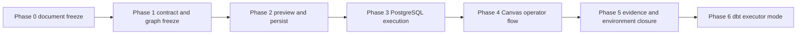
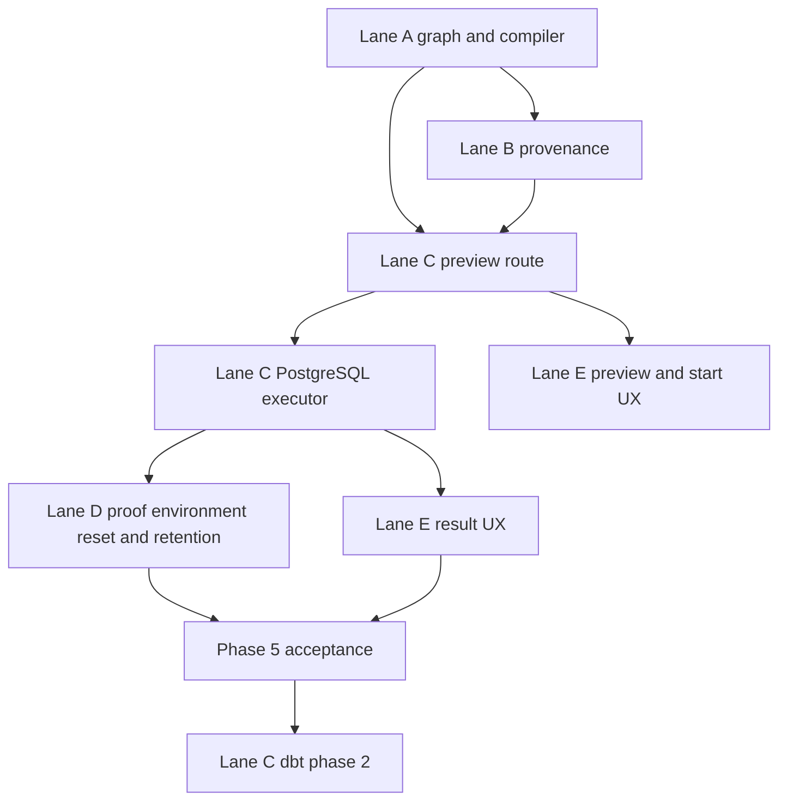

# Transformation Flow Delivery Plan 2026-04-05

## Purpose

This is the executable roadmap for delivering the first transformation vertical.

It is not a product pitch. It is the delivery plan that sequences contracts,
provenance, runtime, environment, and UI work so the first real transformation
can be designed, planned, executed, and inspected.

## Inputs

This delivery plan is governed by:

- [Transformation Flow Proposal Set 2026-04-05](plan-creation-interface-route-proposal-20260405.md)
- [Transformation Flow Product Decisions 2026-04-05](transformation-flow-product-decisions-20260405.md)
- [Transformation Flow Architecture And Contracts 2026-04-05](transformation-flow-architecture-and-contracts-20260405.md)

## Delivery target

The plan is complete when a user can:

1. build a basic `source -> sql_transform -> sink` graph in Canvas
2. click `Plan` and receive a real persisted `PlanRef`
3. click `Start run`
4. execute the persisted plan against PostgreSQL in a repeatable Docker proof environment
5. inspect sink materialization evidence and failure diagnostics

## Phase dependency map



## Lane critical path



## Phase summary

| Phase | Goal                                             | Primary lanes               |
| ----- | ------------------------------------------------ | --------------------------- |
| 0     | freeze decisions and document set                | E plus planning surfaces    |
| 1     | freeze graph, contract, and compiler model       | A and B                     |
| 2     | implement validate-plus-persist preview boundary | C with A and B dependencies |
| 3     | execute persisted plans against PostgreSQL       | C and D                     |
| 4     | close operator flow in Canvas and result views   | E with C dependency         |
| 5     | close evidence, reset, and repeatability         | B, C, D, E                  |
| 6     | add dbt executor mode behind the same contract   | C and E                     |

## Task matrix

| Task id   | Lane | Deliverable                                                  | Depends on           |
| --------- | ---- | ------------------------------------------------------------ | -------------------- |
| `F-22`    | E    | proposal set, document split, planning classification        | `F-07`, `F-21`       |
| `TF-A1`   | A    | graph and compiler umbrella                                  | `F-22`               |
| `TF-A1-A` | A    | `DesignGraphDraft`, node types, invariants, preview contract | `F-22`               |
| `TF-A1-B` | A    | graph-to-step mapping and canonical plan shape               | `TF-A1-A`            |
| `TF-B1`   | B    | provenance and evidence umbrella                             | `TF-A1`              |
| `TF-B1-A` | B    | `GitArtifactRef` and preview-time provenance rules           | `TF-A1-A`            |
| `TF-B1-B` | B    | run evidence linkage back to Git-tracked inputs              | `TF-B1-A`, `TF-C2-A` |
| `TF-C1`   | C    | preview and persist umbrella                                 | `TF-A1`, `TF-B1`     |
| `TF-C1-A` | C    | protected `/plans/preview` route and typed validation errors | `TF-A1-A`, `TF-B1-A` |
| `TF-C1-B` | C    | persisted plan store write and `PlanRef` issuance            | `TF-C1-A`, `TF-A1-B` |
| `TF-C2`   | C    | PostgreSQL execution umbrella                                | `TF-C1`              |
| `TF-C2-A` | C    | PostgreSQL executor and Docker baseline                      | `TF-C1-B`            |
| `TF-C2-B` | C    | run read surfaces with materialization evidence              | `TF-C2-A`, `TF-B1-B` |
| `TF-D1`   | D    | proof-environment reset, cleanup, retention, and runbook     | `TF-C2-A`            |
| `TF-E1`   | E    | Canvas and result umbrella                                   | `TF-A1`, `TF-C1`     |
| `TF-E1-A` | E    | Canvas graph authoring and inline validation                 | `TF-A1-A`            |
| `TF-E1-B` | E    | preview/start UX with real `PlanRef`                         | `TF-C1-B`, `TF-E1-A` |
| `TF-E1-C` | E    | result UX with success and failure evidence                  | `TF-C2-B`, `TF-E1-B` |
| `TF-C3`   | C    | dbt executor phase-2 umbrella                                | `TF-C2`              |
| `TF-C3-A` | C    | dbt executor mode under same preview and run contract        | `TF-C2-B`            |

## Phase 0. Document and decision freeze

### Objective

Remove ambiguity before code slicing starts.

### Required outputs

- proposal set published
- Mermaid diagrams render conservatively
- lane decomposition explicit across A, B, C, D, and E
- roadmap and portfolio surfaces classify the set correctly

### Tasks

- `F-22`
- planning surface updates in roadmap and proposal portfolio docs

### Exit criteria

1. one overview doc links the set
2. decisions, architecture, and delivery docs are split and consistent
3. lanes reference the new task graph

## Phase 1. Contract and graph freeze

### Objective

Freeze the authoring, provenance, and compiler inputs before API and UI work.

### Tasks by lane

- Lane A: `TF-A1`, `TF-A1-A`, `TF-A1-B`
- Lane B: `TF-B1`, `TF-B1-A`

### Required outputs

- `DesignGraphDraft`
- node, edge, and invariant rules
- `GitArtifactRef`
- graph-to-step mapping
- canonical plan shape for persisted SQL-first plans

### Validation expectation

- contract docs updated first
- negative-path test list frozen before implementation

### Exit criteria

1. no implementation still depends on UI-local hidden state
2. the compiler output shape is defined before route work begins
3. provenance requirements are explicit and non-optional

## Phase 2. Preview validates and persists

### Objective

Turn preview into the real immutable plan boundary.

### Tasks by lane

- Lane C: `TF-C1`, `TF-C1-A`, `TF-C1-B`
- Lane A supports final contract interpretation
- Lane B supports provenance capture rules

### Required outputs

- protected `POST /plans/preview`
- typed `400`, `401`, `403`, `422`, and `500` behavior
- persisted immutable plan bytes
- real `PlanRef` issuance

### Validation expectation

- package tests for `apps/api`
- negative-path contract coverage for invalid graph and SQL inputs
- end-to-end proof that `POST /runs/start` can consume the returned `PlanRef`

### Exit criteria

1. preview is no longer ephemeral
2. the runtime start boundary stays `PlanRef`-based
3. the persisted plan captures provenance and canonical identity

## Phase 3. PostgreSQL execution and proof environment

### Objective

Execute the persisted plan in a real database and make that execution repeatable.

### Tasks by lane

- Lane C: `TF-C2`, `TF-C2-A`
- Lane D: `TF-D1`

### Required outputs

- PostgreSQL execution seam for SQL-first plans
- Docker PostgreSQL local proof environment
- seed, reset, and cleanup procedure
- failure semantics for SQL execution errors

### Validation expectation

- Docker-based local acceptance path
- run success path with sink materialization
- run failure path with failed-step diagnostics

### Exit criteria

1. one real transformation runs end to end against PostgreSQL
2. the same local environment can be reset and rerun without manual cleanup
3. SQL errors produce explicit runtime failure state and diagnostics

## Phase 4. Canvas operator flow

### Objective

Make the vertical usable from the UI instead of only from backend surfaces.

### Tasks by lane

- Lane E: `TF-E1`, `TF-E1-A`, `TF-E1-B`

### Required outputs

- operator can place one source, one SQL transform, and one sink
- Canvas blocks invalid graphs inline
- valid preview enables Start run
- Start run navigates to run detail with the real `PlanRef` path already exercised

### Validation expectation

- frontend tests for graph validation and button state
- frontend tests for preview and start transitions

### Exit criteria

1. Canvas is no longer a shell-only surface for this vertical
2. Start run is wired to persisted plans, not mock state
3. invalid graphs fail before execution starts

## Phase 5. Evidence, result UX, and repeatability closure

### Objective

Close the outcome loop so the operator can trust the result and rerun it.

### Tasks by lane

- Lane B: `TF-B1-B`
- Lane C: `TF-C2-B`
- Lane D: `TF-D1`
- Lane E: `TF-E1-C`

### Required outputs

- result surfaces expose executor identity, rows written, and sink table
- run events expose step transitions and failure attribution
- environment reset and cleanup runbook exists
- provenance chain remains visible from result back to Git artifacts

### Validation expectation

- runtime read-surface tests
- frontend result rendering tests
- docs and runbook validation

### Exit criteria

1. the operator can answer what ran, what it wrote, and from which artifacts
2. repeated acceptance runs do not accumulate ambiguous leftover state
3. success and failure outcomes are equally legible

## Phase 6. dbt executor mode

### Objective

Add dbt as a runtime mode without replacing the outer product loop.

### Tasks by lane

- Lane C: `TF-C3`, `TF-C3-A`
- Lane E: extend result UX to show executor identity when needed

### Required outputs

- dbt executor behind the same preview and run boundary
- `executor: dbt` visible in result surfaces
- no second product flow for dbt users

### Validation expectation

- contract compatibility tests
- runtime executor selection tests
- UI executor-label tests

### Exit criteria

1. dbt uses the same `PlanRef` and run identity model
2. the UI loop stays `design -> plan -> run -> result`
3. the product does not fork into two unrelated execution paths

## Test plan by area

### Contract and planner tests

- valid three-node graph
- invalid node count
- invalid edge order
- cycle rejection
- missing SQL artifact provenance
- deterministic graph-to-step mapping

### API and persistence tests

- preview returns persisted `PlanRef`
- preview rejects malformed envelopes
- preview rejects invalid graphs with `422`
- persisted plan contains provenance and canonical hash

### Runtime and executor tests

- `POST /runs/start` accepts valid `PlanRef`
- runtime rejects missing or invalid `PlanRef`
- PostgreSQL execution success produces sink evidence
- PostgreSQL execution failure yields failed state and diagnostics

### Frontend tests

- Canvas can compose the constrained graph
- invalid graph blocks `Plan`
- preview success enables `Start run`
- run detail renders success and failure evidence

### Environment and docs tests

- Docker PostgreSQL proof environment is repeatable
- cleanup path resets sink and proof data
- Mermaid diagrams render
- planning surfaces stay in sync

## Validation baseline

For this planning slice:

```bash
pnpm docs:sync
pnpm docs:workboard:generate
pnpm verify:prepush
```

For implementation slices derived from this roadmap:

```bash
pnpm --filter dvt-api test
pnpm --filter dvt-api typecheck
pnpm --filter apps/web test
pnpm verify:prepush
```

Package-level commands may need refinement as the implementing slices land, but
`pnpm verify:prepush` remains mandatory.

## Not done if

The roadmap must still be treated as incomplete if any of the following remain
true:

1. `PlanRef` is still synthetic or client-local
2. PostgreSQL execution is mocked
3. result surfaces do not expose materialization evidence
4. Docker proof environment is non-repeatable or undocumented
5. dbt integration requires a second outer flow
