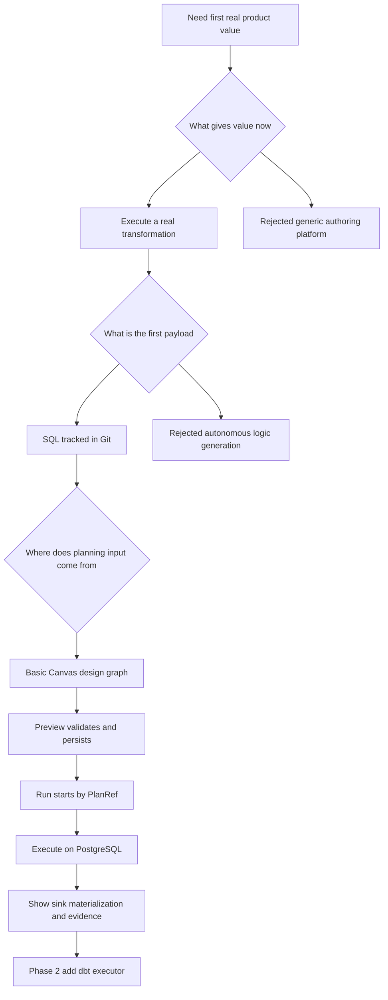

# Transformation Flow Product Decisions 2026-04-05

## Purpose

This document freezes the product and delivery decisions that must be accepted
before implementation starts.

Without these decisions, the project keeps drifting between three different
products:

- SQL and artifact authoring
- dbt model generation
- runtime execution and evidence

V1 does not attempt to close all three. V1 closes execution.

## Decision diagram

## Decision register

| Decision area           | Accepted decision                                               | Rejected now                                   | Why this is the right cut                                                    |
| ----------------------- | --------------------------------------------------------------- | ---------------------------------------------- | ---------------------------------------------------------------------------- |
| Product promise         | first product value is execution of a real transformation       | broad authoring platform                       | execution is the shortest path to demonstrable value                         |
| First payload           | SQL is the first executable artifact                            | model generation as the core value proposition | SQL is inspectable, testable, and executable against PostgreSQL now          |
| Authoring source        | planning input is derived from the design graph                 | hand-built raw plan payloads from the client   | the graph is the user-level intent we can validate and persist               |
| Preview contract        | preview validates and persists immutable plans                  | preview as a transient estimate                | runtime already wants `PlanRef`, so preview must produce it                  |
| Runtime start boundary  | execution starts by `PlanRef`                                   | execution starts by raw client plan bytes      | preserves runtime immutability and provenance                                |
| First executor          | PostgreSQL is the first real execution target                   | multi-target executor matrix in v1             | Postgres is the cheapest truthful environment for proof                      |
| Local proof environment | Docker PostgreSQL is required for acceptance                    | cloud-only or manual env setup                 | the first vertical must be repeatable by developers and CI-like local checks |
| Artifact policy         | authoring artifacts are Git-first                               | UI-only state or runtime-invented SQL          | Git-first gives provenance and repeatability                                 |
| Canvas scope            | basic `source -> sql_transform -> sink` only                    | generic workbench with many node types         | narrow graph is the only realistic way to close the loop now                 |
| Phase 2                 | dbt is added as an executor mode behind the same outer contract | separate dbt product flow                      | preserves the investment in preview, `PlanRef`, and result UX                |

## What the product is and is not

### It is

- a system that takes a basic transformation design
- validates and persists an immutable execution plan
- executes that plan in a real environment
- returns materialization evidence and diagnostics

### It is not

- a natural-language-to-SQL product
- a generic ETL canvas with arbitrary node taxonomy
- a product that promises semantic correctness of user SQL
- a separate dbt authoring workbench in v1

## Realism guardrails

These statements are intentionally hard limits.

### Claims we can make

1. the user can design a small transformation graph
2. the system can validate graph shape and contract invariants
3. the system can persist an immutable plan and issue a real `PlanRef`
4. the runtime can execute the persisted plan against PostgreSQL
5. the user can inspect success, failure, and materialization evidence

### Claims we must not make in v1

1. the system invents business-correct SQL on its own
2. the system writes back governed source artifacts into Git automatically
3. the system is already a full dbt replacement
4. the system is a generic workflow authoring platform
5. the system closes design, execution, and evidence in one magical step

## Product boundary for v1

### Included

- basic Canvas graph with one source, one SQL transform, one sink
- SQL artifact reference in Git
- graph-derived preview request
- preview validates and persists immutable plan
- `PlanRef` returned to the caller
- run started by `PlanRef`
- PostgreSQL execution path
- materialization evidence on read surfaces
- local proof environment based on Docker PostgreSQL

### Excluded

- autonomous SQL generation
- multi-source or multi-sink graphs
- non-PostgreSQL executor targets in phase 1
- graph types beyond `source`, `sql_transform`, and `sink`
- scheduling, SLA, dashboard, or scale work beyond what is needed to prove the vertical

## Success and failure criteria

### Success means all of this is true

1. the graph is valid and reviewable
2. preview returns a real persisted `PlanRef`
3. runtime starts from that persisted `PlanRef`
4. PostgreSQL applies the requested transformation to the sink
5. the user can see what ran, from which Git artifacts, and what happened

### Failure means any of this remains missing

1. preview is still ephemeral
2. runtime still needs client-supplied raw plan bytes
3. PostgreSQL execution is mocked or hidden
4. materialization evidence is unavailable or ambiguous
5. the Canvas can draw shapes but cannot drive a real run

## Phase boundary decisions

### Phase 1

Close the execution-first SQL vertical.

Required outputs:

- graph contract
- Git provenance contract
- preview and persistence contract
- PostgreSQL execution seam
- operator-visible result surface

### Phase 2

Add dbt execution without changing the outer loop.

Required rule:

- dbt is an executor mode behind the same `design -> preview -> PlanRef -> run -> result` contract

## Benchmark posture

This proposal intentionally borrows different qualities from mature systems
instead of trying to clone one whole platform.

| Reference posture  | What to copy                                                | What not to copy in v1                                |
| ------------------ | ----------------------------------------------------------- | ----------------------------------------------------- |
| dbt                | Git-first SQL artifacts and reviewable transformation logic | full dbt project management as the first user surface |
| Prefect and Kestra | persisted execution identity and run-by-reference semantics | broad deployment and scheduling surface area          |
| Dagster            | future direction for explicit asset outcomes and evidence   | asset-platform breadth before first vertical closure  |

## Operational decision consequences

These consequences are accepted as part of the decision set:

1. preview is heavier because it persists
2. the API boundary must carry Git provenance, not just SQL text
3. the runtime must expose executor identity and materialization evidence
4. Canvas scope is intentionally constrained to make the vertical finishable
5. phase 2 dbt work must reuse the same preview and run surfaces rather than creating a fork

## Decision closeout rule

No implementation slice should contradict this document without first updating
this decision register and the linked delivery plan.
