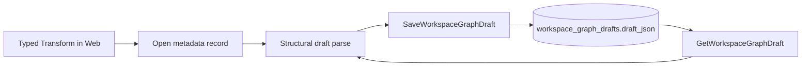
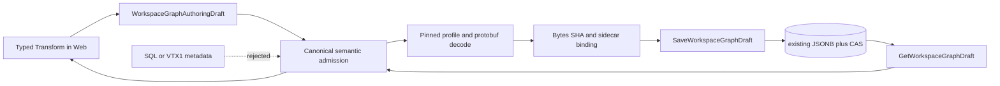

# VTX2 durable semantic document plan

## Governing sources

- `AGENTS.md`
- `docs/architecture/command-query-rail-governance.md`
- `docs/architecture/fowler-opportunity-planning-governance.md`
- `docs/architecture/components/web/graph/canvas-authoring-draft-boundary-component.md`
- `docs/architecture/components/planner/workspace-authoring-draft-aggregate.md`
- `docs/contracts/planner/workspace-graph-draft-persistence-v1.md`
- `docs/adr/ADR-0064-substrait-semantic-reference-and-bounded-logical-profile.md`
- `docs/planning/proposals/mandatory/runtime-and-contracts/vtx2-substrait-semantic-reference-design-20260824.md`
- GitHub issue #2655

## Think-first analysis

### Problem and root cause

`WorkspaceGraphDraftSaveRequest` validates the graph aggregate, but node `metadata`
remains an intentionally open extension record. Consequently a DVT Transform can
carry malformed bytes, a false digest, an unsupported pinned profile or an unbound
sidecar through the otherwise protected JSONB/CAS path. Read validation repeats the
same structural aggregate parse, so malformed semantic truth can survive reload.

The persistence store is not the defect: it already preserves JSONB exactly and owns
scope, idempotency and compare-and-swap. The missing invariant is at the canonical
contract boundary where `dvt:transform` metadata becomes typed semantic authority.

### Constraints and invariants

- ADR-0064 makes typed Substrait plus the DVT identity sidecar the only current
  Transform semantic authority.
- Exact schema/profile/spec coordinates, protobuf bytes, semantic SHA and sidecar SHA
  must validate together.
- Stable `RelationId` and `FieldId` must survive JSONB save/reload unchanged.
- Unsupported or corrupt semantics fail closed; no SQL/VTX1 read, write or migration
  fallback is permitted.
- `SaveWorkspaceGraphDraft` and `GetWorkspaceGraphDraft` remain the only protected
  persistence rails.
- PostgreSQL JSONB/CAS remains the only store. No repository, service, artifact or
  document abstraction is added.
- Transform nodes without an authored semantic document remain valid editable drafts;
  once `transformAuthoring` exists, it must be canonical.

### Options considered

1. Validate only in Web. Rejected because persisted and externally supplied payloads
   would bypass the invariant.
2. Add a second semantic repository/table. Rejected because JSONB/CAS already owns
   durable graph truth and a second store would create split authority.
3. Add API-local request and response validators. Rejected because write/read logic
   would duplicate the same contract rule and non-HTTP consumers could bypass it.
4. Refine the canonical aggregate schema with the pinned Substrait decoder. Selected:
   one contract rule automatically governs HTTP parse, application reload and tests.

No external library is being invented. The already pinned Buf runtime and generated
Substrait package used by Web are reused for exact protobuf decoding.

## Fowler opportunity matrix

| Signal                    | Selected treatment                                              | DDD owner                           | Rail                      | Proof                                              |
| ------------------------- | --------------------------------------------------------------- | ----------------------------------- | ------------------------- | -------------------------------------------------- |
| Primitive obsession       | Replace unverified Transform metadata with typed admission      | Workspace graph authoring aggregate | `SaveWorkspaceGraphDraft` | malformed semantic documents never reach the store |
| Duplicate validation risk | One schema refinement for save and load                         | DVT semantic document contract      | Save/Get rails            | both paths reject through the same parser          |
| Large module              | Split profile coordinates, document envelope and binary decoder | Substrait contract                  | n/a                       | each new module stays below 200 lines              |
| Test-only confidence      | Exercise the real PostgreSQL JSONB/CAS store                    | Workspace draft persistence adapter | Save/Get rails            | exact document and stable IDs survive reload       |
| Hidden authority          | Reject SQL/VTX1 or unsupported semantic metadata                | Workspace authoring aggregate       | Save/Get rails            | no fallback branch exists                          |

## Current state



## Target state



## Pre-implementation brief

- Mode: Full.
- Scope: canonical semantic-document contracts, aggregate admission, focused Web/API
  behavior tests, and real PostgreSQL persistence proof.
- Expected outcome: the exact typed document survives save/reload; corrupt, mismatched
  or unsupported documents reject before becoming current authoring truth.
- Risk: adding the generated protobuf decoder to contracts can enlarge consumers.
  Mitigation: expose it only through the existing bounded `@dvt/contracts/substrait`
  surface and reuse the already pinned versions.
- Out of scope: new semantic capabilities, UI behavior, SQL/dbt import, target
  projection, runtime lowering, publication and legacy migration.
- Validation: contracts/Web/API package tests, typecheck/lint, real PostgreSQL focused
  test, ARC-2, feature mechanization, governance refresh and `pnpm verify:prepush`.
- Test posture: behavior assertions only; remove literal pin assertions that merely
  restate implementation constants.
- Delivery: one documentation commit, then small contract and persistence-proof
  microcommits.

## Governing rails

| Rail                                  | Type    | Owner                               | Existing surface                             | Negative behavior                                                                                     |
| ------------------------------------- | ------- | ----------------------------------- | -------------------------------------------- | ----------------------------------------------------------------------------------------------------- |
| `ApplyWorkspaceGraphAuthoringCommand` | command | Workspace graph authoring aggregate | Canvas application service                   | invalid authored authority cannot enter the aggregate                                                 |
| `SaveWorkspaceGraphDraft`             | command | Workspace graph authoring aggregate | protected PUT plus existing PostgreSQL store | corruption, digest/profile/sidecar mismatch reject without write; stale CAS rejects without overwrite |
| `GetWorkspaceGraphDraft`              | query   | Workspace graph draft read model    | protected GET plus existing PostgreSQL store | corrupt or unsupported stored semantics return format error                                           |

No rail, endpoint, service or persistence owner is added.

## Delivery order

1. Split the multi-reason Substrait contract module and add exact pinned protobuf
   decode validation.
2. Refine DVT Transform metadata admission in the authoring aggregate.
3. Prove request rejection and read-side corrupt-payload behavior.
4. Prove exact JSONB/CAS round-trip with stable relation/field identity.
5. Preserve the existing Web Apply/Cancel/reload semantic behavior proof.

## Feature mechanization

```feature-mechanization
version: 1
featureId: VTX2-DURABLE-SEMANTIC-DOCUMENT-2655
mechanizationStatus: implemented
noHumanDecisionsRemaining: true
implementationPlan: docs/planning/proposals/mandatory/runtime-and-contracts/vtx2-durable-semantic-document-plan-20260903.md
componentGuides: [docs/architecture/components/planner/workspace-authoring-draft-aggregate.md, docs/architecture/components/web/graph/canvas-authoring-draft-boundary-component.md]
userStories: [Authors reload the exact canonical Transform document, Corrupt semantic truth fails closed, Stable relation and field identities survive persistence]
governingSources: [AGENTS.md, docs/architecture/command-query-rail-governance.md, docs/architecture/fowler-opportunity-planning-governance.md, docs/adr/ADR-0064-substrait-semantic-reference-and-bounded-logical-profile.md]
domainObjects: [DVT Substrait semantic document, WorkspaceGraphAuthoringDraft aggregate, Workspace graph draft record]
allowedImplementationSurfaces: [packages/@dvt/contracts/**, apps/api/test/**, apps/web/src/app/views/canvas/**, apps/web/src/app/services/workspace/**, package.json, pnpm-lock.yaml, docs/**]
forbiddenImplementationSurfaces:
  - packages/@dvt/engine/**
  - packages/@dvt/planner/**
  - new persistence tables, repositories, services, formats or legacy fallbacks
commandQueryRails:
  - {name: ApplyWorkspaceGraphAuthoringCommand, type: command, status: implemented, dddOwner: Workspace graph authoring aggregate, applicationPort: Canvas authoring application service, adapterSurface: Existing Canvas command path, authorizationScope: Existing writable Canvas posture, negativeTests: [Invalid semantic authority is rejected]}
  - {name: SaveWorkspaceGraphDraft, type: command, status: implemented, dddOwner: Workspace graph authoring aggregate, applicationPort: SaveWorkspaceGraphDraftUseCase, adapterSurface: PUT /workspace/graph/draft and PostgresWorkspaceGraphDraftStore, authorizationScope: Existing tenant project environment capability, negativeTests: [Corrupt or mismatched semantic document rejects without write, Stale revision does not overwrite]}
  - {name: GetWorkspaceGraphDraft, type: query, status: implemented, dddOwner: WorkspaceGraphDraft read model, applicationPort: GetWorkspaceGraphDraftUseCase, adapterSurface: GET /workspace/graph/draft and PostgresWorkspaceGraphDraftStore, authorizationScope: Existing tenant project environment capability, negativeTests: [Corrupt or unsupported stored semantic document fails closed]}
fowlerSignals: [Primitive obsession, Duplicate validation risk, Large module, Hidden authority, Test-only confidence]
architectureGuards:
  - pnpm docs:feature-mechanization:implementation -- --feature VTX2-DURABLE-SEMANTIC-DOCUMENT-2655
  - GIT_BASE=origin/main GIT_HEAD=HEAD node tools/ci/arc-check.mjs
symbolDefaults: &symbolDefaults {dddOwner: DvtSubstraitSemanticDocument, cqRails: [SaveWorkspaceGraphDraft, GetWorkspaceGraphDraft], fowlerSignals: [Primitive obsession, Duplicate validation risk], architectureGuard: pnpm verify:prepush, cypressCoverage: Existing Canvas Apply and reload flow, unitTests: [pnpm --filter @dvt/contracts test]}
symbols:
  - {<<: *symbolDefaults, name: decodeDvtSubstraitPlanV1, path: packages/@dvt/contracts/src/contracts/planner/DvtSubstraitPlanBinary.v1.ts}
  - {<<: *symbolDefaults, name: DvtSubstraitSemanticDocumentV1Schema, path: packages/@dvt/contracts/src/contracts/planner/DvtSubstraitSemanticDocument.v1.ts}
  - {<<: *symbolDefaults, name: WorkspaceGraphAuthoringNodeSchema, path: packages/@dvt/contracts/src/contracts/planner/WorkspaceGraphAuthoringDraft.v1.ts}
cypressFlows:
  - apps/web/cypress/e2e/canvas/canvas-substrait-column-functions.cy.ts
redGreenCycles:
  - id: reject-invalid-semantic-authority
    redTest: pnpm --filter @dvt/contracts test
    expectedFailure: structurally valid drafts still accept invalid protobuf or mismatched semantic authority
    patchSurfaces: [packages/@dvt/contracts/src/contracts/planner/**, packages/@dvt/contracts/test/**]
    greenTest: pnpm --filter @dvt/contracts test
  - id: persist-exact-semantic-document
    redTest: pnpm --filter dvt-api test -- workspaceGraphDraftSemanticPersistence
    expectedFailure: no real PostgreSQL proof reloads exact bytes and stable DVT identities
    patchSurfaces: [apps/api/test/**]
    greenTest: pnpm --filter dvt-api test -- workspaceGraphDraftSemanticPersistence
completionGate:
  - pnpm --filter @dvt/contracts test
  - pnpm --filter @dvt/contracts typecheck
  - pnpm --filter dvt-web test
  - pnpm --filter dvt-api test
  - pnpm --filter dvt-api typecheck
  - pnpm verify:prepush
```
