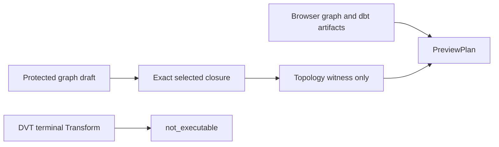

# VTX2 Terminal Transform Preview Workload Projection Plan

## Governing sources

- `docs/planning/status/governance-document-rule-inventory.md`
- Planning DB architecture designs and the existing `PreviewPlan`, `CompilePlan`
  and `StartRun` command rails
- `docs/architecture/command-query-rail-governance.md`
- `docs/architecture/system/subsystems/semantic-transformation/index.md`
- `docs/architecture/components/planner/execution-selection-component.md`
- `docs/architecture/components/planner/executable-subgraph-derivation-component.md`
- `docs/architecture/components/planner/workspace-authoring-draft-aggregate.md`
- `docs/adr/ADR-0064-substrait-semantic-reference-and-bounded-logical-profile.md`
- `docs/adr/ADR-0066-postgresql-stable-table-publication.md`
- GitHub parent #2524 and delivery child #2784

## Problem and root cause

The Canvas persists a PostgreSQL Source connected to a terminal Transform and
the Transform's canonical Substrait revision. Preview still stops in Web because
DVT is registered as `not_executable`. The dbt Preview path builds a
client-authored planner graph; reusing it would give the browser authority over
workload semantics and mislabel DVT as dbt.

The missing behavior is a server-owned lowering boundary. It reads the protected
draft and exact selected closure, resolves the persisted Substrait revision,
projects the admitted `ProjectRel` to PostgreSQL, stores that projection through
the current content-addressed artifact boundary, and submits one generic
ephemeral workload to Planner.

```mermaid
flowchart LR
  Select[Selected terminal Transform] --> Draft[Protected draft reread]
  Draft --> Closure[Exact executable closure]
  Closure --> Semantic[Exact Substrait revision]
  Semantic --> Render[Bounded ProjectRel PostgreSQL projection]
  Render --> CAS[Content-addressed artifact]
  CAS --> Workload[One ephemeral workload]
  Workload --> Preview[PreviewPlan]
  Preview --> Planner[Persisted plan]
```

## Product cut and delivery sequence

The first recovery slice implements one behavior: Preview of a selected terminal
Transform connected to one PostgreSQL Source creates and persists one real plan.
The plan contains one ephemeral output workload. Source cards and Substrait
operators do not become plan steps.

This slice does not execute SQL or return rows; runtime support belongs to #2723.
It does not yet lower sinks, publication fan-out, joins, sets or aggregates.
#2784 remains open until its existing Sink and fan-out acceptance is preserved
through the same rail. Parent #2524 retains broader workload lowering.

## Command and query rails

| Concern                    | Existing rail                   | Use in this slice                           |
| -------------------------- | ------------------------------- | ------------------------------------------- |
| User requests Preview      | `PreviewPlan` command           | Public application entry point              |
| Generic workload admission | `CompilePlan` command           | Existing Planner ingress                    |
| Protected graph read       | existing authorized draft query | Server authority for selection and topology |
| Persisted plan execution   | `StartRun` command              | Future consumer; unchanged                  |

`PreviewExecutionPlan` is retired as a transport by #2762 and the accepted
#2524 topology plan. GitHub #2784 now names `PreviewPlan`; this slice does not
expand the stale duplicate Planning DB rows for the retired name.

## Frozen first-slice descriptor

`DvtOperationalWorkloadV1` contains only:

- authorized tenant, project and environment scope;
- protected draft revision and Canvas ID;
- exact selected Source and Transform IDs plus the single effective edge ID;
- Transform ID, exact semantic plan SHA-256 and bounded profile;
- target profile `dvt.vtx2.postgres.project-rel.v1`, renderer identity and a
  `compiled-sql` `StepArtifactRef`;
- PostgreSQL `ConnectionRef`;
- output `{ kind: 'ephemeral-preview', nodeId }`;
- existing timeout and concurrency policies.

It contains no SQL or Substrait bytes, credentials, implicit Sink, publication,
stable-table intent, schema digest or predecessor admission state. Scope must
match plan ownership; graph IDs are unique; output and semantic Transform IDs
match; semantic and target SHAs match; the Transform is terminal in the selected
closure; and the artifact identity is verified through CAS.

## Invariants

- The browser sends selection and protected-draft authority, never workload,
  semantic, connection or SQL authority.
- If a browser graph is supplied as a topology witness, #2984 validates it before
  server lowering. The one-workload graph is not compared with Canvas cards.
- One protected snapshot supplies draft revision, semantic revision and closure;
  no second read can create a time-of-check/time-of-use gap.
- Only the bounded PostgreSQL `ProjectRel` profile admitted by ADR-0064 is accepted.
- The output is ephemeral and cannot imply materialization or publication.
- Unsupported, missing, stale, mixed-provider or ambiguous bindings fail before
  Planner receives a graph source.
- Planner and Engine remain unaware of Canvas, Substrait and PostgreSQL syntax.
- dbt retains its integration path and authority; making DVT selection-only must
  not make dbt `graphSource` optional.

## Fowler opportunity matrix

| Scenario                         | Opportunity            | Pattern and owner                       | Rail          | Surfaces                       | Test                    | Guard / flow           | Out of scope               |
| -------------------------------- | ---------------------- | --------------------------------------- | ------------- | ------------------------------ | ----------------------- | ---------------------- | -------------------------- |
| Browser supplies DVT steps       | Hidden Authority       | server-owned workload projector / API   | `PreviewPlan` | Preview resolver               | reject client workload  | route policy + Cypress | dbt authority              |
| PostgreSQL lowering lives in Web | Duplicate Semantics    | bounded projection package / adapter    | `CompilePlan` | ProjectRel reader and renderer | SQL projection behavior | dependency guard       | generic renderer framework |
| Raw refs drift independently     | Primitive Obsession    | typed workload value object / contracts | `CompilePlan` | workload schema                | identity mismatch table | contract schema sync   | runtime executor           |
| Resolver rereads mutable draft   | Inappropriate Intimacy | protected snapshot result / API         | `PreviewPlan` | executable-subgraph resolver   | one-read witness        | #2984 topology suite   | draft history store        |

## Exact implementation surfaces

- `packages/@dvt/contracts/src/contracts/planner/DvtOperationalWorkload.v1.ts`
- `packages/@dvt/contracts/src/contracts/planner/TransformationFlowPreview.v1.ts`
- `packages/@dvt/contracts/src/schema-packs/plan-preview-request.ts`
- `packages/@dvt/contracts/src/step-registry/{StepKindRegistry.v1,BuiltInStepTypeEntries}.ts`
- `packages/@dvt/contracts/src/index.ts` and focused contract tests
- `packages/@dvt/postgres-projection/**` limited to ProjectRel
- `apps/api/src/application/services/{resolveAuthorizedExecutableSubgraph,resolveAuthorizedPreviewSelection,PreviewPlanUseCase,dvtOperationalSemanticSet,dvtOperationalWorkloadProjector,dvtPostgresTargetProjectionPublisher}.ts`
- protected-runtime composition and focused API tests
- `apps/web/src/app/plugins/dvt/dvtContributions.ts`
- DVT Preview selection projection, Canvas execution state/action and focused tests
- package manifests, lockfile and governed ARC-2 evidence

Forbidden: Engine, Temporal adapters, runtime worker, dbt artifact semantics,
stable publication and aggregate/join/set lowering.

## Behavior-first validation

1. Protected Source PostgreSQL to terminal Transform with one admitted
   `ProjectRel` publishes one SQL artifact and lowers to one ephemeral workload.
2. DVT Preview without a client `graphSource` persists a one-step plan.
3. A false browser topology witness rejects before lowerer, CAS, Planner and store.
4. Stale semantic SHA, unsupported relation, missing Source binding, mixed
   provider, non-terminal Transform or closed gate rejects before Planner.
5. New kind/config passes canonical compile and admission registration; altered
   kind/config remains invalid.
6. Existing dbt Preview and #2984 exact-topology tests remain green.
7. Visible Cypress proves a persisted plan and its real missing executor
   capability; it does not claim SQL execution or rows.

The feature-mechanization manifest is exported after its symbols and tests exist;
it must not claim `implemented` during the RED phase. Final evidence includes
focused package tests, lint and type checks, ARC-2 evidence and risk, visible
Cypress, `pnpm governance:refresh` and `pnpm verify:prepush` with hooks enabled.
