# VTX2 Terminal Transform Preview Workload Projection Plan

## Governing sources

- `docs/planning/status/governance-document-rule-inventory.md`
- Planning DB architecture designs and the existing `PreviewPlan`, `CompilePlan`
  and `StartRun` command rails
- `docs/architecture/command-query-rail-governance.md`
- `docs/architecture/system/subsystems/semantic-transformation/index.md`
- `docs/architecture/components/planner/execution-selection-component.md`
- `docs/architecture/components/planner/executable-subgraph-derivation-component.md`
- `docs/architecture/components/planner/workspace-authoring-draft-aggregate.md`
- `docs/adr/ADR-0064-substrait-semantic-reference-and-bounded-logical-profile.md`
- `docs/adr/ADR-0066-postgresql-stable-table-publication.md`
- GitHub parent #2524 and delivery child #2784

## Problem and root cause

The Canvas can persist a PostgreSQL Source connected to a terminal Transform,
including the Transform's canonical Substrait revision. Preview still stops in
Web because DVT is registered as `not_executable`. The dbt Preview path builds a
client-authored planner graph; reusing it would give the browser authority over
workload semantics and would mislabel DVT as dbt.

The missing behavior is a server-owned lowering boundary. It must read the
protected draft and exact selected closure, resolve the persisted Substrait
revision, project the admitted `ProjectRel` to PostgreSQL, store that projection
through the current content-addressed artifact boundary, and submit one generic
ephemeral workload to Planner.

```mermaid
flowchart LR
  Select[Selected terminal Transform] --> Draft[Protected draft reread]
  Draft --> Closure[Exact executable closure]
  Closure --> Semantic[Exact Substrait revision]
  Semantic --> Render[Bounded ProjectRel PostgreSQL projection]
  Render --> CAS[Content-addressed artifact]
  CAS --> Workload[One ephemeral workload]
  Workload --> Preview[PreviewPlan]
  Preview --> Planner[Persisted plan]
```

## Product cut

This cut implements one useful behavior: Preview of a selected terminal
Transform connected to one PostgreSQL Source creates and persists one real plan.
The plan contains one ephemeral output workload. Source cards and Substrait
operators do not become plan steps.

The cut does not execute SQL or return rows. Runtime support belongs to #2723.
It does not lower sinks, publish tables, implement fan-out, joins, sets or
aggregates. Those remain in parent #2524. ADR-0066 publication semantics stay
unchanged.

## Command and query rails

| Concern                      | Existing rail                        | Use in this cut                             |
| ---------------------------- | ------------------------------------ | ------------------------------------------- |
| User asks for a Preview plan | `PreviewPlan` command                | Public application entry point              |
| Generic workload is admitted | `CompilePlan` command                | Existing Planner compile boundary           |
| A persisted plan is run      | `StartRun` command                   | Later consumer; unchanged here              |
| Protected draft and closure  | Existing authorized graph query path | Server authority for selection and topology |

`PreviewExecutionPlan` is retired as a transport. This cut does not revive it or
create a parallel rail.

## Invariants

- The API rereads the authorized draft; the browser sends selection intent only.
- The exact selected node and dependency sets remain governed by the #2984
  topology comparator and the shared effective-execution-edge policy.
- The workload binds the exact graph closure, semantic revision, connection,
  renderer and target artifact identities.
- Only the bounded PostgreSQL `ProjectRel` profile admitted by ADR-0064 is accepted.
- The workload output is ephemeral and cannot imply materialization or publication.
- Unsupported, missing, stale, mixed-provider or ambiguous bindings fail before
  Planner receives a graph source.
- Planner and Engine remain unaware of Canvas, Substrait and PostgreSQL syntax.
- dbt retains its integration path and has no authority over DVT semantics.

## Design rationale

The current implementation has **Hidden Authority** because the browser owns the
planner payload, and **Duplicate Semantics** because PostgreSQL projection exists
only in Web. Extracting a bounded pure projector and invoking it behind the
protected API resolver puts each decision with its owner. A generic renderer
framework is rejected because one admitted PostgreSQL `ProjectRel` is the only
behavior required by #2784.

## Allowed implementation surfaces

- `packages/@dvt/contracts/**`
- a bounded PostgreSQL projection package under `packages/@dvt/**`
- `apps/api/src/application/**`, `apps/api/src/modules/**` and focused API tests
- DVT execution contributions and selection-only Preview wiring under
  `apps/web/src/app/**`
- package manifests, lockfile and governed evidence for those changes

The Engine, Temporal adapters, runtime worker, dbt artifact semantics and sink
publication paths are outside this cut.

## Behavior-first validation

1. A protected `Source PostgreSQL -> terminal Transform` with one admitted
   `ProjectRel` lowers to one ephemeral generic workload and one persisted plan.
2. The same request without the browser-authored planner graph succeeds because
   the API owns lowering.
3. Browser-authored DVT graph/workload semantics are rejected.
4. Stale Substrait revision, topology drift, a closed execution gate, an
   unsupported relation, missing Source binding or mixed provider rejects before
   Planner admission.
5. Existing dbt Preview and exact-topology tests remain green.
6. A visible Cypress flow proves the Canvas action produces the persisted plan;
   it does not claim SQL execution or preview rows.

The final evidence must include focused contract, projection, API and Web tests;
package lint and type checks; ARC-2 evidence and risk update; visible Cypress;
`pnpm governance:refresh`; and `pnpm verify:prepush` with hooks enabled.
