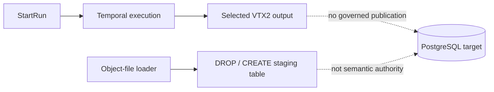
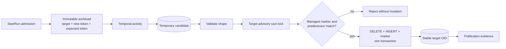

# VTX2 PostgreSQL publication contract study

## Governing sources

- `AGENTS.md`
- `docs/architecture/command-query-rail-governance.md`
- `docs/adr/ADR-0064-substrait-semantic-reference-and-bounded-logical-profile.md`
- `docs/evidence/ED-20260813-pth2-dvt-postgres-connection-authority.md`
- `docs/evidence/ED-20260804-object-file-postgres-runtime.md`
- GitHub issue #2724

Planning DB architecture consultation returned no existing PostgreSQL publication
design. This study creates the missing decision; it does not reconstruct that DB.

## Governing rail

| Rail       | Type    | DDD owner     | Port and adapter                                               | Negative behavior                                                     |
| ---------- | ------- | ------------- | -------------------------------------------------------------- | --------------------------------------------------------------------- |
| `StartRun` | command | Run execution | `IWorkflowEngine.startRun` to Temporal and PostgreSQL activity | Stale, unmanaged or incompatible publication never mutates the target |

Publication is a runtime effect of this command, not another public command or query.

## Current state

There is no admitted predecessor token, managed-target marker, stale-writer fence or
current-output publication evidence. Reusing the staging loader would hide these
missing semantics.

## Options tested

| Option                                                  | Preserves object |      Stale writer fenced | Added lifecycle | Result   |
| ------------------------------------------------------- | ---------------: | -----------------------: | --------------: | -------- |
| Immutable versions plus logical swap                    |     Logical only | Requires extra mechanism |            High | Rejected |
| Stable managed table plus transactional content replace |              Yes |           Yes, token CAS |             Low | Selected |
| Ungoverned table replacement                            |               No |                       No |             Low | Rejected |
| Stable view over versions                               |        View only |             No by itself |          Medium | Rejected |

The selected option is the smallest strategy that meets current integrity needs.

## Real PostgreSQL evidence

The study ran against PostgreSQL 16.12 with disposable schemas and roles. Every
temporary database object was removed afterwards.

Table-swap observations:

- dropping a referenced table failed with `2BP01`;
- rename-based replacement changed OID;
- a dependent view and existing grant remained attached to the old table;
- the replacement inherited no index;
- a concurrent reader could be blocked by the stronger DDL lock.

View-swap observations:

- `CREATE OR REPLACE VIEW` preserved OID and grant;
- a late stale publisher overwrote a newer definition;
- incompatible shape failed with `42P16`;
- a non-owner failed with `42501`.

Stable-table prototype observations:

- readers saw `{id: 1}` during publication and `{id: 2}` after commit;
- OID, dependent-view results, viewer grant, primary key and secondary index survived;
- the fresh token published and the late token returned `STALE_PUBLICATION`;
- final rows and marker belonged to the fresh publication;
- incompatible assignment failed with `42804` and permissions with `42501`;
- an unmarked existing relation was distinguishable as unmanaged.

These are behavioral observations, not a checked-in prototype or fake adapter.

## Target state

## Frozen invariants

- Connection identity comes only from the admitted governed `ConnectionRef`.
- Target identity is exact connection, schema and table; identifiers are quoted.
- Candidate evaluation completes before the target transaction starts.
- One target-scoped transaction lock and predecessor-token comparison fence writers.
- Rows and current token become visible together or not at all.
- Only a marked, owned, schema-compatible DVT target can be replaced.
- The target object survives; no `DROP`, rename swap or `TRUNCATE` is used.
- V1 has no schema migration, version registry, rollback, retention or GC.
- Unexpected managed metadata fails closed; behavior tests do not assert SQL strings.

## Contract propagation

1. #2524 adds target, selected output, schema digest, new token and expected predecessor
   to the immutable workload and admission validation.
2. #2723 implements the PostgreSQL activity, target marker, transaction and evidence,
   then moves ADR-0066 to `Accepted` with real implementation references.
3. #2725 is narrowed from managed physical versions to this stable-table V1 contract;
   unsupported rollback and retention claims are removed.
4. #2523 may add later publication modes only through a new explicit decision.

## Required negative proofs

- two candidates admitted from the same predecessor finish in reverse order;
- target exists without the DVT marker or with the wrong owner/relation kind;
- ordered schema, type, nullability or managed metadata has drifted;
- role lacks create/ownership/publication permissions;
- insert, marker update or commit fails after deletion begins;
- ordinary readers query before, during and after publication;
- grants, declared indexes/constraints and dependent views survive;
- separate targets do not share publication state.

## Delivery boundary

This issue delivers the decision and evidence only. It adds no runtime code, contract
field, migration, compatibility path or second rail. Runtime TDD begins in the owned
implementation issues after this contract is reviewed.
