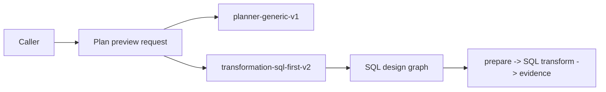
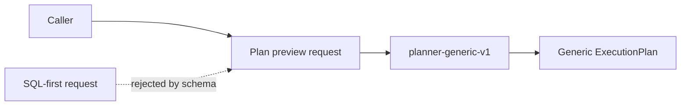

# VTX2 preview contract hard cut plan

## Governing sources

- `AGENTS.md`
- `docs/architecture/command-query-rail-governance.md`
- `docs/guides/ai-work-protocol.md`
- `docs/adr/ADR-0064-substrait-semantic-reference-and-bounded-logical-profile.md`
- `docs/planning/proposals/mandatory/runtime-and-contracts/vtx2-substrait-semantic-reference-design-20260824.md`
- `docs/planning/proposals/mandatory/frontend-and-ux/vtx2-web-sql-first-hardcut-plan-20260903.md`
- GitHub issues #2594 and #2600

## Decision and root cause

The shared preview contract still admits `transformation-sql-first-v2`, its SQL-shaped
design graph, and its three-step compiler source after the DVT plugin stopped selecting
that execution strategy. Keeping those types makes a deleted architecture callable by
other adapters and preserves two meanings for Transform execution.

This slice removes the SQL-first preview profile and compiler/design-graph boundary.
The generic planner preview contract remains. Technical runtime step kinds and handlers
remain temporarily intact for the next #2600 deletion slice; they are not accepted by a
preview profile after this change.

## Command and query rails

- `PreviewExecutionPlan` remains the query rail for the generic persisted preview.
- `CompilePlan` remains the command rail for admitted generic graph sources.
- No replacement preview profile, compiler service, route, alias, or compatibility
  parser is introduced.

## Current state



## Target state



## Invariants

- `planner-generic-v1` request, response, selection rejection, and invalid-plan
  behavior remain unchanged.
- DVT authoring and canonical Substrait persistence remain unchanged.
- DBT generic and project-file preview continue through the generic profile.
- An old SQL-first request fails contract parsing and cannot reach compile/persist.
- SQL-first response payloads do not receive profile-specific validation because the
  profile itself is no longer admitted.
- Runtime handlers are not renamed, wrapped, or replaced in this slice.

## Scope and deletion order

1. Add contract behavior proving the only admitted preview profile is generic and an
   old SQL-first request is rejected.
2. Remove SQL-first preview request/response refinements and exported specialized DTOs.
3. Delete the retired SQL design-graph/compiler/summary contracts and their validation
   exports.
4. Remove the unreachable Web execution-strategy variant and SQL-first preview graph
   assembly consumers.
5. Remove API branching that recognizes the retired design-graph source family.
6. Delete tests and active contract documents whose only purpose was the retired path;
   retain or rewrite tests that protect generic preview behavior.

## Fowler rationale

| Signal                       | Action                          | Owner              | Proof                       |
| ---------------------------- | ------------------------------- | ------------------ | --------------------------- |
| Duplicate semantic authority | Delete obsolete profile         | Preview contract   | schema behavior tests       |
| Dead code                    | Remove unreachable Web assembly | Canvas plan action | focused orchestration tests |
| Parallel parser semantics    | Collapse to generic schema      | Contracts          | API boundary tests          |
| Shotgun surgery              | Keep runtime deletion separate  | Runtime capability | absence inventory           |

## Delivery controls

- Baseline: `main@ee8273a1896a57f76f1db1cc57c64f049dd89b84`.
- Microcommits: plan; red contract behavior; contract hard cut; consumer cleanup;
  evidence and governance.
- ARC-2 applies because `packages/@dvt/contracts/**` changes.
- No file introduced by this slice may exceed 200 lines without a documented single
  reason of change.
- Tests assert parsing and orchestration behavior, not incidental copy or source
  literals, except one architecture absence guard against reintroducing the retired ID.

## Validation

- focused contract validation tests
- focused API preview/compile boundary tests
- focused Web Canvas plan-action tests
- package typecheck, lint, and tests for contracts, API, and Web
- `GIT_BASE=origin/main GIT_HEAD=HEAD node tools/ci/arc-check.mjs`
- `pnpm governance:refresh`
- `pnpm verify:prepush`

## Feature mechanization

```feature-mechanization
version: 1
featureId: VTX2-PREVIEW-CONTRACT-HARDCUT-2600
mechanizationStatus: implemented
noHumanDecisionsRemaining: true
implementationPlan: docs/planning/proposals/mandatory/runtime-and-contracts/vtx2-preview-contract-hardcut-plan-20260903.md
componentGuides:
  - docs/architecture/components/planner/index.md
  - docs/architecture/components/web/runs/frontend-backend-mvp-contract.md
  - docs/architecture/components/web/graph/canvas-authoring-draft-boundary-component.md
userStories:
  - As a DVT author I have one Substrait transformation authority instead of two competing models.
  - As an API caller I receive a typed rejection for retired preview profiles.
  - As a maintainer I can change generic Preview without preserving SQL-first compatibility code.
governingSources:
  - AGENTS.md
  - docs/architecture/command-query-rail-governance.md
  - docs/architecture/fowler-opportunity-planning-governance.md
  - docs/adr/ADR-0064-substrait-semantic-reference-and-bounded-logical-profile.md
domainObjects:
  - Plan preview contract
allowedImplementationSurfaces:
  - packages/@dvt/contracts/**
  - packages/@dvt/adapter-temporal/test/**
  - apps/api/**
  - apps/temporal-worker/test/**
  - apps/web/**
  - scripts/supported-runtime-proof/**
  - docs/**
forbiddenImplementationSurfaces:
  - packages/@dvt/engine/**
  - packages/@dvt/planner/**
  - database migrations
  - new preview routes, commands, queries, planners, stores, or compatibility aliases
commandQueryRails:
  - name: PreviewExecutionPlan
    type: query
    status: implemented
    dddOwner: Canvas / canonical transformation preview
    applicationPort: IPlansPort
    adapterSurface: POST /plans/preview
    authorizationScope: Existing scoped plan preview authorization
    negativeTests:
      - SQL-first preview profile is rejected before compilation or persistence
  - name: CompilePlan
    type: command
    status: implemented
    dddOwner: Plan compile application service
    applicationPort: Existing planner compile boundary
    adapterSurface: API plan compile boundary
    authorizationScope: Existing plan compile scope
    negativeTests:
      - retired transformation design graph is not recognized as an admitted source
fowlerSignals:
  - Duplicate semantic authority
  - Dead code
  - Parallel parser semantics
  - Shotgun surgery
architectureGuards:
  - pnpm docs:feature-mechanization:implementation -- --feature VTX2-PREVIEW-CONTRACT-HARDCUT-2600
  - GIT_BASE=origin/main GIT_HEAD=HEAD node tools/ci/arc-check.mjs
cypressFlows:
  - none: contract hard cut deletes the retired Canvas E2E path; generic Preview remains covered by behavior suites
redGreenCycles:
  - id: reject-retired-preview-profile
    redTest: pnpm --filter @dvt/contracts exec vitest run test/validation.test.ts
    expectedFailure: PreviewProfileSchema still accepts transformation-sql-first-v2.
    patchSurfaces:
      - packages/@dvt/contracts/src/schema-packs/plan-preview-profile.ts
      - packages/@dvt/contracts/src/schema-packs/plan-preview-request.ts
      - packages/@dvt/contracts/src/schema-packs/plan-preview-response.ts
    greenTest: pnpm --filter @dvt/contracts exec vitest run test/validation.test.ts
completionGate:
  - pnpm --filter @dvt/contracts test
  - pnpm --filter dvt-api test:unit
  - pnpm --filter @dvt/web test:changed
  - pnpm verify:prepush
symbols:
  - { name: PreviewProfileSchema, path: packages/@dvt/contracts/src/schema-packs/plan-preview-profile.ts, dddOwner: PlanPreviewContract, cqRails: [PreviewExecutionPlan], fowlerSignals: [Duplicate semantic authority], architectureGuard: pnpm docs:feature-mechanization:implementation, cypressCoverage: none, unitTests: [pnpm --filter @dvt/contracts test] }
  - { name: TRANSFORMATION_STEP_KIND, path: packages/@dvt/contracts/src/index.ts, dddOwner: RuntimeStepRegistry, cqRails: [CompilePlan], fowlerSignals: [Dead code], architectureGuard: pnpm docs:feature-mechanization:implementation, cypressCoverage: none, unitTests: [pnpm --filter @dvt/contracts test] }
  - { name: mapPreviewContractError, path: apps/api/src/entrypoints/http/previewPlanRouteParser.ts, dddOwner: PreviewExecutionPlan, cqRails: [PreviewExecutionPlan], fowlerSignals: [Parallel parser semantics], architectureGuard: pnpm docs:feature-mechanization:implementation, cypressCoverage: none, unitTests: [pnpm --filter dvt-api test:unit] }
  - { name: CanvasPlanActionResult, path: apps/web/src/app/views/canvas/canvasPlanAction.ts, dddOwner: CanvasPlanAction, cqRails: [PreviewExecutionPlan], fowlerSignals: [Duplicate semantic authority], architectureGuard: pnpm docs:feature-mechanization:implementation, cypressCoverage: none, unitTests: [pnpm --filter @dvt/web test:changed] }
  - { name: attachDbtSelectionIntentToOutcome, path: apps/web/src/app/views/canvas/canvasPlanAction.ts, dddOwner: CanvasPlanAction, cqRails: [PreviewExecutionPlan], fowlerSignals: [Extract Function], architectureGuard: pnpm docs:feature-mechanization:implementation, cypressCoverage: none, unitTests: [pnpm --filter @dvt/web test:changed] }
  - { name: GENERIC_GRAPH_SOURCE, path: apps/web/src/app/services/plans/plansService.test.support.ts, dddOwner: PlansAdapterBehaviorProof, cqRails: [PreviewExecutionPlan], fowlerSignals: [Extract Class], architectureGuard: pnpm docs:feature-mechanization:implementation, cypressCoverage: none, unitTests: [pnpm --filter @dvt/web test:changed] }
  - { name: buildPlan, path: apps/web/src/app/services/plans/plansService.test.support.ts, dddOwner: PlansAdapterBehaviorProof, cqRails: [PreviewExecutionPlan], fowlerSignals: [Extract Function], architectureGuard: pnpm docs:feature-mechanization:implementation, cypressCoverage: none, unitTests: [pnpm --filter @dvt/web test:changed] }
  - { name: buildValidPlanRef, path: apps/web/src/app/services/plans/plansService.test.support.ts, dddOwner: PlansAdapterBehaviorProof, cqRails: [PreviewExecutionPlan], fowlerSignals: [Extract Function], architectureGuard: pnpm docs:feature-mechanization:implementation, cypressCoverage: none, unitTests: [pnpm --filter @dvt/web test:changed] }
  - { name: buildPreviewPayload, path: apps/web/src/app/services/plans/plansService.test.support.ts, dddOwner: PlansAdapterBehaviorProof, cqRails: [PreviewExecutionPlan], fowlerSignals: [Extract Function], architectureGuard: pnpm docs:feature-mechanization:implementation, cypressCoverage: none, unitTests: [pnpm --filter @dvt/web test:changed] }
  - { name: buildApiClientStub, path: apps/web/src/app/services/plans/plansService.test.support.ts, dddOwner: PlansAdapterBehaviorProof, cqRails: [PreviewExecutionPlan], fowlerSignals: [Extract Function], architectureGuard: pnpm docs:feature-mechanization:implementation, cypressCoverage: none, unitTests: [pnpm --filter @dvt/web test:changed] }
  - { name: buildPreviewInput, path: apps/web/src/app/services/plans/plansService.test.support.ts, dddOwner: PlansAdapterBehaviorProof, cqRails: [PreviewExecutionPlan], fowlerSignals: [Extract Function], architectureGuard: pnpm docs:feature-mechanization:implementation, cypressCoverage: none, unitTests: [pnpm --filter @dvt/web test:changed] }
  - { name: previewAccepted, path: apps/web/src/app/services/plans/plansService.test.support.ts, dddOwner: PlansAdapterBehaviorProof, cqRails: [PreviewExecutionPlan], fowlerSignals: [Extract Function], architectureGuard: pnpm docs:feature-mechanization:implementation, cypressCoverage: none, unitTests: [pnpm --filter @dvt/web test:changed] }
  - { name: createPlanRejectedApiError, path: apps/web/src/app/services/plans/plansService.test.support.ts, dddOwner: PlansAdapterBehaviorProof, cqRails: [PreviewExecutionPlan], fowlerSignals: [Extract Function], architectureGuard: pnpm docs:feature-mechanization:implementation, cypressCoverage: none, unitTests: [pnpm --filter @dvt/web test:changed] }
  - { name: createWorkspaceFilesQueryMock, path: apps/web/src/app/views/canvas/useCanvasExecutionActions.test.support.tsx, dddOwner: CanvasExecutionBehaviorProof, cqRails: [PreviewExecutionPlan], fowlerSignals: [Extract Function], architectureGuard: pnpm docs:feature-mechanization:implementation, cypressCoverage: none, unitTests: [pnpm --filter @dvt/web test:changed] }
```
