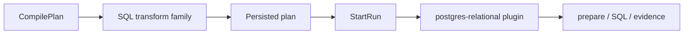
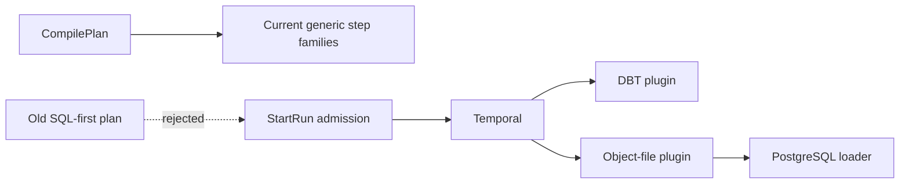

# VTX2 legacy runtime step hard cut plan

## Governing sources

- `AGENTS.md`
- `docs/architecture/command-query-rail-governance.md`
- `docs/guides/ai-work-protocol.md`
- `docs/adr/ADR-0064-substrait-semantic-reference-and-bounded-logical-profile.md`
- `docs/planning/proposals/mandatory/runtime-and-contracts/vtx2-substrait-semantic-reference-design-20260824.md`
- `docs/planning/proposals/mandatory/runtime-and-contracts/vtx2-preview-contract-hardcut-plan-20260903.md`
- GitHub issue #2600

## Decision and root cause

The preview hard cut made the SQL-first compiler unreachable, but its three technical
step kinds remain canonical and executable, so persisted plans still describe it.

This slice deletes all three kinds from producers, registries, admission, runtime and
proofs without aliasing old plans. Object-file-to-PostgreSQL remains supported.

## Governing rails

| Rail                              | Type    | DDD owner                        | Port / adapter surface                    | Negative behavior                           |
| --------------------------------- | ------- | -------------------------------- | ----------------------------------------- | ------------------------------------------- |
| `CompilePlan`                     | command | Plan compile application service | API planner compile boundary              | Deleted family and kinds cannot compile     |
| `PlanAdmissionCompatibilityQuery` | query   | Execution plan admission matrix  | Contracts validation and engine admission | Old PlanRefs fail closed before dispatch    |
| `StartRun`                        | command | Run command application service  | Engine/Temporal dispatch                  | No legacy PostgreSQL activity is registered |
| `PreviewRunMaterializationRows`   | query   | Legacy run sample read model     | `GET /runs/:runId/materialization-rows`   | Route retires with its only target resolver |

No new command, query, profile, compatibility parser, or runtime plugin is introduced.

## Current state



## Target state



## Invariants

- Unknown step kinds remain rejected by the canonical contract registry.
- Existing DBT, HTTP JSON, object-file and Spark compile behavior is unchanged.
- Object-file ingestion keeps its PostgreSQL loader and bounded plugin ID.
- PostgreSQL plan-connection context is not retained after its only step consumers are
  deleted.
- Tests protect contract rejection and surviving runtime composition behavior; they do
  not assert source text or preserve obsolete fixtures.

## Green deletion order

1. Remove the API SQL-transform producer family and rewrite fixtures around surviving
   behavior.
2. Remove the PostgreSQL legacy activity capability and Temporal plugin composition,
   replacing only the surviving object-file loader ownership.
3. Remove admission context binding for the deleted plugin.
4. Remove the three contract kinds, schemas, exports, and registry entries.
5. Delete obsolete tests and runtime proofs; update current architecture and prove
   repository-wide absence from active source.

## Delivery controls

- Baseline: `main@b2b27a6b4629adb08f2d4974e6b73edaf03e449b`.
- Each concern lands as a microcommit with focused behavior validation.
- ARC-2 applies to contracts and adapter changes.
- New or replacement source files stay below 200 lines and own one reason to change.
- No legacy alias, bridge entry, feature flag, fallback, stub, or TODO is allowed.

## Validation

- focused API, contract, adapter and Temporal behavior tests
- package tests, lint and typecheck for every affected workspace
- `GIT_BASE=origin/main GIT_HEAD=HEAD node tools/ci/arc-check.mjs`
- `pnpm governance:refresh`
- `pnpm verify:prepush`

## Feature mechanization

```feature-mechanization
version: 1
featureId: VTX2-RUNTIME-STEP-HARDCUT-2600
mechanizationStatus: planned
noHumanDecisionsRemaining: true
implementationPlan: docs/planning/proposals/mandatory/runtime-and-contracts/vtx2-runtime-step-hardcut-plan-20260903.md
componentGuides:
  - docs/architecture/diagrams/engine-internal-components.md
  - docs/architecture/components/engine/contracts/plan-admission-matrix.md
userStories:
  - As an operator I cannot execute a persisted plan from the deleted SQL-first architecture.
  - As a maintainer I have no PostgreSQL runtime plugin whose only purpose is obsolete transform steps.
  - As an object-file user I retain the current PostgreSQL loading behavior.
governingSources:
  - AGENTS.md
  - docs/architecture/command-query-rail-governance.md
  - docs/adr/ADR-0064-substrait-semantic-reference-and-bounded-logical-profile.md
domainObjects:
  - ExecutionPlan step-kind registry
  - Plan compile catalog
  - Temporal step-activity registry
allowedImplementationSurfaces:
  - packages/@dvt/contracts/**
  - packages/@dvt/adapter-postgres/**
  - packages/@dvt/adapter-temporal/**
  - apps/api/**
  - apps/temporal-worker/**
  - packages/@dvt/engine/test/**
  - scripts/**, package.json, and CI declarations governing runtime proofs
  - docs/**
forbiddenImplementationSurfaces:
  - packages/@dvt/planner/**
  - new compatibility contracts, runtime plugins, or fallback handlers
commandQueryRails:
  - name: CompilePlan
    type: command
    status: implemented
    dddOwner: Plan compile application service
    applicationPort: Existing planner compile boundary
    adapterSurface: API plan compile boundary
    authorizationScope: Existing plan compile scope
    negativeTests:
      - deleted SQL-transform family and step kinds are rejected
  - name: PlanAdmissionCompatibilityQuery
    type: query
    status: implemented
    dddOwner: Execution plan admission matrix
    applicationPort: Canonical contracts validation
    adapterSurface: Engine start-run admission
    authorizationScope: Existing scoped run authorization
    negativeTests:
      - old PlanRefs with deleted kinds do not reach Temporal dispatch
  - name: StartRun
    type: command
    status: implemented
    dddOwner: Run command application service
    applicationPort: Existing engine start-run boundary
    adapterSurface: Temporal worker plugin registry
    authorizationScope: Existing scoped start-run authorization
    negativeTests:
      - no activity is registered for a deleted PostgreSQL transform kind
  - name: PreviewRunMaterializationRows
    type: query
    status: retired
    dddOwner: Legacy run materialization sample read model
    applicationPort: Deleted with its only SQL-first target resolver
    adapterSurface: GET /runs/:runId/materialization-rows
    authorizationScope: Route is no longer registered
    negativeTests:
      - retired route is absent from the protected runtime registry
fowlerSignals:
  - Dead code
  - Duplicate runtime authority
  - Large Class
architectureGuards:
  - pnpm docs:feature-mechanization:implementation -- --feature VTX2-RUNTIME-STEP-HARDCUT-2600
  - GIT_BASE=origin/main GIT_HEAD=HEAD node tools/ci/arc-check.mjs
cypressFlows:
  - none: backend contract and runtime hard cut
redGreenCycles:
  - id: reject-deleted-runtime-kinds
    redTest: pnpm --filter @dvt/contracts test
    expectedFailure: canonical registry still accepts the deleted kinds
    patchSurfaces:
      - packages/@dvt/contracts/src/contracts/planner/StepKindRegistry.v1.ts
      - packages/@dvt/contracts/src/step-registry/BuiltInStepTypeEntries.ts
    greenTest: pnpm --filter @dvt/contracts test
  - id: preserve-object-file-runtime
    redTest: pnpm --filter @dvt/adapter-postgres test
    expectedFailure: object-file loading still depends on the legacy relational execution capability
    patchSurfaces:
      - packages/@dvt/adapter-postgres/src/**
      - apps/temporal-worker/src/runtime/**
    greenTest: pnpm --filter @dvt/adapter-postgres test
completionGate:
  - pnpm --filter @dvt/contracts test
  - pnpm --filter dvt-api test:unit
  - pnpm --filter @dvt/adapter-postgres test
  - pnpm --filter @dvt/temporal-worker test
  - pnpm verify:prepush
```
