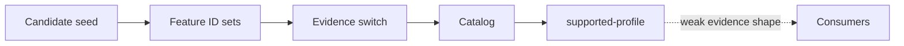
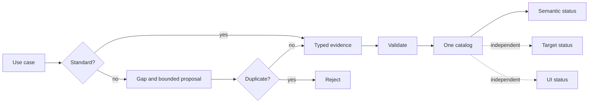

# VTX2 standard-first capability admission plan

## Decision

Capability admission is typed validation over the one existing
`DvtSubstraitCapabilityCatalogV1`, not another registry or operator hierarchy. Standard
admission requires use-case, exact identity, canonical fixture, positive/negative,
stable-identity, target, and UI evidence. Provider acceptance remains a separate claim.
A DVT extension fails closed on a reviewed standard match and otherwise requires core
and extension searches, upstream gap, bounded version, fail-closed proof, target posture,
and convergence evidence.

## Governing sources

`AGENTS.md`; ADR-0064; command/query-rail and Fowler governance; the semantic
transformation and Canvas command catalogs; semantic-reference and union-all evidence;
and issues `#2639`, `#2640`, `#2641`, `#2771`. Planning DB returned no design specific
to `#2641`; creation intent resolved to existing `ConfigureCanvasDvtNode`. No rail,
endpoint, persistence owner, or import is added.

## Product boundary

Mechanize admission, migrate ID-set promotion to typed evidence, prove one current
capability and rejection paths, separate semantic/target/UI posture, and split modules
below 200 lines. Structured fields, version changes, new execution/UI capability,
registries, persistence, routes, and legacy fallbacks remain out of scope.

## Current state



One large module owns seven concerns; bare references cannot distinguish semantic,
provider, and visual conformance.

## Target state



## Fowler opportunity matrix

| Signal                   | Current cost                                                  | Treatment                                                                       | Behaviour proof                                                |
| ------------------------ | ------------------------------------------------------------- | ------------------------------------------------------------------------------- | -------------------------------------------------------------- |
| Large module             | Seven reasons change in 606 lines                             | Separate schema, candidates, admission evidence, product needs, and composition | every production module remains below 200 lines                |
| Primitive obsession      | Bare issue-reference arrays promote capabilities              | Typed admission evidence and postures                                           | incomplete evidence rejects                                    |
| Switch statements        | Feature ID sets and ordered `if` chain own promotion          | Admission records resolve by canonical entry ID                                 | catalog promotion is order independent                         |
| Duplicated observed data | UI/provider availability can be inferred from semantic status | Explicit independent postures                                                   | admission does not imply exposure or execution                 |
| Speculative generality   | A new extension registry could mirror Substrait               | Validate bounded proposals without storing another registry                     | standard duplicate proposal rejects                            |
| Test code                | Literal counts and version strings restate implementation     | Behaviour-focused contract tests                                                | canonicalization, admission and rejection paths prove outcomes |

## Contract invariants

Supported entries require complete typed evidence; candidates cannot carry it. Identity,
fixture, positive/negative validation, stable IDs, target and UI postures are explicit.
Provider acceptance requires native evidence. DVT proposals require searches and a gap;
reviewed standard matches reject. Serialization stays deterministic.

## Existing rail

`ConfigureCanvasDvtNode` remains the Canvas aggregate command; unsupported semantics
reject before mutation. Admission is pure validation of the existing read model.

## Delivery and red/green order

Red/green admission and duplicate guards; split catalog ownership; remove literal tests;
then ARC-2 evidence, governance refresh, and pre-push.

## Feature mechanization

```feature-mechanization
version: 1
featureId: VTX2-STANDARD-FIRST-CAPABILITY-ADMISSION-2641
mechanizationStatus: implemented
noHumanDecisionsRemaining: true
implementationPlan: docs/planning/proposals/mandatory/runtime-and-contracts/vtx2-standard-first-capability-admission-plan-20260903.md
componentGuides: [docs/architecture/system/subsystems/semantic-transformation/index.md, docs/architecture/components/web/graph/canvas-workbench-command-query-catalog.md]
userStories: [Admit a standard capability with complete conformance evidence, Reject a private duplicate semantic, Keep provider and visual support independent]
governingSources: [AGENTS.md, docs/adr/ADR-0064-substrait-semantic-reference-and-bounded-logical-profile.md, docs/architecture/command-query-rail-governance.md, docs/architecture/fowler-opportunity-planning-governance.md]
domainObjects: [DvtSubstraitCapabilityCatalogV1 read model, Standard capability admission, Bounded DVT extension proposal]
allowedImplementationSurfaces: [packages/@dvt/contracts/**, docs/**]
forbiddenImplementationSurfaces:
  - apps/**
  - packages/@dvt/engine/**
  - packages/@dvt/planner/**
  - new registries, persistence, services, routes, provider claims, UI exposure or legacy fallbacks
commandQueryRails:
  - {name: ConfigureCanvasDvtNode, type: command, status: implemented, dddOwner: Canvas DVT node aggregate, applicationPort: Canvas authoring application service, adapterSurface: Existing Canvas command path, authorizationScope: Existing writable Canvas posture, negativeTests: [Unsupported or unadmitted semantics reject before mutation]}
fowlerSignals: [Large module, Primitive obsession, Switch statements, Duplicated observed data, Speculative generality, Test code]
architectureGuards:
  - pnpm docs:feature-mechanization:implementation -- --feature VTX2-STANDARD-FIRST-CAPABILITY-ADMISSION-2641
  - GIT_BASE=origin/main GIT_HEAD=HEAD node tools/ci/arc-check.mjs
symbolDefaults: &symbolDefaults {dddOwner: DvtSubstraitCapabilityCatalogV1 read model, cqRails: [ConfigureCanvasDvtNode], fowlerSignals: [Primitive obsession], architectureGuard: pnpm verify:prepush, cypressCoverage: apps/web/cypress/e2e/canvas/canvas-substrait-column-functions.cy.ts, unitTests: [pnpm --filter @dvt/contracts test]}
symbols: [
  {<<: *symbolDefaults, name: NonBlankStringSchema, path: packages/@dvt/contracts/src/contracts/planner/DvtSubstraitCapabilityAdmission.v1.ts}, {<<: *symbolDefaults, name: EvidenceRefsSchema, path: packages/@dvt/contracts/src/contracts/planner/DvtSubstraitCapabilityAdmission.v1.ts},
  {<<: *symbolDefaults, name: DvtSubstraitTargetConformanceV1Schema, path: packages/@dvt/contracts/src/contracts/planner/DvtSubstraitCapabilityAdmission.v1.ts}, {<<: *symbolDefaults, name: DvtSubstraitVisualExposureV1Schema, path: packages/@dvt/contracts/src/contracts/planner/DvtSubstraitCapabilityAdmission.v1.ts},
  {<<: *symbolDefaults, name: DvtSubstraitStableIdentityPostureV1Schema, path: packages/@dvt/contracts/src/contracts/planner/DvtSubstraitCapabilityAdmission.v1.ts}, {<<: *symbolDefaults, name: DvtSubstraitStandardAdmissionEvidenceV1Schema, path: packages/@dvt/contracts/src/contracts/planner/DvtSubstraitCapabilityAdmission.v1.ts},
  {<<: *symbolDefaults, name: DvtSubstraitExtensionProposalV1Schema, path: packages/@dvt/contracts/src/contracts/planner/DvtSubstraitCapabilityAdmission.v1.ts}, {<<: *symbolDefaults, name: DvtSubstraitStandardAdmissionEvidenceV1, path: packages/@dvt/contracts/src/contracts/planner/DvtSubstraitCapabilityAdmission.v1.ts},
  {<<: *symbolDefaults, name: DvtSubstraitExtensionProposalV1, path: packages/@dvt/contracts/src/contracts/planner/DvtSubstraitCapabilityAdmission.v1.ts}, {<<: *symbolDefaults, name: assertDvtSubstraitExtensionProposalV1, path: packages/@dvt/contracts/src/contracts/planner/DvtSubstraitCapabilityAdmission.v1.ts},
  {<<: *symbolDefaults, name: DVT_SUBSTRAIT_CAPABILITY_CATALOG_V1, path: packages/@dvt/contracts/src/contracts/planner/DvtSubstraitCapabilityCatalog.v1.ts}, {<<: *symbolDefaults, name: NonBlankStringSchema, path: packages/@dvt/contracts/src/contracts/planner/DvtSubstraitCapabilityCatalogSchema.v1.ts},
  {<<: *symbolDefaults, name: EvidenceRefsSchema, path: packages/@dvt/contracts/src/contracts/planner/DvtSubstraitCapabilityCatalogSchema.v1.ts}, {<<: *symbolDefaults, name: compareStrings, path: packages/@dvt/contracts/src/contracts/planner/DvtSubstraitCapabilityCatalogSchema.v1.ts},
  {<<: *symbolDefaults, name: DVT_SUBSTRAIT_CAPABILITY_CATALOG_SCHEMA_VERSION, path: packages/@dvt/contracts/src/contracts/planner/DvtSubstraitCapabilityCatalogSchema.v1.ts}, {<<: *symbolDefaults, name: DvtSubstraitStandardCapabilityV1Schema, path: packages/@dvt/contracts/src/contracts/planner/DvtSubstraitCapabilityCatalogSchema.v1.ts},
  {<<: *symbolDefaults, name: DvtSubstraitProductNeedCapabilityV1Schema, path: packages/@dvt/contracts/src/contracts/planner/DvtSubstraitCapabilityCatalogSchema.v1.ts}, {<<: *symbolDefaults, name: DvtSubstraitCapabilityEntryV1Schema, path: packages/@dvt/contracts/src/contracts/planner/DvtSubstraitCapabilityCatalogSchema.v1.ts},
  {<<: *symbolDefaults, name: DvtSubstraitCapabilityCatalogV1Schema, path: packages/@dvt/contracts/src/contracts/planner/DvtSubstraitCapabilityCatalogSchema.v1.ts}, {<<: *symbolDefaults, name: DvtSubstraitStandardCapabilityV1, path: packages/@dvt/contracts/src/contracts/planner/DvtSubstraitCapabilityCatalogSchema.v1.ts},
  {<<: *symbolDefaults, name: DvtSubstraitProductNeedCapabilityV1, path: packages/@dvt/contracts/src/contracts/planner/DvtSubstraitCapabilityCatalogSchema.v1.ts}, {<<: *symbolDefaults, name: DvtSubstraitCapabilityCatalogV1, path: packages/@dvt/contracts/src/contracts/planner/DvtSubstraitCapabilityCatalogSchema.v1.ts},
  {<<: *symbolDefaults, name: canonicalAdmission, path: packages/@dvt/contracts/src/contracts/planner/DvtSubstraitCapabilityCatalogSchema.v1.ts}, {<<: *symbolDefaults, name: canonicalizeDvtSubstraitCapabilityCatalogV1, path: packages/@dvt/contracts/src/contracts/planner/DvtSubstraitCapabilityCatalogSchema.v1.ts},
  {<<: *symbolDefaults, name: serializeDvtSubstraitCapabilityCatalogV1, path: packages/@dvt/contracts/src/contracts/planner/DvtSubstraitCapabilityCatalogSchema.v1.ts}, {<<: *symbolDefaults, name: NonBlankStringSchema, path: packages/@dvt/contracts/src/contracts/planner/DvtSubstraitCapabilityIdentity.v1.ts},
  {<<: *symbolDefaults, name: OfficialExtensionUrnSchema, path: packages/@dvt/contracts/src/contracts/planner/DvtSubstraitCapabilityIdentity.v1.ts}, {<<: *symbolDefaults, name: DVT_SUBSTRAIT_CAPABILITY_CATEGORY, path: packages/@dvt/contracts/src/contracts/planner/DvtSubstraitCapabilityIdentity.v1.ts},
  {<<: *symbolDefaults, name: DVT_SUBSTRAIT_STANDARD_PROFILE_STATUS, path: packages/@dvt/contracts/src/contracts/planner/DvtSubstraitCapabilityIdentity.v1.ts}, {<<: *symbolDefaults, name: DVT_SUBSTRAIT_PRODUCT_NEED_STATUS, path: packages/@dvt/contracts/src/contracts/planner/DvtSubstraitCapabilityIdentity.v1.ts},
  {<<: *symbolDefaults, name: DvtSubstraitCapabilityCategorySchema, path: packages/@dvt/contracts/src/contracts/planner/DvtSubstraitCapabilityIdentity.v1.ts}, {<<: *symbolDefaults, name: DvtSubstraitStandardProfileStatusSchema, path: packages/@dvt/contracts/src/contracts/planner/DvtSubstraitCapabilityIdentity.v1.ts},
  {<<: *symbolDefaults, name: DvtSubstraitProductNeedStatusSchema, path: packages/@dvt/contracts/src/contracts/planner/DvtSubstraitCapabilityIdentity.v1.ts}, {<<: *symbolDefaults, name: DvtSubstraitCoreSemanticIdentityV1Schema, path: packages/@dvt/contracts/src/contracts/planner/DvtSubstraitCapabilityIdentity.v1.ts},
  {<<: *symbolDefaults, name: DvtSubstraitSimpleExtensionSemanticIdentityV1Schema, path: packages/@dvt/contracts/src/contracts/planner/DvtSubstraitCapabilityIdentity.v1.ts}, {<<: *symbolDefaults, name: DvtSubstraitStandardSemanticIdentityV1Schema, path: packages/@dvt/contracts/src/contracts/planner/DvtSubstraitCapabilityIdentity.v1.ts},
  {<<: *symbolDefaults, name: DvtSubstraitCapabilityCategory, path: packages/@dvt/contracts/src/contracts/planner/DvtSubstraitCapabilityIdentity.v1.ts}, {<<: *symbolDefaults, name: DvtSubstraitStandardSemanticIdentityV1, path: packages/@dvt/contracts/src/contracts/planner/DvtSubstraitCapabilityIdentity.v1.ts},
  {<<: *symbolDefaults, name: encodeCapabilitySegments, path: packages/@dvt/contracts/src/contracts/planner/DvtSubstraitCapabilityIdentity.v1.ts}, {<<: *symbolDefaults, name: buildDvtSubstraitStandardCapabilityId, path: packages/@dvt/contracts/src/contracts/planner/DvtSubstraitCapabilityIdentity.v1.ts},
  {<<: *symbolDefaults, name: buildDvtSubstraitProductNeedCapabilityId, path: packages/@dvt/contracts/src/contracts/planner/DvtSubstraitCapabilityIdentity.v1.ts}, {<<: *symbolDefaults, name: STUDY, path: packages/@dvt/contracts/src/contracts/planner/DvtSubstraitProductNeeds.v1.ts},
  {<<: *symbolDefaults, name: productNeed, path: packages/@dvt/contracts/src/contracts/planner/DvtSubstraitProductNeeds.v1.ts}, {<<: *symbolDefaults, name: DVT_SUBSTRAIT_PRODUCT_NEEDS_V1, path: packages/@dvt/contracts/src/contracts/planner/DvtSubstraitProductNeeds.v1.ts},
  {<<: *symbolDefaults, name: STUDY, path: packages/@dvt/contracts/src/contracts/planner/DvtSubstraitStandardCandidates.v1.ts}, {<<: *symbolDefaults, name: ALGEBRA, path: packages/@dvt/contracts/src/contracts/planner/DvtSubstraitStandardCandidates.v1.ts},
  {<<: *symbolDefaults, name: TYPES, path: packages/@dvt/contracts/src/contracts/planner/DvtSubstraitStandardCandidates.v1.ts}, {<<: *symbolDefaults, name: extensionEvidence, path: packages/@dvt/contracts/src/contracts/planner/DvtSubstraitStandardCandidates.v1.ts},
  {<<: *symbolDefaults, name: coreCandidate, path: packages/@dvt/contracts/src/contracts/planner/DvtSubstraitStandardCandidates.v1.ts}, {<<: *symbolDefaults, name: extensionCandidate, path: packages/@dvt/contracts/src/contracts/planner/DvtSubstraitStandardCandidates.v1.ts},
  {<<: *symbolDefaults, name: CORE_RELATIONS, path: packages/@dvt/contracts/src/contracts/planner/DvtSubstraitStandardCandidates.v1.ts}, {<<: *symbolDefaults, name: EXPRESSION_SELECTORS, path: packages/@dvt/contracts/src/contracts/planner/DvtSubstraitStandardCandidates.v1.ts},
  {<<: *symbolDefaults, name: CORE_TYPES, path: packages/@dvt/contracts/src/contracts/planner/DvtSubstraitStandardCandidates.v1.ts}, {<<: *symbolDefaults, name: DVT_SUBSTRAIT_STANDARD_CANDIDATES_V1, path: packages/@dvt/contracts/src/contracts/planner/DvtSubstraitStandardCandidates.v1.ts},
  {<<: *symbolDefaults, name: standardId, path: packages/@dvt/contracts/src/contracts/planner/DvtSubstraitSupportedCapabilities.v1.ts}, {<<: *symbolDefaults, name: functionId, path: packages/@dvt/contracts/src/contracts/planner/DvtSubstraitSupportedCapabilities.v1.ts},
  {<<: *symbolDefaults, name: SupportedCapabilityGroup, path: packages/@dvt/contracts/src/contracts/planner/DvtSubstraitSupportedCapabilities.v1.ts}, {<<: *symbolDefaults, name: LOWER_ID, path: packages/@dvt/contracts/src/contracts/planner/DvtSubstraitSupportedCapabilities.v1.ts},
  {<<: *symbolDefaults, name: SUPPORTED_CAPABILITY_GROUPS, path: packages/@dvt/contracts/src/contracts/planner/DvtSubstraitSupportedCapabilities.v1.ts}, {<<: *symbolDefaults, name: admissionFor, path: packages/@dvt/contracts/src/contracts/planner/DvtSubstraitSupportedCapabilities.v1.ts},
  {<<: *symbolDefaults, name: admitDvtSubstraitStandardCandidatesV1, path: packages/@dvt/contracts/src/contracts/planner/DvtSubstraitSupportedCapabilities.v1.ts}
]
cypressFlows: [apps/web/cypress/e2e/canvas/canvas-substrait-column-functions.cy.ts]
redGreenCycles:
  - id: standard-admission-contract
    redTest: pnpm --filter @dvt/contracts test -- dvt-substrait-capability-admission
    expectedFailure: supported capability evidence is untyped and incomplete evidence is accepted
    patchSurfaces: [packages/@dvt/contracts/src/contracts/planner/**, packages/@dvt/contracts/test/**]
    greenTest: pnpm --filter @dvt/contracts test -- dvt-substrait-capability-admission
  - id: private-duplicate-extension-guard
    redTest: pnpm --filter @dvt/contracts test -- dvt-substrait-capability-admission
    expectedFailure: a DVT extension proposal can duplicate an existing standard identity
    patchSurfaces: [packages/@dvt/contracts/src/contracts/planner/**, packages/@dvt/contracts/test/**]
    greenTest: pnpm --filter @dvt/contracts test -- dvt-substrait-capability-admission
completionGate:
  - pnpm --filter @dvt/contracts test
  - pnpm --filter @dvt/contracts typecheck
  - pnpm exec eslint packages/@dvt/contracts/src packages/@dvt/contracts/test --max-warnings 0
  - pnpm docs:feature-mechanization:implementation -- --feature VTX2-STANDARD-FIRST-CAPABILITY-ADMISSION-2641
  - pnpm governance:refresh
  - pnpm verify:prepush
```
