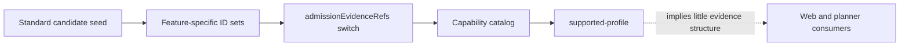
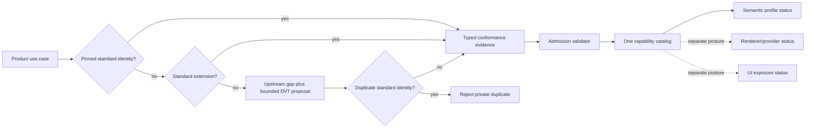

# VTX2 standard-first capability admission plan

## Decision

Capability admission is a typed validation policy over the one existing
`DvtSubstraitCapabilityCatalogV1` read model. It is not a second capability registry,
runtime operator hierarchy, provider matrix, or visual catalog.

An admitted standard capability must carry evidence for the product use case, exact
pinned Substrait identity, canonical semantic fixture, positive and negative semantic
validation, stable identity handling, and an explicit target/UI posture. Provider
acceptance is required only when execution support is claimed.

A DVT-specific extension proposal fails closed when a reviewed standard identity
already exists. When no standard identity is available, the proposal must retain core
and standard-extension search evidence, an upstream gap reference, bounded version,
fail-closed proof, target posture, and convergence path before admission can be
considered.

## Governing sources

- `AGENTS.md`
- `docs/adr/ADR-0064-substrait-semantic-reference-and-bounded-logical-profile.md`
- `docs/architecture/command-query-rail-governance.md`
- `docs/architecture/fowler-opportunity-planning-governance.md`
- `docs/architecture/components/web/graph/canvas-workbench-command-query-catalog.md`
- `docs/architecture/system/subsystems/semantic-transformation/index.md`
- `docs/evidence/ed-20260824-substrait-semantic-reference-traceability.md`
- `docs/evidence/ED-20260831-vtx2-substrait-union-all.md`
- GitHub issues `#2639`, `#2640`, `#2641`, and blocked consumer `#2771`

Planning DB architecture consultation returned no design specific to `#2641`. Creation
intent resolved to the existing `ConfigureCanvasDvtNode` command rail. This plan adds
no command, query, endpoint, persistence owner, or import operation.

## Product boundary

In scope:

- mechanize the standard-first admission checklist as a contract;
- migrate supported-profile promotion from scattered ID sets to typed admission
  evidence attached to the existing catalog entries;
- prove one current VTX2 standard capability end to end;
- reject one private duplicate and an extension proposal without upstream gap evidence;
- separate semantic admission from renderer/provider and UI availability;
- split multi-reason production and test modules below 200 lines.

Out of scope:

- adding structured fields or unblocking `#2771` by assertion;
- changing the pinned Substrait version;
- enabling a renderer, provider, UI function, or runtime execution path;
- adding a second registry, database table, service, route, or legacy fallback.

## Current state



The 606-line catalog module owns schemas, identity construction, canonicalization,
candidate seed data, product needs, promotion rules, and final composition. Evidence
references prove provenance but do not prove the admission sequence or distinguish
semantic, provider, and visual conformance.

## Target state



## Fowler opportunity matrix

| Signal                   | Current cost                                                  | Treatment                                                                       | Behaviour proof                                                |
| ------------------------ | ------------------------------------------------------------- | ------------------------------------------------------------------------------- | -------------------------------------------------------------- |
| Large module             | Seven reasons change in 606 lines                             | Separate schema, candidates, admission evidence, product needs, and composition | every production module remains below 200 lines                |
| Primitive obsession      | Bare issue-reference arrays promote capabilities              | Typed admission evidence and postures                                           | incomplete evidence rejects                                    |
| Switch statements        | Feature ID sets and ordered `if` chain own promotion          | Admission records resolve by canonical entry ID                                 | catalog promotion is order independent                         |
| Duplicated observed data | UI/provider availability can be inferred from semantic status | Explicit independent postures                                                   | admission does not imply exposure or execution                 |
| Speculative generality   | A new extension registry could mirror Substrait               | Validate bounded proposals without storing another registry                     | standard duplicate proposal rejects                            |
| Test code                | Literal counts and version strings restate implementation     | Behaviour-focused contract tests                                                | canonicalization, admission and rejection paths prove outcomes |

## Contract invariants

1. `supported-profile` requires one complete, typed admission record.
2. Admission references the entry's canonical `entryId`; it cannot rename semantics.
3. Exact Substrait/profile evidence is distinct from product-use-case evidence.
4. Semantic validation includes a canonical fixture, positive proof, and negative proof.
5. Stable identity posture is explicit: proved or not applicable with rationale.
6. Target posture is explicit: unavailable, mapped, or provider-accepted.
7. `provider-accepted` requires provider-native evidence; lower postures do not claim it.
8. Visual posture is explicit and never follows automatically from semantic admission.
9. DVT extension proposals require standard search and upstream gap evidence.
10. A proposal naming an existing standard catalog identity as an alternative rejects.
11. Candidate and out-of-scope standard entries cannot carry an admission record.
12. Canonical serialization is deterministic regardless of input order.

## Existing rail

| Rail                     | Type    | Owner                     | Role in this slice                                             | Negative behaviour                                         |
| ------------------------ | ------- | ------------------------- | -------------------------------------------------------------- | ---------------------------------------------------------- |
| `ConfigureCanvasDvtNode` | command | Canvas DVT node aggregate | future consumers may expose only admitted catalog capabilities | unsupported or unadmitted semantics reject before mutation |

Admission itself is pure contract validation for the existing capability read model, so
it does not create a command/query rail. UI/provider catalogs remain projections of this
authority and are not modified in this slice.

## Delivery and red/green order

1. Add behaviour tests for complete standard admission, incomplete evidence, private
   duplicate rejection, missing upstream gap, and posture independence.
2. Introduce the typed admission policy and proposal guard.
3. Split the existing catalog by reason of change and replace ID-set promotion with
   admission records attached during canonical composition.
4. Remove literal-count/version assertions and split tests above 200 lines.
5. Add ARC-2 evidence/risk, synchronize governed docs, then run the full contracts and
   pre-push gates.

## Feature mechanization

```feature-mechanization
version: 1
featureId: VTX2-STANDARD-FIRST-CAPABILITY-ADMISSION-2641
mechanizationStatus: planned
noHumanDecisionsRemaining: true
implementationPlan: docs/planning/proposals/mandatory/runtime-and-contracts/vtx2-standard-first-capability-admission-plan-20260903.md
componentGuides: [docs/architecture/system/subsystems/semantic-transformation/index.md, docs/architecture/components/web/graph/canvas-workbench-command-query-catalog.md]
userStories: [Admit a standard capability with complete conformance evidence, Reject a private duplicate semantic, Keep provider and visual support independent]
governingSources: [AGENTS.md, docs/adr/ADR-0064-substrait-semantic-reference-and-bounded-logical-profile.md, docs/architecture/command-query-rail-governance.md, docs/architecture/fowler-opportunity-planning-governance.md]
domainObjects: [DvtSubstraitCapabilityCatalogV1 read model, Standard capability admission, Bounded DVT extension proposal]
allowedImplementationSurfaces: [packages/@dvt/contracts/**, docs/**]
forbiddenImplementationSurfaces:
  - apps/**
  - packages/@dvt/engine/**
  - packages/@dvt/planner/**
  - new registries, persistence, services, routes, provider claims, UI exposure or legacy fallbacks
commandQueryRails:
  - {name: ConfigureCanvasDvtNode, type: command, status: implemented, dddOwner: Canvas DVT node aggregate, applicationPort: Canvas authoring application service, adapterSurface: Existing Canvas command path, authorizationScope: Existing writable Canvas posture, negativeTests: [Unsupported or unadmitted semantics reject before mutation]}
fowlerSignals: [Large module, Primitive obsession, Switch statements, Duplicated observed data, Speculative generality, Test code]
architectureGuards:
  - pnpm docs:feature-mechanization:implementation -- --feature VTX2-STANDARD-FIRST-CAPABILITY-ADMISSION-2641
  - GIT_BASE=origin/main GIT_HEAD=HEAD node tools/ci/arc-check.mjs
symbols: []
cypressFlows: []
redGreenCycles:
  - id: standard-admission-contract
    redTest: pnpm --filter @dvt/contracts test -- dvt-substrait-capability-admission
    expectedFailure: supported capability evidence is untyped and incomplete evidence is accepted
    patchSurfaces: [packages/@dvt/contracts/src/contracts/planner/**, packages/@dvt/contracts/test/**]
    greenTest: pnpm --filter @dvt/contracts test -- dvt-substrait-capability-admission
  - id: private-duplicate-extension-guard
    redTest: pnpm --filter @dvt/contracts test -- dvt-substrait-capability-admission
    expectedFailure: a DVT extension proposal can duplicate an existing standard identity
    patchSurfaces: [packages/@dvt/contracts/src/contracts/planner/**, packages/@dvt/contracts/test/**]
    greenTest: pnpm --filter @dvt/contracts test -- dvt-substrait-capability-admission
completionGate:
  - pnpm --filter @dvt/contracts test
  - pnpm --filter @dvt/contracts typecheck
  - pnpm --filter @dvt/contracts lint
  - pnpm docs:feature-mechanization:implementation -- --feature VTX2-STANDARD-FIRST-CAPABILITY-ADMISSION-2641
  - pnpm governance:refresh
  - pnpm verify:prepush
```
