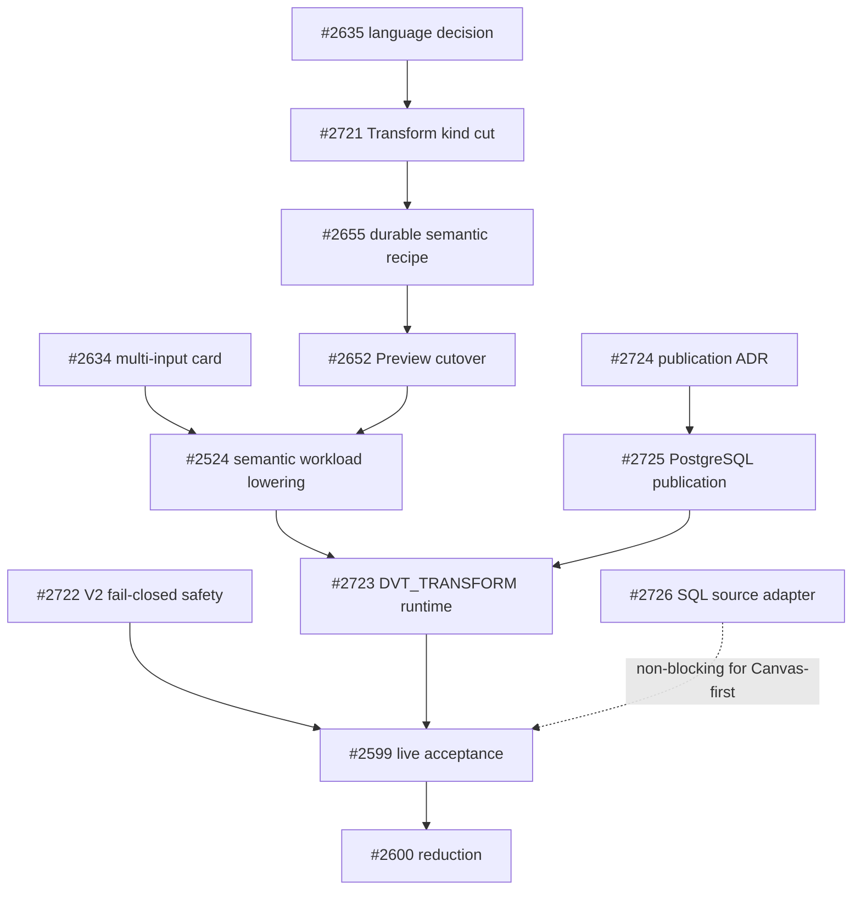

# VTX2 Transform Cutover Plan 2026-08-28

## Purpose

Define the smallest source-first programme that moves DVT from the current
SQL-first compatibility vertical to one language-neutral **Transform** semantic
boundary, then lowers it to real executable workloads without multiplying
architectural mechanisms.

This proposal does not implement the programme. GitHub epic
[#2650](https://github.com/dunay2/dvt/issues/2650) owns the programme and its
bounded child issues own each implementation cut.

## Governing sources

- `AGENTS.md`;
- `docs/planning/status/governance-document-rule-inventory.md`;
- `docs/guides/ai-work-protocol.md`;
- ADR-0003, DVT execution-model sovereignty;
- ADR-0012, plan integrity ownership;
- ADR-0017, ExecutionPlan versioning;
- ADR-0035, Planner public-contract evolution;
- ADR-0064, bounded Substrait semantic authority;
- current semantic-transformation subsystem architecture;
- current source at `main@73b0d1a4784237937ca737a12c1e802dbf35178d`;
- epic #2594 and execution epic #2650.

The Planning DB architecture-design query required by repository procedure must
be executed and recorded before this proposal becomes implementation-ready. The
GitHub connector used to prepare this draft cannot execute repository-local
`pnpm planning:db:*` commands, so that gate remains explicit rather than being
invented from files.

## Source-first AS-IS findings

### Current product identity is still SQL-centered

Production source still exposes:

```text
kind  = dvt:sql_transform
label = SQL transform
```

The plugin catalog, Canvas copy, connection rules and authoring guards all use
that identity.

### Semantic cutover is partial

The repository has already delivered:

- a pinned typed Substrait profile;
- the DVT RelationId/FieldId/provenance sidecar;
- one typed card-authoring pilot;
- one bounded Substrait-to-PostgreSQL projection;
- a machine-readable semantic capability catalog.

However the current authoring authority still carries SQL, VTX1 visual recipe
and Substrait modes during migration. The bounded PostgreSQL projection is not
yet the production Preview source.

### Preview can silently truncate selected topology

The current transformation Preview path filters the selected scope and then
uses first-match role lookup for one input, transform and output. It emits only
that chain. Additional selected nodes and edges can therefore be absent from the
persisted plan.

### Runtime still models technical phases as steps

Current new-plan SQL-first execution emits:

```text
PREPARE_POSTGRES_TRANSFORM
POSTGRES_SQL_TRANSFORM
CAPTURE_MATERIALIZATION_EVIDENCE
```

The PostgreSQL implementation currently:

```text
PREPARE  -> CREATE SCHEMA IF NOT EXISTS
TRANSFORM -> DROP TABLE IF EXISTS + CREATE TABLE AS
EVIDENCE -> SELECT COUNT(*)
```

Connection resolution occurs when each activity acquires its governed plan
session, and `StepCompleted` already supports `resultEvidence`.

### Generic graph/planner authorities already exist

DVT already owns:

- `WorkspaceGraphAuthoringDraft`;
- exact execution selection and closure;
- dependency-gap and cycle diagnostics;
- deterministic graph ordering;
- `GenericGraphSourceV1` and the generic Planner/ExecutionPlan boundary.

The target must reuse them rather than introduce another graph or Planner.

## Product decision

The current native semantic-card concept becomes:

```text
visible noun: Transform
Graph Draft kind: dvt:transform
role: transform
semantic authority: typed Substrait Plan + DVT stable sidecar
```

SQL, Canvas commands and later resolved dbt are source representations or
provenance. PostgreSQL SQL is a target projection. None of those representations
becomes a second semantic authority.

A Transform is a semantic container for relational meaning. It may contain many
Substrait relations/expressions/functions internally. It does **not** contain
child Graph Draft nodes or a hidden subworkflow.

## Three-scale rule

```text
Substrait operator count
        !=
Canvas Transform-card count
        !=
ExecutionPlan workload/step count
```

A runtime workload exists because there is an independent operational
responsibility, not because a card or semantic operator exists.

## Target boundary

```mermaid
flowchart LR
  Sources["SQL source / Canvas commands / future resolved dbt"]
  Transform["Transform card\ndvt:transform"]
  Semantic["Typed Substrait Plan\n+ DVT identity sidecar"]
  Render["Governed target projection"]
  Ready["Provider-native readiness"]
  Select["Exact selected Graph Draft"]
  Lower["Semantic workload lowering"]
  Planner["Generic Planner / ExecutionPlan"]
  Runtime["DVT_TRANSFORM runtime activity"]
  Publish["Safe output publication"]
  Evidence["StepCompleted.resultEvidence"]

  Sources --> Transform
  Transform --> Semantic
  Semantic --> Render
  Render --> Ready
  Select --> Lower
  Semantic --> Lower
  Ready --> Lower
  Lower --> Planner
  Planner --> Runtime
  Runtime --> Publish
  Publish --> Evidence
```



## What this programme removes

The accepted target removes or confines:

- visible `SQL transform` as the native product noun;
- current createable kind `dvt:sql_transform` after one governed migration;
- SQL and VTX1 visual recipe as parallel editable semantic authorities;
- fixed `exactly one source + one transform + one sink` product topology;
- first-role `.find()` Preview truncation;
- current transformation-specific three-node compiler as the current path;
- PREPARE as a step without an independent lifecycle responsibility;
- CAPTURE_EVIDENCE as a separate step when the completing workload can return
  evidence;
- legacy POSTGRES_SQL_TRANSFORM on new VTX2 plans;
- fake source/join/operator workload steps;
- `selectedColumns` as a competing field-selection authority;
- compatibility code after its exact persisted-draft/PlanRef obligation expires.

## What this programme does not add

- one node or class per Join/Filter/Aggregate/Set/Window operator;
- a private DVT relational IR beside Substrait;
- a second Graph Draft, Planner, state store or runtime;
- a generic transform child-node container;
- SQLGlot for the single PostgreSQL target;
- a generic renderer framework before a second real target proves duplication;
- query optimization or join reordering;
- shared-build caching;
- universal asset catalog;
- generic materialization strategy framework;
- reusable subflow/procedure framework;
- new provider merely to justify an abstraction.

## Workload-boundary rule

Create a separate workload only when at least one real responsibility exists:

- independently published/addressable output;
- explicit materialization boundary;
- provider/connection transfer;
- check/control/gateway semantics;
- distinct retry, timeout, cancellation or recovery boundary;
- independently consumed artifact/result.

Do not create a workload solely for:

- source/input reference;
- internal Substrait relation/expression/function;
- a visible card that can be structurally composed without semantic change;
- connection/session setup;
- evidence collection;
- cleanup, logging, tracing or metrics.

## Current issue ownership

### Delivered foundations

| Issue | Delivered responsibility |
| --- | --- |
| #2595 | pinned Substrait profile, document and stable sidecar |
| #2598 | typed card-authoring pilot |
| #2597 | first bounded PostgreSQL projection |
| #2640 | semantic capability catalog |
| #2618 | SQLGlot reference-only decision for PostgreSQL V0 |

### Remaining concrete cuts

| Order/lane | Issue | One owned outcome |
| --- | --- | --- |
| immediate | #2722 | legacy V2 fails closed; no silent selected-graph truncation |
| product | #2635 | visual language and primary product noun |
| product | #2721 | `SQL transform -> Transform`; `dvt:sql_transform -> dvt:transform` migration |
| semantic persistence | #2655 | one durable Substrait recipe document on existing storage |
| field identity | #2596 | remove `selectedColumns` semantic residue |
| capability UI | #2642 | project admitted capabilities into current authoring surface |
| Preview | #2652 | Preview consumes Substrait-derived PostgreSQL SQL |
| projection identity | #2657 | decide destination/storage identity from real Preview evidence |
| multi-input | #2634 | multiple inputs inside one semantic card |
| lowering | #2524 | exact selected semantic DAG -> generic workload descriptors |
| runtime | #2723 | execute `DVT_TRANSFORM`; stop new-plan PREPARE/legacy SQL/EVIDENCE |
| materialization | #2523 | bounded general table/view + replace/append adapter contract |
| publication ADR | #2724 | decide managed logical/physical publication and rollback semantics |
| publication impl | #2725 | implement PostgreSQL managed table-replace only if ADR adopts it |
| SQL source | #2726 | first bounded PostgreSQL SELECT -> admitted Substrait mapping |
| acceptance | #2599 | consume completed cuts in one live semantic/Preview/Run proof |
| deletion | #2600 | delete superseded VTX1 mechanisms after replacement evidence |

No separate dbt-to-Substrait implementation issue is created yet. It is opened
only after the first SQL source adapter proves the reusable source boundary and
current dbt source evidence justifies a concrete cut.

## Delivery order



## Source-first rule for every child issue

Before implementation, every cut records:

1. exact current `main` SHA;
2. overlapping open PRs and issues;
3. production path and composition root;
4. current tests and reproduced behavior;
5. existing contract/store/command/query rail to reuse;
6. all consumers of symbols to change/delete;
7. red test or measured provider experiment;
8. explicit `KEEP | REPLACE | DELETE | VERSION-CONFINE` disposition;
9. refreshed DoR and DoD against source.

Issue text, old proposals and closed PRs are context, not implementation proof.

## Command/query rail posture

The programme reuses current product intents:

| Intent | Existing rail/owner |
| --- | --- |
| edit/apply semantic card | current Canvas DVT node configuration command / Graph Draft aggregate |
| persist/reload graph | existing Workspace Graph Draft save/get rails |
| select executable closure | current Canvas execution-selection and executable-subgraph query |
| Preview/compile | current PreviewExecutionPlan/Planner boundary |
| Start immutable plan | current StartRun/Engine boundary |
| observe run/evidence | current run-state/event/read-model queries |

The kind migration and internal workload lowering do not create a second user
intent. If source inspection shows a genuinely missing externally observable
command/query, it must be registered through the existing governance mechanism
before implementation.

## Fowler/DDD opportunity matrix

| Finding | Smell/opportunity | Selected treatment | Owner |
| --- | --- | --- | --- |
| `dvt:sql_transform` also hosts visual/Substrait semantics | misleading type code / primitive obsession | rename one canonical kind after bounded migration | Transform authoring contract |
| SQL, visual recipe and Substrait coexist as authorities | hidden/duplicate authority | converge on Substrait document; retain provenance only | semantic transformation context |
| Preview chooses first node by role | silent data loss / feature envy | immediate fail-closed cut, then exact-DAG lowering | Preview / lowering boundary |
| visible source/sink become technical steps | representation coupling | derive only real semantic workloads | lowering boundary |
| PREPARE/EVIDENCE are activities without independent lifecycle | speculative responsibility | internal phases + observability | provider activity |
| `DROP + CTAS` owns live target replacement | destructive coupling | explicit publication ADR and bounded implementation | PostgreSQL adapter/publication policy |
| broad E2E issue contains missing implementation | responsibility overload | child implementation issues; E2E only consumes them | epic/acceptance |
| adding operator node types | shotgun surgery / parallel semantics | keep operators inside Substrait semantic document | semantic authority |

## Programme Definition of Ready

The epic is ready for bounded work because its foundations and current code map
exist. Each child issue has its own DoR.

- [x] ADR-0064 accepted;
- [x] semantic document/sidecar, pilot editing, first renderer and capability
  catalog delivered;
- [x] current code rechecked at `main@73b0d1a...`;
- [x] every observed missing responsibility has one issue owner;
- [x] broad #2524 narrowed to exact semantic workload lowering;
- [x] missing cuts #2721-#2726 created;
- [ ] Planning DB architecture-design/creation-intent queries recorded;
- [ ] command/query rail catalog updated only where those queries prove a new rail
  is required;
- [ ] this proposal passes feature mechanization, docs/governance and prepush
  checks before merge readiness.

## Programme Definition of Done

- [ ] product uses **Transform** as native semantic-card noun;
- [ ] new Graph Drafts persist only `dvt:transform`;
- [ ] one typed Substrait document + stable DVT sidecar is semantic authority;
- [ ] source/target representations do not become parallel authorities;
- [ ] Preview consumes deterministic target projection from the semantic document;
- [ ] exact selected graph is lowered without ignored nodes, edges or outputs;
- [ ] multi-input semantics create no fake source/join workloads;
- [ ] generic Planner/Engine remain independent of relational/card/SQL taxonomy;
- [ ] new plans execute real `DVT_TRANSFORM` workloads;
- [ ] new path emits no PREPARE or separate CAPTURE_EVIDENCE step;
- [ ] completing workload emits authoritative evidence;
- [ ] physical output follows the explicitly accepted safe publication outcome;
- [ ] unsupported semantics/topology/provider/materialization fail closed;
- [ ] first bounded SQL source adapter proves SQL is an input representation, not
  authority;
- [ ] VTX1 compatibility is removed or version-confined with an exact exit;
- [ ] no second IR, graph, Planner, store, runtime, renderer framework, command
  bus or operator taxonomy exists;
- [ ] package/service/browser/live evidence and `pnpm verify:prepush` pass;
- [ ] epic #2594 receives acceptance evidence before closure.

## Proposal PR validation

This PR is planning/documentation only and claims no runtime behavior. Before
merge readiness, repository-native execution must complete:

```bash
pnpm planning:db:import --if-stale
pnpm planning:db:query architecture-designs --limit 100
pnpm planning:db:query creation-intent --intent "converge DVT Transform semantic cutover" --limit 10
pnpm docs:feature-mechanization -- --feature VTX2-TRANSFORM-CUTOVER
pnpm governance:refresh
pnpm ci:docs
pnpm verify:prepush
```

```feature-mechanization
version: 1
featureId: VTX2-TRANSFORM-CUTOVER
mechanizationStatus: proposed
noHumanDecisionsRemaining: false
implementationPlan: docs/planning/proposals/mandatory/runtime-and-contracts/vtx2-transform-cutover-plan-20260828.md
componentGuides:
  - docs/architecture/system/subsystems/semantic-transformation/index.md
  - docs/architecture/components/planner/executable-subgraph-derivation-component.md
  - docs/architecture/components/web/graph/canvas-authoring-draft-boundary-component.md
userStories:
  - https://github.com/dunay2/dvt/issues/2650
  - https://github.com/dunay2/dvt/issues/2721
  - https://github.com/dunay2/dvt/issues/2722
  - https://github.com/dunay2/dvt/issues/2723
  - https://github.com/dunay2/dvt/issues/2724
  - https://github.com/dunay2/dvt/issues/2725
  - https://github.com/dunay2/dvt/issues/2726
governingSources:
  - AGENTS.md
  - docs/planning/status/governance-document-rule-inventory.md
  - docs/guides/ai-work-protocol.md
  - docs/architecture/command-query-rail-governance.md
  - docs/architecture/fowler-opportunity-planning-governance.md
  - docs/adr/ADR-0003-execution-model.md
  - docs/adr/ADR-0012-plan-integrity-ownership.md
  - docs/adr/ADR-0017_ExecutionPlan_Schema_Versioning.md
  - docs/adr/ADR-0035-planner-public-contract-evolution-protocol.md
  - docs/adr/ADR-0064-substrait-semantic-reference-and-bounded-logical-profile.md
allowedImplementationSurfaces:
  - packages/@dvt/contracts/src/contracts/planner/**
  - packages/@dvt/contracts/src/step-registry/**
  - packages/@dvt/planner/src/**
  - apps/web/src/app/plugins/dvt/**
  - apps/web/src/app/views/canvas/**
  - apps/api/src/**
  - packages/@dvt/adapter-postgres/**
  - packages/@dvt/adapter-temporal/**
  - apps/temporal-worker/**
  - docs/evidence/**
  - docs/risk-register/quality/**
forbiddenImplementationSurfaces:
  - new graph stores
  - new planners
  - new state stores
  - private relational IRs
  - operator-specific native node taxonomies
  - hidden nested Graph Drafts inside Transform metadata
  - generic renderer frameworks without a second real target
  - SQLGlot runtime for PostgreSQL V0
  - permanent compatibility aliases
commandQueryRails:
  - name: ConfigureCanvasDvtNode
    type: command
    dddOwner: Native DVT Transform authoring
  - name: SaveCanvasAuthoringDraft
    type: command
    dddOwner: WorkspaceGraphAuthoringDraft
  - name: ProjectSelectedExecutableSubgraph
    type: query
    dddOwner: Planner executable subgraph
  - name: PreviewExecutionPlan
    type: command
    dddOwner: Planner compile boundary
  - name: StartRun
    type: command
    dddOwner: Engine run lifecycle
  - name: ObserveRunEvidence
    type: query
    dddOwner: Canonical run read model
fowlerSignals:
  - Misleading SQL-centered card identity.
  - Duplicate semantic authorities during cutover.
  - Silent selected-graph truncation.
  - Technical runtime phases modeled as product steps.
  - Destructive live-target replacement without explicit publication policy.
architectureGuards:
  - proposed: Preview never silently drops selected nodes or edges
  - proposed: one current native Transform kind after migration
  - proposed: Planner and Engine do not parse Substrait or SQL semantics
  - proposed: new plans contain no technical PREPARE/EVIDENCE activities
  - proposed: no second graph/planner/store/IR authority
cypressFlows:
  - proposed: Transform Apply Cancel reload with stable semantic identity
  - proposed: multi-input Transform to Preview and Run
  - proposed: selected graph fan-out preserves all outputs
completionGate:
  - pnpm docs:feature-mechanization -- --feature VTX2-TRANSFORM-CUTOVER
  - pnpm docs:feature-mechanization:implementation
  - pnpm governance:refresh
  - pnpm ci:docs
  - pnpm verify:prepush
redGreenCycles:
  - id: v2-no-silent-truncation
    redTest: selected V2 graph with extra Transform/output is silently reduced
    expectedFailure: current first-role projection ignores selected graph elements
    greenTest: #2722 returns deterministic unsupported-topology diagnostics
  - id: transform-kind-cutover
    redTest: current catalog persists and displays dvt:sql_transform / SQL transform
    expectedFailure: product identity remains SQL-centered
    greenTest: #2721 persists dvt:transform and migrates supported drafts
  - id: exact-semantic-workload-lowering
    redTest: current compiler emits fixed three technical steps
    expectedFailure: selected semantic graph is not represented as real workloads
    greenTest: #2524 emits deterministic generic DVT workload descriptors
  - id: single-transform-runtime-step
    redTest: new path emits PREPARE plus SQL_TRANSFORM plus EVIDENCE
    expectedFailure: technical phases produce synthetic lifecycle boundaries
    greenTest: #2723 executes one real DVT_TRANSFORM workload and evidence
  - id: safe-managed-publication
    redTest: current table replace executes DROP TABLE against the logical target
    expectedFailure: no post-commit rollback/version retention guarantee
    greenTest: #2724 decision and #2725 implementation satisfy the accepted publication contract
negativeTests:
  - Unknown or unsupported Substrait semantics fail closed.
  - Unsupported topology never produces a partial plan.
  - Mixed unsupported provider/connection graphs never invent transfer semantics.
  - A Transform cannot embed an arbitrary child Graph Draft.
  - SQL or visual recipe cannot survive as a second current semantic authority.
```

## Planning disposition

- #2594 owns the strategic Substrait/card direction.
- #2650 owns the Transform cutover programme and acceptance.
- child issues own bounded implementation cuts.
- #2599 consumes completed cuts for live acceptance; it does not become an
  implementation omnibus.
- #2600 deletes superseded mechanisms only after replacement evidence and exact
  compatibility expiry.
- draft PR #2540 is superseded by this source-first proposal and must not remain
  a competing current architecture plan.
