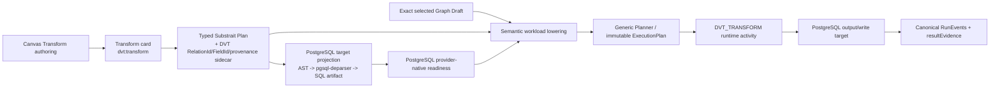
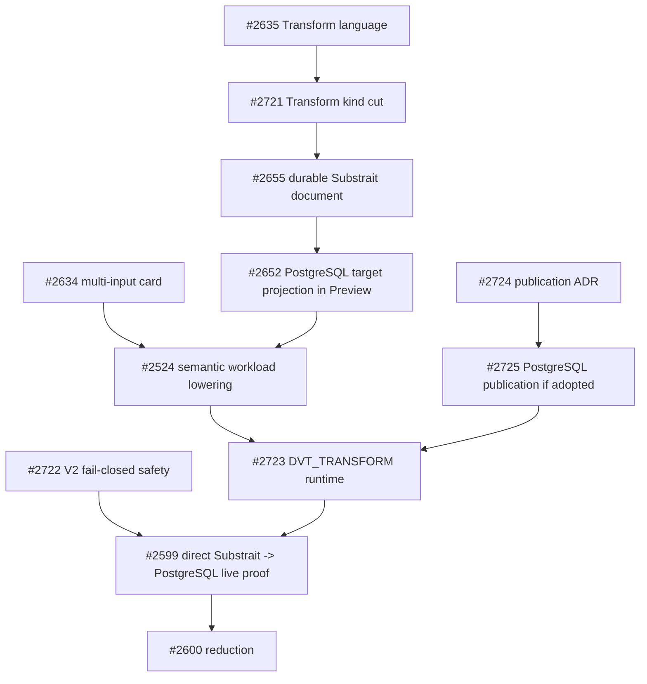

# VTX2 Transform Cutover Plan 2026-08-28

## Purpose

Define the smallest source-first programme that moves DVT from the current
SQL-first compatibility vertical to one direct, language-neutral **Transform**
semantic boundary and then lowers it to real executable workloads.

The programme does **not** translate SQL into Substrait as part of the current
product path. DVT authors and persists Substrait semantics directly. PostgreSQL
appears downstream as the first target/provider and output/write boundary.

GitHub epic [#2650](https://github.com/dunay2/dvt/issues/2650) owns the programme.
Each child issue owns one bounded implementation cut.

## Governing sources

- `AGENTS.md`;
- `docs/planning/status/governance-document-rule-inventory.md`;
- `docs/guides/ai-work-protocol.md`;
- ADR-0003, DVT execution-model sovereignty;
- ADR-0012, plan integrity ownership;
- ADR-0017, ExecutionPlan versioning;
- ADR-0035, Planner public-contract evolution;
- ADR-0064, bounded Substrait semantic authority;
- current semantic-transformation subsystem architecture;
- current source and tests;
- epic #2594 and execution epic #2650.

Planning DB architecture and creation-intent queries remain mandatory before
implementation readiness. This GitHub-connected environment cannot execute the
repository-local `pnpm planning:db:*` commands, so those gates remain explicit.

## Current source truth

Current production is transitional:

1. the native catalog still exposes `dvt:sql_transform` and `SQL transform`;
2. authoring still carries SQL, VTX1 visual recipe and Substrait modes during
   migration;
3. the bounded Substrait -> PostgreSQL projection is delivered but is not yet
   the production Preview source;
4. legacy Preview still chooses the first input, transform and output by role;
5. the current compiler still emits PREPARE, POSTGRES_SQL_TRANSFORM and
   CAPTURE_EVIDENCE;
6. PostgreSQL runtime still executes separate prepare/transform/evidence
   activities and currently uses destructive `DROP + CTAS` for table replace.

Generic graph selection, cycle/dependency validation, deterministic ordering,
Planner ingress and immutable ExecutionPlan already exist and must be reused.

## Product decision

The current native semantic card becomes:

```text
visible noun: Transform
Graph Draft kind: dvt:transform
role: transform
semantic authority: typed Substrait Plan + stable DVT sidecar
```

A Transform contains relational semantics represented by admitted Substrait
relations, expressions, functions and types. It does not contain child Graph
Draft nodes or a hidden workflow.

SQL and PostgreSQL are not the same boundary:

```text
Substrait
  = semantic authority

PostgreSQL AST / rendered SQL
  = target representation

PostgreSQL database
  = target/provider and output/write boundary
```

SQL-to-Substrait import is outside the current programme. Issue #2726 is closed
`not_planned`. A future importer requires a separate real user story for
importing an existing SQL-only asset into editable Transform semantics.

## Three-scale rule

```text
Substrait operator count
        !=
Canvas Transform-card count
        !=
ExecutionPlan workload/step count
```

A workload exists because there is an independent operational responsibility,
not because a semantic operator or visible card exists.

## Target path



There is deliberately no `SQL -> Substrait` arrow.

## What the programme removes

The accepted target removes or version-confines:

- visible `SQL transform` as the native product noun;
- createable `dvt:sql_transform` after one governed Graph Draft migration;
- SQL and VTX1 visual recipe as parallel editable semantic authorities;
- fixed `exactly one source + one transform + one sink` product topology;
- first-role `.find()` Preview truncation;
- the transformation-specific three-node compiler as the current path;
- PREPARE as a step without an independent lifecycle responsibility;
- CAPTURE_EVIDENCE as a separate step;
- legacy POSTGRES_SQL_TRANSFORM emission on new VTX2 plans;
- fake source/join/operator workload steps;
- `selectedColumns` as a competing field-selection authority;
- compatibility code after its exact persisted-draft/PlanRef obligation expires.

## What the programme does not add

- SQL-to-Substrait parser/mapping path;
- SQLGlot runtime for PostgreSQL V0;
- one native node/class/step per Join, Filter, Aggregate, Set or Window;
- private DVT relational IR beside Substrait;
- second Graph Draft, Planner, state store or runtime;
- generic transform child-node container;
- generic cross-target renderer framework before a second real target;
- query optimizer or join reordering;
- shared-build cache;
- universal asset catalog;
- generic materialization framework;
- reusable procedure/subflow framework;
- new provider merely to justify an abstraction.

## Workload-boundary rule

Create a separate workload only for a real operational boundary such as:

- independently published/addressable output;
- explicit materialization boundary;
- provider/connection transfer;
- check/control/gateway semantics;
- distinct retry, timeout, cancellation or recovery boundary;
- independently consumed artifact/result.

Do not create a workload solely for:

- source/input reference;
- internal Substrait relation/expression/function;
- a visible card that can be structurally composed;
- connection/session setup;
- evidence collection;
- cleanup, logging, tracing or metrics.

## PostgreSQL responsibility

PostgreSQL remains necessary because it is the first execution and output target.
The outbound path is:

```text
Substrait semantic document
 -> bounded PostgreSQL AST
 -> deterministic rendered PostgreSQL SQL artifact
 -> PostgreSQL readiness
 -> PostgreSQL execution/publication
```

The target renderer does not own semantics. Provider readiness does not replace
semantic admission. Execution/publication does not rewrite the semantic
document.

Physical output guarantees are owned explicitly:

- #2523 owns the bounded table/view and replace/append intent contract;
- #2724 decides whether managed logical/physical version publication is adopted;
- #2725 implements it only when #2724 accepts the principle.

The programme must not claim rollback/version retention when only the smaller
#2523 contract has been delivered.

## Current issue ownership

### Delivered foundations

| Issue | Delivered responsibility |
| --- | --- |
| #2595 | pinned Substrait profile, document and stable sidecar |
| #2598 | typed Transform-card authoring pilot |
| #2597 | first bounded Substrait -> PostgreSQL projection |
| #2640 | semantic capability catalog |
| #2618 | SQLGlot/reference decision; no current SQL-import path |

### Remaining cuts

| Lane | Issue | One owned outcome |
| --- | --- | --- |
| safety | #2722 | legacy V2 fails closed; no silent graph truncation |
| product | #2635 | visual language around Transform |
| product | #2721 | `SQL transform -> Transform`; `dvt:transform` migration |
| persistence | #2655 | one durable Substrait semantic document |
| field identity | #2596 | retire `selectedColumns` residue |
| capability UI | #2642 | project admitted capabilities into current authoring |
| target projection | #2652 | Preview consumes Substrait-derived PostgreSQL SQL |
| target identity | #2657 | target artifact identity/destination/storage decision |
| readiness | #2333 | PostgreSQL structural/provider-native validation |
| multi-input | #2634 | multiple inputs inside one Transform card |
| lowering | #2524 | exact selected semantic DAG -> generic workloads |
| runtime | #2723 | execute DVT_TRANSFORM; stop new-plan technical activities |
| materialization | #2523 | bounded table/view + replace/append contract |
| publication ADR | #2724 | decide managed publication/rollback semantics |
| publication impl | #2725 | PostgreSQL implementation only if ADR adopts it |
| acceptance | #2599 | direct Transform/Substrait -> PostgreSQL Preview/Run proof |
| deletion | #2600 | remove superseded VTX1 mechanisms |

### Closed speculative cut

| Issue | Disposition |
| --- | --- |
| #2726 | closed `not_planned`; SQL -> Substrait import is outside VTX2 cutover |

No dbt-to-Substrait or SQL-import issue is created until a concrete source-first
consumer demonstrates that product requirement.

## Delivery order



## Source-first protocol for every cut

Before implementation, every child records:

1. exact current `main` SHA;
2. overlapping open PRs/issues;
3. production path and composition root;
4. current tests and reproduced behavior;
5. existing contract/store/command/query rail to reuse;
6. every consumer of symbols to change/delete;
7. red test or measured provider experiment;
8. `KEEP | REPLACE | DELETE | VERSION-CONFINE` disposition;
9. refreshed DoR and DoD against observed source.

Issue text and old proposals are context, not implementation proof.

## Programme Definition of Ready

- [x] ADR-0064 accepted;
- [x] semantic document/sidecar, typed pilot, first PostgreSQL renderer and
  capability catalog delivered;
- [x] current code gaps reconciled source-first;
- [x] concrete implementation responsibilities have bounded issue owners;
- [x] #2524 narrowed to semantic workload lowering;
- [x] SQL -> Substrait import removed from the programme;
- [ ] Planning DB architecture/creation-intent queries recorded;
- [ ] command/query rail catalog updated only if those queries prove a new rail;
- [ ] feature mechanization, docs/governance and prepush checks pass before merge
  readiness.

## Programme Definition of Done

- [ ] product uses **Transform** and new drafts persist only `dvt:transform`;
- [ ] one typed Substrait document + stable DVT sidecar is semantic authority;
- [ ] no SQL/visual/dbt parallel authority survives on the current path;
- [ ] deterministic PostgreSQL target SQL derives from the exact semantic document;
- [ ] PostgreSQL provider-native readiness validates the effective target;
- [ ] exact selected graph lowers without ignored nodes, edges or outputs;
- [ ] multi-input semantics create no fake source/join workloads;
- [ ] Planner/Engine remain independent of semantic operator and SQL taxonomy;
- [ ] new plans execute real `DVT_TRANSFORM` workloads;
- [ ] new path emits no PREPARE or separate CAPTURE_EVIDENCE step;
- [ ] completing workload emits authoritative evidence;
- [ ] PostgreSQL output follows the explicitly accepted safe publication outcome;
- [ ] unsupported semantics/topology/provider/materialization fail closed;
- [ ] no SQL-to-Substrait importer is required or present;
- [ ] VTX1 compatibility is removed or version-confined with an exact exit;
- [ ] no second IR, graph, Planner, store, runtime, renderer framework, command
  bus or operator taxonomy exists;
- [ ] package/service/browser/live evidence and `pnpm verify:prepush` pass;
- [ ] #2594 receives acceptance evidence before closure.

## Proposal PR validation

This PR is documentation/planning only and claims no runtime behavior.
Repository-native validation required before merge readiness:

```bash
pnpm planning:db:import --if-stale
pnpm planning:db:query architecture-designs --limit 100
pnpm planning:db:query creation-intent --intent "converge DVT Transform semantic cutover" --limit 10
pnpm docs:feature-mechanization -- --feature VTX2-TRANSFORM-CUTOVER
pnpm governance:refresh
pnpm ci:docs
pnpm verify:prepush
```

```feature-mechanization
version: 1
featureId: VTX2-TRANSFORM-CUTOVER
mechanizationStatus: proposed
noHumanDecisionsRemaining: false
implementationPlan: docs/planning/proposals/mandatory/runtime-and-contracts/vtx2-transform-cutover-plan-20260828.md
componentGuides:
  - docs/architecture/system/subsystems/semantic-transformation/index.md
  - docs/architecture/components/planner/executable-subgraph-derivation-component.md
  - docs/architecture/components/web/graph/canvas-authoring-draft-boundary-component.md
userStories:
  - https://github.com/dunay2/dvt/issues/2650
  - https://github.com/dunay2/dvt/issues/2721
  - https://github.com/dunay2/dvt/issues/2722
  - https://github.com/dunay2/dvt/issues/2723
  - https://github.com/dunay2/dvt/issues/2724
  - https://github.com/dunay2/dvt/issues/2725
governingSources:
  - AGENTS.md
  - docs/planning/status/governance-document-rule-inventory.md
  - docs/guides/ai-work-protocol.md
  - docs/architecture/command-query-rail-governance.md
  - docs/architecture/fowler-opportunity-planning-governance.md
  - docs/adr/ADR-0003-execution-model.md
  - docs/adr/ADR-0012-plan-integrity-ownership.md
  - docs/adr/ADR-0017_ExecutionPlan_Schema_Versioning.md
  - docs/adr/ADR-0035-planner-public-contract-evolution-protocol.md
  - docs/adr/ADR-0064-substrait-semantic-reference-and-bounded-logical-profile.md
allowedImplementationSurfaces:
  - packages/@dvt/contracts/src/contracts/planner/**
  - packages/@dvt/contracts/src/step-registry/**
  - packages/@dvt/planner/src/**
  - apps/web/src/app/plugins/dvt/**
  - apps/web/src/app/views/canvas/**
  - apps/api/src/**
  - packages/@dvt/adapter-postgres/**
  - packages/@dvt/adapter-temporal/**
  - apps/temporal-worker/**
  - docs/evidence/**
  - docs/risk-register/quality/**
forbiddenImplementationSurfaces:
  - SQL-to-Substrait importer for the current programme
  - SQLGlot runtime for PostgreSQL V0
  - new graph stores
  - new planners
  - new state stores
  - private relational IRs
  - operator-specific native node taxonomies
  - hidden nested Graph Drafts inside Transform metadata
  - generic renderer frameworks without a second real target
  - permanent compatibility aliases
commandQueryRails:
  - name: ConfigureCanvasDvtNode
    type: command
    dddOwner: Native DVT Transform authoring
  - name: SaveCanvasAuthoringDraft
    type: command
    dddOwner: WorkspaceGraphAuthoringDraft
  - name: ProjectSelectedExecutableSubgraph
    type: query
    dddOwner: Planner executable subgraph
  - name: PreviewExecutionPlan
    type: command
    dddOwner: Planner compile boundary
  - name: StartRun
    type: command
    dddOwner: Engine run lifecycle
  - name: ObserveRunEvidence
    type: query
    dddOwner: Canonical run read model
redGreenCycles:
  - id: v2-no-silent-truncation
    redTest: selected V2 graph with extra Transform/output is silently reduced
    expectedFailure: current first-role projection ignores selected graph elements
    greenTest: #2722 returns deterministic unsupported-topology diagnostics
  - id: transform-kind-cutover
    redTest: current catalog persists and displays dvt:sql_transform / SQL transform
    expectedFailure: product identity remains SQL-centered
    greenTest: #2721 persists dvt:transform and migrates supported drafts
  - id: direct-substrait-preview
    redTest: current Preview does not consume the canonical Substrait-derived PostgreSQL artifact
    expectedFailure: semantic authority is not the production Preview source
    greenTest: #2652 Preview consumes deterministic target projection
  - id: exact-semantic-workload-lowering
    redTest: current compiler emits fixed three technical steps
    expectedFailure: selected semantic graph is not represented as real workloads
    greenTest: #2524 emits deterministic generic DVT workload descriptors
  - id: single-transform-runtime-step
    redTest: new path emits PREPARE plus SQL_TRANSFORM plus EVIDENCE
    expectedFailure: technical phases produce synthetic lifecycle boundaries
    greenTest: #2723 executes one DVT_TRANSFORM workload and evidence
negativeTests:
  - Unknown or unsupported Substrait semantics fail closed.
  - Unsupported topology never produces a partial plan.
  - Mixed unsupported provider/connection graphs never invent transfer semantics.
  - A Transform cannot embed an arbitrary child Graph Draft.
  - SQL or visual recipe cannot survive as a second current semantic authority.
  - SQL-to-Substrait import cannot enter the current cutover path.
```

## Planning disposition

- #2594 owns the strategic Substrait/card direction.
- #2650 owns the Transform cutover programme and acceptance.
- bounded child issues own implementation cuts.
- #2599 consumes completed cuts for live acceptance.
- #2600 deletes superseded mechanisms after replacement evidence.
- SQL import remains outside the programme until a separate source-first product
  requirement justifies it.
