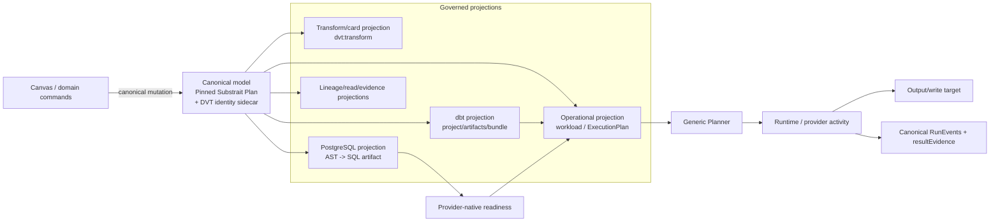
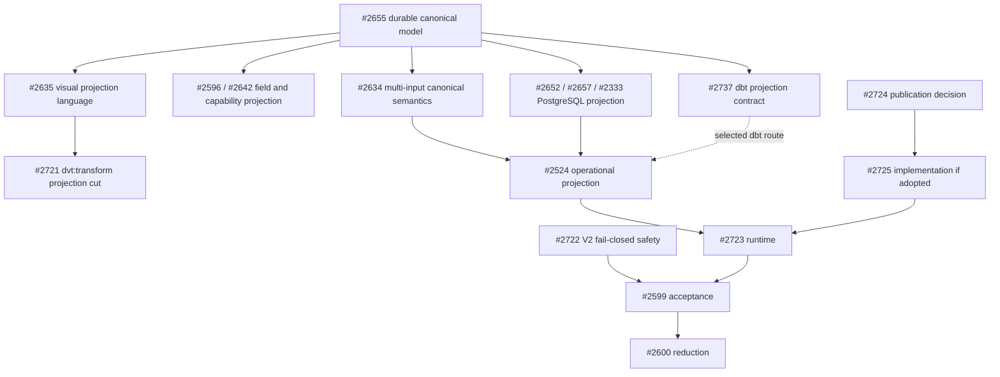

# VTX2 Single Canonical Model and Governed Projections Cutover Plan

## Purpose

Define the smallest source-first programme that moves DVT from the current
SQL/dbt/VTX1 compatibility mechanisms to **one canonical transformation model**
and a set of governed projections.

This proposal does not implement the programme. Strategic epic
[#2594](https://github.com/dunay2/dvt/issues/2594) owns the canonical-model
direction. Operational epic [#2650](https://github.com/dunay2/dvt/issues/2650)
owns the cutover. Each child issue owns one bounded implementation or study cut.

## Governing sources

- `AGENTS.md`;
- `docs/planning/status/governance-document-rule-inventory.md`;
- `docs/guides/ai-work-protocol.md`;
- ADR-0003, DVT execution-model sovereignty;
- ADR-0012, plan integrity ownership;
- ADR-0017, ExecutionPlan versioning;
- ADR-0035, Planner public-contract evolution;
- ADR-0064, single canonical Substrait semantic model and bounded profile;
- current semantic-transformation subsystem architecture;
- current source, tests, composition roots and CI;
- epics #2594 and #2650.

Planning DB architecture and creation-intent queries remain mandatory before
implementation readiness. This GitHub-connected environment cannot execute the
repository-local `pnpm planning:db:*` commands, so those gates remain explicit.

## Decision

DVT persists and mutates one canonical transformation model:

```text
typed pinned Substrait Plan
+ stable DVT RelationId / FieldId / provenance sidecar
```

There is no separate canonical DVT model, dbt model, PostgreSQL model, Canvas
model, workload model or ExecutionPlan model of relational meaning.

The following are projections of the same canonical semantic revision:

```text
canonical Substrait semantic revision
        ├── Transform/card UI projection
        ├── dbt project/artifact/execution projection
        ├── PostgreSQL AST/SQL target projection
        ├── workload / ExecutionPlan operational projection
        ├── lineage/impact projection
        └── read-model/evidence projection
```

A projection may be stored immutably for execution, audit, reproducibility,
diff, cache or evidence. Every stored projection binds to the exact canonical
semantic SHA/profile and required projection/tool/target identity. No projection
silently becomes editable semantic authority.

## Canonical mutation path

```text
Canvas/domain command
        ↓
mutate one canonical Substrait semantic revision
        ↓
new semantic SHA + stable identity binding
        ↓
invalidate/regenerate derived projections
        ↓
provider-native readiness of selected target projection
        ↓
operational projection
        ↓
generic Planner / immutable ExecutionPlan / runtime
```

The current programme does not require SQL or dbt to be converted into another
DVT model. A future importer for an externally owned SQL/dbt asset is a separate
migration/compatibility capability and requires a concrete user story and
source-first contract.

## Current source truth

Current production is transitional:

1. the native catalog still exposes `dvt:sql_transform` and `SQL transform`;
2. Graph Draft and authoring code still carry SQL, VTX1 visual recipe and
   Substrait migration modes;
3. the bounded Substrait -> PostgreSQL projection is delivered but is not yet
   the production Preview source;
4. legacy Preview still chooses the first input, transform and output by role;
5. the current compiler still emits PREPARE, POSTGRES_SQL_TRANSFORM and
   CAPTURE_EVIDENCE;
6. PostgreSQL runtime still executes separate prepare/transform/evidence
   activities and currently uses destructive `DROP + CTAS` for table replace;
7. current dbt import/file/analyzer/runner functionality predates ADR-0064 and
   still contains file-authority assumptions that require source-first
   classification.

Generic graph selection, cycle/dependency validation, deterministic ordering,
Planner ingress, immutable ExecutionPlan, artifact storage, run state and
provider composition already exist and must be reused.

## Projection taxonomy

### Canonical semantic model

Owner:

```text
Substrait Plan + DVT sidecar
```

Contains admitted relational, expression, type and function meaning plus stable
DVT identity/provenance. It is the only semantic authority.

### Transform/card projection

Owner:

```text
Canvas / Graph Draft product projection
```

The visible noun is **Transform** and the target projection kind is
`dvt:transform`. The card does not persist another relational model. Product
commands mutate the canonical semantic document and the card reprojects it.

### dbt projection

Owner to freeze source-first in #2737:

```text
canonical semantic revision
 -> deterministic dbt artifacts required by current integration/execution
```

Generated SQL/YAML/manifest/compiled artifacts are non-authoritative
projections. Existing imported/external dbt project editing, if retained, is an
explicit compatibility workflow, not a second canonical model.

### PostgreSQL target projection

Current concrete route:

```text
canonical semantic revision
 -> bounded PostgreSQL AST
 -> pgsql-deparser
 -> deterministic PostgreSQL SQL artifact
 -> PostgreSQL provider-native readiness
```

SQL is target representation, not semantic authority.

### Operational projection

Owner split across #2524 and #2723:

```text
canonical semantic revision
+ exact selected Graph Draft
+ verified provider projection refs
+ explicit runtime boundaries/policies
        ↓
generic workloads / immutable ExecutionPlan
        ↓
runtime activity
```

Planner/Engine do not parse Substrait operators, card presentation, dbt files or
SQL clauses.

## Three-scale rule

```text
Substrait operator count
        !=
Canvas/Graph Draft projection count
        !=
ExecutionPlan workload/step count
```

A workload exists because there is an independent operational responsibility,
not because a semantic operator, card or generated file exists.

## Target architecture



There is deliberately no current `SQL/dbt -> canonical model` arrow.

## What the programme removes or version-confines

- visible `SQL transform` as native product noun;
- createable `dvt:sql_transform` after one governed Graph Draft migration;
- card/Graph Draft metadata that duplicates canonical relational semantics;
- SQL and VTX1 visual recipe as parallel editable semantic authorities;
- dbt files/project state described as a second current DVT semantic authority;
- fixed `exactly one source + one transform + one sink` product topology;
- first-role `.find()` Preview truncation;
- transformation-specific three-node compiler as current path;
- PREPARE as a step without independent lifecycle responsibility;
- CAPTURE_EVIDENCE as a separate step;
- legacy POSTGRES_SQL_TRANSFORM emission on new VTX2 plans;
- fake source/join/operator workloads;
- `selectedColumns` as competing field-selection authority;
- compatibility code after exact persisted-draft/artifact/PlanRef obligations
  expire.

## What the programme does not add

- separate canonical DVT and dbt models;
- SQL/dbt-to-Substrait importer in the current product path;
- SQLGlot runtime for PostgreSQL V0;
- one native node/class/step per Join, Filter, Aggregate, Set or Window;
- private DVT relational IR beside Substrait;
- second Graph Draft, Planner, model store, state store or runtime;
- generic Transform child-node container;
- generic cross-target/dbt projection framework before a second real shared
  mechanism is demonstrated;
- query optimizer or join reordering;
- shared-build cache;
- universal asset/model catalog;
- generic materialization framework;
- reusable procedure/subflow framework;
- new provider merely to justify an abstraction.

## Operational-boundary rule

Create a separate workload only for a real operational boundary such as:

- independently published/addressable output;
- explicit materialization boundary;
- provider/connection transfer;
- check/control/gateway semantics;
- distinct retry, timeout, cancellation or recovery boundary;
- independently consumed artifact/result.

Do not create a workload solely for:

- source/input reference;
- internal Substrait relation/expression/function;
- a visible card projection that can be structurally composed;
- a generated dbt/SQL file by itself;
- connection/session setup;
- evidence collection;
- cleanup, logging, tracing or metrics.

## Current issue ownership

### Delivered foundations

| Issue | Delivered responsibility |
| --- | --- |
| #2595 | pinned Substrait profile, canonical semantic document and sidecar |
| #2598 | typed card-projection editing pilot |
| #2597 | first bounded PostgreSQL target projection |
| #2640 | semantic capability catalog |
| #2618 | SQLGlot/reference decision; no current SQL-import path |

### Remaining cuts

| Lane | Issue | One owned outcome |
| --- | --- | --- |
| safety | #2722 | V2 fails closed; no silent selected-graph truncation |
| canonical persistence | #2655 | one durable canonical Substrait document |
| field identity | #2596 | retire `selectedColumns` residue |
| capability UI | #2642 | project admitted capabilities into current UI |
| visual projection | #2635 | Transform projection language |
| projection kind | #2721 | `SQL transform -> Transform`; `dvt:transform` migration |
| multi-input | #2634 | multiple inputs inside canonical semantics/card projection |
| dbt projection | #2737 | source-first dbt projection/compatibility contract |
| PostgreSQL projection | #2652 | Preview consumes canonical-model-derived PostgreSQL SQL |
| target identity | #2657 | target artifact identity/destination/storage decision |
| readiness | #2333 | PostgreSQL provider-native validation |
| operational projection | #2524 | canonical revision + exact selected graph -> workloads |
| runtime | #2723 | execute operational projection; retire technical activities |
| materialization | #2523 | bounded table/view + replace/append contract |
| publication ADR | #2724 | decide managed publication/rollback semantics |
| publication implementation | #2725 | PostgreSQL implementation only if ADR adopts it |
| acceptance | #2599 | one canonical revision through projections and Run |
| deletion | #2600 | remove/version-confine superseded mechanisms |

### Closed speculative cut

| Issue | Disposition |
| --- | --- |
| #2726 | closed `not_planned`; SQL -> Substrait import is outside VTX2 |

Issues #2171 and #2331 are inventory/history for current dbt compatibility. Their
historical file-authority wording does not override #2594/#2650/#2737.

## Delivery order



## Source-first protocol for every cut

Before implementation, every child records:

1. exact current `main` SHA;
2. overlapping open PRs/issues;
3. production path and composition root;
4. current tests and reproduced behavior;
5. existing contract/store/command/query rail to reuse;
6. every consumer of symbols to change/delete;
7. red test or measured provider experiment;
8. one disposition from:

```text
KEEP_AS_CANONICAL
KEEP_AS_PROJECTION
KEEP_AS_EXTERNAL_COMPATIBILITY
REPLACE
DELETE
VERSION_CONFINE
```

9. refreshed DoR and DoD against observed source.

Issue text and old proposals are context, not implementation proof.

## Command/query rail posture

The programme reuses current product intents:

| Intent | Existing owner |
| --- | --- |
| mutate canonical semantics | current DVT semantic authoring command/aggregate boundary |
| persist/reload Graph Draft | existing Workspace Graph Draft rails |
| select executable closure | existing execution-selection/executable-subgraph query |
| Preview/compile | current PreviewExecutionPlan/Planner boundary |
| start immutable plan | current StartRun/Engine boundary |
| observe run/evidence | current run-state/event/read-model queries |

Projection generation or kind migration does not create a new user intent. If
source inspection proves a genuinely missing externally observable command or
query, it must be registered through existing governance before implementation.

## Fowler/DDD opportunity matrix

| Finding | Smell/opportunity | Treatment | Owner |
| --- | --- | --- | --- |
| card or dbt files described as a model | duplicate authority | one canonical model; projections bind semantic SHA | semantic transformation context |
| `dvt:sql_transform` hosts non-SQL semantics | misleading type code | one bounded projection-kind migration | #2721 |
| SQL/VTX1/Substrait authoring modes coexist | parallel authority | cut over to one durable canonical document | #2655/#2600 |
| Preview chooses first node by role | silent data loss | fail closed, then exact operational projection | #2722/#2524 |
| visible nodes become technical steps | representation coupling | derive only real operational workloads | #2524 |
| PREPARE/EVIDENCE lack lifecycle independence | speculative responsibility | internal provider phases + observability | #2723 |
| dbt project code predates canonical model | boundary drift | source-first projection/compatibility classification | #2737 |
| `DROP + CTAS` owns live replacement | destructive coupling | explicit publication decision and implementation | #2724/#2725 |

## Programme Definition of Ready

- [x] ADR-0064 accepted and clarified around one canonical model/projections;
- [x] canonical semantic document/sidecar, typed card pilot, first PostgreSQL
  projection and capability catalog delivered;
- [x] current code gaps reconciled source-first;
- [x] implementation responsibilities have bounded issue owners;
- [x] #2524 narrowed to operational projection;
- [x] SQL -> Substrait import removed from the programme;
- [x] dbt projection has a source-first owner through #2737;
- [ ] Planning DB architecture/creation-intent queries recorded;
- [ ] command/query rail catalog updated only if queries prove a new rail;
- [ ] feature mechanization, docs/governance and prepush checks pass before merge
  readiness.

## Programme Definition of Done

- [ ] active architecture names Substrait + DVT sidecar as the single canonical
  transformation model;
- [ ] current edits mutate only that canonical semantic revision;
- [ ] Transform/card, dbt, PostgreSQL, workload/ExecutionPlan, lineage and read
  surfaces are governed projections of the same revision;
- [ ] every stored projection binds to semantic SHA/profile and required
  projection/tool/target context;
- [ ] no projection survives as a parallel editable semantic authority;
- [ ] product uses **Transform** and new Graph Drafts use `dvt:transform` as
  projection identity;
- [ ] deterministic PostgreSQL target SQL derives from the canonical revision;
- [ ] dbt projection/compatibility follows #2737 without creating another model;
- [ ] provider-native readiness validates the selected target projection;
- [ ] exact selected graph projects to workloads without ignored nodes, edges or
  outputs;
- [ ] multi-input semantics create no fake source/join workloads;
- [ ] Planner/Engine remain independent of semantic/card/dbt/SQL taxonomy;
- [ ] new plans execute real operational workloads and emit no PREPARE or
  separate CAPTURE_EVIDENCE step;
- [ ] completing workload emits evidence correlated to canonical semantic and
  projection identities;
- [ ] physical output follows the explicitly accepted safe publication outcome;
- [ ] unsupported semantic/projection/topology/provider/materialization cases
  fail closed;
- [ ] SQL/VTX1/dbt compatibility is deleted or version-confined with exact exits;
- [ ] no second model, IR, graph, Planner, store, runtime, projection framework,
  command bus or operator taxonomy exists;
- [ ] package/service/browser/live evidence and `pnpm verify:prepush` pass;
- [ ] #2594 receives final evidence and product acceptance.

## Proposal PR validation

This PR is documentation/planning only and claims no runtime behavior.
Repository-native validation required before merge readiness:

```bash
pnpm planning:db:import --if-stale
pnpm planning:db:query architecture-designs --limit 100
pnpm planning:db:query creation-intent --intent "govern one canonical Substrait model and its projections" --limit 10
pnpm docs:feature-mechanization -- --feature VTX2-SINGLE-MODEL-PROJECTIONS
pnpm governance:refresh
pnpm ci:docs
pnpm verify:prepush
```

```feature-mechanization
version: 1
featureId: VTX2-SINGLE-MODEL-PROJECTIONS
mechanizationStatus: proposed
noHumanDecisionsRemaining: false
implementationPlan: docs/planning/proposals/mandatory/runtime-and-contracts/vtx2-transform-cutover-plan-20260828.md
componentGuides:
  - docs/architecture/system/subsystems/semantic-transformation/index.md
  - docs/architecture/components/planner/executable-subgraph-derivation-component.md
  - docs/architecture/components/web/graph/canvas-authoring-draft-boundary-component.md
userStories:
  - https://github.com/dunay2/dvt/issues/2594
  - https://github.com/dunay2/dvt/issues/2650
  - https://github.com/dunay2/dvt/issues/2721
  - https://github.com/dunay2/dvt/issues/2722
  - https://github.com/dunay2/dvt/issues/2524
  - https://github.com/dunay2/dvt/issues/2723
  - https://github.com/dunay2/dvt/issues/2737
governingSources:
  - AGENTS.md
  - docs/planning/status/governance-document-rule-inventory.md
  - docs/guides/ai-work-protocol.md
  - docs/architecture/command-query-rail-governance.md
  - docs/architecture/fowler-opportunity-planning-governance.md
  - docs/adr/ADR-0003-execution-model.md
  - docs/adr/ADR-0012-plan-integrity-ownership.md
  - docs/adr/ADR-0017_ExecutionPlan_Schema_Versioning.md
  - docs/adr/ADR-0035-planner-public-contract-evolution-protocol.md
  - docs/adr/ADR-0064-substrait-semantic-reference-and-bounded-logical-profile.md
allowedImplementationSurfaces:
  - packages/@dvt/contracts/src/contracts/planner/**
  - packages/@dvt/contracts/src/step-registry/**
  - packages/@dvt/planner/src/**
  - apps/web/src/app/plugins/dvt/**
  - apps/web/src/app/views/canvas/**
  - apps/api/src/**
  - packages/@dvt/artifacts/**
  - packages/@dvt/temporal-dbt-plugin/**
  - packages/@dvt/adapter-postgres/**
  - packages/@dvt/adapter-temporal/**
  - apps/temporal-worker/**
  - docs/evidence/**
  - docs/risk-register/quality/**
forbiddenImplementationSurfaces:
  - SQL-or-dbt-to-Substrait importer for the current programme
  - SQLGlot runtime for PostgreSQL V0
  - second canonical semantic model or model store
  - new graph stores
  - new planners
  - new state stores
  - private relational IRs
  - operator-specific native node taxonomies
  - hidden nested Graph Drafts inside Transform metadata
  - generic projection frameworks without proven reuse
  - permanent compatibility aliases
commandQueryRails:
  - name: ConfigureCanvasDvtNode
    type: command
    dddOwner: Canonical DVT semantic authoring
  - name: SaveCanvasAuthoringDraft
    type: command
    dddOwner: WorkspaceGraphAuthoringDraft
  - name: ProjectSelectedExecutableSubgraph
    type: query
    dddOwner: Planner executable subgraph
  - name: PreviewExecutionPlan
    type: command
    dddOwner: Planner compile boundary
  - name: StartRun
    type: command
    dddOwner: Engine run lifecycle
  - name: ObserveRunEvidence
    type: query
    dddOwner: Canonical run read model
fowlerSignals:
  - Card and dbt surfaces described as competing models.
  - Misleading SQL-centered card projection identity.
  - Duplicate semantic authorities during cutover.
  - Silent selected-graph truncation.
  - Technical provider phases modeled as product steps.
  - Destructive live-target replacement without explicit publication policy.
architectureGuards:
  - proposed: one canonical Substrait semantic model plus sidecar
  - proposed: every projection binds to the canonical semantic SHA
  - proposed: generated projections cannot become editable authority
  - proposed: Preview never silently drops selected nodes or edges
  - proposed: Planner and Engine do not parse Substrait, dbt or SQL semantics
  - proposed: new plans contain no technical PREPARE/EVIDENCE activities
  - proposed: no second graph/planner/store/IR/model authority
cypressFlows:
  - proposed: Transform projection Apply Cancel reload with stable canonical identity
  - proposed: multi-input canonical semantics to PostgreSQL Preview and Run
  - proposed: selected graph fan-out preserves all outputs
completionGate:
  - pnpm docs:feature-mechanization -- --feature VTX2-SINGLE-MODEL-PROJECTIONS
  - pnpm docs:feature-mechanization:implementation
  - pnpm governance:refresh
  - pnpm ci:docs
  - pnpm verify:prepush
redGreenCycles:
  - id: canonical-model-only
    redTest: current SQL/VTX1/dbt/card paths can be interpreted as parallel authorities
    expectedFailure: more than one editable semantic source survives
    greenTest: only the canonical Substrait revision is mutable and projections bind its SHA
  - id: v2-no-silent-truncation
    redTest: selected V2 graph with extra Transform/output is silently reduced
    expectedFailure: current first-role projection ignores selected graph elements
    greenTest: #2722 returns deterministic unsupported-topology diagnostics
  - id: transform-projection-kind-cutover
    redTest: current catalog persists and displays dvt:sql_transform / SQL transform
    expectedFailure: product projection remains SQL-centered
    greenTest: #2721 persists dvt:transform and migrates supported drafts
  - id: exact-operational-projection
    redTest: current compiler emits fixed three technical steps
    expectedFailure: exact graph/canonical revision are not represented as real workloads
    greenTest: #2524 emits deterministic generic workload descriptors
  - id: reduced-runtime-activities
    redTest: new path emits PREPARE plus SQL_TRANSFORM plus EVIDENCE
    expectedFailure: technical phases create synthetic lifecycle boundaries
    greenTest: #2723 executes one real operational workload and evidence
negativeTests:
  - Unknown or unsupported Substrait semantics fail closed.
  - Unsupported topology never produces a partial plan.
  - A projection with mismatched semantic SHA is rejected.
  - Generated dbt/SQL/card/workload projections cannot overwrite canonical semantics.
  - Mixed unsupported provider/connection graphs never invent transfer semantics.
  - A Transform cannot embed an arbitrary child Graph Draft.
```

## Planning disposition

- #2594 owns the single canonical model and strategic projection direction.
- #2650 owns the cutover programme and acceptance coordination.
- #2737 owns dbt projection/compatibility classification.
- child issues own bounded implementation cuts.
- #2599 consumes completed cuts for live acceptance; it is not an implementation
  omnibus.
- #2600 deletes superseded mechanisms only after replacement evidence and exact
  compatibility expiry.
- closed draft #2540 remains historical context and must not compete with this
  current architecture plan.
