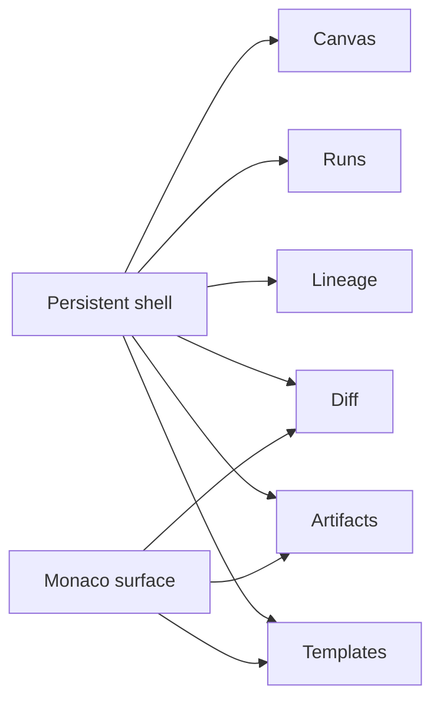
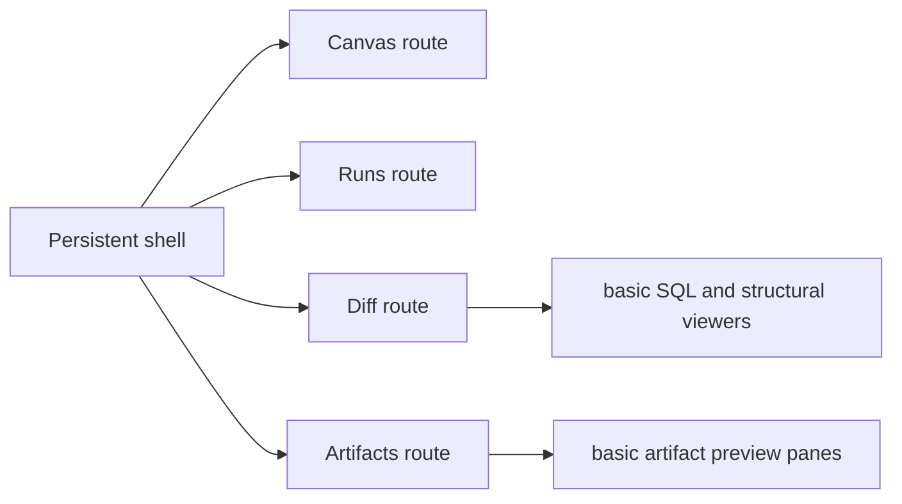
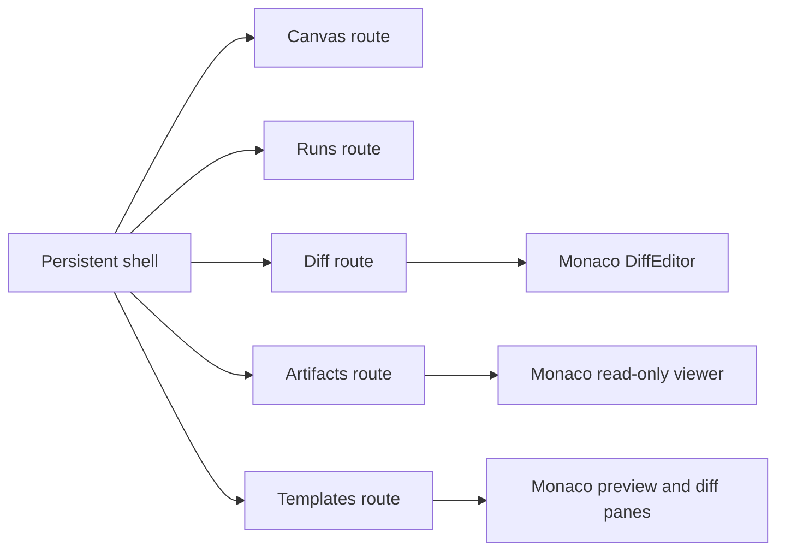

# Monaco Embedded Review Surfaces Rationale And Tradeoffs

## Summary

This proposal replaces the earlier Monaco narrative that treated Canvas as the
center of a new tabbed IDE-like workspace.

The product decision is now explicit:

- DVT converges on a persistent shell with route-level workbenches;
- Monaco is an embedded editor and diff primitive inside review and generation
  routes;
- Monaco is not the base of the product shell;
- Monaco is not the center of Canvas.

The first-class Monaco routes are:

- `Diff`
- `Artifacts`
- `Templates` (future execution-template and source-generation workbench)

Monaco v1 is intentionally narrow:

- read-only viewer
- diff viewer
- syntax-aware review surface

## Product Topology To Preserve

The shell, routing model, and route-level workbench grammar remain primary.
Monaco is a specialized surface used where text review, structured payload
inspection, and generated-source diff justify it.

## Current Problem

The earlier Monaco proposal solved the wrong problem.

It assumed that because DVT wants a serious operator shell, the next move was
to turn Canvas into a Monaco-centered multi-tab workbench.

That coupling is not justified by the product topology:

- Canvas is an authoring and topology workspace centered on graph interaction;
- Runs is an operational monitoring workspace;
- Diff is a review workspace;
- Artifacts is an inspection workspace;
- Templates is the future generation workspace.

Those are distinct route-level workbenches. They do not need a single
Monaco-led super-surface to become coherent.

## Decision Model

| Model | Description                                                                                                  | Decision         | Rationale                                                                                                                                                                              |
| ----- | ------------------------------------------------------------------------------------------------------------ | ---------------- | -------------------------------------------------------------------------------------------------------------------------------------------------------------------------------------- |
| A     | Turn Canvas into a Monaco-based workbench bundle                                                             | Rejected         | It makes Monaco the center of the route that is supposed to stay graph-first, adds layout and tab-state complexity too early, and couples editor adoption to unrelated shell concerns. |
| B     | Adopt a full IDE platform such as Theia or OpenSumi                                                          | Rejected for now | It would impose a heavier application architecture than DVT currently needs and would interfere with `F-04`, `F-05`, and `F-06` while those boundaries are still stabilizing.          |
| C     | Keep the persistent shell and add Monaco as embedded review surfaces in `Diff`, `Artifacts`, and `Templates` | Chosen           | It matches the product topology, unlocks high-value review capabilities first, and keeps Monaco behind route-level boundaries.                                                         |
| D     | Add a dockable inner workbench later via a layout engine such as Dockview                                    | Deferred option  | Useful only if route-level composition later proves insufficient. It is a separate layout decision, not a prerequisite for Monaco adoption.                                            |

## Architecture: Before vs Target

### Before

### Target

## Route Positioning

### Canvas

Canvas remains:

- graph-first;
- toolbar-driven;
- overlay-aware;
- non-Monaco-centric.

Canvas may later link to source review or generated output, but Monaco does not
become the owning surface of the route.

### Runs

Runs remains:

- list and detail operational workspace;
- event, metric, and artifact context owner;
- non-Monaco-centric unless a future detail pane explicitly justifies it.

### Diff

Diff is the first low-risk Monaco route.

Monaco should provide:

- SQL diff rendering;
- structured text comparison;
- syntax-aware review posture;
- read-only review semantics.

### Artifacts

Artifacts is the second low-risk Monaco route.

Monaco should provide:

- read-only JSON viewing;
- large-payload inspection;
- stable formatting and search for manifest, catalog, and run-result payloads.

### Templates

Templates is the strategic Monaco route.

Monaco should provide:

- generated-source preview;
- before/after diff;
- provider-facing review for task DDL, procedures, and ETL scaffolds.

The route still depends on governed backend template semantics. Monaco is only
the preview and diff surface.

## Tradeoff Analysis

| Decision                | Option A                  | Option B                                                  | Chosen                    | Rationale                                                                                            |
| ----------------------- | ------------------------- | --------------------------------------------------------- | ------------------------- | ---------------------------------------------------------------------------------------------------- |
| Monaco scope            | Canvas takeover           | Embedded route surfaces                                   | Embedded route surfaces   | Preserves route-level workbench ownership and uses Monaco only where text-heavy review justifies it. |
| Delivery order          | Start with Canvas         | Start with Diff and Artifacts                             | Diff and Artifacts first  | Lowest coupling, fastest operator value, and no need to redesign graph UX first.                     |
| Monaco capability level | Full editing from day one | Read-only and diff first                                  | Read-only and diff first  | DVT needs governed review before it needs browser-side authoring or save/apply flows.                |
| Product shell strategy  | Build new IDE shell       | Keep current shell and strengthen route-level workbenches | Keep current shell        | The shell already exists and is becoming cleaner through `F-04`, `F-05`, `F-06`, and `F-15`.         |
| OSS reuse               | Theia/OpenSumi            | Current stack plus Monaco                                 | Current stack plus Monaco | Lighter integration and less architectural collision.                                                |
| Future docking          | Ignore layout growth      | Evaluate Dockview later if needed                         | Evaluate later            | Keeps Monaco adoption separate from the later question of dockable inner layouts.                    |

## Execution Order

```mermaid
flowchart LR
  F04["F-04 data-boundary convergence"] --> F05["F-05 store split"]
  F05 --> F06["F-06 query standardization"]
  F06 --> F17B["F-17-B Monaco in Diff"]
  F17B --> F17C["F-17-C Monaco in Artifacts"]
  F17C --> F17D["F-17-D Monaco in Templates"]
  F17D --> F17E["F-17-E lazy loading and bundle isolation"]
  F17E --> F17F["F-17-F real backend data and contracts"]
  F17F --> F21["F-21 execution-template workbench hardening"]
```

The implementation order is intentional:

1. stabilize data and query boundaries through `F-04`, `F-05`, and `F-06`;
2. adopt Monaco in `Diff`;
3. adopt Monaco in `Artifacts`;
4. adopt Monaco in `Templates`;
5. enforce lazy loading and bundle guardrails;
6. converge Monaco panes on real backend contracts and artifact truth.

## What This Unlocks

1. Better SQL and structured payload review without redesigning the shell.
2. A reusable editor primitive for the future execution-template route.
3. Cleaner separation between graph work, operational monitoring, and source
   review.
4. A route-safe way to grow review complexity without turning the frontend into
   a general-purpose IDE.
5. A later path to docking or inner-layout tooling if DVT truly needs it.

## Risks And Mitigations

| Risk                                                               | Severity | Mitigation                                                                                                                 |
| ------------------------------------------------------------------ | -------- | -------------------------------------------------------------------------------------------------------------------------- |
| Monaco increases JS weight                                         | Medium   | `F-17-E` makes lazy loading and bundle isolation mandatory before the slice is considered production-ready.                |
| Teams reintroduce the "Canvas replacement" narrative in later docs | Medium   | `F-17-A` requires architecture, roadmap, and lane wording to stay aligned and explicitly reject Monaco-as-shell ownership. |
| Monaco lands before contracts and query boundaries stabilize       | Medium   | `F-17-B` and `F-17-C` depend on `F-06`, and `F-17-F` depends on `F-07` and `F-11`.                                         |
| Source-generation UX leaks provider semantics into the browser     | High     | Keep preview/diff in the frontend and keep generation contracts and translation logic in governed backend services.        |
| Route-level composition later needs docking                        | Low      | Revisit with a layout engine such as Dockview only after route-level workbenches prove insufficient.                       |

## Recommendation

Adopt Monaco as an embedded review and generation surface, not as a replacement
for the shell or for Canvas.

That means:

- rewrite `F-17` around `Diff`, `Artifacts`, and `Templates`;
- keep Canvas and Runs non-Monaco-centric;
- defer any docking-layout decision;
- let `F-21` depend on Monaco as preview and diff infrastructure, not as the
  product shell.
