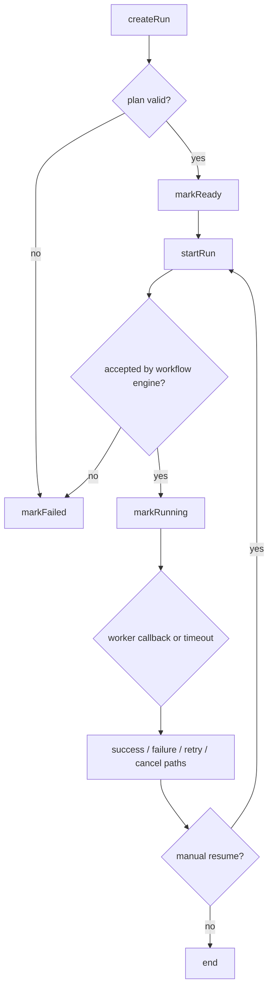
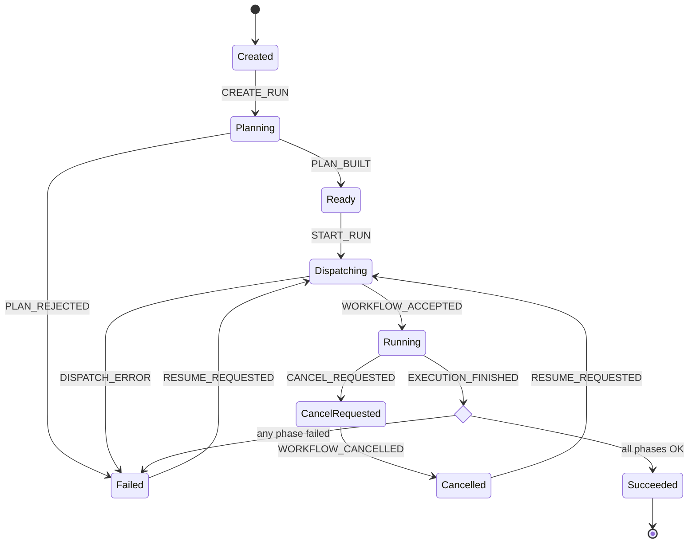
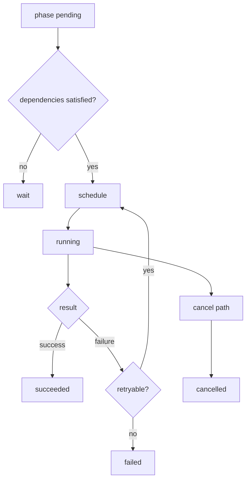
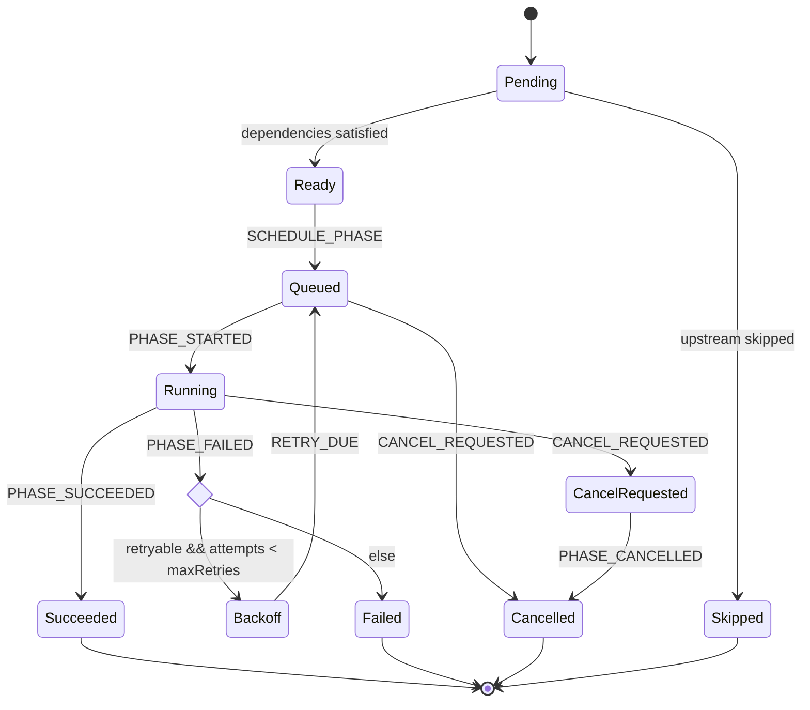
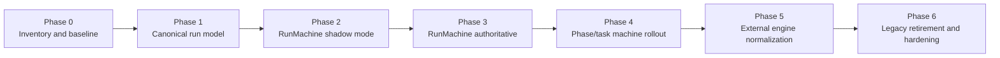

# DVT+ State Machine Adoption Proposal

## Executive summary

This proposal recommends an incremental introduction of **explicit state machines** into DVT+.

The immediate goal is **not** to rewrite the whole platform, but to move the lifecycle logic that already exists implicitly across `status` enums, flags, `switch` blocks, and worker callbacks into a small number of explicit, testable transition models.

The recommended end state is:

- `@dvt/engine` becomes a **dispatcher/orchestrator**.
- `@dvt/state-store` becomes the **authoritative persistence layer** for snapshots and transition history.
- `@dvt/run-machine` becomes the **single source of truth for run lifecycle transitions**.
- `@dvt/plan-interpreter` (or a dedicated `@dvt/phase-machine`) becomes the **single source of truth for phase/task lifecycle transitions**.
- `IWorkflowEngine` / `TemporalAdapter` become **execution adapters**, not owners of business state.

This approach gives DVT+ a safer model for `start`, `cancel`, `resume`, `retry`, `skip`, `fail`, and `succeed`, while preserving the current architecture and avoiding a big-bang rewrite.

---

## Scope and assumptions

This document is a **transition proposal**, not a full code audit. The "current state" below is inferred from the DVT+ architecture already discussed:

- `@dvt/planner` builds an `ExecutionPlan`.
- `@dvt/engine` orchestrates runs and coordinates external execution.
- `@dvt/state-store` persists run state.
- `@dvt/plan-interpreter` resolves and executes phase/task flow.
- `IWorkflowEngine` / `TemporalAdapter` bridge DVT+ with the external workflow runtime.
- workers/activities emit callbacks or completion/failure signals back into the engine.

The proposal assumes the current codebase already contains lifecycle rules distributed across:

- `RunState`, `PhaseState`, or similar status enums
- derived flags such as `isTerminal`, `canResume`, `canRetry`, `isRunning`
- orchestration logic in `@dvt/engine`
- retry/resume/cancel decisions in the interpreter and external engine callbacks

---

## Why this change

DVT+ already behaves like a stateful orchestration system. The issue is that the lifecycle is likely **implicit and distributed**, which creates the usual problems:

- transition rules are hard to locate and reason about
- invalid transitions are prevented inconsistently
- retry/resume logic gets duplicated
- tracing a run requires reconstructing decisions from several modules
- engine-specific behavior risks leaking into business lifecycle rules

An explicit state machine addresses those issues by making three things first-class:

1. **States** — what the run or phase currently is
2. **Events** — what happened
3. **Transitions** — what is allowed next, with guards and emitted commands

References:

- Martin Fowler — State Machine: https://martinfowler.com/dslCatalog/stateMachine.html
- Stately / XState — state machines and statecharts: https://stately.ai/docs/state-machines-and-statecharts
- Mermaid syntax reference: https://mermaid.js.org/intro/syntax-reference.html
- Temporal workflows: https://docs.temporal.io/workflows
- Temporal messages (signals / queries / updates): https://docs.temporal.io/sending-messages
- Temporal retry policies: https://docs.temporal.io/encyclopedia/retry-policies

---

## Current state vs target state

| Dimension            | Current state (as-is)                                                                      | Target state (to-be)                                            |
| -------------------- | ------------------------------------------------------------------------------------------ | --------------------------------------------------------------- |
| Run lifecycle        | Distributed across engine methods, status updates, worker callbacks, and conditional logic | Centralized in `@dvt/run-machine` as explicit states and events |
| Phase/task lifecycle | Mixed between `@dvt/plan-interpreter`, retries, dependency checks, and callback handling   | Centralized in explicit phase/task transition logic             |
| State authority      | Persistence and orchestration may both influence lifecycle                                 | State machine decides; store persists; engine executes commands |
| External engine role | Adapter may indirectly shape lifecycle semantics                                           | Adapter only translates external signals into domain events     |
| Observability        | Transitions reconstructed indirectly from logs/status changes                              | Every state transition is explicit, auditable, and testable     |
| Recovery             | `resume` and `retry` logic likely repeated across code paths                               | Recovery rules become part of the machine model                 |
| Change safety        | Behavior changes require touching several modules                                          | Most lifecycle change is localized to the machine definition    |

---

## Architecture before and after

### Before — current inferred architecture

```mermaid
flowchart LR
    API[API / CLI / Scheduler]
    Planner[@dvt/planner<br/>ExecutionPlan]
    Engine[@dvt/engine<br/>orchestration + lifecycle decisions]
    Store[@dvt/state-store<br/>status snapshot]
    Interpreter[@dvt/plan-interpreter<br/>phase execution + local retry logic]
    Adapter[IWorkflowEngine / TemporalAdapter]
    Workers[Workers / Activities]
    Trace[@dvt/traceability-service]

    API -->|start / cancel / resume| Engine
    Planner -->|plan| Engine
    Engine -->|read / write status| Store
    Engine -->|phase control| Interpreter
    Engine -->|dispatch external work| Adapter
    Adapter --> Workers
    Workers -->|callbacks / completion / failure| Engine
    Store --> Trace
```

### After — target architecture

```mermaid
flowchart LR
    API[API / CLI / Scheduler]
    Planner[@dvt/planner<br/>ExecutionPlan]
    Engine[@dvt/engine<br/>dispatcher + command executor]
    RunMachine[@dvt/run-machine<br/>explicit run transitions]
    PhaseMachine[@dvt/phase-machine or @dvt/plan-interpreter<br/>explicit phase transitions]
    Store[@dvt/state-store<br/>snapshot + transition log]
    Adapter[IWorkflowEngine / TemporalAdapter<br/>signal translation only]
    Workers[Workers / Activities]
    Trace[@dvt/traceability-service]

    API -->|domain events| Engine
    Planner -->|ExecutionPlan| Engine
    Engine -->|load / save| Store
    Engine -->|apply event| RunMachine
    RunMachine -->|next state + commands| Engine
    Engine -->|phase events| PhaseMachine
    PhaseMachine -->|next state + commands| Engine
    Engine -->|dispatch external work| Adapter
    Adapter --> Workers
    Workers -->|domain events| Engine
    Store --> Trace
```

---

## Lifecycle before and after

### Before — run lifecycle is implicit



The problem here is not the diagram itself; it is that this behavior is usually split across several modules and code paths.

### After — explicit run lifecycle state machine



### Before — phase lifecycle is inferred from local rules



### After — explicit phase state machine



---

## Proposed phased execution plan

The transition should be incremental and execution-safe.

### Phase 0 — baseline and inventory

**Objective**

Create a reliable map of the lifecycle logic that already exists.

**What we have now**

- state transitions likely exist in multiple modules
- some states are explicit (`status` enums), some are derived (`canResume`, `isTerminal`)
- side effects and transition decisions may be mixed

**What this phase delivers**

- inventory of all run and phase statuses
- inventory of all transition entry points (`start`, `cancel`, `resume`, `retry`, callback handlers)
- catalog of guards and invariants
- list of terminal vs resumable vs retryable situations
- mismatch report between desired lifecycle and actual code paths

**What we will have at the end of the phase**

- a shared canonical vocabulary for `State`, `Event`, `Guard`, `Command`, `Terminal`, `Resumable`
- explicit ownership boundaries for engine, store, interpreter, and adapter

**Exit criteria**

- all lifecycle entry points identified
- all current statuses mapped to business meaning
- no unknown status mutation paths remain

---

### Phase 1 — canonical run lifecycle model

**Objective**

Define the run lifecycle as an explicit model before changing runtime behavior.

**What we have now**

- `RunState` exists implicitly or partially explicitly
- transitions are implemented procedurally

**What this phase delivers**

- canonical run state model
- canonical run event model
- transition table or machine reducer
- explicit guards for invalid transitions
- emitted commands for side effects

**What we will have at the end of the phase**

A pure decision component with a shape similar to:

```ts
type RunDecision = {
  nextState: RunState;
  nextContext: RunContext;
  commands: Command[];
  domainEvents: DomainEvent[];
};

transition(snapshot: RunSnapshot, event: RunEvent): RunDecision
```

**Exit criteria**

- machine covers all known run events
- unit tests cover valid and invalid transitions
- current production behavior can be expressed by the model

---

### Phase 2 — `RunMachine` in shadow mode

**Objective**

Run the new machine alongside the current implementation without changing production behavior.

**What we have now**

- legacy code still performs the real state update
- there is no central transition authority yet

**What this phase delivers**

- `@dvt/run-machine`
- adapter layer that mirrors each incoming run event into the machine
- diff logging between legacy outcome and machine outcome
- telemetry for transition mismatches

**What we will have at the end of the phase**

- the machine evaluates every important lifecycle event
- production behavior is still controlled by the current implementation
- mismatches are visible before rollout risk is introduced

**Exit criteria**

- zero critical mismatches for an agreed validation window
- all non-critical mismatches explained and resolved or accepted

---

### Phase 3 — `RunMachine` becomes authoritative

**Objective**

Make the run state machine the only component allowed to decide run lifecycle transitions.

**What we have now**

- shadow mode proves the machine is behaviorally compatible
- legacy state mutation paths still exist

**What this phase delivers**

- engine loads current snapshot from `@dvt/state-store`
- engine applies domain event to `@dvt/run-machine`
- engine persists resulting snapshot and transition log
- engine executes emitted commands after persistence
- optimistic version checks in the store to guard against concurrent updates

**What we will have at the end of the phase**

- run lifecycle decisions are centralized
- direct status mutation is no longer allowed outside the machine path
- traces can show state, event, command, and persisted outcome per transition

**Exit criteria**

- all run state writes flow through the machine
- concurrency collisions are handled deterministically
- resume/cancel/fail paths are stable in production

---

### Phase 4 — phase/task state machine rollout

**Objective**

Apply the same model to phase/task execution where the operational complexity is highest.

**What we have now**

- retry, dependency readiness, skip logic, and cancellation are likely spread across interpreter code paths

**What this phase delivers**

- explicit `PhaseState` and `PhaseEvent` model
- dependency readiness guards
- retry/backoff semantics as part of the transition model
- skip/cancel semantics modeled explicitly
- deterministic terminal states for each phase/task

**What we will have at the end of the phase**

- `@dvt/plan-interpreter` becomes simpler and more predictable
- retry behavior is no longer buried inside procedural branches
- operational behavior for partial failure is explicit

**Exit criteria**

- phase retries follow one model only
- `skip`, `cancel`, and `dependency satisfied` transitions are test-covered
- interpreter complexity and duplicate logic are visibly reduced

---

### Phase 5 — external engine normalization

**Objective**

Constrain the workflow runtime integration to message translation and execution concerns.

**What we have now**

- adapter/runtime events may influence lifecycle semantics directly
- external engine concepts can leak into domain logic

**What this phase delivers**

- external callbacks/signals mapped to domain events only
- no business transition logic inside `TemporalAdapter` or equivalent
- command/outbox semantics for external dispatch where needed
- explicit mapping for `accepted`, `started`, `heartbeat`, `completed`, `failed`, `cancelled`, `timeout`

**What we will have at the end of the phase**

- DVT+ owns business state
- the workflow engine owns execution mechanics only
- adapter replacement becomes materially easier

**Exit criteria**

- adapter contains no domain-state branching beyond event translation
- switching runtime implementation would not require changing business lifecycle rules

---

### Phase 6 — legacy retirement and hardening

**Objective**

Remove duplicated state logic and harden the operational model.

**What we have now**

- some old branches, booleans, and direct status updates are still present for compatibility

**What this phase delivers**

- removal of dead `switch(status)` branches
- removal of redundant derived flags where they duplicate machine semantics
- standardized transition audit events
- developer documentation and onboarding examples
- operational dashboards for invalid transition attempts, retries, resumes, and terminal outcomes

**What we will have at the end of the phase**

- one transition model per lifecycle boundary
- reduced accidental complexity
- easier maintenance, testing, and supportability

**Exit criteria**

- legacy status mutation paths removed
- transition documentation matches production behavior
- on-call/debugging workflow improves measurably

---

## Rollout roadmap



---

## Recommended target ownership model

| Module                                         | Recommended responsibility                                         |
| ---------------------------------------------- | ------------------------------------------------------------------ |
| `@dvt/planner`                                 | Pure plan generation and validation                                |
| `@dvt/engine`                                  | Load snapshot, apply event, persist result, execute commands       |
| `@dvt/state-store`                             | Authoritative snapshot persistence, versioning, transition history |
| `@dvt/run-machine`                             | Run lifecycle transitions and guards                               |
| `@dvt/plan-interpreter` / `@dvt/phase-machine` | Phase/task lifecycle transitions, dependency handling, retry model |
| `IWorkflowEngine` / `TemporalAdapter`          | External runtime translation and dispatch only                     |
| workers/activities                             | Execute work and emit execution events                             |
| `@dvt/traceability-service`                    | Read model / observability over transition history                 |

---

## Trade-offs

| Decision               | Option A                   | Option B                                 | Recommendation                                                                                   | Rationale                                                                                                                         |
| ---------------------- | -------------------------- | ---------------------------------------- | ------------------------------------------------------------------------------------------------ | --------------------------------------------------------------------------------------------------------------------------------- |
| Machine implementation | Small custom reducer/DSL   | XState                                   | Start with a small internal reducer unless visualization/runtime features are needed immediately | A custom reducer keeps the first rollout simpler; XState is a strong second step if hierarchy, actors, or tooling become valuable |
| Lifecycle ownership    | Domain state owned by DVT+ | Business state delegated to Temporal     | Keep business lifecycle in DVT+                                                                  | Preserves engine-agnostic architecture and avoids coupling domain semantics to one runtime                                        |
| Granularity            | One global machine         | Separate run and phase machines          | Separate machines                                                                                | Smaller bounded machines are easier to reason about, test, and evolve                                                             |
| Persistence            | Snapshot only              | Snapshot + transition log                | Snapshot + transition log                                                                        | Snapshot is efficient; transition log improves auditability, debugging, and replay analysis                                       |
| Migration style        | Big-bang rewrite           | Shadow mode + gradual authority transfer | Shadow mode                                                                                      | Lowest operational risk and best fit for a production orchestration platform                                                      |
| Derived flags          | Keep many booleans         | Derive from machine semantics            | Reduce booleans over time                                                                        | Avoids semantic drift between `status` and helper flags                                                                           |

### Notes on the implementation choice

A lightweight internal reducer is usually enough to start:

- minimal runtime dependency
- easy to unit test
- direct control over serialization and persistence contracts

XState becomes attractive if DVT+ later needs:

- hierarchical states
- parallel states
- actor-style decomposition
- visual modeling as part of the team workflow

Reference:

- XState docs: https://stately.ai/docs/xstate

---

## Rationale for the proposed order

The recommended order is deliberate.

### 1. Start with `RunMachine`, not with the planner

The planner is closer to deterministic computation. The biggest state-management pain is usually in orchestration, recovery, and external execution.

### 2. Put the first machine around the smallest high-value boundary

The run lifecycle has the clearest high-value transitions:

- `create`
- `plan built` / `plan rejected`
- `start`
- `accepted`
- `running`
- `cancel requested`
- `cancelled`
- `failed`
- `succeeded`
- `resume`

That makes it the best first machine.

### 3. Delay phase/task rollout until the run machine is stable

Phase/task lifecycle is usually more operationally complex: dependencies, retries, skipped branches, backoff, partial completion. It benefits from the same pattern, but only after the core engine-store-machine flow is proven.

### 4. Keep the adapter thin

External runtimes such as Temporal are excellent at execution durability, retries, timers, and signaling, but that does not mean they should define the business lifecycle of DVT+.

References:

- Temporal workflows: https://docs.temporal.io/workflows
- Temporal messages: https://docs.temporal.io/handling-messages

---

## Expected benefits

### Engineering benefits

- explicit and testable transition logic
- lower accidental complexity in `@dvt/engine`
- reduced duplication of retry/resume/cancel logic
- easier onboarding because lifecycle rules are visible in one place

### Operational benefits

- clearer audit trail of what happened and why
- simpler incident analysis for failed/cancelled/resumed runs
- easier detection of invalid transition attempts
- better observability around recovery behavior

### Architectural benefits

- stronger separation between domain lifecycle and workflow runtime
- easier future replacement or coexistence of workflow backends
- better foundation for traceability and replay-oriented tooling

---

## Risks and mitigations

| Risk                                                     | Impact                                           | Mitigation                                                              |
| -------------------------------------------------------- | ------------------------------------------------ | ----------------------------------------------------------------------- |
| The current lifecycle has hidden edge cases              | Missing states or transitions in the first model | Use Phase 0 inventory plus shadow mode before authority transfer        |
| Concurrency races during callbacks and manual operations | Inconsistent snapshots or out-of-order updates   | Add optimistic versioning and explicit event ordering rules             |
| Over-modeling too early                                  | Excessive complexity and slow adoption           | Start with run lifecycle only; keep the first model intentionally small |
| Too much abstraction around the adapter                  | Debugging complexity                             | Keep event mapping explicit and observable                              |
| Teams keep writing direct status mutations               | Architectural drift                              | Enforce machine-only writes through APIs and code review guardrails     |

---

## Success criteria

The migration should be considered successful when the following are true:

1. Run transitions are decided only by the run machine.
2. Phase transitions are decided only by the phase machine/interpreter model.
3. Direct status mutations outside machine entry points are removed.
4. Invalid transitions are observable and test-covered.
5. Resume/retry/cancel behavior is deterministic and documented.
6. Traceability can reconstruct each transition from event to persisted result.

Suggested operational metrics:

- invalid transition attempts per week
- shadow-mode mismatches
- successful resume rate
- successful retry rate
- mean time to identify root cause for failed runs
- percentage of lifecycle test coverage by transition type

---

## Final recommendation

Adopt the state machine pattern in DVT+ **first at the run lifecycle boundary**, then extend it to **phase/task lifecycle**, while keeping the external workflow engine as an execution adapter rather than as the owner of domain state.

The preferred migration strategy is:

1. inventory current lifecycle logic
2. model the canonical run machine
3. deploy it in shadow mode
4. make it authoritative
5. extend the pattern to phases/tasks
6. retire legacy status branching

This path gives DVT+ a controlled transition from **implicit state handling** to **explicit orchestration semantics** with low rollout risk and high long-term maintainability.
