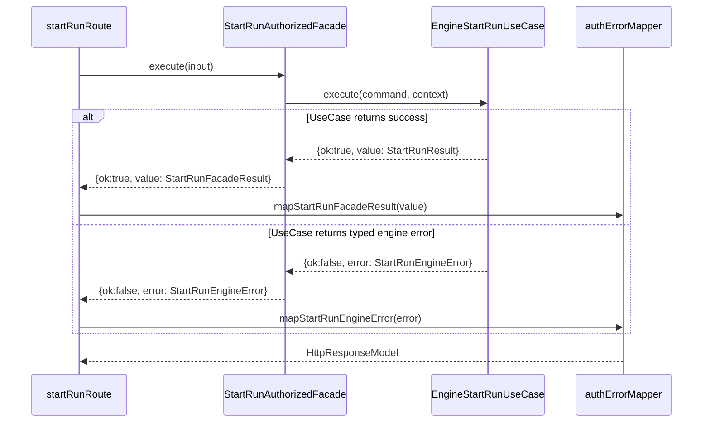
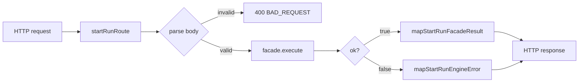

# RC-E3 Execution And Task Tracking Plan

## Task

Close `RC-E3` from lane A by replacing throw-propagation handling in
`StartRunAuthorizedFacade` with an explicit `Result<T, EngineError>` flow and
removing facade-local catch mapping drift.

References:

- `docs/planning/state/agent-lane-a.yaml`
- `docs/planning/state/planning-control-tower.md`
- `apps/api/src/application/services/startRunAuthorizedFacade.ts`

## Rationale

Current behavior keeps two independent change drivers in one place:

1. auth/authz orchestration in the facade
2. engine error translation details in the same facade

That structure increases divergent-change pressure because each new engine error
shape tends to require edits in multiple layers. `RC-E3` narrows responsibility
by returning explicit result objects from the facade path and making HTTP
mapping decisions at the entrypoint mapper boundary.

## Scope

In scope:

- `apps/api` start-run facade contract and implementation
- HTTP mapping path for facade/engine error outputs
- start-run facade and route test updates

Out of scope:

- non-start-run endpoints
- provider behavior changes
- lane task state transitions (unless explicitly requested)

## Execution Plan

1. In `startRunFacadeContract.ts`: remove `adapterNotConfigured` from
   `StartRunFacadeResult` union — that kind is only reachable via
   `mapEngineErrorToFacade()` which is deleted in step 3.
2. In `startRunFacadeContract.ts`: export `StartRunFacadeExecutionResult` as
   `Result<StartRunFacadeResult, StartRunEngineError>` — the new return type of
   `execute()`.
3. In `startRunAuthorizedFacade.ts`: update `execute()` return type to
   `Promise<StartRunFacadeExecutionResult>`, replace the final `return
mapEngineErrorToFacade(startRun.error)` with `return startRun` (pass the
   `{ok: false, error}` through), and delete the `mapEngineErrorToFacade` local
   function entirely.
4. In `authErrorMapper.ts`: add `mapStartRunEngineError(error:
StartRunEngineError): HttpResponseModel` covering all three engine error
   kinds: `adapterNotRegistered` → 422 `ADAPTER_NOT_CONFIGURED`,
   `commandInvalid` → 422 `PLAN_REJECTED`, `unsupportedPlanVersion` → 422
   `PLAN_REJECTED`.
5. In `startRunRoute.ts`: update `facade.execute()` call to handle
   `StartRunFacadeExecutionResult`; branch on `ok` — call
   `mapStartRunFacadeResult` on `ok: true`, `mapStartRunEngineError` on
   `ok: false`.
6. In `startRunAuthorizedFacade.test.ts`: rewrite the three engine-error test
   cases (`adapter_not_registered`, `unsupported_plan_version`,
   `command_invalid`) to assert `{ok: false, error: ...}` passthrough instead of
   the current facade-absorbed facade result kinds.
7. In `authErrorMapper.test.ts`: add test coverage for `mapStartRunEngineError`
   for all three engine error kinds.
8. In `startRunRoute.test.ts`: add test cases for `{ok: false, error:
StartRunEngineError}` facade result and verify correct HTTP outputs.
9. Run validation baseline including `pnpm verify:prepush`.

## Design Diagrams





## DoD Checklist (Verifiable)

- [ ] `StartRunFacadeExecutionResult` exported from `startRunFacadeContract.ts`
      as `Result<StartRunFacadeResult, StartRunEngineError>`.
- [ ] `adapterNotConfigured` kind removed from `StartRunFacadeResult` union.
- [ ] `StartRunAuthorizedFacade.execute()` return type is
      `Promise<StartRunFacadeExecutionResult>`.
- [ ] `mapEngineErrorToFacade` local function deleted from
      `startRunAuthorizedFacade.ts`.
- [ ] `mapStartRunEngineError(error: StartRunEngineError): HttpResponseModel`
      exists in `authErrorMapper.ts` and covers all three error kinds.
- [ ] `startRunRoute.ts` branches on `ok` before calling mapper.
- [ ] `startRunAuthorizedFacade.test.ts` engine-error cases assert
      `{ok: false, error}` passthrough (not facade-absorbed result kinds).
- [ ] `authErrorMapper.test.ts` has coverage for all three
      `mapStartRunEngineError` branches.
- [ ] `startRunRoute.test.ts` has coverage for `ok: false` facade result shape.
- [ ] `pnpm --filter dvt-api typecheck` passes.
- [ ] `pnpm --filter dvt-api test` passes.
- [ ] `pnpm --filter dvt-api test:arch` passes.
- [ ] `pnpm verify:prepush` passes.

## Validation Commands

```bash
pnpm --filter dvt-api typecheck
pnpm --filter dvt-api test
pnpm --filter dvt-api test:arch
pnpm verify:prepush
```

## Tracking Log

| Date       | Owner  | Status      | Notes                                                                                                                              |
| ---------- | ------ | ----------- | ---------------------------------------------------------------------------------------------------------------------------------- |
| 2026-03-28 | Lane A | Planned     | Initial execution + tracking plan created.                                                                                         |
| 2026-03-28 | Lane A | Implemented | Contract + facade + route + mapper refactor completed with `typecheck`, `test`, `test:arch`, `lint`, and `verify:prepush` passing. |
| 2026-03-28 | Lane A | Closed      | Lane-A state synced to `done`, workboard regenerated, and RC-E3 integrated in mainline via PR #639.                                |

## Risks And Coordination

- `RC-E3` is marked as breaking-interface follow-up and requires coordination
  with lane C per `agent-lane-a.yaml` dependency notes.
- Risk of response drift is mitigated by route-level tests and mapper tests.
- Risk of hidden catch-all behavior is mitigated by explicit result branching.
- `mapRuntimeDomainError` in `authErrorMapper.ts` handles `intentActiveConflict`
  as a throw-based path, but this is only used by non-start-run routes and is
  already handled in `engineStartRunUseCase.ts` as a typed `duplicate` result —
  no change needed here; out of scope for RC-E3.
- `adapterNotConfigured` removal from `StartRunFacadeResult` is a breaking
  contract change; verify no other consumer outside `startRunRoute.ts` reads
  that kind before deleting.
