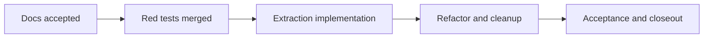

# Canvas Controller Document First Hard Gate

## Why this slice exists

`useCanvasController` is currently the busiest route-level hook in the canvas
stack. It mixes graph query ownership, canonical mapping, overlay policy,
layout persistence, selection wiring, and post-run navigation in one place.

The route still works, but the shape is too broad to refactor safely without a
hard gate that freezes truth before code movement starts.

## Exact drifts being closed

This slice exists to close these drifts:

- multi-responsibility controller with mixed server state, graph projection,
  UI coordination, and route side effects
- repeated node lookup during graph sync instead of stable identity-map use
- `console.debug` diagnostics in hot controller paths
- thin invariant coverage around pending, error, and persistence guards

## Why this belongs under F-05

This work belongs under `F-05`, not as an isolated refactor, because the real
problem is responsibility convergence between canvas interaction state, layout
state, run-related side effects, and the broad `appStore` surface.

The slice hardens controller and state-boundary ownership. It does not add a
new feature and it does not redefine query policy or runtime contracts.

## Hard-Gate Delivery Sequence

Implementation must follow this order and must not skip ahead:

1. documentation hard gate
2. TDD red phase
3. implementation green phase
4. refactor and cleanup phase
5. closeout and acceptance

## Phase Requirements

### 1. Documentation hard gate

Required before any code movement:

- technical source of truth in
  `docs/architecture/components/web/graph/canvas-controller-current-to-target-architecture.md`
- user-facing Canvas hardening expectations in
  `docs/architecture/components/web/screen-manuals-and-user-stories.md`
- Lane E tracking linked to `F-05`

Acceptance for this phase:

- current truth and target decomposition are explicit
- non-goals are explicit
- future implementer does not need to invent the seam model

### 2. TDD red phase

Before implementation, add failing tests that freeze the intended invariants.

Red tests must cover:

- pending graph query does not persist node positions
- pending graph query does not persist viewport updates
- query error preserves route shell and returns safe canvas state
- node sync preserves persisted positions deterministically
- overlay mode falls back from `cost` to `runtime` when no cost data exists
- navigation after run start remains isolated to route-side effects
- controller composition tests cover invariants, not only happy-path wiring

Acceptance for this phase:

- tests fail for the intended reasons before code extraction starts
- no test depends on private implementation details that the extraction is
  supposed to change

### 3. Implementation green phase

Extract and wire these seams:

- `useCanvasGraphModel`
  owns graph query consumption, canonical mapping, and graph identity maps
- `useCanvasOverlayModel`
  owns overlay mode, runtime or cost decoration projection, and fallback rules
- `useCanvasLayoutPersistence`
  owns viewport equality checks, node-position persistence, and readiness
  guards
- `useCanvasNavigationActions`
  owns route transitions such as post-run navigation
- `useCanvasController`
  becomes a composition facade over the extracted seams plus existing
  `useCanvasGraphHandlers` and `useCanvasExecutionActions`

Acceptance for this phase:

- controller surface remains route-compatible
- extracted hooks have single declared responsibilities
- green tests prove the same user workflow still works

### 4. Refactor and cleanup phase

After green:

- remove hot-path `console.debug`
- replace repeated node-array lookup with identity-map based sync
- remove duplicated derivation that extraction made unnecessary
- align naming and module boundaries with the technical document

Acceptance for this phase:

- no residual debug logging in controller hot paths
- sync path is identity-map oriented instead of repeated search oriented
- code reads like composition, not like one large controller again

### 5. Closeout and acceptance

Closeout must confirm:

- docs still match the implemented code
- Lane E task state is updated with evidence
- no new mock-only or route-contract drift was introduced

## Validation Baseline For The Future Implementation

The future implementation slice must validate with:

- relevant `apps/web` tests for the canvas route and extracted seams
- `apps/web` typecheck and build
- `pnpm verify:prepush`

If new docs or lane state change during that future implementation, it must also
run:

- `pnpm docs:sync`
- `pnpm docs:workboard:generate`

## Naming And Ownership Freeze

These names are frozen for the next implementer unless a follow-up document
changes them first:

- `useCanvasGraphModel`
- `useCanvasOverlayModel`
- `useCanvasLayoutPersistence`
- `useCanvasNavigationActions`
- `useCanvasController`

Ownership is frozen as follows:

- graph data acquisition and canonical identity belong to
  `useCanvasGraphModel`
- overlay policy belongs to `useCanvasOverlayModel`
- persistence guards and save callbacks belong to
  `useCanvasLayoutPersistence`
- route navigation belongs to `useCanvasNavigationActions`
- graph interaction commands remain in `useCanvasGraphHandlers`
- plan or run execution remains in `useCanvasExecutionActions`

## Scope Boundaries

This slice does not do any of the following:

- full `appStore` decomposition
- full TanStack Query policy normalization
- runtime route contract cleanup
- new canvas UX or new canvas features
- shell console or live-log convergence

## Canonical Position

The active canonical docs for this slice are:

- `docs/architecture/components/web/graph/canvas-controller-current-to-target-architecture.md`
- `docs/architecture/components/web/screen-manuals-and-user-stories.md`

The draft note under
`docs/architecture/components/web/views/workflow/workflow-graph-workbench-surfaces-and-operating-modes.md`
remains non-canonical for this remediation and must not be used as the source
of implementation requirements.
