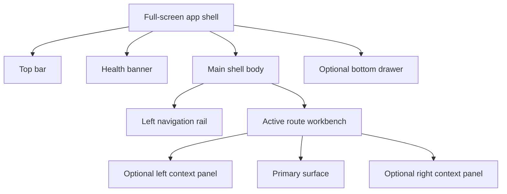
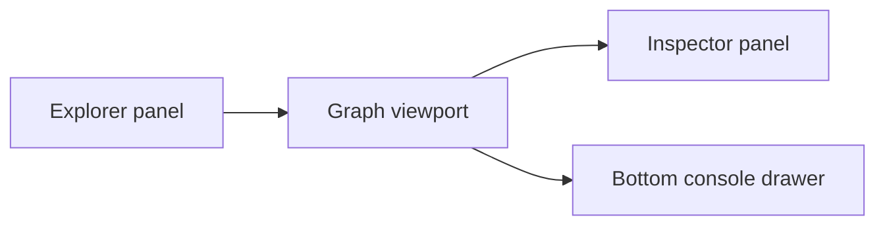
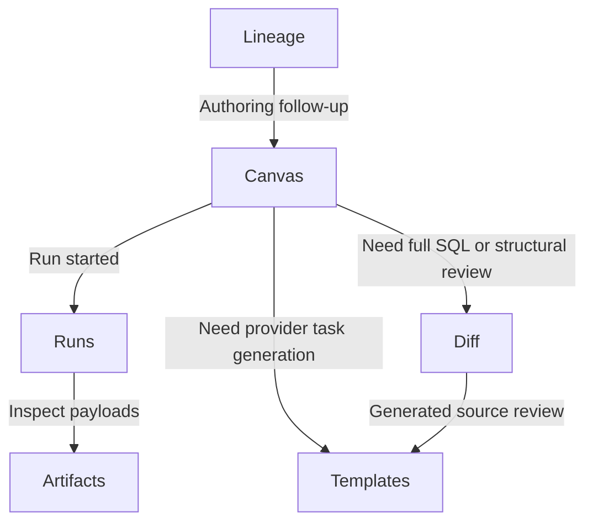
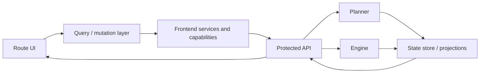
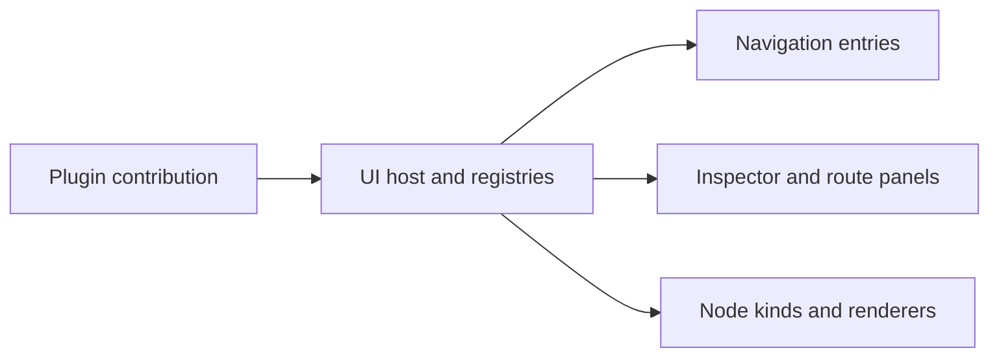

# DVT UI workbench architecture proposal 2026-04-04

## Summary

This proposal consolidates the intended UI architecture of DVT into one
planning artifact.

Its purpose is to make the product direction easy to review without replacing
the canonical frontend architecture set.

Canonical truth for shipped behavior remains in:

- [Frontend Architecture](../../../../architecture/frontend/index.md)
- [Main Workspace Views And UX](../../../../architecture/frontend/main-workspace-views-and-ux.md)
- [Workbench UI Contract And Component Inventory](../../../../architecture/frontend/workbench-ui-contract-and-component-inventory.md)
- [Screen Layout And Cross-Surface Behavior Rules](../../../../architecture/frontend/screen-layout-and-cross-surface-behavior-rules.md)
- [UX Implementation Guide](../../../../architecture/frontend/ux-implementation-guide.md)

## Governing Sources

- [Reference Architecture](../../../../architecture/reference-architecture.md)
- [System Delivery Status](../../../../architecture/system-delivery-status.md)
- [Frontend Architecture](../../../../architecture/frontend/index.md)
- [Main Workspace Views And UX](../../../../architecture/frontend/main-workspace-views-and-ux.md)
- [Workbench UI Contract And Component Inventory](../../../../architecture/frontend/workbench-ui-contract-and-component-inventory.md)
- [Screen Layout And Cross-Surface Behavior Rules](../../../../architecture/frontend/screen-layout-and-cross-surface-behavior-rules.md)
- [Frontend Roadmap - Prototype To Operational UI](frontend-roadmap-20260219.md)

## Proposal Position

This is a planning synthesis document.

It is not the canonical implementation spec for frontend behavior.

Use it to:

- review the UI direction as one proposal;
- check whether shell, navigation, screens, and runtime boundaries are
  coherent;
- align future UI slices before implementation expands.

Do not use it to override route-level frontend docs that already describe the
current product.

## Core Principles

1. The frontend is not an execution authority.
2. The UI submits intent through governed API boundaries and renders resulting
   state.
3. The planner owns plan derivation, not shell state or UI layout.
4. The engine executes and emits state transitions; the UI observes those
   results.
5. The product is a persistent operator workbench, not a collection of
   unrelated dashboards.

## Shell Proposal

The shell should be full-screen, persistent, and route-first.

Shell rules:

- the top bar owns global context only;
- the left rail owns primary route navigation;
- the center owns one active workbench route at a time;
- the bottom drawer is supporting context, not a second navigation model;
- side panels are contextual and resizable, not fixed floating windows.

## Navigation Model

Primary navigation should be:

1. left rail for route switching;
2. top bar for tenant, project, environment, health, and session context;
3. route toolbar for local commands;
4. local tabs only inside a route when they segment one job.

Explicit non-goal:

- no global workbench tabs for `Canvas`, `Runs`, `Diff`, `Lineage`, or
  `Artifacts`.

Tabs are allowed only within a route, for example:

- `Runs`: `Timeline`, `Steps`, `Events`, `Metrics`, `Artifacts`;
- `Diff`: `Graph Diff`, `SQL Diff`, `Catalog Diff`;
- `Inspector`: plugin-contributed panels.

## Main Route Inventory

The proposed primary workbench routes are:

1. `Canvas`
2. `Runs`
3. `Lineage`
4. `Diff`
5. `Artifacts`
6. `Templates`
7. `Plugins`
8. `Admin`

Route intent:

| Route       | Primary job                                     |
| ----------- | ----------------------------------------------- |
| `Canvas`    | graph authoring and graph-context actions       |
| `Runs`      | execution operations and run evidence           |
| `Lineage`   | dependency and impact analysis                  |
| `Diff`      | Git-aware and SQL-aware review                  |
| `Artifacts` | immutable artifact browsing                     |
| `Templates` | governed source generation and task scaffolding |
| `Plugins`   | plugin inspection and capability visibility     |
| `Admin`     | administrative configuration surfaces           |

Not proposed as primary routes today:

- `Overview`
- `Projects`
- `Observability`

Those concerns belong in global shell context, route-local summaries, or the
existing `Runs` and shell health surfaces unless a stronger product case is
accepted later.

## Canvas Proposal

Canvas remains graph-first.

Rules:

- explorer is a source browser, not main navigation;
- inspector is selection-driven;
- graph-local commands live in the route toolbar;
- SQL may appear only as contextual read-only support;
- full SQL review or generated-source diff moves to `Diff` or `Templates`.

## Cross-Screen Handoffs

Handoff rule:

- each route owns its primary job and passes context explicitly to another
  route instead of absorbing that job into itself.

## Runtime Interaction Model

The UI runtime should stay boundary-first.

Rules:

- route components do not call `fetch` directly;
- server state belongs in TanStack Query and service boundaries;
- shell state and route-local UI state should not stay mixed in one global
  store forever;
- the UI reads projections and results; it does not model backend execution
  ownership locally.

## Git, Artifacts, And Templates

### Git posture

`Diff` is the governed review surface.

Proposal:

- expose Git-aware compare context in shell and `Diff`;
- support graph diff, SQL diff, and catalog diff;
- do not build a full browser Git client.

### Artifact posture

`Artifacts` is the immutable inspection surface.

Proposal:

- support manifest, run results, and catalog browsing;
- allow explicit local imports;
- keep artifact browsing read-only.

### Template posture

`Templates` is the future generation surface.

Proposal:

- start from workflow context, template catalog, and provider profile;
- use schema-driven parameter forms;
- preview and diff generated source before export or dispatch;
- keep provider-specific generation semantics behind governed backend
  contracts.

## Plugin Model

Frontend plugin integration should stay UI-scoped.

Rules:

- frontend plugins may contribute navigation, panels, node renderers, badges,
  and route surfaces;
- this proposal does not imply that browser plugins talk directly to planner or
  engine internals;
- backend extension points are separate contracts and should not be collapsed
  into the frontend plugin model.

## Observability Position

Observability is distributed by design.

Proposal:

- shell shows platform health and degraded state;
- `Runs` owns metrics, events, and execution evidence;
- `Canvas` may show lightweight contextual overlays only;
- no dedicated top-level `Observability` route is required in the current UI
  proposal.

## Rejected Patterns

This proposal rejects the following as the primary product direction:

1. fixed floating windows as the main interaction model;
2. global workspace tabs across all primary routes;
3. a full SQL editor permanently co-equal with the graph in `Canvas`;
4. a browser Git client as the main review model;
5. a generic top-level observability dashboard as a required first-class route
   today.

## Immediate Proposal Decisions

1. DVT should converge on a persistent workbench shell.
2. The main route should be `Canvas`.
3. Primary navigation should live in the left rail.
4. Global context should live in the top bar.
5. Route-local actions should live in route toolbars.
6. Global workbench tabs should not be the main navigation model.
7. `Diff` should own Git-aware and SQL-aware review.
8. `Templates` should own governed task and source generation.
9. `Runs` should own operational evidence and execution telemetry.

## Acceptance Criteria

This proposal is satisfied when:

1. route-level frontend docs all align with one workbench model;
2. no active frontend architecture doc describes global workbench tabs as the
   primary navigation model;
3. `Canvas`, `Runs`, `Diff`, `Artifacts`, and `Templates` have non-overlapping
   primary responsibilities;
4. shell, route, and plugin boundaries are described without contradicting the
   current frontend architecture set.

## Related Canonical Docs

- [Frontend Architecture](../../../../architecture/frontend/index.md)
- [App Shell](../../../../architecture/frontend/appshell/app-shell.md)
- [Main Workspace Views And UX](../../../../architecture/frontend/main-workspace-views-and-ux.md)
- [Workbench UI Contract And Component Inventory](../../../../architecture/frontend/workbench-ui-contract-and-component-inventory.md)
- [Screen Layout And Cross-Surface Behavior Rules](../../../../architecture/frontend/screen-layout-and-cross-surface-behavior-rules.md)
- [Iconography And Design Tokens Contract](../../../../architecture/frontend/iconography-and-design-tokens-contract.md)
