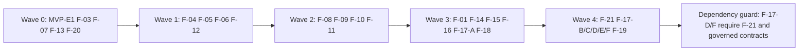
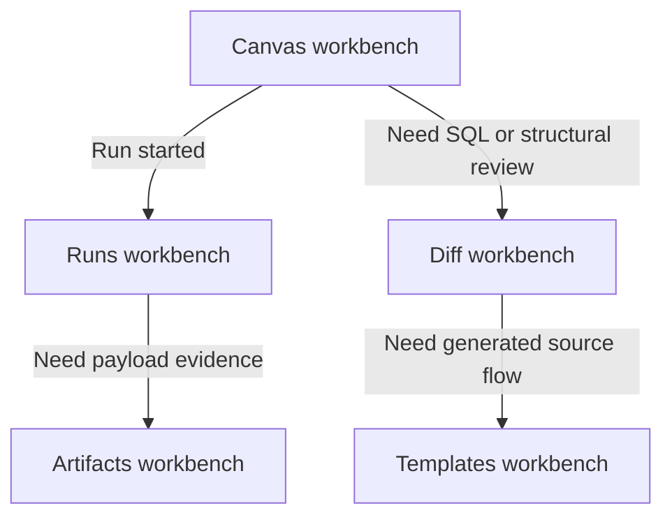
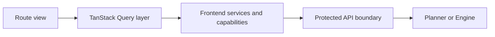

# DVT UI workbench implementation roadmap 2026-04-04

## Summary

This roadmap translates the workbench architecture proposal into execution work
bound to scheduled Lane E tasks only.

Canonical execution tracking remains in:

- [Agent Lane E](../../../state/agent-lane-e.yaml)
- [Frontend roadmap](./frontend-roadmap-20260219.md)

This document is the implementation sequence and Definition of Done map for the
workbench program.

## Governing sources

- [Governance document and rule inventory](../../../status/governance-document-rule-inventory.md)
- [Mandatory work system for AI](../../../../guides/ai-work-protocol.md)
- [Frontend roadmap](./frontend-roadmap-20260219.md)
- [UX implementation guide](../../../../architecture/components/web/ux-implementation-guide.md)
- [Screen manuals and user stories](../../../../architecture/components/web/screen-manuals-and-user-stories.md)

## Unblock roadmap

### Wave 0 - Contract and shell truth

Tasks: `MVP-E1`, `F-03`, `F-07`, `F-13`, `F-20`

Target:

- route and DTO truth is explicit;
- shell degraded and offline behavior is visible;
- docs describe current behavior, not target-only behavior;
- per-screen user manuals are maintained as acceptance baseline.

### Wave 1 - Data and state boundaries

Tasks: `F-04` (`F-04-D`, `F-04-E`, `F-04-F`, `F-04-RISK-*`, `F-04-RESIDUAL-*`), `F-05`, `F-06`, `F-12`

Target:

- one composition root owns mode and adapter wiring;
- route views stop owning service factory and mode decisions;
- stores are domain-scoped;
- query keys, mutation ownership, and invalidation are standardized;
- legacy graph path is removed.

### Wave 2 - Core operator runtime

Tasks: `F-08`, `F-09`, `F-10`, `F-11`

Target:

- Plan -> Run -> Monitor works through governed contracts;
- Runs list and run detail consume real runtime data;
- timeline and console use real run events;
- Diff, Artifacts, and Level-C surfaces activate progressively under contracts
  and flags.

### Wave 3 - Workbench hardening and dense surfaces

Tasks: `F-01`, `F-14`, `F-15`, `F-16`, `F-17-A`, `F-18`

Target:

- shell grammar is stable and low-noise;
- frontend test lane is governed in CI;
- dense operational tables replace non-scaling card layouts;
- Monaco documentation and ownership posture are aligned for route-level
  embedding (`F-17-A`);
- console and run-log story converges.

### Wave 4 - Governed review, generation, and visual split

Tasks: `F-21`, `F-17-B`, `F-17-C`, `F-17-D`, `F-17-E`, `F-17-F`, `F-19`, `F-23`

Target:

- Templates route delivers governed source generation with preview and diff;
- `Code` and `Diff` converge on governed file-history review without creating a
  second shell or Git explorer;
- Monaco route implementations stay dependency-safe: `F-17-D` and `F-17-F`
  remain blocked until `F-21` and governed contract/data prerequisites are
  available;
- open-data visual direction is formalized without contaminating operator
  workbench grammar.

## Development work packages with DoD

### Package A - Contract and documentation baseline

Tasks: `MVP-E1`, `F-07`, `F-13`, `F-20`

DoD:

- frontend-facing runtime contract is written and linked from frontend
  architecture entrypoints;
- no active frontend doc claims global workbench tabs as main navigation;
- per-screen manuals define loading, empty, error, degraded, and read-only
  states;
- docs and lane references are synchronized.

### Package B - Boundary and ownership convergence

Tasks: `F-04`, `F-05`, `F-06`, `F-12`

DoD:

- route-level code does not call mode resolvers or service factories directly;
- no route component performs raw `fetch`;
- store ownership is split by shell, graph, run, and status concerns;
- query ownership and invalidation follow a shared policy;
- canvas operates through one active graph stack only.

### Package C - Runtime flow and operator evidence

Tasks: `F-08`, `F-09`, `F-10`, `F-11`

DoD:

- run-start path aligns with protected API route truth;
- runs list and detail are operational with stable state handling;
- timeline and console surface real events with explicit degraded posture;
- secondary workbenches activate through governed contracts and feature gates.

### Package D - UX hardening and generation

Tasks: `F-01`, `F-14`, `F-15`, `F-16`, `F-17`, `F-18`, `F-21`, `F-19`, `F-23`

DoD:

- shell slots and route workbench grammar are consistent across core routes;
- frontend CI has a governed test lane;
- dense surfaces use table-grade interaction where needed;
- file-history review stays in `Code` while revision comparison stays in `Diff`;
- Monaco remains infrastructure, not route owner;
- Templates owns generation flow and keeps provider semantics in backend
  contracts;
- open-data visual language is explicit and scoped.

## Execution status snapshot (source of truth: Lane E)

Date: `2026-04-04`

| Package | Task set                                                               | Lane E status snapshot                                                                                                                                         |
| ------- | ---------------------------------------------------------------------- | -------------------------------------------------------------------------------------------------------------------------------------------------------------- |
| A       | `MVP-E1`, `F-07`, `F-13`, `F-20`                                       | `MVP-E1` queued, `F-07` in_progress, `F-13` in_progress, `F-20` review                                                                                         |
| B       | `F-04`, `F-05`, `F-06`, `F-12`                                         | `F-04` in_progress (`F-04-D/E/F` queued), `F-05` in_progress, `F-06` queued, `F-12` queued                                                                     |
| C       | `F-08`, `F-09`, `F-10`, `F-11`                                         | `F-08` queued, `F-09` queued, `F-10` queued, `F-11` queued                                                                                                     |
| D       | `F-01`, `F-14`, `F-15`, `F-16`, `F-17`, `F-18`, `F-21`, `F-19`, `F-23` | `F-01` queued, `F-14` queued, `F-15` in_progress, `F-16` queued, `F-17` in_progress, `F-18` queued, `F-21` in_progress, `F-19` in_progress, `F-23` in_progress |

Traceability rule:

- progress and status classification must be updated in `agent-lane-e.yaml`
  first;
- this roadmap snapshot is descriptive and must not override lane state.

## Mermaid execution maps

### Program dependency map

### Runtime handoff chain

### Boundary ownership chain

## Validation baseline for each execution slice

Every implementation slice under this roadmap must close with:

1. route or package-level checks for touched scope;
2. docs sync when docs structure changes;
3. `pnpm verify:prepush`.
