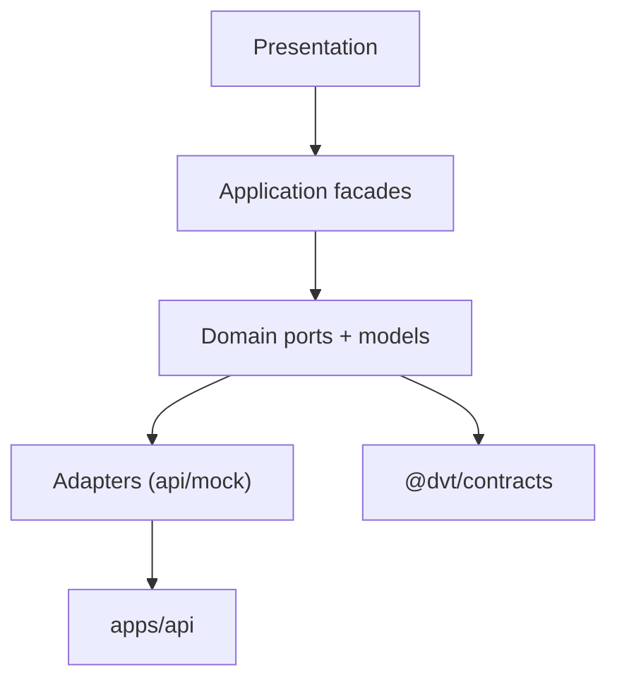
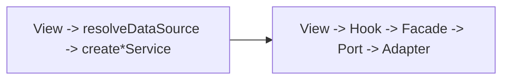
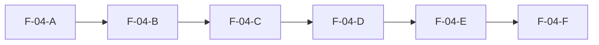

# F-04 Frontend Data-Boundary Hexagonal Convergence Plan

## Scope

This plan covers the frontend data-boundary subsystem inside `apps/web` and Lane E `F-04`.

## Invariants

- frontend remains a browser client, never execution authority;
- route/view layers do not own mode selection;
- `VITE_DATA_SOURCE` is read only in one composition boundary;
- service and query boundaries use typed contracts;
- no raw fetch in route-level query hooks when a governed client exists.

## Decision Rationale

Chosen model: capability-centered hexagonal frontend.

- rejected Model A (keep hybrid view wiring): fast now, structural drift later;
- rejected Model B (full DI container): too heavy for current slice;
- accepted Model C: clean boundaries with lower migration overhead.

## Tradeoffs

- Gain: clearer boundaries, less drift, better testability.
- Cost: more interfaces/modules and migration effort.
- Opportunity: enables stable future slices (runtime contracts, execution-template UX, CI hardening).

## System And Ports

## Current To Target

## Task Breakdown

- `F-04-A`: current-state dependency inventory.
- `F-04-B`: canonical technical architecture doc + Mermaid pack.
- `F-04-C`: runtime-modes user manual.
- `F-04-D`: define ports and split hybrid surfaces.
- `F-04-E`: composition-root wiring + route-level facades/hooks.
- `F-04-F`: remove direct `resolveDataSource`, `create*Service`, and raw capabilities fetch from view/query surfaces.

Dependencies:

- next chain remains `F-05 -> F-06 -> F-07 -> F-12 -> F-14`.

## TDD-First Execution Contract

No implementation patch should land before test scaffolding exists for the same slice.

Per sub-slice execution order:

1. write failing tests (RED);
2. implement minimal code to satisfy test (GREEN);
3. refactor with tests green (REFACTOR).

Required test scopes before code rollout:

- `F-04-D`: contract tests for ports and adapters (API and mock parity).
- `F-04-E`: composition-root tests proving single-point mode resolution and stable service wiring.
- `F-04-F`: route-level tests proving no direct `resolveDataSource`/`create*Service` imports and no raw capabilities fetch hook.

## Acceptance Criteria

- docs are English-only and discoverable from frontend entrypoints;
- route/view/controller surfaces stop importing mode/service factories directly;
- capabilities query uses governed client boundary;
- legacy parallel store surface is documented as historical;
- TDD evidence exists for each implemented sub-slice before refactor/cleanup commits;
- `pnpm docs:sync`, `pnpm docs:workboard:generate`, `pnpm --filter @dvt/web typecheck` pass.

## Rollout Sequence

## Mature Baseline Comparison

- VS Code: shell grammar and panel consistency.
- Backstage: app-first plugin composition.
- TanStack Query: disciplined server-state lifecycle.
- OpenLineage/Marquez: lineage/public-data separation reference.
