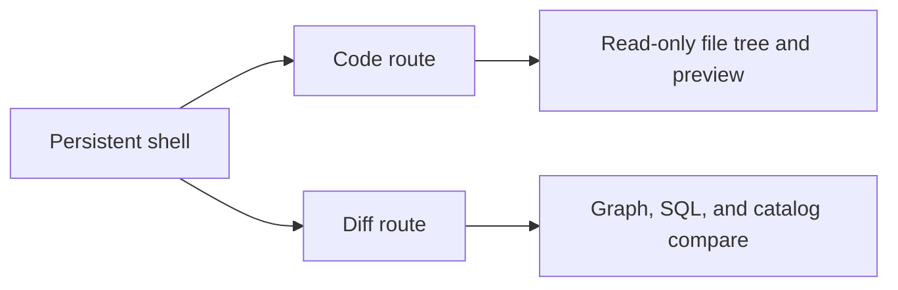
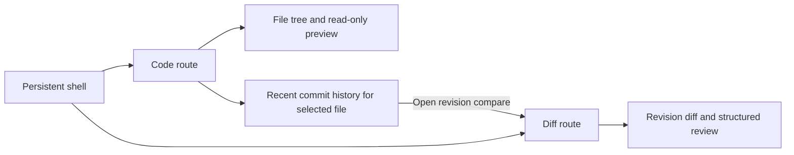

# F-23 Git file-history review plan 2026-04-07

## Summary

`F-23` defines the governed Git-facing UX slice for file-level history review.

The product direction is narrow on purpose:

- `Code` owns workspace file browsing and per-file history entry;
- `Diff` owns revision comparison and structured review;
- DVT does not introduce a VS Code-style Git explorer or a second shell model.

This is a docs-first slice that removes execution ambiguity before the blocked
implementation work starts.

## Governing sources

- `AGENTS.md`
- `docs/planning/status/governance-document-rule-inventory.md`
- `docs/guides/ai-work-protocol.md`
- `docs/planning/state/planning-control-tower.md`
- `docs/planning/roadmap/index.md`
- `docs/planning/state/agent-lane-e.yaml`
- `docs/planning/proposals/nice-to-have/frontend-and-ux/frontend-roadmap-20260219.md`
- `docs/planning/proposals/nice-to-have/frontend-and-ux/dvt-ui-workbench-implementation-roadmap-20260404.md`
- `docs/architecture/frontend/index.md`
- `docs/architecture/frontend/main-workspace-views-and-ux.md`
- `docs/architecture/frontend/screen-manuals-and-user-stories.md`
- `docs/architecture/frontend/ux-implementation-guide.md`
- `docs/architecture/frontend/screen-layout-and-cross-surface-behavior-rules.md`
- `docs/architecture/frontend/workbench-ui-contract-and-component-inventory.md`
- `docs/architecture/frontend/git/git-mode-architecture.md`
- `docs/planning/proposals/monaco-workbench-integration-rationale-20260402.md`
- `apps/web/src/app/views/CodeView.tsx`
- `apps/web/src/app/views/DiffView.tsx`
- `apps/web/src/app/plugins/dbt/dbtContributions.ts`

## Think-first analysis

### Problem summary

Lane E already says `F-23` should add governed Git file-history review inside
`Code` and `Diff`, but the active proposal set does not yet freeze the exact
ownership model, handoff rules, or route-level UX states for that slice.

At the same time, the shipped frontend already exposes a `/code` route, while
several canonical frontend docs still describe the main workbench as if `Code`
did not exist.

### Root cause

The earlier frontend planning work focused first on shell convergence,
Monaco-as-embedded-review posture, and the future `Templates` route.

That left Git review partially documented in `Diff` while the read-only source
browser in `Code` grew without a canonical file-history plan. The result is a
gap between real route topology and the governed Git review story.

### Constraints and invariants

- The persistent shell and route-level workbench model remain primary.
- `Code` and `Diff` must stay route-owned surfaces, not tabs inside a new Git
  application.
- `Diff` remains the comparison workbench. `Code` must not absorb full compare
  semantics.
- `Code` can own selected-file context and history entry, but not staging,
  conflict resolution, or repository management.
- `F-23` implementation remains blocked on `F-06` query-boundary standardization
  and `F-17-B` Monaco in `Diff`.
- Monaco is embedded infrastructure, not shell ownership.

### Options considered

| Option | Description                                                                                                           | Decision | Rationale                                                                                                                         |
| ------ | --------------------------------------------------------------------------------------------------------------------- | -------- | --------------------------------------------------------------------------------------------------------------------------------- |
| A      | Add a left-nav Git explorer with branches, commits, staging, and repository actions                                   | Rejected | It creates a second shell model, violates the current Git-mode posture, and expands the slice into a browser Git client.          |
| B      | Keep all Git review inside `Diff` and leave `Code` as a plain read-only browser                                       | Rejected | It preserves the current drift and makes per-file history discovery harder than necessary.                                        |
| C      | Let `Code` own file browsing plus recent commit history, and let `Diff` own revision comparison and structured review | Chosen   | It matches the real route inventory, keeps responsibilities narrow, and reuses the governed Diff workbench for actual comparison. |

### Selected option and rationale

The chosen model is `Code -> Diff`:

1. the operator selects a workspace file in `Code`;
2. `Code` can reveal recent history for that file only;
3. selecting a revision or compare action hands the user to `Diff`;
4. `Diff` renders the revision comparison through its governed compare model.

This keeps browsing, history discovery, and comparison distinct without
introducing a second navigation grammar.

### Rejected alternatives

- Monaco-first Git review entirely inside `Code`
- a docked Git sidebar independent from route ownership
- browser-side repository operations such as stage, commit, or conflict
  resolution in the same slice

## Pre-implementation brief

- Mode: `Full`
- Scope:
  - create the canonical `F-23` proposal;
  - align frontend architecture docs with the real `Code` route;
  - place `F-23` in the roadmap and lane registry with non-conflicting
    sequencing.
- Touched files or paths:
  - `docs/planning/proposals/nice-to-have/frontend-and-ux/*`
  - `docs/architecture/frontend/*`
  - `docs/planning/state/agent-lane-e.yaml`
  - `docs/planning/closeouts/*`
- Expected outcome:
  - one canonical plan describes file-history ownership, handoffs, blockers,
    states, and validation for `F-23`;
  - frontend docs stop omitting `Code` from the main workbench story.
- Risks and mitigations:
  - risk: reintroducing a browser Git client narrative
  - mitigation: explicitly keep repository operations and Git explorer patterns
    out of scope
  - risk: competing execution sequence with Monaco work
  - mitigation: keep `F-23` blocked on `F-17-B` and reuse `Diff` ownership
- Out-of-scope items:
  - runtime code changes
  - new backend Git endpoints
  - staging, commit, branch, or conflict workflows
  - Monaco implementation work in `Code`
- Validation plan:
  - `pnpm docs:sync`
  - `pnpm docs:workboard:generate`
  - `pnpm verify:prepush`
- Test coverage plan:
  - no runtime tests in this planning slice
  - later implementation must add route-level tests for empty history,
    file-selection changes, and `Code -> Diff` handoff failures
- Libraries evaluated:
  - none adopted in this planning slice
  - implementation reuses the existing workspace service and the Monaco posture
    already governed by `F-17-B`

## Current state

Current reality:

- `Code` exists and already provides read-only file browsing and preview;
- `Diff` exists and already provides compare mode, summary, and review tabs;
- no governed file-history handoff currently connects the two.

## Target state

Ownership rules:

- `Code` owns file selection, preview, and history entry for that file.
- `Diff` owns compare refs, summary, severity, and rendered revision review.
- The shell top bar may show repository context, but it does not become a Git
  console.

## Delivery sequence inside F-23

### `F-23-A` File-scoped history in `Code`

- add recent commit history for the selected workspace file;
- keep the surface read-only and file-scoped;
- include explicit empty, loading, and error states.

### `F-23-B` Revision handoff into `Diff`

- open revision comparison through the governed `Diff` workbench;
- reuse route-level compare context instead of creating a second comparison
  primitive in `Code`.

### `F-23-C` Query and service convergence

- keep file-history queries behind the same service and query-boundary rules
  expected by `F-06`;
- avoid route-local fetches or view-owned repository logic.

## Acceptance criteria

`F-23` is ready for implementation only when all are true:

1. `Code` is documented as a real main workbench route.
2. File-history review is explicitly scoped to the selected file.
3. Revision comparison is explicitly owned by `Diff`.
4. No document or lane note introduces a left-nav Git explorer as primary Git
   mode.
5. The slice remains blocked on `F-06` and `F-17-B` for implementation.

## Validation baseline

For this planning slice:

- `pnpm docs:sync`
- `pnpm docs:workboard:generate`
- `pnpm verify:prepush`

For the future implementation slice:

- `pnpm --filter @dvt/web test`
- `pnpm --filter @dvt/web typecheck`
- `pnpm verify:prepush`
