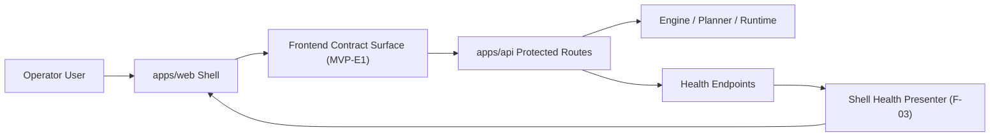
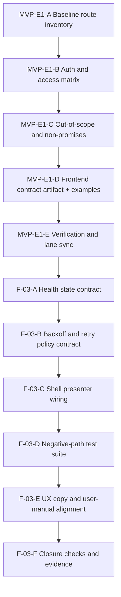
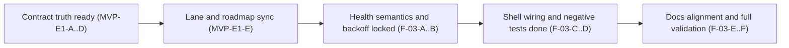

# MVP-E1 and F-03 frontend backend contract and health state plan 2026-04-04

## Goal

Define and execute a governed frontend-facing backend contract (`MVP-E1`) and complete real backend health state UX in shell (`F-03`) without promising unsupported runtime behavior.

## Scope

In scope:

- Frontend-consumable route inventory and contract posture.
- Authn and authz expectations at route level.
- Out-of-scope and non-promised backend behavior.
- Health state UX contract in shell (TopBar + global degraded/offline banner).
- Atomic implementation and validation tasks for `MVP-E1` and `F-03`.

Out of scope:

- New backend endpoints.
- New auth model or token system changes.
- New frontend route-level features outside shell health behavior.

## Governing Sources

- `docs/planning/status/governance-document-rule-inventory.md`
- `docs/guides/ai-work-protocol.md`
- `docs/planning/state/planning-control-tower.md`
- `docs/planning/state/agent-lane-e.yaml`
- `docs/planning/proposals/nice-to-have/frontend-and-ux/frontend-roadmap-20260219.md`
- `docs/planning/reviews/architecture-and-governance/20260402-f03-shell-health-fowler-hard-review.md`
- `docs/planning/reviews/20260402-f03-shell-health-banner-hard-qa-review.md`
- `docs/planning/reviews/execution-runtime/20260331-mvp-a1-backend-contractual-inventory-review.md`

## Rationale

`MVP-E1` is the product truth gate for frontend promises. `F-03` is the operational trust gate for shell status. Running them together avoids two drifts:

1. Frontend promises routes that backend does not expose.
2. Frontend shows health semantics that are not aligned with real backend state.

This plan closes both drifts before additional route work (`F-07`, `F-08`, `F-09`) expands behavior.

## System Context

## Target Execution Map

## Atomic Tasks and Checks

### MVP-E1 chain

| Task       | Description                                             | Output                                                                         | Required checks                                     |
| ---------- | ------------------------------------------------------- | ------------------------------------------------------------------------------ | --------------------------------------------------- |
| `MVP-E1-A` | Build route and method inventory from real API surface. | Route table with method, path, request shape, response shape, status envelope. | `pnpm --filter dvt-api build`                       |
| `MVP-E1-B` | Define auth/authz expectations by route.                | Auth matrix (`public`, `authenticated`, `role-scoped`, forbidden cases).       | `pnpm --filter dvt-api test`                        |
| `MVP-E1-C` | Freeze explicit non-promises for frontend.              | Out-of-scope section with forbidden assumptions and fallback UX policy.        | `pnpm --filter @dvt/web test`                       |
| `MVP-E1-D` | Publish frontend-facing backend contract artifact.      | Canonical doc in `docs/` with examples and error-path behavior.                | `pnpm docs:sync`                                    |
| `MVP-E1-E` | Link planning/governance surfaces.                      | Lane E evidence refs and roadmap linkage updated.                              | `pnpm docs:workboard:generate` and `pnpm docs:sync` |

### F-03 chain

| Task     | Description                                               | Output                                                                       | Required checks                                                  |
| -------- | --------------------------------------------------------- | ---------------------------------------------------------------------------- | ---------------------------------------------------------------- |
| `F-03-A` | Define health-state semantic model from real endpoints.   | Canonical state machine (`ok`, `degraded`, `offline`) with transition rules. | `pnpm --filter @dvt/web test`                                    |
| `F-03-B` | Define retry and backoff contract.                        | Deterministic retry policy, cancellation rules, and max-wait behavior.       | `pnpm --filter @dvt/web test`                                    |
| `F-03-C` | Wire shell presenter to capability boundary only.         | TopBar and banner consume one health facade, no ad-hoc mode drift.           | `pnpm --filter @dvt/web test` and `pnpm --filter @dvt/web build` |
| `F-03-D` | Add negative-path and resilience tests.                   | Tests for timeout, network down, 401/403/5xx, partial endpoint failures.     | `pnpm --filter @dvt/web test`                                    |
| `F-03-E` | Align manual and operator copy with implemented behavior. | User-facing health behavior documentation in English.                        | `pnpm docs:sync`                                                 |
| `F-03-F` | Final quality closure for this slice.                     | Verified no-drift closure snapshot and lane progress update.                 | `pnpm verify:prepush`                                            |

## Implementation Contract (Frontend Promise Gate)

The frontend contract artifact produced by `MVP-E1-D` must contain:

1. Route inventory table based on current protected API.
2. Authentication expectations and scope requirements.
3. Canonical success and error envelope examples.
4. Explicit non-promised behavior list.
5. Health endpoint semantics consumed by `F-03`.

## Risks and Mitigations

| Risk                                      | Impact                                          | Mitigation                                                                       |
| ----------------------------------------- | ----------------------------------------------- | -------------------------------------------------------------------------------- |
| Route drift between API and docs          | Frontend implements unsupported behavior        | `MVP-E1-A` and `MVP-E1-E` include source-of-truth cross-check and docs sync gate |
| Health state drift in shell               | Operator confusion and false runtime perception | `F-03-A` plus `F-03-D` negative tests as mandatory gate                          |
| Retry behavior regresses to fixed polling | Degraded UX and stale status                    | `F-03-B` explicit backoff contract and presenter tests                           |
| Planning drift                            | Proposal not reflected in execution registry    | Mandatory lane update in `agent-lane-e.yaml` and `docs:workboard:generate`       |

## Definition of Done (DoD)

This slice is done only when all are true:

1. `MVP-E1-A..E` and `F-03-A..F` are completed with evidence refs.
2. Frontend-facing backend contract doc exists and is linked from Lane E and roadmap surfaces.
3. `F-03` shell behavior uses only real backend health capability path.
4. Negative tests cover degraded/offline transitions and auth/failure paths.
5. Docs and lane state are synchronized.
6. Validation baseline is green:
   - `pnpm --filter dvt-api build`
   - `pnpm --filter dvt-api test`
   - `pnpm --filter @dvt/web build`
   - `pnpm --filter @dvt/web test`
   - `pnpm docs:workboard:generate`
   - `pnpm docs:sync`
   - `pnpm verify:prepush`

## Checkpoint Sequence

## Action Artifact

### Task Details

#### `MVP-E1-A` Baseline route inventory

- Objective: Freeze the real frontend-consumable backend route map.
- Scope: API route and method inventory only.
- In current task scope: Yes.
- Dependencies: `MVP-A1`, `MVP-B1`.
- Documentation impact: Contract route table section.
- Evidence / risk-doc impact: None expected for docs-only planning slice.
- Comment with rationale: Frontend contract quality starts with route truth, not assumptions.
- Definition of Done: Route matrix includes method, path, auth posture, request, response, and error envelope references.

#### `MVP-E1-B` Auth and access matrix

- Objective: Define clear authn/authz expectations for each exposed route.
- Scope: Route-level access policy.
- In current task scope: Yes.
- Dependencies: `MVP-E1-A`.
- Documentation impact: Auth matrix section.
- Evidence / risk-doc impact: None expected for docs-only planning slice.
- Comment with rationale: UX and error handling are unstable without explicit auth contract.
- Definition of Done: Matrix includes public/authenticated/role-scoped and forbidden outcomes.

#### `MVP-E1-C` Non-promises and out-of-scope

- Objective: Prevent frontend overpromising unsupported backend behavior.
- Scope: Explicit assumptions and non-goals.
- In current task scope: Yes.
- Dependencies: `MVP-E1-A`, `MVP-E1-B`.
- Documentation impact: Out-of-scope section.
- Evidence / risk-doc impact: None expected for docs-only planning slice.
- Comment with rationale: Product trust requires explicit non-promises.
- Definition of Done: List is explicit, testable, and aligned with current API reality.

#### `MVP-E1-D` Publish frontend-facing backend contract

- Objective: Produce canonical frontend backend contract artifact.
- Scope: New governed document and navigation linkage.
- In current task scope: Yes.
- Dependencies: `MVP-E1-A`, `MVP-E1-B`, `MVP-E1-C`.
- Documentation impact: Proposal and lane linkage.
- Evidence / risk-doc impact: None expected for docs-only planning slice.
- Comment with rationale: One canonical artifact removes route and semantics ambiguity.
- Definition of Done: Artifact is published, linked, and validated by docs sync.

#### `MVP-E1-E` Planning and lane synchronization

- Objective: Reflect execution plan in lane state and planning views.
- Scope: Lane E and generated planning surfaces.
- In current task scope: Yes.
- Dependencies: `MVP-E1-D`.
- Documentation impact: Lane YAML and generated planning pages.
- Evidence / risk-doc impact: None expected for docs-only planning slice.
- Comment with rationale: Untracked plans become governance drift.
- Definition of Done: `agent-lane-e.yaml` and generated planning surfaces are synchronized.

#### `F-03-A` Health state semantic contract

- Objective: Lock canonical shell health-state semantics.
- Scope: `ok`, `degraded`, `offline` transitions and rules.
- In current task scope: Yes.
- Dependencies: `F-02`, `MVP-E1-D`.
- Documentation impact: Health semantics section and diagrams.
- Evidence / risk-doc impact: None expected for docs-only planning slice.
- Comment with rationale: Shell cannot be operational without deterministic state semantics.
- Definition of Done: State model and transition rules are explicitly defined and testable.

#### `F-03-B` Retry and backoff policy contract

- Objective: Define deterministic retry/backoff behavior for shell health.
- Scope: Retry cadence, backoff caps, cancel conditions.
- In current task scope: Yes.
- Dependencies: `F-03-A`.
- Documentation impact: Retry/backoff policy section.
- Evidence / risk-doc impact: None expected for docs-only planning slice.
- Comment with rationale: Fixed polling regresses operator trust and creates false health signal.
- Definition of Done: Policy is explicit and mapped to test scenarios.

#### `F-03-C` Shell presenter wiring contract

- Objective: Ensure TopBar and banner consume one governed health capability seam.
- Scope: Presenter ownership and dependency boundaries.
- In current task scope: Yes.
- Dependencies: `F-03-A`, `F-03-B`.
- Documentation impact: Architecture and sequence diagrams.
- Evidence / risk-doc impact: None expected for docs-only planning slice.
- Comment with rationale: Multiple health paths create contradictory UI states.
- Definition of Done: One shell health seam is documented as mandatory.

#### `F-03-D` Negative-path test plan

- Objective: Define negative-path and resilience checks for health behavior.
- Scope: Timeout/network/auth/server partial-failure cases.
- In current task scope: Yes.
- Dependencies: `F-03-A`, `F-03-B`, `F-03-C`.
- Documentation impact: Test matrix section.
- Evidence / risk-doc impact: None expected for docs-only planning slice.
- Comment with rationale: Health UX without negative tests is not production-safe.
- Definition of Done: Negative test set is explicit and mapped to expected shell outcomes.

#### `F-03-E` Manual and UX copy alignment

- Objective: Align user/operator docs with implemented shell behavior.
- Scope: User manual and UX wording.
- In current task scope: Yes.
- Dependencies: `F-03-D`.
- Documentation impact: Guide/manual updates.
- Evidence / risk-doc impact: None expected for docs-only planning slice.
- Comment with rationale: Misaligned manuals create support debt and operator confusion.
- Definition of Done: Manual wording matches implemented health states and retry behavior.

#### `F-03-F` Slice closure and full validation

- Objective: Close the slice with complete quality gate evidence.
- Scope: Final checks and planning closure sync.
- In current task scope: Yes.
- Dependencies: `MVP-E1-A..E`, `F-03-A..E`.
- Documentation impact: Lane progress and closeout-ready evidence references.
- Evidence / risk-doc impact: Evaluate based on touched code paths in implementation slice.
- Comment with rationale: Slice is not ready without reproducible validation evidence.
- Definition of Done: Validation baseline passes and status is traceable in lane artifacts.

### Task Checklist

- [x] `MVP-E1-A` Build baseline route inventory from real API surface
- [x] `MVP-E1-B` Define auth and access matrix for frontend-consumable routes
- [x] `MVP-E1-C` Freeze non-promises and out-of-scope backend assumptions
- [x] `MVP-E1-D` Publish canonical frontend-facing backend contract artifact
- [x] `MVP-E1-E` Sync lane state, roadmap links, and planning surfaces
- [x] `F-03-A` Define canonical shell health-state semantic model
- [x] `F-03-B` Define deterministic retry and backoff policy contract
- [x] `F-03-C` Enforce single health presenter seam in shell architecture
- [x] `F-03-D` Add negative-path and resilience test matrix
- [x] `F-03-E` Align user manual and UX copy with real health behavior
- [x] `F-03-F` Run closure checks and complete quality-gate validation

## Closure Disposition 2026-05-15

`F-03` is accepted as closed by the current shell implementation and
documentation set.

Evidence:

- `apps/web/src/capabilities/platform-health/presentation/platformHealthStatus.ts`
  owns health projection, initial pending behavior, and retry cadence.
- `apps/web/src/capabilities/platform-health/presentation/platformHealthStatus.test.ts`
  covers the first unsettled probe, failed initial probe, degraded/offline
  projection, and capped exponential backoff.
- `apps/web/src/capabilities/platform-health/presentation/usePlatformHealthSnapshotQuery.test.ts`
  covers query-option wiring and error-state backoff.
- `apps/web/src/app/Root.tsx`, `TopAppBar.tsx`, and `ShellHealthBanner.tsx`
  consume the single shell-health presentation seam.
- `docs/architecture/components/web/frontend-runtime-modes-user-manual.md`,
  and `docs/architecture/components/web/app-bootstrap-screen-component.md`
  describe the implemented checking, degraded, offline, retry, and startup
  behavior.

The remaining work item was not implementation. It was planning-state drift:
the code and docs had moved past the proposal checklist, while the proposal and
planning DB still showed `review`.
