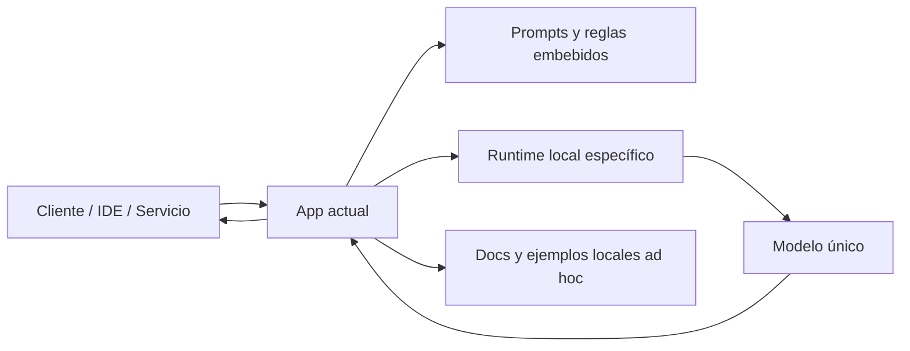
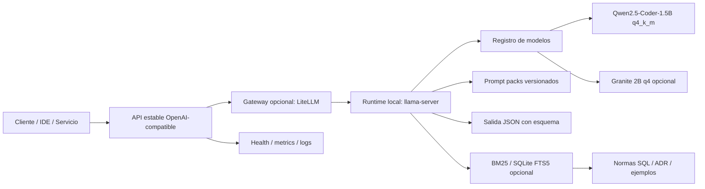

# Arquitectura propuesta para una app LLM local, ligera y específica

## 1. Objetivo

Definir, en un único documento, el **estado actual inferido** de la app y el **estado objetivo** recomendado para un caso de uso muy concreto:

- ejecución **local**,
- consumo **bajo** de memoria y CPU,
- especialización en **arquitectura de datos y programación**,
- exposición vía **API estable** para poder cambiar de modelo o runtime sin romper clientes.

> **Importante**  
> No se ha analizado un repositorio ni una arquitectura real. Por tanto, la sección **AS-IS** está **inferida** a partir de esta conversación y debe entenderse como una **baseline técnica** sobre la que iterar.

---

## 2. Resumen ejecutivo

La app, tal como se ha planteado hasta ahora, tiende a resolverse de forma **acoplada**: un modelo local, un runtime concreto y una integración directa desde la app. Eso es válido para un prototipo, pero penaliza cuatro cosas:

1. **intercambio de modelos**,
2. **mantenibilidad**,
3. **observabilidad**,
4. **especialización incremental**.

La arquitectura recomendada es:

- **runtime local ligero** con `llama.cpp` / `llama-server`,
- **contrato de API OpenAI-compatible**,
- **gateway opcional** delante (`LiteLLM`) para desacoplar clientes del backend real,
- **modelo pequeño especializado en código** como baseline,
- **prompt packs + reglas + ejemplos** fuera del código,
- **RAG local barato** solo si aporta valor,
- **LoRA/PEFT** únicamente si la especialización por prompting + ejemplos no es suficiente.

---

## 3. Estado actual inferido (AS-IS)

### 3.1 Características probables del estado actual

A falta de arquitectura real, el patrón más probable es este:

- La app o backend consumidor llama **directamente** a un runtime/modelo local.
- El modelo está **ligado** a una implementación concreta.
- Los prompts, reglas y comportamiento están **embebidos en código**.
- No existe un **contrato estable de API** independiente del motor.
- El cambio de modelo implica tocar configuración, código o ambos.
- No hay separación clara entre:
  - inferencia,
  - reglas de dominio,
  - observabilidad,
  - gobierno del cambio.
- La especialización depende más del prompt que de una estrategia de producto.

### 3.2 Riesgos del AS-IS

- **Acoplamiento alto** entre app y modelo.
- **Sustitución costosa** del backend de inferencia.
- **Difícil comparación** entre modelos.
- **Poca trazabilidad** sobre prompts, respuestas y errores.
- **Escalado limitado** si más de un consumidor usa la misma API.
- Riesgo de que el modelo genere texto libre donde debería devolver **salida estructurada**.

### 3.3 Diagrama Mermaid — antes



### 3.4 Lectura del diagrama AS-IS

El problema principal no es que el modelo sea local, sino que la app:

- habla con un backend demasiado concreto,
- mezcla lógica de negocio con lógica de inferencia,
- no tiene una frontera estable para sustituir modelo, runtime o política de prompting.

---

## 4. Estado objetivo recomendado (TO-BE)

### 4.1 Principios de diseño

1. **API estable primero**: los clientes no deben saber qué modelo real hay detrás.
2. **Ligereza operativa**: contexto corto por defecto, cuantización y pocas piezas.
3. **Especialización sin sobreentrenar**: reglas, plantillas y ejemplos antes que fine-tuning.
4. **Cambio de modelo sin tocar cliente**.
5. **Salidas estructuradas** para tareas técnicas.
6. **Observabilidad mínima obligatoria**: salud, métricas, logs y versionado de prompts/modelos.

### 4.2 Componentes propuestos

#### Capa 1 — contrato estable

Una API compatible con OpenAI como fachada estable:

- `/v1/chat/completions` o `/v1/responses`,
- mismo alias lógico aunque cambie el modelo real,
- posibilidad de usar los SDKs habituales sin reescribir clientes.

#### Capa 2 — gateway opcional

`LiteLLM` es útil si queréis:

- enrutar un alias lógico a distintos backends,
- hacer fallback,
- cambiar proveedor o runtime sin tocar consumidores,
- añadir gobierno, cuotas y observabilidad más adelante.

Si al principio solo vais a tener **un runtime y un modelo**, esta capa puede ser **opcional**.

#### Capa 3 — inferencia local

`llama-server` sobre `llama.cpp` como backend de inferencia local:

- footprint bajo,
- cuantización GGUF,
- CPU/GPU,
- rutas OpenAI-compatible,
- soporte para JSON estructurado,
- métricas y operación sencilla.

#### Capa 4 — especialización

La especialización no debería ir en el binario de la app. Debe externalizarse en:

- **prompt packs** versionados,
- **plantillas de respuesta**,
- **reglas de dominio**,
- **ejemplos SQL / ADR / estándares internos**,
- **políticas de salida JSON**.

#### Capa 5 — conocimiento local opcional

Antes de meter embeddings y un vector DB, para este caso es más eficiente empezar con:

- **BM25**,
- **SQLite FTS5**,
- o un índice textual simple.

Esto reduce complejidad y consumo.

#### Capa 6 — adaptación posterior

Si después de varias iteraciones seguís teniendo errores repetitivos de estilo o formato:

- añadir **LoRA/PEFT**,
- sin full fine-tuning,
- con adapters cargables por modelo o por caso de uso.

### 4.3 Diagrama Mermaid — después



### 4.4 Lectura del diagrama TO-BE

La diferencia clave es que el **cliente ya no depende del modelo**. Depende de un **contrato**.

Eso permite:

- cambiar de `Qwen` a otro modelo,
- cambiar de `llama-server` a otro runtime,
- introducir fallback,
- separar inferencia de conocimiento de dominio,
- evolucionar la especialización sin reescribir integraciones.

---

## 5. Rationale de arquitectura

| Decisión                                   | Por qué                                                                                               | Beneficio                                              | Trade-off                                                      |
| ------------------------------------------ | ----------------------------------------------------------------------------------------------------- | ------------------------------------------------------ | -------------------------------------------------------------- |
| Usar `llama.cpp` / `llama-server`          | Está orientado a inferencia local ligera y modelos cuantizados; además expone rutas OpenAI-compatible | Bajo consumo, operación simple, portabilidad           | Menos cómodo que plataformas más empaquetadas                  |
| Mantener API OpenAI-compatible             | Desacopla clientes del backend real                                                                   | Cambio de modelo/runtime con bajo coste de integración | Hay que controlar bien compatibilidades entre implementaciones |
| Añadir `LiteLLM` solo como capa opcional   | Permite routing, fallback y un alias lógico estable                                                   | Mayor flexibilidad futura                              | Añade otra pieza operativa                                     |
| Empezar por un modelo pequeño de código    | El caso de uso es muy específico y local                                                              | Menor RAM, menor latencia, menor coste                 | Menor capacidad generalista                                    |
| Empezar por prompting + reglas + ejemplos  | La especialización de dominio suele venir antes por contexto que por reentrenamiento                  | Menor complejidad y más velocidad de iteración         | Requiere buena higiene documental                              |
| RAG textual barato antes que vector DB     | Para normas, snippets y convenciones internas no siempre hace falta semántica densa                   | Menor consumo y menor complejidad                      | Menor recall semántico en consultas difusas                    |
| Usar JSON estructurado                     | Para SQL, arquitectura y validaciones, el texto libre es frágil                                       | Salidas parseables y automatizables                    | Requiere diseñar bien el esquema                               |
| Reservar LoRA/PEFT para una fase posterior | Es mucho más barato que full fine-tuning y suele bastar                                               | Especialización incremental sin disparar recursos      | Exige pipeline de entrenamiento y evaluación                   |

---

## 6. Recomendación concreta de baseline

### 6.1 Modelo inicial

**Baseline recomendado:** `Qwen2.5-Coder-1.5B-Instruct-GGUF` en `q4_k_m`.

Motivos:

- está orientado a **código**,
- tiene **1.54B** parámetros,
- ofrece **32,768** tokens de contexto en el card del modelo,
- tiene licencia **Apache-2.0**,
- dispone de cuantizaciones GGUF oficiales.

### 6.2 Presupuesto operativo sugerido

Como punto de partida práctico:

- **contexto por defecto**: `4096`,
- **concurrencia inicial**: `1`,
- **RAM objetivo mínima**: `4–8 GB`,
- **modo de uso**: tareas específicas y respuestas estructuradas, no chat generalista largo.

> Estas cifras son una **estimación operativa recomendada**, no una garantía del fabricante.

### 6.3 Alias lógico

No exponer el modelo real a los clientes. Exponer un alias estable, por ejemplo:

- `sql-architect`
- `data-architect-local`

Así, el cliente siempre llama al mismo nombre y el backend decide si detrás hay:

- Qwen 1.5B,
- Granite 2B,
- un modelo con LoRA,
- o un runtime distinto.

---

## 7. Endpoints recomendados

### 7.1 Públicos

- `POST /v1/chat/completions`
- `POST /v1/responses`
- `GET /healthz`
- `GET /readyz`
- `GET /metrics`

### 7.2 Internos

- `GET /internal/models`
- `GET /internal/prompts/version`
- `GET /internal/build-info`

### 7.3 Contrato mínimo de salida

Para casos técnicos, priorizar salidas tipo:

```json
{
  "task_type": "sql_review",
  "dialect": "postgresql",
  "risk_level": "medium",
  "summary": "...",
  "issues": [
    {
      "id": "I-001",
      "title": "Uso de SELECT *",
      "severity": "medium",
      "rationale": "...",
      "fix": "..."
    }
  ],
  "proposed_sql": "..."
}
```

Eso reduce ambigüedad y facilita automatización posterior.

---

## 8. Cómo debería organizarse la app

### 8.1 Separación de responsabilidades

```text
app/
  api/
    routes/
    schemas/
  orchestrator/
    prompt_builder/
    response_parser/
    policies/
  retrieval/
    bm25/
    fts/
  prompts/
    sql_review/
    data_modeling/
    pipeline_design/
  models/
    registry.yaml
  adapters/
    lora/
  observability/
    metrics/
    logging/
infra/
  docker/
  compose/
  healthchecks/
```

### 8.2 Qué no debería hacerse

- No fijar el nombre real del modelo en el cliente.
- No mezclar prompts con lógica HTTP.
- No incrustar reglas de dominio dispersas por el código.
- No permitir texto libre cuando la tarea requiera estructura.
- No introducir fine-tuning antes de tener casos de evaluación y métricas.

---

## 9. Fases de implantación

### Fase 1 — mínima viable

- `llama-server`
- un único modelo pequeño
- alias lógico estable
- prompts versionados
- salidas JSON
- healthcheck y logs

### Fase 2 — desacoplamiento real

- introducir `LiteLLM` delante
- configurar routing por alias
- soportar segundo modelo opcional
- métricas y trazabilidad por modelo/prompt

### Fase 3 — especialización documental

- índice textual local
- corpus de reglas SQL, ADR y convenciones
- tests de regresión

### Fase 4 — adaptación eficiente

- LoRA/PEFT por dominio
- comparativa A/B contra baseline
- promoción por métricas, no por intuición

---

## 10. Decisión recomendada

Si la prioridad es **ligereza + control + capacidad de cambiar backend**, la arquitectura recomendada es:

1. **`llama-server` como runtime local**,
2. **API OpenAI-compatible como contrato**,
3. **`LiteLLM` como capa opcional de abstracción**,
4. **modelo pequeño de código como baseline**,
5. **especialización por contexto y reglas antes que por entrenamiento**,
6. **LoRA/PEFT solo cuando haya evidencia de necesidad**.

En otras palabras: el diseño correcto no es “meter un modelo local dentro de la app”, sino **tratar la inferencia como un backend sustituible con contrato estable**.

---

## 11. Referencias oficiales

- llama.cpp (repositorio): https://github.com/ggml-org/llama.cpp
- llama.cpp HTTP Server / `llama-server`: https://github.com/ggml-org/llama.cpp/blob/master/tools/server/README.md
- Qwen local con llama.cpp: https://qwen.readthedocs.io/en/latest/run_locally/llama.cpp.html
- Qwen2.5-Coder-1.5B-Instruct-GGUF: https://huggingface.co/Qwen/Qwen2.5-Coder-1.5B-Instruct-GGUF
- LiteLLM Proxy / gateway: https://docs.litellm.ai/docs/
- LiteLLM OpenAI-compatible endpoints: https://docs.litellm.ai/docs/providers/openai_compatible
- PEFT / LoRA: https://huggingface.co/docs/peft/index

---

## 12. Cierre

Este documento describe una **arquitectura objetivo pragmática** para un LLM local y ligero orientado a arquitectura de datos y programación. El punto crítico es separar tres cosas:

- **clientes**,
- **contrato de API**,
- **backend real de inferencia**.

Esa separación es la que os permitirá mantener bajo consumo ahora y conservar margen de cambio más adelante.
