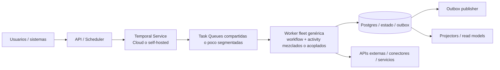
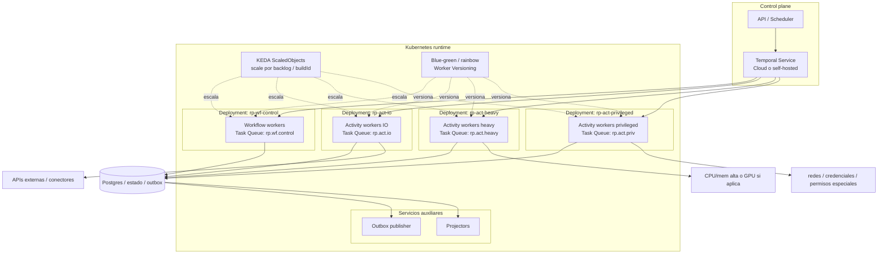
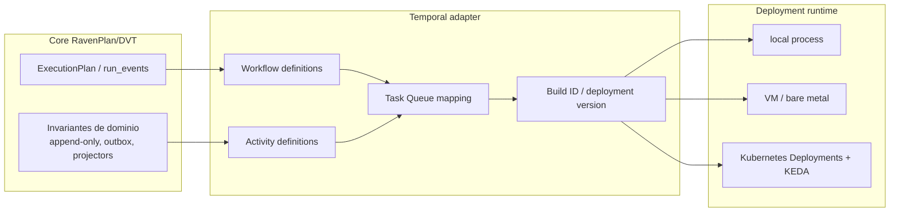
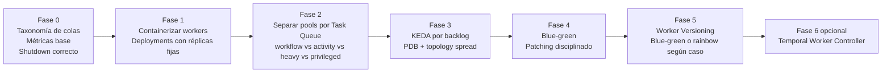

# Propuesta de arquitectura para RavenPlan/DVT sobre Temporal + Kubernetes

## Resumen ejecutivo

### Propuesta recomendada

**No hacer RavenPlan “Kubernetes-native” en el sentido de ejecutar cada workflow, step o activity como un `Job`/`Pod` efímero.**

**Sí usar Kubernetes como runtime estándar de la flota de workers y de los servicios auxiliares**, manteniendo a **Temporal como único orquestador de ejecución durable**.

El modelo objetivo es este:

- **Temporal sigue siendo el motor** de workflows, estado, replay, retries y encolado.
- **Kubernetes pasa a ser el runtime** donde viven los worker pools y los componentes auxiliares (`api`, `scheduler`, `outbox-publisher`, `projectors`).
- La flota de workers se separa por **`Task Queue × perfil de ejecución × frontera de versionado`**.
- El escalado se hace por **backlog real** con **KEDA** sobre las `Task Queue` de Temporal.
- Los despliegues de código de workflow pasan de “rolling deploy” a **blue-green** como mínimo, y a **rainbow** sólo donde tenga sentido, para poder usar **Worker Versioning** de Temporal.
- **Outbox y projectors** siguen siendo servicios propios; no se fuerzan dentro de Temporal si su valor principal hoy es asegurar semántica de integración/eventos.

### Decisión principal

La ganancia de meter Kubernetes **no** está en “orquestar workflows mejor que Temporal”.
La ganancia está en:

1. **aislar** pools de workers por carga, permisos y recursos,
2. **escalar** por backlog real,
3. **desplegar** código de workflow con menos riesgo,
4. **estandarizar** la operación de la flota.

### Qué no recomiendo como target por defecto

No recomiendo, salvo casos muy concretos, este modelo:

- `Workflow -> Kubernetes Job -> Pod efímero por task`
- `Activity -> Kubernetes Job -> Pod efímero`

Con Temporal debajo, ese patrón suele **duplicar dispatch, retry y scheduling** sin añadir semántica nueva. Sólo merece la pena si necesitáis **aislamiento duro por ejecución**, **GPU**, **sandboxing**, **tenant isolation fuerte** o ejecutar **código no confiable**.

---

## Contexto y premisas

Esta propuesta asume lo siguiente:

- RavenPlan/DVT ya usa **Temporal** como motor de workflows.
- El core de RavenPlan mantiene una idea de **kernel agnóstico** (`ExecutionPlan`, `run_events`, append-only, outbox, projectors), aunque la ejecución real hoy pasa por Temporal.
- La pregunta no es “si Kubernetes puede correr contenedores”, sino **si merece la pena introducirlo como sustrato operativo de la flota de workers**.

Temporal documenta que los **Workers son procesos externos** al Temporal Service, que los desarrolladores **operan esa flota**, y que Temporal sólo **orquesta transiciones de estado** y entrega trabajo a la siguiente entidad disponible.[^1]

Temporal también documenta que los workers son **horizontalmente escalables**, que múltiples workers pueden hacer `poll` sobre la misma `Task Queue`, y que la operación de workers puede hacerse en infraestructura propia, incluyendo Kubernetes.[^2][^3]

---

## Lo que hay hoy

### Lectura arquitectónica actual

Lo que tenéis hoy, simplificando, es esto:



### Características de este estado

- La semántica fuerte ya la pone **Temporal**.
- El punto más probable de fricción está en la **flota de workers**:
  - colas demasiado compartidas,
  - despliegues con blast radius amplio,
  - poca separación entre workflow workers y activity workers,
  - escalado más basado en “réplicas por intuición” que en backlog.
- Kubernetes, si entra, debe entrar **a resolver eso**, no a reescribir la semántica de ejecución.

---

## Opciones evaluadas

| Opción                                      | Descripción                                                           | Encaje con Temporal |     Coste |     Valor | Veredicto                                                    |
| ------------------------------------------- | --------------------------------------------------------------------- | ------------------: | --------: | --------: | ------------------------------------------------------------ |
| A. Mantener runtime actual                  | Workers fuera de Kubernetes, con el modelo actual                     |                Alto |      Bajo |     Medio | Válida si la carga es estable y la operación actual no duele |
| B. **Workers en Kubernetes por pool/queue** | Temporal sigue orquestando; Kubernetes opera, aísla y escala la flota |        **Muy alto** | **Medio** |  **Alto** | **Recomendada**                                              |
| C. Pod/Job por workflow o activity          | Cada ejecución importante se materializa en Pod/Job efímero           |          Bajo/medio |      Alto | Selectivo | Sólo para casos especiales                                   |

### Por qué gana la opción B

Porque **respeta el modelo nativo de Temporal**:

- Temporal sigue poniendo Tasks en `Task Queue` y asignándolas a workers externos.[^1]
- Podéis **escalar horizontalmente** varios workers sobre la misma cola o segmentar colas para aislar carga.[^2]
- KEDA os permite escalar deployments de Kubernetes **en función del backlog** de una `Task Queue` de Temporal, con soporte para `taskQueue`, `queueTypes` y `buildId`.[^4][^5]
- Temporal recomienda **Worker Versioning** como default para cambios de código de workflow en producción, y eso casa mejor con workers desplegados como unidades operables/versionables que con una flota amorfa.[^6]

---

## Propuesta clara

## Propuesta: **Temporal-native, Kubernetes-assisted**

### Principio 1

**Temporal es el único orquestador de workflows.**

Kubernetes no decide semántica de workflow, no hace retries de negocio, no decide replay, no decide timers ni estado. Eso sigue siendo trabajo de Temporal.[^1][^7]

### Principio 2

**Kubernetes opera la flota, no el grafo del workflow.**

Kubernetes se usa para:

- empaquetar workers,
- asignar recursos,
- aislar permisos y red,
- escalar por backlog,
- desplegar versiones,
- mejorar disponibilidad del runtime.

### Principio 3

**La unidad de despliegue deja de ser “el worker genérico” y pasa a ser “un pool con una responsabilidad clara”.**

La nueva frontera operativa debe ser:

```text
Task Queue × perfil de ejecución × frontera de versionado
```

Ejemplos:

- `rp-wf-control`
- `rp-act-io`
- `rp-act-heavy`
- `rp-act-privileged`
- `rp-projector`
- `rp-outbox-publisher`

---

## A dónde iríamos



### Qué cambia realmente

No cambia el motor de ejecución. Cambia **la forma de operar la flota**.

Antes:

- un worker grande o pocos pools amplios,
- despliegues con mucho acoplamiento,
- colas con semánticas mezcladas,
- menos control de recursos y permisos.

Después:

- pools pequeños y explícitos,
- despliegues por frontera de compatibilidad,
- colas por tipo de carga,
- autoscaling por backlog,
- versionado más seguro.

---

## Trade-offs

## Qué ganamos

### 1. Escalado por backlog real

Temporal expone métricas y estadísticas de `Task Queue` como `ApproximateBacklogCount`, `ApproximateBacklogAge`, `TasksAddRate` y `TasksDispatchRate`.[^8]

KEDA tiene un scaler nativo para Temporal que permite escalar por `taskQueue`, `queueTypes` y `buildId`, y puede actuar sobre `Deployment`, `StatefulSet` o recursos con `/scale`.[^4][^5]

**Ganancia práctica**:

- menos tuning manual de réplicas,
- capacidad de absorber picos,
- mejor separación entre colas calientes y frías.

### 2. Aislamiento por tipo de worker

Temporal diferencia explícitamente entre **Workflow Worker Process** y **Activity Worker Process**. Además, documenta que los activity workers pueden requerir acceso a red, credenciales o incluso GPU.[^1]

**Ganancia práctica**:

- workflow workers más limpios y predecibles,
- activity workers con permisos y recursos específicos,
- reducción del blast radius.

### 3. Despliegues más seguros del código de workflow

Temporal recomienda **Worker Versioning** como la opción por defecto para desplegar cambios de código de workflow en producción.[^6]

Los beneficios documentados incluyen:

- `ramping` gradual,
- validación antes de enviar tráfico completo,
- rollback instantáneo,
- `Workflow Pinning` para mantener una ejecución en una versión concreta.[^6]

**Ganancia práctica**:

- menos riesgo de romper workflows vivos,
- mejor rollback,
- menos dependencia de patching ad hoc a largo plazo.

### 4. Mejor plataforma para servicios auxiliares

Outbox publisher, projectors y otros consumidores pueden vivir también en Kubernetes como `Deployment` normales, con la misma disciplina operativa que los workers.

**Ganancia práctica**:

- un runtime estándar para todo el execution plane,
- observabilidad y despliegue homogéneos,
- recursos y alta disponibilidad mejor controlados.

---

## Qué cuesta

### 1. Más complejidad de plataforma

Pasáis a operar:

- cluster,
- imágenes,
- despliegues,
- `ScaledObject` de KEDA,
- políticas de recursos,
- permisos de runtime,
- más unidades desplegables.

Esto es un coste real.

### 2. Dos bucles de control

Tendréis que coordinar:

- **tuning interno del worker**: slots, pollers, caches, concurrencia,[^8]
- **escalado externo del deployment**: KEDA/HPA.[^5]

Eso obliga a separar dos problemas distintos:

- **cuánto trabajo puede procesar bien una réplica**, y
- **cuántas réplicas hacen falta**.

### 3. Disciplina fuerte de colas y ownership

Si no definís bien las `Task Queue`, acabáis metiendo en Kubernetes una flota igualmente caótica, sólo que con YAML.

La propuesta sólo funciona si existe:

- taxonomía de colas,
- ownership por pool,
- límites claros de responsabilidad,
- criterios de recursos por deployment.

### 4. Cambio del modelo de despliegue

Temporal documenta que los **rolling deploys son incompatibles con Worker Versioning**.[^9]

Eso implica cambiar la práctica de despliegue de workers versionados hacia:

- **blue-green** como mínimo,
- **rainbow** donde queráis `Workflow Pinning` real.[^9]

### 5. Worker Versioning aún tiene una cautela importante

La documentación actual de Temporal indica que **Worker Versioning está en Public Preview** y publica versiones mínimas de SDK/Server/CLI/UI.[^6]

**Trade-off**:

- si vuestro stack ya cumple versiones y aceptáis Preview en producción, se puede adoptar;
- si no, la transición debe pasar primero por **patching** y por un modelo de despliegue preparado para versionado, aunque aún no activéis la funcionalidad.[^9]

---

## Qué no ganamos

- No ganamos más durabilidad de workflow: eso ya lo da Temporal.[^1][^7]
- No ganamos mejor replay: eso ya lo da Temporal.[^7]
- No ganamos retries de negocio adicionales: eso ya lo da Temporal.
- No ganamos valor automático por crear `Job`/`Pod` por cada activity.

Kubernetes **no sustituye** el modelo de ejecución de Temporal; sólo mejora la forma de operar la flota que ejecuta el código.

---

## Cómo tendría que ser el sistema para llegar a esta propuesta

## 1. Separación explícita entre core, adapter y runtime

El sistema debería quedar conceptualmente así:



### Implicación

El **core no debe saber de Kubernetes**.

Lo que sí debe conocer el sistema es algo así como:

- qué clase de trabajo es,
- qué `Task Queue` usa,
- qué recursos/permisos necesita,
- qué frontera de versionado tiene.

Eso es metadata de ejecución, no lógica de dominio.

---

## 2. Taxonomía de worker pools

Propongo este mínimo:

### `rp-wf-control`

- Ejecuta **Workflow Tasks**.
- Sin dependencias externas fuertes.
- Sin privilegios extra.
- Réplicas mínimas > 0 en producción.
- Despliegue más conservador.

### `rp-act-io`

- Activities con I/O externo.
- Escalado por backlog.
- Permisos/red controlados.

### `rp-act-heavy`

- Activities CPU/mem intensivas.
- Requests/limits específicos.
- Node groups o clases de nodo dedicadas si hace falta.

### `rp-act-privileged`

- Activities con credenciales o acceso a red/sistemas sensibles.
- Aislamiento más duro de permisos, secrets y network policy.

### `rp-outbox-publisher`

- Proceso largo que drena outbox y publica fuera.
- No necesita convertirse en workflow.

### `rp-projector`

- Proyecciones y read models.
- Debe seguir siendo idempotente y reconstruible.

---

## 3. Modelo de despliegue

### Lo mínimo viable correcto

Cada pool anterior debería ser un **Deployment** de Kubernetes.[^10]

Y cada deployment debería tener, como mínimo:

- `requests/limits` explícitos,
- `readiness/liveness`,
- `terminationGracePeriodSeconds` alineado con vuestro shutdown,
- `PodDisruptionBudget` para proteger disponibilidad ante evicciones voluntarias,[^11]
- `topologySpreadConstraints` para no concentrar todos los pods en el mismo nodo o zona.[^12]

### Por qué importa esto

Temporal reubica trabajo entre workers cuando hay fallos; pero si la plataforma os baja demasiados pods a la vez o concentra réplicas en un único dominio de fallo, el runtime se vuelve frágil.[^8][^11][^12]

---

## 4. Autoscaling

### Recomendación

Usar **KEDA** como plano de autoscaling de deployments de workers.

El scaler de Temporal soporta:

- `taskQueue`,
- `queueTypes` (`workflow`, `activity` o ambos),
- `buildId`,
- `selectAllActive`,
- `selectUnversioned`.[^4]

KEDA usa `ScaledObject` para escalar `Deployment`, `StatefulSet` y otros recursos con subrecurso `/scale`.[^5]

### Política sugerida

- `workflow workers`: **no escalar a 0** por defecto.
- `activity workers` fríos o bursty: se puede evaluar `minReplicaCount = 0` o muy bajo.
- `outbox/projectors`: mínimo > 0 salvo casos muy concretos.

Esta es una recomendación arquitectónica, no una regla del producto. La razón es que workflow workers tienden a beneficiarse de mantener pollers/caché calientes y de evitar cold-start innecesario; eso debe confirmarse con métricas reales de backlog, slots y latencia.[^8]

---

## 5. Versionado y despliegues de código

### Objetivo final

Adoptar **Worker Versioning** donde aporte valor y donde las versiones del stack lo permitan.[^6]

### Política recomendada

- **Blue-green** como baseline para pools con código de workflow.
- **Rainbow** sólo para workflows largos o tipos que queráis fijar con `Pinned`.
- **Rolling update** sólo en componentes donde no dependáis de Worker Versioning o donde el riesgo de compatibilidad sea irrelevante.[^9]

### Nota importante

Temporal documenta también una limitación operacional: durante ramping, si la versión `Current` o `Ramping` está caída o sin capacidad suficiente, puede haber **queue blocking** para workflows nuevos o `Auto-Upgrade`.[^6]

Eso implica que el sistema debe tener:

- capacidad mínima garantizada en versiones activas,
- alertas por backlog/version skew,
- disciplina de rollout y rollback.

### Si aún no podéis usar Worker Versioning

Entonces el camino correcto no es bloquear la evolución. Es este:

1. separar pools,
2. introducir blue-green a nivel de deployment,
3. seguir con **patching** para cambios no replay-safe,
4. activar Worker Versioning cuando versiones y apetito de riesgo lo permitan.[^9]

---

## 6. Observabilidad

Temporal recomienda tunear workers basándose en métricas de slots, pollers, latencia, backlog y failure modes.[^8]

La instrumentación mínima objetivo debería cubrir:

- `approximate_backlog_count`,
- `ApproximateBacklogAge`,
- `TasksAddRate`,
- `TasksDispatchRate`,
- `worker_task_slots_available`,
- `num_pollers`,
- CPU/memoria por deployment,
- latencia media y p95 por tipo de activity,
- fallos por causa (`RESOURCE_EXHAUSTED`, `DEADLINE_EXCEEDED`, etc.).[^8]

Sin esto, el autoscaling y el tuning se vuelven opinión.

---

## 7. Seguridad y aislamiento

La propia documentación de Temporal explica que los activity workers pueden necesitar red, credenciales o GPU.[^1]

Por tanto, la propuesta exige separar:

- workers con acceso a red externa,
- workers con credenciales privilegiadas,
- workers con perfiles de recursos distintos.

Esa separación no es sólo operativa; es también una frontera de riesgo.

---

## Ruta de transición



## Fase 0 — Preparación

### Objetivo

Preparar el sistema para que Kubernetes no entre a ciegas.

### Cambios

- inventario de workflows, activities y servicios auxiliares,
- clasificación por perfil: `workflow`, `io`, `heavy`, `privileged`,
- definición de taxonomía de `Task Queue`,
- métricas base de backlog/capacidad/latencia,
- shutdown elegante de workers,
- build metadata inyectada en cada worker.

### Resultado esperado

- sabéis qué colas existen,
- qué cuesta cada una,
- y qué pools necesitáis de verdad.

## Fase 1 — Kubernetes sin cambio semántico

### Objetivo

Mover los workers a Kubernetes **sin cambiar el modelo de ejecución**.

### Cambios

- empaquetar workers como contenedores,
- desplegar cada worker principal como `Deployment`,
- réplicas fijas,
- secrets/config runtime,
- `readiness/liveness`,
- observabilidad básica.

### Resultado esperado

- Kubernetes ya opera la flota,
- pero sin autoscaling ni versioning avanzado todavía.

## Fase 2 — Separación de pools

### Objetivo

Dejar de tener una flota genérica.

### Cambios

- separar workflow workers de activity workers,
- aislar heavy/privileged,
- opcionalmente separar projectors y outbox como servicios dedicados.

### Resultado esperado

- menos blast radius,
- permisos más limpios,
- colas más legibles,
- tuning más fino.

## Fase 3 — Autoscaling por backlog

### Objetivo

Escalar por señal real.

### Cambios

- `ScaledObject` de KEDA por pool,
- mínimos y máximos explícitos,
- `cooldown` y `fallback` definidos,
- alertas de backlog.

### Resultado esperado

- la capacidad sigue a la cola,
- no a una cifra fija “por si acaso”.

## Fase 4 — Modelo de despliegue correcto

### Objetivo

Preparar el camino para versionado seguro.

### Cambios

- abandonar rolling update en pools sensibles,
- introducir blue-green,
- usar patching donde todavía haga falta compatibilidad replay-safe.

### Resultado esperado

- despliegues con rollback más limpio,
- menor riesgo de romper workflows vivos.

## Fase 5 — Worker Versioning

### Objetivo

Versionar workers de forma nativa en Temporal.[^6]

### Cambios

- activar `Build ID`/deployment version en workers soportados,
- definir `Pinned` vs `Auto-Upgrade` por tipo de workflow,
- usar `ramping` progresivo,
- monitorizar capacidad de `Current` y `Ramping`.

### Resultado esperado

- versionado de workflow code con mucho menos riesgo,
- mejor operativa de upgrades y rollbacks.

## Fase 6 — Temporal Worker Controller (opcional)

### Objetivo

Automatizar despliegues versionados en Kubernetes si el coste operativo ya lo justifica.

Temporal documenta que podéis usar el **Temporal Worker Controller** para gestionar y escalar workers en pods de Kubernetes, y también para habilitar modelos como rainbow más fácilmente.[^3][^9]

### Cuándo sí

- muchos pools,
- muchos despliegues versionados,
- necesidad real de automatizar el lifecycle.

### Cuándo no

- si con blue-green bien hecho y KEDA ya tenéis suficiente.

---

## Rationale

### Por qué esta propuesta tiene sentido para RavenPlan/DVT

1. **No pelea contra Temporal; se apoya en él.**  
   Temporal dice explícitamente que el código se ejecuta en workers externos y que el servicio sólo orquesta estado y despacho.[^1]

2. **Ataca el problema correcto.**  
   El problema no es “cómo representar workflows”; eso ya está resuelto. El problema es cómo **operar** mejor la flota.

3. **Separa preocupaciones.**
   - Temporal: durable execution.
   - Kubernetes: runtime, aislamiento, despliegue, escalado.
   - RavenPlan core: invariantes de dominio y modelo auditable.

4. **Evita el error de duplicar schedulers.**  
   Pod/Job por activity sólo tiene sentido en escenarios especiales; como estrategia por defecto, complica más de lo que aporta.

5. **Permite una adopción incremental.**  
   No obliga a “big bang”. Primero se gana operativa; luego autoscaling; luego versioning.

---

## Criterio de decisión

## Adoptaría esta propuesta si se cumple al menos una parte relevante de esto

- varias `Task Queue` con perfiles de carga distintos,
- picos o backlog variable,
- necesidad de aislar credenciales/red/recursos,
- dolor real en despliegues de workflow code,
- necesidad de rollback rápido,
- equipo con capacidad razonable de operar Kubernetes.

## No la priorizaría todavía si esto sigue siendo cierto

- pocas colas,
- carga estable,
- workers homogéneos,
- despliegues poco frecuentes,
- equipo pequeño sin músculo de plataforma,
- bajo valor esperado del autoscaling/versioning.

En ese caso, la decisión correcta puede ser **seguir fuera de Kubernetes** o hacer sólo una parte del camino.

---

## Recomendación final

**Sí recomiendo introducir Kubernetes, pero sólo como runtime operativo de la flota de workers y servicios auxiliares.**

La propuesta concreta es:

1. **Temporal sigue siendo el motor único**.
2. **Separar worker pools** por `Task Queue × recurso × versión`.
3. **Mover esos pools a Kubernetes** como `Deployment`.
4. **Escalar con KEDA** usando backlog real de Temporal.
5. **Adoptar blue-green** primero y **Worker Versioning** después, cuando versiones y riesgo lo permitan.
6. **No** usar `Job`/`Pod` por activity salvo casos especiales.

Esa es, en mi opinión, la mejor relación entre:

- encaje con Temporal,
- ganancia operativa,
- coste de plataforma,
- y riesgo de complejidad accidental.

---

## Referencias

[^1]:
    Temporal — What is a Worker Process?  
     https://docs.temporal.io/workers

[^2]:
    Temporal — Worker tuning quick reference (cómo trabajan los workers, escalado horizontal, métricas de `Task Queue`)  
     https://docs.temporal.io/develop/worker-tuning-reference

[^3]:
    Temporal — Worker deployments (workers en cualquier infraestructura, Worker Controller opcional en Kubernetes)  
     https://docs.temporal.io/production-deployment/worker-deployments

[^4]:
    KEDA — Temporal scaler (`taskQueue`, `queueTypes`, `buildId`, `selectAllActive`, `selectUnversioned`)  
     https://keda.sh/docs/2.19/scalers/temporal/

[^5]:
    KEDA — `ScaledObject` spec (escala `Deployment`, `StatefulSet` y recursos con `/scale`)  
     https://keda.sh/docs/2.19/reference/scaledobject-spec/

[^6]:
    Temporal — Worker Versioning (recomendación, beneficios, preview y versiones mínimas)  
     https://docs.temporal.io/production-deployment/worker-deployments/worker-versioning

[^7]:
    Temporal — Workflows (durable execution, replay y determinismo)  
     https://docs.temporal.io/workflows

[^8]:
    Temporal — Worker tuning / performance / backlog / pollers / slots  
     https://docs.temporal.io/develop/worker-tuning-reference

[^9]:
    Temporal — Worker Versioning deployment strategies (rolling incompatible, blue-green/rainbow)  
     https://docs.temporal.io/production-deployment/worker-deployments/worker-versioning

[^10]:
    Kubernetes — Deployments  
     https://kubernetes.io/docs/concepts/workloads/controllers/deployment/

[^11]:
    Kubernetes — PodDisruptionBudget  
     https://kubernetes.io/docs/tasks/run-application/configure-pdb/

[^12]:
    Kubernetes — Pod Topology Spread Constraints  
     https://kubernetes.io/docs/concepts/scheduling-eviction/topology-spread-constraints/
