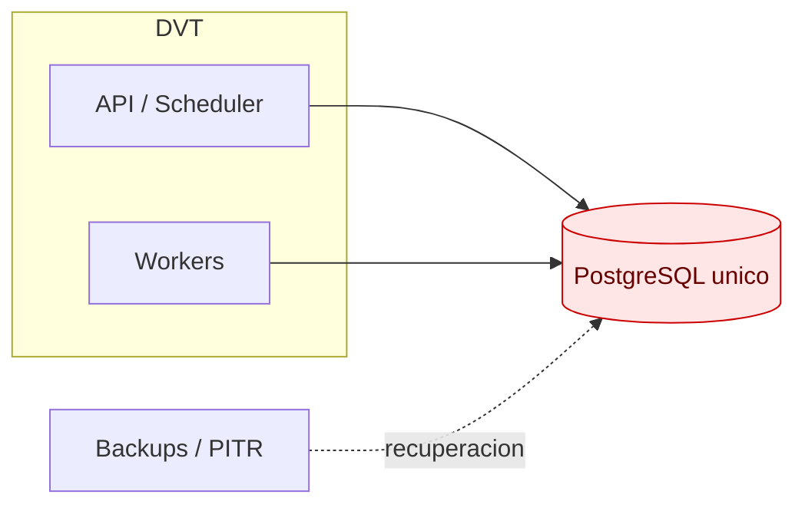
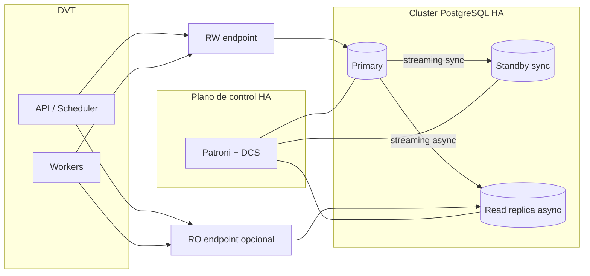
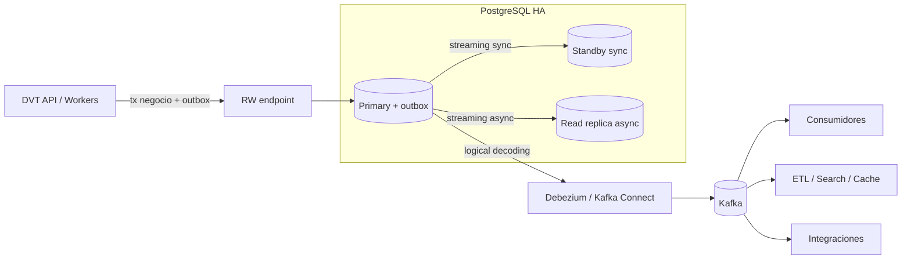
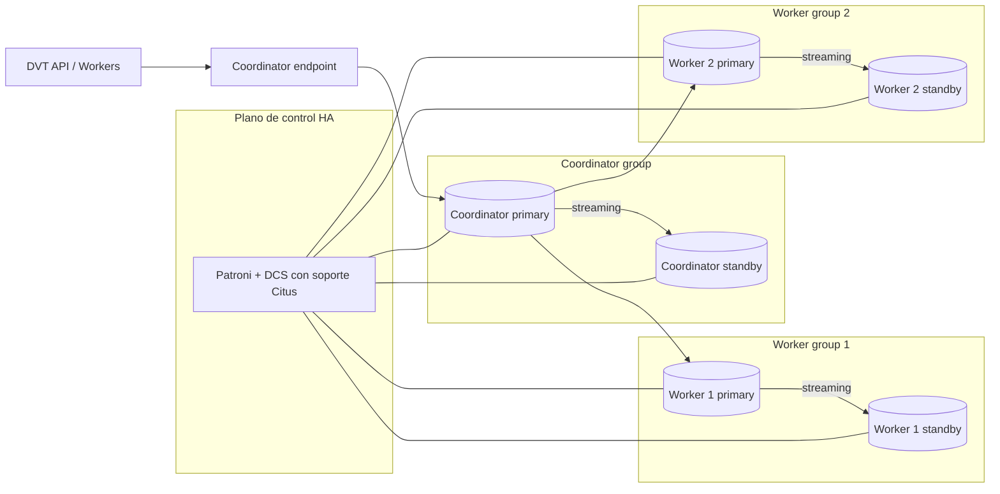
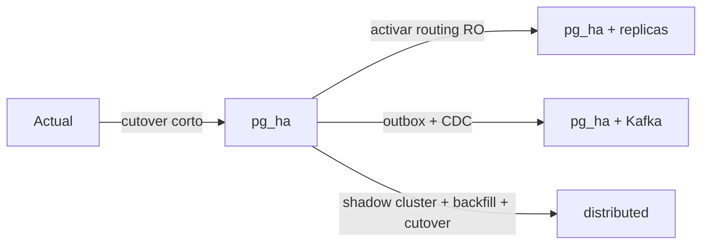

# DVT — Propuesta de arquitectura para eliminar SPOF y dejar una vía abierta a Kafka

## 1. Objetivo

**Prioridad principal:** eliminar el **SPOF** del backend de persistencia con el menor cambio posible en DVT.

**Objetivos secundarios:**

- habilitar **alta disponibilidad** y **lecturas escalables**;
- dejar una vía **abierta a Kafka** para integración asíncrona;
- conservar una opción **distribuida** si más adelante el problema pasa de disponibilidad a **escala horizontal**.

---

## 2. Supuestos de partida

Esta propuesta asume lo siguiente:

- DVT usa hoy un **adaptador PostgreSQL** para persistencia.
- El estado actual más probable es un **único PostgreSQL** que sirve lectura y escritura.
- No se ha validado aquí el **DDL real**, las **migraciones** ni las **queries calientes** del repo; por tanto, esta es una **propuesta de referencia** y no un dictamen final de compatibilidad.

---

## 3. Principio de decisión

El criterio rector es:

1. **Eliminar SPOF primero**.
2. **No reabrir el modelo de datos** si no es necesario.
3. Añadir **Kafka** como **eje de eventos**, no como reemplazo inmediato del sistema transaccional.
4. Pasar a **distribuido** solo si la limitación real deja de ser disponibilidad y pasa a ser **escritura, capacidad o hotspots de tenant**.

---

## 4. Estado actual asumido

### 4.1 Diagrama de lo que hay hoy



### 4.2 Lectura del estado actual

- El nodo PostgreSQL concentra **escritura, lectura y metadatos**.
- Los backups reducen **RPO/RTO**, pero **no eliminan el SPOF**.
- Si el nodo cae, DVT pierde el backend activo hasta restauración o intervención manual.

**Conclusión:** la primera decisión correcta no es “Kafka o distribuido”, sino **quitar el SPOF del primario**.

---

## 5. Propuesta A — PostgreSQL HA + réplicas

> **Modo recomendado por defecto** para DVT.

### 5.1 Topología propuesta



### 5.2 Qué resuelve

- Elimina el **SPOF del host/instancia primaria**.
- Permite **failover automático**.
- Habilita **réplicas de lectura** para offload de queries no críticas.
- Mantiene la semántica más cercana al adaptador PostgreSQL actual.

### 5.3 Qué no resuelve

- **No escala escritura horizontalmente**.
- Sigue existiendo un **único writer lógico**.
- Las lecturas **read-after-write** fuertes deben seguir yendo al **primary**.

### 5.4 Requisitos

#### Requisitos de infraestructura

- **Patroni** o servicio gestionado equivalente para HA.
- **DCS / quorum** para orquestación: Kubernetes, etcd, Consul o similar.
- **Backups + PITR** aunque haya HA.
- **Endpoints estables**:
  - `rw` para escritura y lecturas consistentes;
  - `ro` para lecturas tolerantes a réplica.

#### Requisitos de aplicación

- Separar acceso entre:
  - `writer`
  - `reader`
- Definir una **política de consistencia**:
  - `primary` para lecturas críticas;
  - `replica_eventual` para reporting/listados;
  - opcionalmente `remote_apply` si necesitáis read-after-write en réplica a costa de latencia.
- Instrumentar **lag de réplica**, tiempo de failover y health checks.

### 5.5 Coste relativo

| Dimensión               | Valor          |
| ----------------------- | -------------- |
| Infraestructura         | **Media**      |
| Operación               | **Media**      |
| Riesgo de migración     | **Bajo-Medio** |
| Cambio funcional en DVT | **Bajo**       |

### 5.6 Rationale

Esta opción es la mejor cuando la prioridad es **disponibilidad** y no **escala de escritura**. PostgreSQL HA mantiene un modelo de **primary read/write + standbys**, y hot standby permite consultas **solo lectura** sobre réplicas [R1][R2]. Patroni existe precisamente para orquestar HA de PostgreSQL y también soporta despliegues con Citus más adelante [R3][R4].

### 5.7 Configuración sugerida del modo

```yaml
storage:
  mode: pg_ha
  writer_endpoint: postgres-rw.service
  reader_endpoint: postgres-ro.service

reads:
  default_consistency: primary # primary | replica_eventual

ha:
  managed_by: patroni
  backup_strategy: pitr

events:
  mode: off # off | outbox_cdc
```

---

## 6. Extensión abierta a Kafka

> Kafka aquí **no sustituye PostgreSQL**. Kafka se introduce como **canal de eventos**, no como base transaccional principal.

### 6.1 Topología propuesta



### 6.2 Por qué esta opción sí encaja

- Permite **desacoplar** integraciones sin tocar el writer principal.
- Evita la **doble escritura no atómica** usando patrón **outbox**.
- Abre el camino a casos de uso de:
  - integración con otros servicios;
  - indexación/búsqueda;
  - analítica near-real-time;
  - cachés derivadas;
  - notificaciones.

### 6.3 Qué no debe interpretarse

- **Kafka no elimina el SPOF del writer** si PostgreSQL sigue siendo único.
- **Kafka no reemplaza** de forma natural las garantías transaccionales/relacionales de PostgreSQL.
- Por tanto, **Kafka es una extensión**, no el primer paso para resolver disponibilidad del backend.

### 6.4 Requisitos

- Tabla **outbox** dentro de la misma transacción que la escritura de negocio.
- **Debezium PostgreSQL connector**.
- PostgreSQL con:
  - `wal_level=logical`
  - replication slot
  - publication / subscriber si aplica
- Observabilidad de:
  - lag del connector,
  - crecimiento de WAL retenido por slots,
  - DLQ y retries de consumidores.
- Gobierno de eventos:
  - versionado,
  - claves de partición,
  - compatibilidad hacia atrás.

### 6.5 Coste relativo

| Dimensión               | Valor          |
| ----------------------- | -------------- |
| Infraestructura         | **Media-Alta** |
| Operación               | **Media-Alta** |
| Riesgo de migración     | **Bajo-Medio** |
| Cambio funcional en DVT | **Bajo-Medio** |

### 6.6 Rationale

Debezium documenta el patrón **outbox** precisamente para evitar inconsistencias entre el estado interno de la aplicación y los eventos consumidos por otros sistemas [R10][R11]. PostgreSQL logical replication permite publicar cambios de datos con modelo **publish/subscribe**, pero el **DDL no se replica** automáticamente [R8][R9].

### 6.7 Configuración sugerida del modo

```yaml
storage:
  mode: pg_ha
  writer_endpoint: postgres-rw.service
  reader_endpoint: postgres-ro.service

events:
  mode: outbox_cdc
  connector: debezium
  topic_prefix: dvt
  partition_key: tenant_id
```

---

## 7. Propuesta B — Distribuido con Citus

> **Modo opt-in**, no modo por defecto.

### 7.1 Cuándo tiene sentido

Solo lo activaría si se cumple una de estas condiciones:

- el **writer** ya no escala aunque exista HA;
- aparecen **hotspots por tenant**;
- el volumen de datos requiere **sharding real**;
- necesitáis mover/aislar tenants con mayor granularidad;
- el patrón de acceso está claramente alineado con **tenant_id** o con **schema-per-tenant**.

### 7.2 Topología propuesta



### 7.3 Qué resuelve

- Permite **escala horizontal**.
- Reparte datos y carga entre workers.
- Es la vía natural si DVT es **multi-tenant** y las queries son **tenant-scoped**.

### 7.4 Qué complica

- Introduce **coordinator + workers**.
- Obliga a pensar en **modelo de datos distribuido**.
- La **HA por nodo** sigue siendo necesaria.
- En **row-based sharding**, no es un cambio transparente: puede requerir cambios en esquema, constraints y queries.

### 7.5 Requisitos

#### Requisitos mínimos de diseño

Elegir explícitamente uno de estos dos modelos:

1. **`citus_schema`**
   - Menos intrusivo si ya existe **schema-per-tenant**.
   - Mejor opción si el tenant ya está aislado a nivel de esquema.

2. **`citus_row`**
   - Requiere **tenant_id** como clave clara de distribución.
   - Requiere revisar:
     - PK / UNIQUE / FK;
     - joins cross-tenant;
     - queries sin filtro por tenant.

#### Requisitos operativos

- HA del coordinator y de cada worker.
- Pruebas de propagación de DDL.
- Pruebas de rebalanceo.
- Observabilidad por shard / tenant / node.
- Validación explícita del adaptador DVT sobre el SQL distribuido real.

### 7.6 Coste relativo

| Dimensión               | Valor          |
| ----------------------- | -------------- |
| Infraestructura         | **Alta**       |
| Operación               | **Alta**       |
| Riesgo de migración     | **Alta**       |
| Cambio funcional en DVT | **Medio-Alto** |

### 7.7 Rationale

Citus introduce un modelo de **coordinator + workers** y documenta que hay que pensar en el coste de conexiones, latencia de red y planificación multi-shard [R5]. Además, la guía de migración de Citus indica de forma explícita que el **row-based sharding no es un drop-in replacement** para todos los workloads [R6]. Incluso en Citus, la HA por nodo sigue apoyándose en **streaming replication** de PostgreSQL [R7].

### 7.8 Configuración sugerida del modo

```yaml
storage:
  mode: distributed
  engine: citus
  coordinator_endpoint: citus-coordinator-rw.service
  sharding_model: schema # schema | row
  distribution_key: tenant_id # solo si model=row

reads:
  default_consistency: coordinator

events:
  mode: off # o outbox_cdc en una fase posterior
```

---

## 8. Selector de modo de funcionamiento

### 8.1 Diagrama del selector

```mermaid
flowchart TB
    REQ[Request / Job / Tenant] --> SEL[Topology Resolver]

    SEL -->|storage.mode = pg_ha| PG[PostgreSQL HA]
    SEL -->|storage.mode = distributed| CT[Citus]

    SEL -. events.mode = outbox_cdc .-> CDC[Debezium]
    CDC --> K[(Kafka)]
```

### 8.2 Principio de diseño del selector

El sistema **sí puede seleccionar el modo**, pero debe hacerlo con estas restricciones:

- **Sí** a selección **por entorno** o **por tenant**.
- **No** a conmutación automática opaca entre `pg_ha` y `distributed` en mitad de una request.
- **Sí** a un eje separado para eventos:
  - `events.mode = off`
  - `events.mode = outbox_cdc`

### 8.3 Contrato sugerido

```yaml
selector:
  scope: tenant # global | tenant
  default_storage_mode: pg_ha
  default_events_mode: off

rules:
  - when: tenant_class == "default"
    storage_mode: pg_ha
    events_mode: off

  - when: tenant_class == "integrated"
    storage_mode: pg_ha
    events_mode: outbox_cdc

  - when: tenant_class == "hotspot"
    storage_mode: distributed
    events_mode: outbox_cdc
```

### 8.4 Recomendación de implementación

Primera fase:

- selector **global** por entorno.

Segunda fase:

- selector **por tenant**.

No recomiendo una tercera fase de “**autotuning**” que cambie de motor en tiempo real según carga: la semántica y los costes no son equivalentes.

---

## 9. ¿Se puede cambiar en caliente?

### 9.1 Diagrama de transición



### 9.2 Matriz de cambio

| Cambio                        | ¿Cambio en caliente?      | Comentario                                                                                 |
| ----------------------------- | ------------------------- | ------------------------------------------------------------------------------------------ |
| `actual -> pg_ha`             | **Sí, con cutover corto** | Es la mejor transición inicial. Patroni documenta conversión de standalone a clúster [R3]. |
| `pg_ha -> añadir replicas`    | **Sí**                    | Es principalmente routing y operación.                                                     |
| `pg_ha -> outbox_cdc`         | **Sí, casi en caliente**  | CDC sobre WAL; requiere preparar outbox y connector [R10][R11].                            |
| `pg_ha -> distributed`        | **No como toggle**        | Requiere shadow cluster, backfill, validación y cutover gestionado.                        |
| `distributed -> añadir Kafka` | **Depende**               | No lo tomaría como primer paso; primero abrir Kafka sobre `pg_ha`.                         |

### 9.3 Juicio técnico

- **Sí**: eliminar SPOF con `pg_ha` se puede hacer con una ventana de corte pequeña.
- **Sí**: abrir la arquitectura a Kafka con outbox + CDC es una evolución razonablemente segura.
- **No**: pasar a distribuido **no** debe tratarse como un “switch” runtime. Es una **migración controlada**.

---

## 10. Comparativa ejecutiva

| Opción               | Elimina SPOF           | Escala lectura | Escala escritura | Complejidad | Coste relativo | Recomendación                         |
| -------------------- | ---------------------- | -------------: | ---------------: | ----------: | -------------: | ------------------------------------- |
| Actual               | No                     |           Baja |             Baja |        Baja |           Baja | No mantener así                       |
| `pg_ha`              | Sí                     |          Media |             Baja |       Media |          Media | **Sí, ahora**                         |
| `pg_ha + replicas`   | Sí                     |           Alta |             Baja |       Media |          Media | **Sí, ahora o siguiente fase**        |
| `pg_ha + outbox_cdc` | Sí                     |           Alta |             Baja |  Media-Alta |     Media-Alta | **Sí, cuando haga falta integración** |
| `distributed`        | Sí, si hay HA por nodo |           Alta |       Media-Alta |        Alta |           Alta | **Solo si hay cuello real**           |

---

## 11. Recomendación final

### 11.1 Decisión propuesta

**Decisión base:**

- adoptar **`pg_ha`** como arquitectura por defecto;
- activar **réplicas** para lectura cuando la carga lo pida;
- mantener el sistema **abierto a Kafka** mediante **`events.mode = outbox_cdc`**;
- dejar `distributed` como modo **opt-in** para tenants o entornos que realmente lo requieran.

### 11.2 Secuencia sugerida

1. **Fase 1** — eliminar SPOF
   - `storage.mode = pg_ha`

2. **Fase 2** — escalar lectura
   - `storage.mode = pg_ha`
   - `reader_endpoint` activo

3. **Fase 3** — abrir integración asíncrona
   - `events.mode = outbox_cdc`

4. **Fase 4** — evaluar distribuido
   - solo si el writer, el volumen o el patrón multi-tenant lo justifican

### 11.3 Dictamen

Si el objetivo prioritario es **eliminar SPOF**, la propuesta correcta es:

- **primero `pg_ha + replicas`**,
- **después Kafka como extensión**,
- **y solo más tarde distribuido**.

---

## 12. Riesgos a validar contra el repo antes de cerrar la ADR

Antes de convertir esta propuesta en plan definitivo, hay que revisar en DVT:

- DDL real de tablas y migraciones;
- uso de PK / UNIQUE / FK;
- `UPSERT`, `ON CONFLICT`, secuencias, `JSONB`, arrays, UUID;
- queries calientes y si están o no filtradas por `tenant_id`;
- necesidad real de read-after-write fuerte;
- volumen por tenant y distribución de carga;
- expectativa de eventos e integraciones downstream.

---

## 13. Referencias oficiales

- [R1] PostgreSQL — High Availability, Load Balancing, and Replication  
  https://www.postgresql.org/docs/current/high-availability.html

- [R2] PostgreSQL — Hot Standby  
  https://www.postgresql.org/docs/current/hot-standby.html

- [R3] Patroni — Convert a Standalone to a Patroni Cluster  
  https://patroni.readthedocs.io/en/latest/existing_data.html

- [R4] Patroni — Citus support  
  https://patroni.readthedocs.io/en/latest/citus.html

- [R5] Citus — Concepts  
  https://docs.citusdata.com/en/stable/get_started/concepts.html

- [R6] Citus — Migrating an Existing App  
  https://docs.citusdata.com/en/stable/develop/migration.html

- [R7] Citus — Cluster Management / FAQ on failure handling  
  https://docs.citusdata.com/en/stable/admin_guide/cluster_management.html  
  https://docs.citusdata.com/en/stable/faq/faq.html

- [R8] PostgreSQL — Logical Replication  
  https://www.postgresql.org/docs/current/logical-replication.html

- [R9] PostgreSQL — Logical Replication Restrictions  
  https://www.postgresql.org/docs/current/logical-replication-restrictions.html

- [R10] Debezium — PostgreSQL connector  
  https://debezium.io/documentation/reference/stable/connectors/postgresql.html

- [R11] Debezium — Outbox Event Router  
  https://debezium.io/documentation/reference/stable/transformations/outbox-event-router.html

- [R12] Apache Kafka — KRaft  
  https://kafka.apache.org/documentation/#kraft

- [R13] Apache Kafka — Producer configs  
  https://kafka.apache.org/documentation/#producerconfigs
