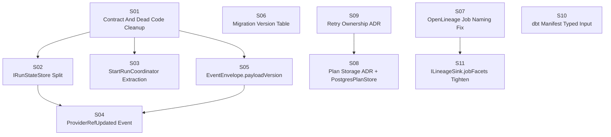

# Phase 2 Architectural Debt Roadmap

## Proposal Set Context

This document is part of the repository governance proposal set.

- Set entry point: [Repository Governance Proposal Set 2026-03-17](repository-governance-proposal-set-20260317.md)
- Role in set: execution roadmap
- Complementary proposals:
  - [Package Module Build Policy v2](package-module-build-policy-v2-20260317.md) defines target repository package policy
  - [CI Workflow Deduplication Plan](ci-workflow-deduplication-plan-20260307.md) defines how enforcement and CI orchestration should converge
  - [Documentation Usability Change Plan](documentation-usability-change-plan-20260308.md) defines how documentation and traceability around these slices should stay discoverable

This proposal groups the main post-Phase-1 architectural follow-ups into one
execution roadmap. It is planning material only: no slice below is implied to
be implemented by publication of this document.

## Purpose

- keep the major architectural debt items visible in one place
- show blocking relationships between slices
- give engineering a clean order of execution after Phase 1 gap closure

## Dependency Graph

## Execution Waves

| Wave | Slices                     | Can start                                            |
| ---- | -------------------------- | ---------------------------------------------------- |
| 0    | `S06`, `S07`, `S09`, `S10` | immediately                                          |
| 1    | `S01`                      | immediately                                          |
| 2    | `S02`, `S03`, `S05`, `S11` | after `S01` for `S02/S03/S05`; after `S07` for `S11` |
| 3    | `S04`, `S08`               | after `S02+S05` for `S04`; after `S09` for `S08`     |

## Slice Catalog

| Slice | Problem                                                        | Main paths                                                                             | Size | Risk   |
| ----- | -------------------------------------------------------------- | -------------------------------------------------------------------------------------- | ---- | ------ |
| `S01` | stale public contract surfaces and dead architecture artifacts | `@dvt/contracts`, `@dvt/engine`                                                        | S    | Low    |
| `S02` | `IRunStateStore` mixes write, read, and maintenance roles      | `@dvt/contracts`, `@dvt/engine`, `@dvt/adapter-postgres`, `@dvt/delivery`, `apps/api`  | M    | Medium |
| `S03` | `WorkflowEngine` still owns too much start-run orchestration   | `@dvt/engine`                                                                          | M    | Medium |
| `S04` | provider ref reconciliation is fail-soft but under-modeled     | `@dvt/contracts`, `@dvt/engine`, `@dvt/adapter-postgres`                               | M    | Medium |
| `S05` | event payload shape lacks explicit versioning                  | `@dvt/contracts`, `@dvt/engine`, adapters, projectors                                  | M    | Medium |
| `S06` | schema migrations have no applied-version table                | `@dvt/adapter-postgres`                                                                | S    | Low    |
| `S07` | lineage job naming and sink shape need tightening              | `@dvt/traceability-service`, lineage workers                                           | S    | Low    |
| `S08` | plan storage is implicit and provider-side only                | `@dvt/contracts`, `@dvt/adapter-postgres`, `@dvt/adapter-temporal`, planner/api wiring | L    | High   |
| `S09` | retry ownership rules are implicit across layers               | ADR/doc layer, engine, adapters                                                        | S    | Medium |
| `S10` | dbt manifest inputs stay too weakly typed at the boundary      | planner/contracts                                                                      | S    | Low    |
| `S11` | lineage sink facets are looser than the runtime now expects    | contracts + traceability                                                               | S    | Low    |

## Slice Summaries

### S01: Contract And Dead Code Cleanup

Remove or deprecate stale public surfaces and internal dead code that distort
the current architecture. The target includes ghost interfaces, obsolete
aggregate experiments, and stale type annotations that no longer match the real
engine/provider boundary.

Acceptance goals:

- stale public surfaces are removed or clearly deprecated
- dead internal code is deleted
- typed engine errors are used instead of message-based branching

### S02: `IRunStateStore` Split

Split the state-store contract into explicit write, read, and maintenance roles.
Keep a backward-compatible alias during transition, but move consumers onto the
narrowest dependency they actually need.

Acceptance goals:

- three role interfaces exist
- engine start/status paths no longer depend on maintenance-only methods
- projector/admin paths depend only on read + maintenance roles

### S03: `StartRunCoordinator` Extraction

Move the start-run orchestration out of `WorkflowEngine` into a dedicated
coordinator. This is a responsibility split, not a behavior change.

Acceptance goals:

- `WorkflowEngine` becomes a thin delegator for start-run orchestration
- dedicated tests cover bootstrap, dispatch, fail-soft metadata updates, and
  compensation paths

### S04: `ProviderRefUpdated` Event

Formalize the post-bootstrap provider reference reconciliation path so the event
stream makes the ref update explicit instead of treating it as silent metadata
mutation.

Acceptance goals:

- canonical event/contract for provider ref updates
- projector/state-store handling for the new event

### S05: `EventEnvelope.payloadVersion`

Add explicit payload versioning to event envelopes so consumers can evolve event
payload shapes safely over time.

Acceptance goals:

- payload version field exists in the canonical envelope
- adapters/projectors enforce or at least preserve the version value

### S06: Migration Version Table

Add an applied-migrations table so in-code schema migrations are resumable and
auditable after crashes or partial deploys.

### S07: OpenLineage Job Naming Fix

Normalize lineage job naming and related sink semantics so OpenLineage outputs
remain stable and queryable across workers.

### S08: Plan Storage ADR + `PostgresPlanStore`

Make plan storage explicit instead of leaving plan bytes purely behind provider
execution. This slice likely needs an ADR because it changes storage ownership.

### S09: Retry Ownership ADR

State explicitly where retry policy is owned across planner, engine, and
provider layers. The goal is to stop implicit overlap.

### S10: dbt Manifest Typed Input

Reduce `Record<string, unknown>` escape hatches around dbt manifest-derived
inputs so invalid configs are rejected earlier.

### S11: `ILineageSink.jobFacets` Tighten

Tighten the lineage sink contract to match the runtime assumptions already made
by the lineage path.

## Execution Notes

- Prefer slices `S06`, `S07`, `S09`, and `S10` first if the goal is fast
  momentum with low integration risk.
- Do not start `S04` until `S02` and `S05` are settled.
- Do not start `S08` until `S09` clarifies retry ownership.

## Non-Goals

- This proposal does not close any gap by itself.
- This proposal does not supersede current ADRs or status docs.
- This proposal does not mark any Phase 2 slice as implemented.
