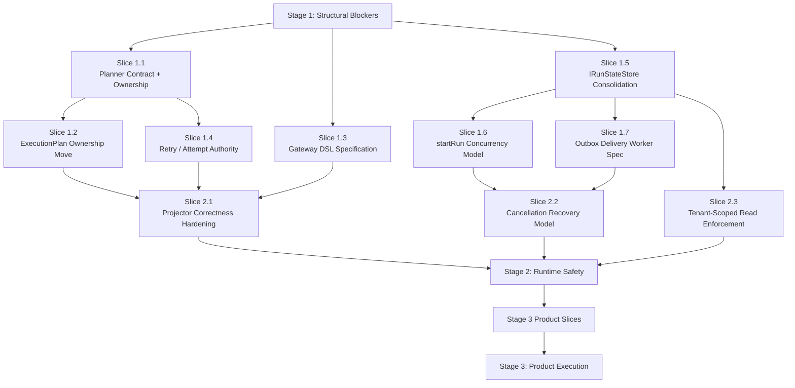

# Principal Architecture Review Execution Plan

This document turns the principal architecture review into staged execution
work. It is a proposal-backed plan. It is not a competing roadmap of record.

Primary source review:

- [Principal Architecture Review - DVT+](../reviews/20260316-principal-architecture-review.md)

Related proposal set:

- [Repository Governance Proposal Set](./repository-governance-proposal-set-20260317.md)
- [Package / Module / Build Policy v2](./package-module-build-policy-v2-20260317.md)
- [Monorepo Platform Optimization Plan](./monorepo-platform-optimization-plan-20260316.md)

## Goal

Close the highest-risk architectural gaps without drifting back into horizontal
cleanup work that does not advance product delivery.

## Stage Model

| Stage   | Intent                           | Outcome                                                                                                        |
| ------- | -------------------------------- | -------------------------------------------------------------------------------------------------------------- |
| Stage 1 | Close structural blockers        | Planner, execution-plan ownership, state contract, gateway DSL, and runtime authority become governable slices |
| Stage 2 | Close runtime safety gaps        | Concurrency, outbox delivery, cancellation recovery, and projector correctness are specified and hardened      |
| Stage 3 | Resume product-forward execution | Adapter and product slices proceed under the stabilized boundaries                                             |

## Parallelization Graph

## Stage 1: Structural Blockers

Stage 1 exists to stop semantic drift. These slices are the minimum set needed
before more product-forward adapter or UI work.

### Slice 1.1 — Planner Contract And Ownership

**Problem**

The planner is architecturally central and operationally vague. The review
identified it as the least specified critical subsystem.

**Deliverables**

- canonical planner boundary
- planner responsibilities and non-responsibilities
- authoritative `ExecutionPlan` owner declaration
- dbt artifact ingestion scope
- plan generation algorithm surface

**Why first**

Without this, every later decision about `ExecutionPlan`, retries, cost, and
partial execution is guesswork.

### Slice 1.2 — ExecutionPlan Ownership Move

**Problem**

`ExecutionPlan` ownership is misplaced if the engine consumes only `PlanRef`
while plan semantics live effectively elsewhere.

**Depends on**

- Slice 1.1

**Deliverables**

- authoritative package and contract home for `ExecutionPlan`
- migration plan for existing references
- explicit planner/engine boundary note

### Slice 1.3 — Gateway DSL Specification

**Problem**

Runtime gateway evaluation currently threatens both determinism and the
"engine does not decide" boundary.

**Deliverables**

- grammar
- evaluator choice or constraints
- determinism rules
- security rules
- failure semantics

**Parallelization**

Can run in parallel with Slice 1.1, but its final acceptance must align with
the planner boundary defined there.

### Slice 1.4 — Retry / Attempt Authority

**Problem**

`logicalAttemptId` and retry ownership are conceptually inconsistent.

**Depends on**

- Slice 1.1

**Deliverables**

- authoritative owner for retry progression
- `logicalAttemptId` lifecycle
- planner policy vs engine enforcement split

### Slice 1.5 — IRunStateStore Consolidation

**Problem**

Multiple `IRunStateStore` variants create a correctness split across code and
contracts.

**Deliverables**

- one canonical interface
- deprecation/removal plan for duplicates
- explicit ownership in shared contracts

**Parallelization**

Can proceed independently of planner work.

### Slice 1.6 — startRun Concurrency Model

**Problem**

Current startup ordering handles one race and leaves the distributed
concurrency model underdefined.

**Depends on**

- Slice 1.5

**Deliverables**

- duplicate `startRun` semantics
- recovery behavior for bootstrap races
- invariants for engine instance concurrency

### Slice 1.7 — Outbox Delivery Worker Specification

**Problem**

Outbox exists as storage shape without a hardened delivery worker contract.

**Depends on**

- Slice 1.5

**Deliverables**

- pending/dead-letter lifecycle
- retry and backoff policy
- observability and recovery path

## Stage 1 Recommended Execution Order

| Slice                              | Cost   | Value    | Parallelizable |
| ---------------------------------- | ------ | -------- | -------------- |
| 1.1 Planner Contract And Ownership | High   | Critical | No             |
| 1.3 Gateway DSL Specification      | Medium | High     | Yes            |
| 1.5 IRunStateStore Consolidation   | Medium | Critical | Yes            |
| 1.2 ExecutionPlan Ownership Move   | Medium | High     | After 1.1      |
| 1.4 Retry / Attempt Authority      | Medium | High     | After 1.1      |
| 1.6 startRun Concurrency Model     | Medium | High     | After 1.5      |
| 1.7 Outbox Delivery Worker Spec    | Medium | High     | After 1.5      |

## Stage 2: Runtime Safety

Stage 2 turns the newly clarified boundaries into reliable runtime behavior.

- projector correctness under retries and duplicates
- stuck cancellation / recovery semantics
- tenant-scoped read enforcement on all operational query surfaces

This stage should not start until Stage 1 has stabilized the contract and
authority questions.

## Stage 3: Product Execution

Only after Stage 1 and the critical runtime safety slices from Stage 2 should
new adapter or product expansion resume aggressively.

Candidate Stage 3 product-forward themes:

- adapter-specific functional gaps
- product API slices on top of stable execution semantics
- analytics and UX slices that consume authoritative read models

## Non-Goals

- creating a new roadmap of record
- reopening broad monorepo cleanup as a primary workstream
- promising Conductor parity beyond state-equivalence
- starting plugin marketplace work before sandbox policy exists

## Decision

The next implementation slice should come from Stage 1, not from another
horizontal cleanup track.
