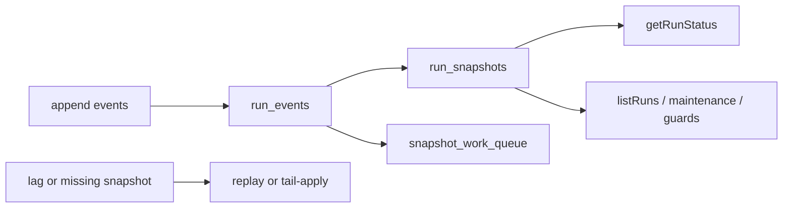
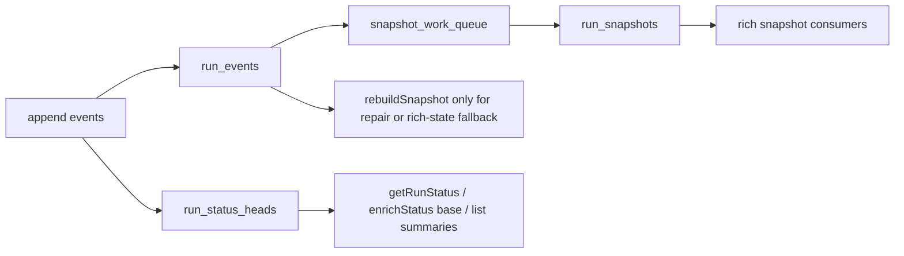

# Run status heads implementation plan

## Summary

This proposal implements `ADR-0045` by introducing a dedicated, query-shaped
status projection for hot run-status reads while keeping `run_snapshots` as the
rich secondary projection.

The plan follows mature, proven patterns:

- Temporal-style visibility vs history separation
- EventStoreDB/Kurrent projection separation from canonical event streams
- Kafka/ksqlDB-style materialized views that update incrementally on change

The key architectural rule is simple:

- hot status reads get a narrow inline-maintained read model;
- rich workflow snapshots remain asynchronously warmed and repairable.

## Governing Sources

- [ADR-0004](../../adr/ADR-0004-event-sourcing-strategy.md)
- [ADR-0013](../../adr/ADR-0013-run-state-store-bootstrapRunTx.md)
- [ADR-0015](../../adr/ADR-0015-getRunStatus-read-model-separation.md)
- [ADR-0031](../../adr/ADR-0031-adapter-tenant-isolation.md)
- [ADR-0045](../../adr/ADR-0045-dedicated-status-head-read-model.md)

## Proven Pattern Rationale

| Mature system          | Proven pattern                                      | Relevance to DVT                                                                                |
| ---------------------- | --------------------------------------------------- | ----------------------------------------------------------------------------------------------- |
| Temporal               | separate visibility APIs from workflow history      | status/list reads should not depend on replaying full execution history                         |
| EventStoreDB/Kurrent   | queryable projections over an immutable event store | the canonical event log remains authoritative while query models stay specialized               |
| Kafka Streams / ksqlDB | incrementally maintained materialized views         | efficient queries come from applying deltas to query-shaped state, not recomputing full history |

## Problem Statement

The current architecture still overloads `run_snapshots` with two incompatible
jobs:

1. rich workflow projection for steps and gateway state
2. latency-critical status polling source

That forces one of three bad outcomes:

- full snapshot write-through on every append
- read-time catch-up/replay under lag
- stale status reads

None of those is the right long-term shape.

## Objectives

1. Make `getRunStatus()` independent from `run_snapshots` freshness.
2. Keep authoritative status reads off the replay path in steady state.
3. Preserve append-only event sourcing as the canonical write model.
4. Keep `run_snapshots` available for rich workflow state, maintenance, and
   archive pinning.
5. Make queue lag in `snapshot_work_queue` operationally independent from hot
   status latency.

## Non-goals

1. No change to the canonical event log.
2. No removal of `run_snapshots`.
3. No provider-status enrichment redesign.
4. No speculative introduction of a generic projection framework in the same
   slice.
5. No hidden compatibility shim that silently preserves the old architecture.

## As-is vs Target

## Plan

### RSH-1: Contract and semantics clarification

Define the status-head payload and its freshness semantics.

Rules:

- hot-path correctness is anchored on authoritative lifecycle fields plus
  `last_run_seq`
- auditability remains anchored on canonical events, not on a digest of the
  read model
- Public HTTP shape remains the same unless a contract clarification is needed.

Output:

- engine-level note on status-head freshness/version semantics
- tests updated away from assumptions that hot status reads expose a digest of
  richer hidden workflow state

### RSH-2: Introduce status-head ports and reducer

Create narrow read/write interfaces for status heads.

Likely surfaces:

- `IRunStatusHeadStoreRead`
- `IRunStatusHeadStoreWrite`

Reducer responsibilities:

- derive status-head state from appended run events only
- update from `bootstrapRunTx()` and `appendAndEnqueueTx()`
- never replay full history in the hot path

Output:

- in-memory implementation
- adapter-neutral reducer logic

### RSH-3: Add PostgreSQL `run_status_heads`

Create additive Postgres storage and migration.

Expected table shape:

- `run_id` primary key
- `tenant_id`
- `status`
- `paused`
- `cancelling`
- `started_at`
- `completed_at`
- `last_run_seq`
- `updated_at`

Expected indexes:

- tenant/time index for recent reads
- tenant/status index for filtered list and maintenance queries

Backfill strategy:

- replay `run_events` into `run_status_heads` once during migration or
  controlled rebuild script
- verify `last_run_seq` alignment per run

### RSH-4: Cut engine and API hot paths over to status heads

Move these call sites away from `getSnapshot()` as the primary source:

- `WorkflowEngineCoreService.getStatus()`
- `WorkflowEngineCoreService.enrichStatus()` base projection
- API list/status-summary flow
- maintenance queries that only need run-level lifecycle state

Rules:

- steady-state hot reads must not call `listEvents()`
- queue lag in `snapshot_work_queue` must not affect correctness

### RSH-5: Re-scope `run_snapshots`

Once status-head reads are live:

- keep `run_snapshots` for rich state only
- keep `snapshot_work_queue` for rich projection warming and repair only
- remove any remaining claim that `run_snapshots` is the hot status source

At this point we can safely decide whether bootstrap snapshot seeding is still
needed for rich-state consumers, or whether those consumers should rebuild on
demand when the snapshot is absent.

### RSH-6: Shadow verification and rollout hardening

Before removing old assumptions, run a shadow comparison phase in tests and
non-user-facing diagnostics:

- compare `run_status_heads.status` against status derived from canonical
  replay on the same run
- compare `last_run_seq` against append results
- assert no hot-path `listEvents()` calls in engine status flows

This phase is what makes the rollout serious rather than aspirational.

## Pros

- Delivers the original performance goal with a design that matches mature
  event-sourced systems.
- Preserves clean separation between canonical events and query models.
- Lets `run_snapshots` stay rich without making status polling fragile.
- Makes snapshot worker lag an operational concern, not a user-facing latency
  concern.

## Cons

- Adds a second projection and more migration surface.
- Requires coordinated updates across engine, adapter, API, and tests.
- Increases verification burden during rollout because two projections coexist.

## Acceptance Criteria

1. `WorkflowEngineCoreService.getStatus()` does not depend on `listEvents()` in
   the steady-state hot path.
2. A delayed or stopped snapshot worker does not degrade `getRunStatus()`
   correctness or asymptotic cost.
3. `run_snapshots` can lag without affecting status polling.
4. `run_status_heads.last_run_seq` advances monotonically with appended events.
5. Status-summary APIs and maintenance reads can run without full replay.

## Validation Baseline

- `pnpm docs:sync`
- `pnpm verify:prepush`

Future implementation validation must also include:

- changed engine package tests
- changed adapter package tests
- migration and backfill coverage for `run_status_heads`
- shadow-equality tests against canonical replay

## Risks And Mitigations

| Risk                                        | Impact                               | Mitigation                                                                                                         |
| ------------------------------------------- | ------------------------------------ | ------------------------------------------------------------------------------------------------------------------ |
| Dual-projection drift                       | Wrong status exposed                 | compare status heads against canonical replay in tests and rollout diagnostics                                     |
| Legacy clients expecting snapshot digests   | Confusion at API boundary            | document contract cleanup and keep polling/version logic anchored on authoritative fields plus projection sequence |
| Incomplete field set in status head         | Future feature pressure              | keep scope explicit: run-level lifecycle only                                                                      |
| Backfill mistakes                           | Historical runs missing status heads | additive migration plus replay-based verification                                                                  |
| Silent reintroduction of replay in hot path | Latency regression                   | add tests that fail if hot-path status reads call `listEvents()`                                                   |

## Definition Of Done

1. `ADR-0045` is implemented, not just documented.
2. Hot status reads are backed by `run_status_heads`.
3. `run_snapshots` remains available as the rich async projection.
4. No placeholder flags, TODOs, or partial fake projections are introduced.
5. Final validation includes package tests plus `pnpm verify:prepush`.
