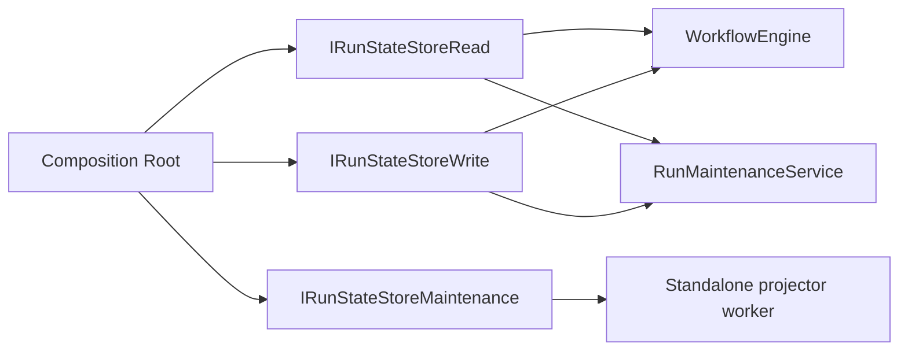

# DDD Pure Root And Aggregate Boundaries

## Goal

Make the composition root explicit about the state-store roles it binds, so the
runtime no longer reconstructs the dependency graph by intersection as a
convenience.

This slice is about DDD purity at the boundary:

- composition roots own wiring
- application services consume only the exact roles they need
- adapters implement the roles, but do not define the boundary shape
- optional maintenance capability is kept explicit and isolated

## Current Architecture

### Composition Roots

The current runtime roots bind state-store roles explicitly at the app
boundary, while the engine and maintenance internals still use compact
constructor shapes where that is the most direct form:

- `apps/api/src/modules/buildProtectedRuntimeModule.ts`
- `apps/api/src/runtime/intentReconcilerRuntime.ts`
- `apps/api/src/application/services/WorkflowEngineFactory.ts`

The remaining gap is the optional maintenance ownership decision, not the root
role names themselves.

### Application Services

The application services are already more precise internally:

- `WorkflowEngine` consumes explicit read/write roles for persistence
- `RunMaintenanceService` consumes explicit read/write roles for persistence

The gap is not inside the services. The gap is in the composition root and the
public wiring surface that still treats the store as a single convenience value.

### State-Store Roles

The canonical store roles already exist in the engine port package:

- `IRunStateStoreRead`
- `IRunStateStoreWrite`
- `IRunStateStoreMaintenance`

The current root exposes explicit role bindings through:

- `apps/api/src/modules/types.ts`
- runtime factory config objects
- test helpers that mirror production wiring

## Target Architecture

The target is a pure DDD wiring model:

1. The root names the roles explicitly.
2. The adapter is bound once, then split by role at the root boundary.
3. The application services receive the exact roles they need.
4. No consumer reconstructs `IRunStateStore` by intersection in its own config.
5. The optional maintenance query is either isolated behind a dedicated port or
   intentionally left unsupported with a documented decision.

### Target Boundary Shape

### What Changes Semantically

- `WorkflowEngine` should not depend on an aggregate convenience field.
- `RunMaintenanceService` should not depend on an aggregate convenience field.
- `buildProtectedRuntimeModule` should bind read/write roles explicitly.
- `intentReconcilerRuntime` should bind read/write roles explicitly.
- `WorkflowEngineFactory` should stop reconstructing the aggregate in the
  production path.

## Task Tracking Strategy

To stop multiple agents from colliding on Markdown tables, lane work is tracked
in YAML and rendered into Markdown views.

Canonical sources:

- `docs/planning/state/agent-lane-a.yaml`
- `docs/planning/state/agent-lane-b.yaml`
- `docs/planning/state/agent-lane-c.yaml`
- `docs/planning/state/agent-lane-d.yaml`

Rendered views:

- `docs/planning/state/agent-lane-a.md`
- `docs/planning/state/agent-lane-b.md`
- `docs/planning/state/agent-lane-c.md`
- `docs/planning/state/agent-lane-d.md`

The rule is simple:

1. edit the lane YAML, not the rendered Markdown table;
2. run `pnpm docs:sync`;
3. let the generated views and the global planning surfaces stay in sync.

## Why This Is Not "More DDD"

This is a boundary cleanup, not a new abstraction layer.

The target is not to add more domain objects. The target is to make the current
ports and aggregates explicit so the runtime matches the actual dependency
shape:

- domain rules stay in the domain/application layer
- adapters stay on the outside
- wiring stays in the composition root
- role identity stays visible instead of being hidden in intersections

## Task Tracking

### S18 - Explicit Role Bindings At The Composition Root

- **Priority:** P0
- **Status:** review
- **Dependency:** S02
- **Scope:** API runtime root, engine factory, intent reconciler runtime, test
  helpers
- **Target:** bind `IRunStateStoreRead` and `IRunStateStoreWrite` explicitly in
  the root and stop reconstructing the aggregate by convenience

### S19 - Isolate Maintenance Query Ownership

- **Priority:** P1
- **Status:** done
- **Dependency:** S18
- **Scope:** projector worker, snapshot query port, store implementations
- **Target:** move `listStaleSnapshotRuns` out of maintenance into a dedicated
  query port and keep maintenance write-only

### Future Follow-Up

The runtime export surface can be tightened further once the root wiring is
explicit:

- remove convenience aliases from public module types where they are no longer
  needed
- keep exact-role bindings visible in tests and helper builders
- add a guard against reintroducing intersection-based wiring at the root

## Acceptance Criteria

- composition roots expose explicit state-store role bindings
- no production root reconstructs the aggregate by intersection
- application services receive only the exact roles they use
- the follow-up maintenance ownership decision is documented and tracked
- the workboard and route docs stay synchronized with this slice
