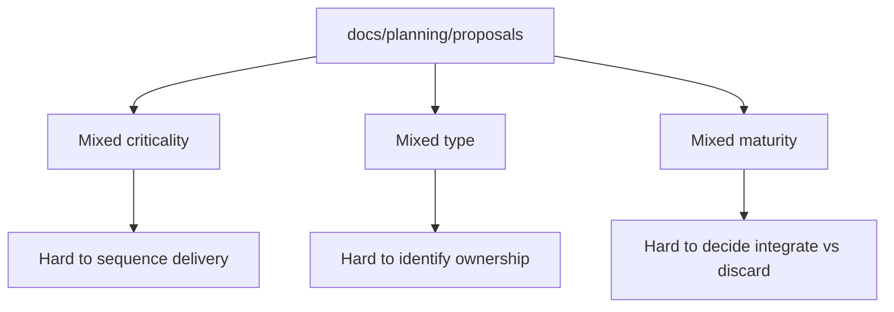
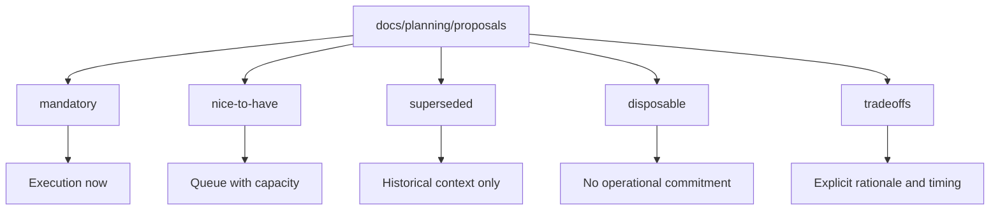

# Proposal Portfolio Tradeoffs 2026-04-03

This document defines portfolio-level rationale, effort, priority, expected
gain, and opportunity cost for integrating current proposals.

## Portfolio Before

## Portfolio After

## What We Gain

- Faster prioritization by separating mandatory work from optional ideas.
- Lower delivery noise by isolating superseded/disposable material.
- Better planning quality with explicit integration timing and opportunity cost.
- Clearer ownership by grouping by proposal type inside each priority class.

## Tradeoff Matrix

| Category                          | Scope                                                | Rationale                                                           | Effort | Priority | Integration Window                        | Opportunity Cost If Delayed                                       | Expected Gain                                        |
| --------------------------------- | ---------------------------------------------------- | ------------------------------------------------------------------- | ------ | -------- | ----------------------------------------- | ----------------------------------------------------------------- | ---------------------------------------------------- |
| `mandatory/governance-and-docs`   | Governance and documentation execution surfaces      | Required to keep docs and governance aligned with real system state | M      | P0       | Current sprint + next sprint              | Persistent drift in architecture truth and slower onboarding      | Governance consistency and lower coordination cost   |
| `mandatory/runtime-and-contracts` | Runtime correctness, contracts, admission, preflight | Protects reliability and compatibility at execution boundaries      | M-L    | P0       | Current sprint + next sprint              | Regressions and contract ambiguity in critical paths              | Lower production risk and stronger change safety     |
| `nice-to-have/architecture`       | Strategic architecture and operating model upgrades  | Increases long-term modularity and execution clarity                | M-L    | P1       | After P0 closure                          | Technical debt remains longer and refactors become costlier later | Better maintainability and cleaner boundaries        |
| `nice-to-have/frontend-and-ux`    | Front UX evolution and implementation roadmap        | Improves adoption and operator productivity                         | M      | P1       | Parallel lane when backend P0 is stable   | Slower product usability gains and delayed UX validation          | Better user efficiency and lower support friction    |
| `nice-to-have/platform-and-ai`    | AI/LLM/HA/K8s strategic proposals                    | Opens future capability but not blocking current closure            | M-L    | P2       | After architecture baseline stabilization | Lost experimentation window, but low immediate delivery impact    | Future scalability and automation options            |
| `superseded/runtime-and-delivery` | Replaced plans                                       | Preserve rationale and traceability without driving execution       | S      | P3       | No integration                            | Historical confusion if mixed with active plans                   | Cleaner active backlog and better decision history   |
| `disposable/*`                    | Experiments, assets, one-off manifests               | Keep references without polluting active planning surfaces          | S      | P3       | No integration                            | Minimal; mostly organizational noise                              | Cleaner proposal signal and faster review throughput |

## Integration Timing Rule

1. Integrate all `mandatory/*` proposals first.
2. Re-check dependency blockers in lane boards every sprint close.
3. Pull `nice-to-have/*` only when no `P0` proposal is blocked by capacity.
4. Keep `superseded/*` and `disposable/*` out of active sprint commitments.

## Effort Scale

- `S`: <= 2 engineer-days
- `M`: 3-8 engineer-days
- `L`: >= 9 engineer-days or cross-domain dependency
