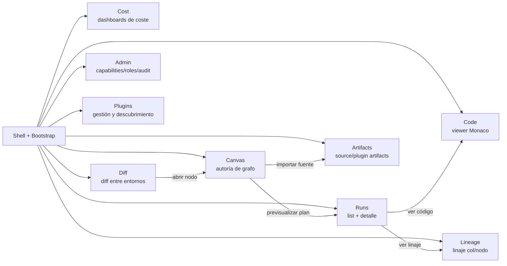
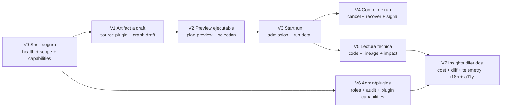

# DVT+ Web — Historias de Usuario

**Plan-driven. Outcome-agnostic.**

Propuesta verificada de historias de usuario para el front-end de DVT+. No es un catálogo
canónico todavía: es un mapa de producto que debe promoverse por verticales, con contrato,
tests y evidencia antes de convertirse en especificación gobernante.

Cada historia está anclada al código fuente real (vistas existentes en
`apps/web/src/app/views/`) y al modelo de dominio del backend (`@dvt/contracts`,
`@dvt/engine`, `apps/api`). Cuando una historia depende de una ruta no implementada o de una
capability todavía incompleta, el documento lo marca explícitamente como gap.

Las historias siguen el formato Connextra ampliado:

> **Como** `<persona>` **quiero** `<capacidad>` **para** `<resultado de negocio>`.

Cada historia incluye criterios de aceptación verificables, prioridad MVP / P1 / P2 y
escenarios negativos mínimos. Las historias se entregan por cortes verticales, no por pantallas
aisladas.

## Postura de propuesta

- Este documento es `Proposed`: no debe usarse como promesa de producto hasta que el corte
  vertical correspondiente tenga contrato, implementación, pruebas y evidencia.
- El sistema debe ser plugin-neutral. `dbt` es el primer plugin/fuente soportado, no una regla
  estructural de DVT Web.
- Las vistas pueden mostrar lenguaje específico de dbt cuando el plugin activo sea dbt, pero los
  contratos, route models y estados compartidos deben hablar de artifacts, source graphs, nodes,
  compiled code y plugin capabilities.
- Todo slice nuevo debe conservar el gating backend: la UI puede prevenir errores conocidos, pero
  nunca reemplaza autorización, admisión, tenant isolation ni validación del servidor.

---

## Personas

| ID  | Persona                    | Ámbito                                                                    | Permisos típicos                                                                  |
| --- | -------------------------- | ------------------------------------------------------------------------- | --------------------------------------------------------------------------------- |
| DE  | Data Engineer              | Construye y mantiene modelos de transformación; crea planes; lanza runs   | `run:start`, `run:cancel`, `run:signal`, `workspace:graph-draft:save`, `run:view` |
| DA  | Data Analyst / Stakeholder | Consume linaje, costes y resultados; no edita                             | `run:view`, `run:list`, `run:logs:view`, `workspace:graph-draft:view`             |
| TL  | Tech Lead / Reviewer       | Revisa planes y diffs entre entornos antes de promover                    | DE + revisión cross-environment                                                   |
| PA  | Platform Admin             | Gestiona tenants, capabilities, roles, auditoría                          | `admin:rebuild-snapshot` + acceso completo a `/admin`                             |
| PD  | Plugin Author              | Extiende el sistema con nuevos source types, node types, renders y reglas | Acceso a `/plugins` y a la consola de capabilities                                |

---

## Mapa de superficies (front)

---

## 1. Shell, bootstrap y navegación

**Anclaje:** `apps/web/src/app/Root.tsx`, `bootstrap/`, `routes.ts`, `shell/`

### S1.1 — Carga progresiva con estado visible

**Como** DE **quiero** ver explícitamente cuándo el shell está cargando, listo o degradado **para**
saber si puedo confiar en lo que veo y no actuar sobre datos obsoletos.

**Criterios:**

- El bootstrap publica estados `pending` / `ready` / `failed` por ruta.
- Un banner persistente indica si el platform health probe está degradado.
- Si una ruta falla en bootstrap, se muestra un error boundary con acción "reintentar" sin
  perder la sesión.
- No se renderizan vistas con datos parciales sin un overlay explícito.

**Prioridad:** MVP

### S1.2 — Cambio de tenant / project / environment

**Como** DE **quiero** cambiar de tenant, proyecto o entorno desde el shell **para** trabajar en
varios contextos sin re-loguearme.

**Criterios:**

- El selector de scope vive en el shell, no en cada vista.
- Cambiar de scope invalida queries cacheadas del scope anterior.
- La URL refleja el scope activo y es shareable.
- Si no hay scope grant para un environment, el item aparece deshabilitado, no oculto.

**Prioridad:** MVP

### S1.3 — Bloqueo por capability faltante

**Como** PA **quiero** que la UI deshabilite acciones para las que el principal no tiene
capability **para** evitar errores 403 silenciosos y reducir confusión.

**Criterios:**

- Cada acción de mutación (`run:start`, `run:cancel`, `workspace:graph-draft:save`) está
  gated por capability resuelta en `useCapabilitiesQuery`.
- Si la capability falta, el botón está disabled con tooltip explicando el motivo.
- Nunca se deja al usuario lanzar una acción que sabemos que el backend va a rechazar.

**Prioridad:** MVP

---

## 2. Canvas — autoría de grafo

**Anclaje:** `apps/web/src/app/views/canvas/` (~150 archivos)

### S2.1 — Cargar grafo desde artifact de plugin

**Como** DE **quiero** importar un artifact de una fuente soportada y verlo como grafo navegable
**para** trabajar visualmente sobre el DAG existente sin escribir configuración manual.

**Criterios:**

- El wizard `sourceImportWizard` me guía: plugin/fuente → conexión → opciones → selección →
  grouping → review.
- Para el plugin dbt, `manifest.json` se trata como artifact dbt y se proyecta a nodos
  normalizados; otros plugins deben poder aportar su propio materializador.
- Tras importar, el grafo se renderiza con roles normalizados (`source`, `transform`, `output`,
  `test` o equivalentes del contrato), no con enums acoplados a dbt.
- El layout se calcula automáticamente y es estable entre cargas (mismo artifact → mismo layout).
- Errores de parseo o schema del artifact se muestran inline en el wizard, no como toast genérico.

**Prioridad:** MVP

### S2.2 — Editar el grafo y guardar como draft

**Como** DE **quiero** añadir nodos, mover nodos, conectar y desconectar aristas **para** modelar
cambios antes de comprometerlos al repo.

**Criterios:**

- Cada cambio actualiza el draft local (autosave debounced).
- El draft persiste en backend vía `workspace:graph-draft:save` con conflict detection.
- Si otro usuario tiene un draft activo en el mismo scope, se muestra un banner de conflicto
  con opciones "abrir el otro draft" / "forzar overwrite".
- Las conexiones violando reglas de transformación (`transformationConnectionGuard`) se rechazan
  con un mensaje específico, no genérico.

**Prioridad:** MVP

### S2.3 — Recuperación de draft tras desconexión

**Como** DE **quiero** que mi draft sobreviva a un reload del navegador o a una caída de red
**para** no perder trabajo en sesiones largas.

**Criterios:**

- El draft local se persiste en almacenamiento del navegador.
- Al reabrir, se ofrece "continuar draft" o "descartar y empezar limpio".
- Si el backend tiene una versión más reciente del mismo scope, se muestra un banner de
  recuperación con diff resumen antes de elegir.
- La hidratación del draft no monta el grafo hasta que la conciliación termina (sin estados
  intermedios visibles).

**Prioridad:** MVP

### S2.4 — Inspeccionar un nodo

**Como** DE **quiero** seleccionar un nodo y ver su SQL compilado, configuración, dependencias
y tests asociados **para** entender qué hace antes de modificarlo.

**Criterios:**

- Panel inspector con pestañas: SQL, Config, Dependencies, Tests, History.
- El SQL se renderiza con Monaco (highlight, no edición desde aquí).
- Las dependencias son clickeables y centran la vista en el nodo destino.
- "History" muestra los últimos N runs que tocaron este nodo, con status y duración.

**Prioridad:** P1

### S2.5 — Previsualizar un plan antes de lanzar run

**Como** DE **quiero** ver el `ExecutionPlan` que se generaría a partir del grafo actual **para**
verificar el orden topológico, los layers, los step types y la política de retry antes de gastar
capacidad de runtime o warehouse.

**Criterios:**

- Acción "Preview Plan" en la toolbar del Canvas.
- Resultado: panel con `planId`, número de steps, número de layers, lista de gateways, retry
  policy materializada, tamaño total del plan (KB).
- El preview es deterministic: el mismo grafo produce el mismo `planId`.
- Si el preview detecta un ciclo, depth excedido o config de step inválida, muestra el error
  específico sin lanzar el plan.

**Prioridad:** MVP

### S2.6 — Lanzar un run desde el canvas

**Como** DE **quiero** lanzar un run del plan previsualizado con un click **para** ir del diseño
a la ejecución sin saltar a otra herramienta.

**Criterios:**

- Botón "Run" disponible solo si el preview es exitoso y el principal tiene `run:start`.
- Al lanzar, se redirige a `/runs/{runId}` con el detalle del run en estado `PENDING` →
  `RUNNING`.
- Si la admisión rechaza el run (backpressure, capability denied), se muestra el motivo
  específico (`tenantBackpressure`, `executionCapacityExhausted`, `actionNotGranted`).
- El `runId` queda asociado al draft activo para trazabilidad.

**Prioridad:** MVP

### S2.7 — Ejecución parcial / selección

**Como** DE **quiero** seleccionar un subconjunto de nodos y lanzar un run solo sobre ellos
(con upstream/downstream opcional) **para** iterar rápido sobre cambios localizados.

**Criterios:**

- Selección rectangular o ctrl+click en el viewport.
- Modal "Run selection" con toggles `+upstream`, `+downstream`, `+tests`.
- El plan resultante se previsualiza antes de lanzar.
- Si la selección queda vacía tras aplicar políticas, se bloquea con mensaje claro.

**Prioridad:** P1

### S2.8 — Modal host gating

**Como** DE **quiero** que los modales del canvas (importar fuente, recovery, conflictos) no
roben foco a otra ruta **para** no perder contexto al cambiar de vista.

**Criterios:**

- `CanvasModalHost` solo abre modales si la ruta canvas está activa.
- Si navego a `/runs` con un modal abierto, el modal se cierra de forma limpia (no zombie).
- Estado del modal serializable (resumible al volver al canvas).

**Prioridad:** P2

---

## 3. Runs — list y detalle

**Anclaje:** `apps/web/src/app/views/runs/`, `apps/web/src/app/views/RunsView.tsx`

### S3.1 — Listar runs con filtros operativos

**Como** DE **quiero** ver runs filtrados por status, environment, gitSha y rango temporal
**para** encontrar rápidamente el que estoy debugando.

**Criterios:**

- Lista paginada con columnas: runId (corto), status, environment, gitSha (corto), startTime,
  duration, planId.
- Filtros combinables que se reflejan en la URL.
- Estados terminales (`COMPLETED`, `FAILED`, `CANCELLED`) coloreados de forma consistente.
- Empty state distingue "no hay runs aún" vs "tu filtro no encuentra resultados".

**Prioridad:** MVP

### S3.2 — Detalle de run en tiempo real

**Como** DE **quiero** abrir un run y ver el estado de cada step en (casi) tiempo real **para**
saber dónde está la ejecución sin recargar.

**Criterios:**

- Vista detalle con summary (status global, started, elapsed, layer actual) y lista/grafo de
  steps.
- Cada step muestra: status (PENDING/RUNNING/COMPLETED/FAILED/SKIPPED), attempts, started,
  duration.
- Polling o SSE actualiza cada N segundos hasta estado terminal.
- Si el snapshot está stale (`getSnapshot` returns null), mostrar overlay "reconstruyendo
  estado" en lugar de datos vacíos.

**Prioridad:** MVP

### S3.3 — Eventos del run

**Como** DE **quiero** ver el log de eventos del run (`RunStarted`, `StepStarted`, `StepFailed`,
etc.) **para** depurar problemas con timestamps precisos.

**Criterios:**

- Tab "Events" muestra eventos ordenados por `runSeq` ascendente.
- Cada evento muestra `runSeq`, type, stepId (si aplica), `persistedAt`, payload colapsado.
- Filtro por type y por stepId.
- Botón "Download as JSONL" para auditoría offline.

**Prioridad:** P1

### S3.4 — Logs por step

**Como** DE **quiero** ver los logs (stdout/stderr) de un step específico **para** entender el
fallo sin abrir la consola del warehouse, del runtime provider o de Temporal.

**Criterios:**

- Click en un step abre panel con log streaming.
- Logs renderizados en `XtermConsole` con color preservation.
- Búsqueda inline (Cmd+F) en los logs.
- Solo visible si el principal tiene `run:logs:view`.

**Prioridad:** P1

### S3.5 — Cancelar un run

**Como** DE **quiero** cancelar un run en marcha **para** parar el coste y la propagación de
errores cuando detecto un problema.

**Criterios:**

- Botón "Cancel" disponible solo si status ∈ {`PENDING`, `RUNNING`, `PAUSED`} y el principal
  tiene `run:cancel`.
- Confirmación modal con consecuencias claras: "los steps en curso terminarán o serán
  abortados; no se compensan automáticamente".
- Tras confirmar, el botón pasa a "Cancelling..." hasta que el evento `RunCancelled` llegue.
- Si la cancelación tarda > N segundos, se muestra hint "el cancel está propagándose".

**Prioridad:** MVP

### S3.6 — Reintentar un run fallido

**Como** DE **quiero** crear un run derivado a partir de uno fallido **para** reejecutar sin
recompilar el plan.

**Criterios:**

- Botón "Retry" en runs en estado `FAILED`.
- Modal explica: "se creará un nuevo run con `parentRunId = <runId>` y `logicalAttemptId+1`,
  usando el mismo `planRef`".
- Tras lanzar, se redirige al nuevo run.
- Solo si el principal tiene `run:retry`.

**Prioridad:** P1

### S3.7 — Pausar y reanudar

**Como** DE **quiero** pausar un run en marcha y reanudarlo más tarde **para** intervenir
manualmente sin perder el progreso.

**Criterios:**

- Acciones `Pause` / `Resume` disponibles según status.
- La señal envía `signalId` único (`PAUSE` / `RESUME`) — idempotente si se pulsa dos veces.
- El estado UI refleja `PAUSED` solo cuando el evento `RunPaused` está confirmado.
- Si el sistema rechaza el signal (run ya terminado), se muestra el motivo, no un error
  genérico.

**Prioridad:** P2

---

## 4. Lineage — linaje a nivel nodo y columna

**Anclaje:** `apps/web/src/app/views/lineage/`, `apps/web/src/app/views/LineageView.tsx`

### S4.1 — Linaje upstream y downstream de un modelo

**Como** DA **quiero** seleccionar un modelo y ver de dónde viene su data y a dónde va **para**
entender el impacto antes de proponer un cambio.

**Criterios:**

- Tras seleccionar un nodo, se renderiza el subgrafo upstream y downstream con profundidad
  configurable.
- Cada nodo del linaje muestra última ejecución exitosa y status actual.
- Click en un nodo abre el inspector con SQL compilado y tests.
- La búsqueda por nombre soporta fuzzy match.

**Prioridad:** MVP

### S4.2 — Linaje a nivel columna

**Como** DA **quiero** ver el linaje de una columna específica **para** trazar el origen de un
campo (e.g., `customer.lifetime_value`) hasta sus fuentes.

**Criterios:**

- Selector de columna en el panel del nodo.
- El grafo se filtra a las columnas que contribuyen a la seleccionada.
- Las transformaciones intermedias se anotan en las aristas (e.g., `SUM(...)`, `CASE WHEN...`).
- Si la información de columna lineage no está disponible para un modelo, se indica "no
  capturado por OpenLineage" en lugar de fallar silenciosamente.

**Prioridad:** P1

### S4.3 — Análisis de impacto

**Como** TL **quiero** seleccionar un cambio propuesto (un nodo modificado en draft) y ver
qué modelos downstream se verán afectados **para** estimar riesgo de regresión antes de mergear.

**Criterios:**

- Acción "Impact analysis" desde el inspector del canvas o desde lineage.
- Muestra: nodos directamente afectados, transitivamente afectados, tests que pasarían/fallarían
  según el último run.
- Resumen agrupado por dueño / equipo (si la metadata existe).
- Exportable como markdown para PR description.

**Prioridad:** P1

### S4.4 — Breadcrumbs y navegación rápida

**Como** DA **quiero** una breadcrumb persistente en lineage **para** no perderme tras varios
saltos entre nodos.

**Criterios:**

- Breadcrumb muestra los últimos N nodos visitados en la sesión.
- Click en un breadcrumb item vuelve al estado exacto de ese nodo.
- "Reset to entry" devuelve al nodo inicial.

**Prioridad:** P2

---

## 5. Cost — dashboards de coste

**Anclaje:** `apps/web/src/app/views/cost/`, `apps/web/src/app/views/CostView.tsx`

> ⚠️ **Nota de implementación:** El backend aún no expone signals de coste reales (gap R13 del
> review arquitectural). Estas historias asumen que el contrato de cost attribution se
> implementa antes de habilitar la vista. Hasta entonces, la vista debe mostrar empty state
> con CTA "el modelo de coste se está implementando".

### S5.1 — Resumen de coste por entorno

**Como** TL **quiero** ver coste agregado del entorno (e.g., production) en últimos 7/30 días
**para** detectar tendencias y outliers.

**Criterios:**

- KPIs: total spend, # de runs, coste medio por run, top 3 modelos más caros.
- Gráfico de tendencia con granularidad día / semana.
- Filtro por warehouse / project.

**Prioridad:** P1

### S5.2 — Drill-down a run / step

**Como** TL **quiero** clicar en un punto de la curva y ver qué runs contribuyeron **para**
identificar el run responsable de un pico.

**Criterios:**

- Drill-down: día → runs → steps → modelos.
- Cada nivel muestra coste con desglose por componente (compute / storage / cloud services).
- Link directo al detalle del run.

**Prioridad:** P1

### S5.3 — Alertas de coste

**Como** PA **quiero** definir umbrales de alerta por tenant / project **para** detectar
incrementos antes de que aparezcan en la factura.

**Criterios:**

- Configuración: umbral absoluto (USD) o relativo (% sobre baseline 7/30 días).
- Lista de alertas activas con severidad y motivo.
- Dismiss / mute con audit trail.

**Prioridad:** P2

### S5.4 — Cobertura de cost attribution

**Como** PA **quiero** ver qué % de runs y modelos están instrumentados con cost signals **para**
saber cuánto puedo confiar en los números.

**Criterios:**

- Card "Coverage": # runs con cost / # runs totales en el período.
- Lista de modelos sin attribution con motivo (warehouse no soporta query tagging, plugin
  faltante, etc.).
- Acción "regenerar attribution" para runs históricos cuando el dato existe en el warehouse o
  runtime provider.

**Prioridad:** P2

---

## 6. Diff — diff entre entornos

**Anclaje:** `apps/web/src/app/views/diff/`, `apps/web/src/app/views/DiffView.tsx`

### S6.1 — Comparar dos entornos

**Como** TL **quiero** comparar el estado de modelos entre `staging` y `production` **para**
saber qué cambios están pendientes de promover.

**Criterios:**

- Selector dual: source env / target env.
- Resumen: # added / removed / modified.
- Lista de modelos cambiados con tipo de cambio (definition / config / tests / dependencies).
- Click en un modelo abre diff de SQL compilado en `MonacoDiffViewer`.

**Prioridad:** P1

### S6.2 — Diff a nivel grafo

**Como** TL **quiero** ver el diff visualmente sobre el grafo **para** detectar cambios
estructurales (nodos añadidos, dependencias modificadas).

**Criterios:**

- Vista grafo con overlay de color: verde = added, rojo = removed, amarillo = modified.
- Filtro "solo cambiados" para reducir ruido.
- Export del diff como markdown estructurado para PR description.

**Prioridad:** P2

### S6.3 — Justificación de cambios

**Como** TL **quiero** asociar cada modelo cambiado a un commit / PR de origen **para** trazar
el cambio hasta su decisión.

**Criterios:**

- Cada item del diff muestra `gitSha` y autor.
- Click abre el commit en GitHub / GitLab (link configurable a nivel tenant).
- Si el cambio no está respaldado por commit (e.g., draft no mergeado aún), warning explícito.

**Prioridad:** P2

---

## 7. Code — viewer de código

**Anclaje:** `apps/web/src/app/views/code/`, `apps/web/src/app/views/CodeView.tsx`

### S7.1 — Navegación por árbol de código/artifacts

**Como** DE **quiero** navegar el árbol de código o artifacts expuesto por el plugin activo como
en un editor **para** abrir SQL, YAML, docs u otros assets sin clonarlos localmente.

**Criterios:**

- Panel `FileTreePanel` con expand/collapse.
- Filtro por extensión.
- Búsqueda fuzzy de filename.

**Prioridad:** P1

### S7.2 — Visualizar código compilado o materializado

**Como** DE **quiero** ver el código compilado o materializado de un nodo **para** debuggear
diferencias entre código fuente, artifact normalizado y lo que se ejecuta.

**Criterios:**

- Toggle "Source / Compiled" en el viewer cuando el plugin expone ambas representaciones.
- Compiled corresponde al último run exitoso o al draft (selector explícito), y muestra "no
  disponible" cuando el plugin no publica código compilado.
- Diff visual entre source y compiled si hay diferencias substantivas.

**Prioridad:** P1

### S7.3 — Read-only enforcement

**Como** PA **quiero** que el viewer sea estrictamente read-only **para** evitar ediciones
accidentales que sortearían el flujo de PR.

**Criterios:**

- Monaco configurado con `readOnly: true`.
- No copy de buffers cross-tenant (paste deshabilitado para tenant ajeno).
- Mensaje claro "este viewer es solo lectura; usa el editor de tu IDE para cambios".

**Prioridad:** MVP

---

## 8. Admin — capabilities, roles, audit

**Anclaje:** `apps/web/src/app/views/admin/`, `apps/web/src/app/views/AdminView.tsx`

### S8.1 — Estado de la plataforma

**Como** PA **quiero** un dashboard con health de la plataforma (workers, DB, Temporal) **para**
detectar problemas antes de que los usuarios se quejen.

**Criterios:**

- Cards: API health, Temporal connection, Postgres latency, outbox depth, projector lag,
  lineage outbox depth.
- Cada card muestra última actualización y umbral.
- Probe failures listados con detalle.

**Prioridad:** MVP

### S8.2 — Gestión de roles y permisos

**Como** PA **quiero** asignar / revocar roles a principals **para** controlar quién puede
hacer qué en cada scope.

**Criterios:**

- Lista de roles con sus actions permitidas (`run:start`, `workspace:graph-draft:save`, etc.).
- Asignación scoped a tenant / project / environment.
- Cambio de role queda en audit log con before/after.

**Prioridad:** P1

### S8.3 — Audit trail

**Como** PA **quiero** ver el audit log de acciones administrativas y de runs **para** cumplir
con auditorías y debugging post-mortem.

**Criterios:**

- Lista de eventos auditables: cambios de role, snapshot rebuild, runs cancelados, drafts
  forzados.
- Filtros por actor, acción, scope, rango temporal.
- Export como CSV / JSONL.

**Prioridad:** P1

### S8.4 — Reconstrucción manual de snapshot

**Como** PA **quiero** poder forzar un `rebuildSnapshot` para un run específico **para** reparar
estado tras un bug del projector.

**Criterios:**

- Acción solo si el principal tiene `admin:rebuild-snapshot`.
- Modal confirma: "esto descartará el snapshot actual y reproyectará desde eventos. No tiene
  consecuencias de coste".
- Operación queda en audit log.
- Resultado: snapshot reconstruido + delta de campos cambiados (para auditoría).

**Prioridad:** P1

### S8.5 — Capabilities granulares por plugin

**Como** PA **quiero** ver qué capabilities ha registrado cada plugin **para** entender la
superficie de capabilities efectiva del sistema.

**Criterios:**

- Tab "Capabilities" lista capabilities con plugin owner, version, status.
- Filtro "core only" / "plugins only" / "all".
- Capabilities en conflicto (mismo nombre, dos plugins) marcadas con error.

**Prioridad:** P2

---

## 9. Artifacts — gestión de artifacts de fuente

**Anclaje:** `apps/web/src/app/views/artifacts/`, `apps/web/src/app/views/ArtifactsView.tsx`

### S9.1 — Importar artifact de fuente

**Como** DE **quiero** subir un artifact de fuente soportado por plugin **para** que aparezca en
canvas y lineage.

**Criterios:**

- Drag & drop o file picker.
- Validación: plugin owner, schema, version, project/source id y consistencia de tenant/scope.
- Tras importar, redirige a Canvas con el artifact cargado.
- Errores de validación se muestran inline con línea afectada.

**Prioridad:** MVP

### S9.2 — Información del artifact activo

**Como** DE **quiero** ver metadatos del artifact activo (plugin, project/source id, version,
cantidad de nodes, fecha de import) **para** confirmar que estoy trabajando sobre la versión
correcta.

**Criterios:**

- Card con metadatos clave.
- Hash del artifact visible (para comparar con CI).
- Acción "reemplazar" con confirmación si hay drafts asociados.

**Prioridad:** P1

---

## 10. Plugins — descubrimiento y gestión

**Anclaje:** `apps/web/src/app/views/PluginsView.tsx`, `apps/web/src/app/plugins/`

### S10.1 — Listar plugins instalados

**Como** PA **quiero** ver los plugins instalados con su estado **para** saber qué extiende mi
plataforma.

**Criterios:**

- Lista con: id, version, status (enabled/disabled), node types contribuidos, capabilities
  contribuidas.
- Toggle enable/disable (sujeto a permiso).
- Disable nunca elimina configuración persistida (solo oculta).

**Prioridad:** P1

### S10.2 — Detalle de contribuciones de un plugin

**Como** PD **quiero** abrir un plugin y ver exactamente qué views, node types y connection
rules contribuye **para** depurar conflictos cuando dos plugins compiten.

**Criterios:**

- Detalle con secciones: Views, NodeRendering, ConnectionRules, Capabilities.
- Cada item linkeable a su uso en runtime (e.g., "este node type se usa en 3 nodos en
  Canvas").
- Versión del plugin manifest visible.

**Prioridad:** P2

### S10.3 — Habilitación gradual

**Como** PA **quiero** habilitar un plugin solo para un subset de tenants antes de hacerlo
disponible globalmente **para** validar en producción sin riesgo de blast radius total.

**Criterios:**

- Flag de habilitación por tenant / por project / global.
- Cambios reflejan en `useShellRuntime.enabledPluginIds` sin recargar app.
- Audit trail de cambios de enablement.

**Prioridad:** P2

---

## 11. Cross-cutting — observabilidad y errores

### X1 — Errores que cuentan la verdad

**Como** DE **quiero** que los errores muestren el código del backend y un resumen accionable
**para** no tener que abrir devtools en cada fallo.

**Criterios:**

- Toda respuesta de error del backend incluye un `errorCode` mapeado a copy localizada.
- Errores 4xx muestran motivo y acción del usuario; 5xx muestran "problema del sistema, ya
  estamos al tanto".
- `correlationId` siempre visible (botón "copy correlation id").

**Prioridad:** MVP

### X2 — Telemetría de uso

**Como** PD **quiero** que la app emita eventos de uso (route-views, action-clicks)
respetando consentimiento **para** mejorar la experiencia con datos reales.

**Criterios:**

- Hook `useTelemetry` central.
- Off by default; on solo si el tenant lo configura.
- Sin PII en payloads.

**Prioridad:** P2

### X3 — Internacionalización

**Como** DE hispanohablante **quiero** que la UI esté en español si así lo configuro **para**
trabajar en mi idioma sin perder claridad.

**Criterios:**

- Catálogos de copy ya existen para canvas (`canvasCopyCatalog.*.es.ts`).
- Extender el patrón al resto de vistas.
- Selector de idioma a nivel principal (no a nivel tenant).

**Prioridad:** P2

### X4 — Accesibilidad WCAG AA

**Como** DA con discapacidad visual **quiero** que la UI cumpla WCAG AA **para** poder
trabajar con teclado y lector de pantalla.

**Criterios:**

- Navegación completa por teclado en Canvas, Runs, Lineage.
- Contraste mínimo 4.5:1 en texto, 3:1 en componentes.
- Roles ARIA en grafos (`role="application"` con descriptions).
- Skip links al contenido principal.

**Prioridad:** P1

---

## Cortes verticales propuestos

El MVP no debe ejecutarse como una suma de pantallas. Cada corte vertical debe cerrar una
capacidad end-to-end con contrato, estados negativos y pruebas de integración.

| Vertical                                   | Historias incluidas                            | Backend/API verificado                                                                                                                                  | Valor del corte                                                                        | Estado recomendado           |
| ------------------------------------------ | ---------------------------------------------- | ------------------------------------------------------------------------------------------------------------------------------------------------------- | -------------------------------------------------------------------------------------- | ---------------------------- |
| V0 — Shell seguro y scope visible          | S1.1, S1.2, S1.3, X1, S8.1                     | `/healthz`, `/readyz`, `/capabilities`; autorización por action/scope en rutas protegidas                                                               | La app no engaña: muestra health, readiness, scope y capability posture antes de mutar | MVP-1                        |
| V1 — Artifact a draft de grafo             | S2.1, S2.2, S2.3, S9.1, S9.2                   | `GET/PUT /workspace/graph/draft`; `POST /plans/import` existe, pero no cubre upload genérico de artifacts                                               | Convierte una fuente/plugin en grafo editable y recuperable                            | MVP-2 con gap de import real |
| V2 — Preview ejecutable                    | S2.5, S2.7 parcial, X1                         | `POST /plans/preview`; `POST /plans/compile` existe como backend route                                                                                  | Permite comprobar plan, selección y errores antes de consumir runtime                  | MVP-3                        |
| V3 — Start run desde plan                  | S2.6, S3.1, S3.2, S3.3                         | `POST /runs/start`, `GET /runs`, `GET /runs/:runId`, `GET /runs/:runId/events`                                                                          | Une diseño, admisión y observabilidad básica del run                                   | MVP-4                        |
| V4 — Control de run                        | S3.5, S3.6, S3.7                               | `POST /runs/:runId/cancel`, `POST /runs/:runId/recover`, `POST /runs/:runId/signal`                                                                     | Permite operar runs vivos y recuperaciones sin salir de DVT Web                        | P1                           |
| V5 — Lectura técnica y lineage desde grafo | S2.4, S4.1, S4.2, S4.3, S4.4, S7.1, S7.2, S7.3 | Workspace graph draft; `/workspace/files` está consumido por web pero no verificado en `apps/api`                                                       | Da contexto técnico para revisar impacto y código sin editar                           | P1 con gaps de API           |
| V6 — Admin y plugins                       | S8.2, S8.3, S8.4, S8.5, S10.1, S10.2, S10.3    | `/admin/runs/:runId/rebuild-snapshot`; `/capabilities`; `/plugins`, `/admin/roles`, `/admin/audit` consumidos por web pero no verificados en `apps/api` | Controla capacidades, auditoría y superficie extensible                                | P1/P2 con gaps de API        |
| V7 — Insights diferidos                    | S5._, S6._, X2, X3, X4                         | Cost no disponible en `/capabilities`; `/diff/changes` consumido por web pero no verificado en `apps/api`                                               | Cost, diff avanzado, telemetría, i18n y a11y completos                                 | P2/backlog gobernado         |

## Escenarios negativos y adicionales

| Vertical | Escenarios negativos mínimos                                                                                                                                                                      | Escenarios adicionales                                                                                                                                  |
| -------- | ------------------------------------------------------------------------------------------------------------------------------------------------------------------------------------------------- | ------------------------------------------------------------------------------------------------------------------------------------------------------- |
| V0       | `/healthz` offline; `/readyz` deshabilitado o `not_ready`; `/capabilities` falla; token ausente; action no concedida; scope conflict entre token y URL                                            | Deep link a ruta protegida sin scope; cambio de tenant con queries en vuelo; health degradado pero ruta renderizable                                    |
| V1       | Artifact inválido; plugin no instalado; plugin disabled para tenant; schema/version no soportado; tenant/project/environment mismatch; conflicto de draft; backend devuelve 404 para draft remoto | Recovery tras reload; autosave duplicado con idempotency key; dos usuarios editando el mismo draft; artifact válido pero sin nodos ejecutables          |
| V2       | Grafo con ciclo; selección vacía; selección contiene nodo inexistente; step kind sin capability; `planRef` o graph source inválidos; preview rechaza por política                                 | Preview determinista repetido; preview stale tras editar draft; preview parcial con upstream/downstream; warning por plan demasiado grande              |
| V3       | `run:start` denegado; backpressure por tenant; capacidad de ejecución agotada; adapter incompatible; run acceptance malformado; duplicate start; run detail 404 tras start aceptado               | Redirección a run pending; polling hasta terminal; evento llega antes que snapshot; error con `correlationId` visible                                   |
| V4       | Cancel en run terminal; PAUSE sobre run no pausable; RESUME sin estado `PAUSED`; recover con `recoveryRunId` igual al source; recover sin `planRef`; signal duplicada                             | Cancel tarda más de N segundos; signal idempotente; recover mantiene lineage de retry; compatibilidad de CANCEL por `/signal` solo si policy lo permite |
| V5       | Workspace graph vacío; columnas ausentes; file tree no disponible; file content 404; compiled code no publicado por plugin; intento de edición en viewer read-only                                | Breadcrumb tras varios saltos; inspector conserva selección al cambiar ruta; lineaje con metadatos parciales; export de impacto a markdown              |
| V6       | Admin routes deshabilitadas; `admin:rebuild-snapshot` denegado; plugin capability duplicada; enablement cambia mientras la sesión está abierta; audit log no disponible                           | Rebuild produce delta vacío; rollback de enablement; vista compara core/plugin capabilities; auditoría filtra por actor y scope                         |
| V7       | Cost capability unavailable; diff endpoint ausente; telemetría sin consentimiento; locale no soportado; contraste insuficiente; navegación por teclado incompleta                                 | Empty states honestos; export CSV/JSONL; degradación por feature flag; a11y smoke por ruta                                                              |

---

## Tabla resumen — inventario bruto por prioridad

Esta tabla conserva el conteo de historias, pero no define el MVP ejecutable. El MVP ejecutable
son los verticales V0 a V3; V4 puede entrar como P1 temprano si operación de runs es crítica.

| Prioridad | # historias | Vista principal                                                  |
| --------- | ----------- | ---------------------------------------------------------------- |
| MVP       | 14          | Shell, Canvas, Runs, Code, Admin, Artifacts                      |
| P1        | 17          | Canvas, Runs, Lineage, Cost, Diff, Code, Admin, Plugins          |
| P2        | 13          | Canvas, Runs, Lineage, Cost, Diff, Admin, Plugins, Cross-cutting |

---

## Anclaje verificado a contratos del backend

Verificación hecha contra `apps/api/src/entrypoints/http/runtimeRoutes.constants.ts`,
`apps/api/src/app.ts`, rutas públicas de health/capabilities, servicios web bajo
`apps/web/src/app/services/**` y contratos de `packages/@dvt/contracts`. Esta tabla corrige el
drift anterior: no todo lo que consume la UI tiene ruta backend verificada todavía.

| Historia           | Contrato / endpoint real                                                                      | Estado verificado           | Implicación para delivery                                                                         |
| ------------------ | --------------------------------------------------------------------------------------------- | --------------------------- | ------------------------------------------------------------------------------------------------- |
| S1.1, S8.1         | `GET /healthz`; `GET /readyz` solo si `DVT_READYZ_ENABLED`                                    | Implementado                | Shell/Admin pueden mostrar liveness/readiness; deben soportar `readyz` ausente.                   |
| S1.2               | No se verificó endpoint de discovery de scopes grants                                         | Gap                         | El selector de tenant/project/environment necesita contrato propio o fuente de sesión gobernada.  |
| S1.3, S8.5, S10.\* | `GET /capabilities`                                                                           | Parcial                     | Expone disponibilidad de plugins/capabilities, pero no reemplaza authorization por action/scope.  |
| S2.1, S9.1         | `POST /plans/import`; `POST /plans/preview`                                                   | Parcial                     | Hay import/preview de plan, pero no upload genérico de artifact/source plugin.                    |
| S2.2, S2.3         | `GET /workspace/graph/draft`; `PUT /workspace/graph/draft`                                    | Implementado                | Draft read/write puede ser el primer vertical de autoría recuperable.                             |
| S2.5, S2.7         | `POST /plans/preview`; `POST /plans/compile`                                                  | Implementado                | Preview/compile existen; selección parcial debe validarse contra graph source y policy.           |
| S2.6               | `POST /runs/start`                                                                            | Implementado                | Sustituye el drift anterior de `POST /runs`; la UI no envía identidad de run.                     |
| S3.1               | `GET /runs` con query de tenant/scope                                                         | Implementado                | Listado viable; filtros avanzados deben confirmarse contra el parser real.                        |
| S3.2               | `GET /runs/:runId`                                                                            | Implementado                | Detalle viable; debe cubrir 404, stale snapshot y eventos fuera de orden.                         |
| S3.3               | `GET /runs/:runId/events` con `afterSeq`                                                      | Implementado                | Timeline viable; download/export debe ser capa web si no hay endpoint dedicado.                   |
| S3.4               | No se verificó endpoint de logs streaming                                                     | Gap                         | Mantener como P1 bloqueado por contrato de logs.                                                  |
| S3.5               | `POST /runs/:runId/cancel`                                                                    | Implementado                | Acción usa `run:cancel`; `CANCEL` por `/signal` es compatibilidad, no la ruta principal.          |
| S3.6               | `POST /runs/:runId/recover`                                                                   | Implementado                | Corrige drift anterior de `POST /runs/recover`; requiere `recoveryRunId` y `planRef`.             |
| S3.7               | `POST /runs/:runId/signal`                                                                    | Implementado                | PAUSE/RESUME usan `run:signal`; CANCEL se debe preferir por `/cancel`.                            |
| S4.1, S4.2, S4.3   | Workspace graph draft; no `GET /lineage/nodes/:id` verificado                                 | Parcial                     | Lineage actual deriva del graph snapshot y metadata; OpenLineage/column endpoint sigue pendiente. |
| S5.\*              | `GET /capabilities` marca `cost.available = false`                                            | Gap explícito               | Cost debe mostrar empty state honesto hasta contrato de attribution.                              |
| S6.\*              | Web consume `/diff/changes`; no ruta equivalente verificada en `apps/api`                     | Drift/gap                   | Diff necesita contrato backend antes de prometer comparación cross-environment.                   |
| S7.\*              | Web consume `/workspace/files` y `/workspace/files/:path`; no rutas verificadas en `apps/api` | Drift/gap                   | Code viewer debe quedar read-only/mock o esperar contrato de workspace files.                     |
| S8.2, S8.3         | Web consume `/admin/roles` y `/admin/audit`; no rutas verificadas en `apps/api`               | Drift/gap                   | Roles/audit requieren contrato admin antes de historia ejecutable.                                |
| S8.4               | `POST /admin/runs/:runId/rebuild-snapshot`                                                    | Implementado detrás de flag | La UI debe manejar admin routes deshabilitadas y `admin:rebuild-snapshot` denegado.               |

---

## Notas finales

- Las historias asumen el vocabulario de authorization ya implementado en `apps/api`
  (`run:start`, `run:cancel`, `run:retry`, `run:signal`, `workspace:graph-draft:save`,
  `admin:rebuild-snapshot`), pero no asumen que exista un endpoint de discovery de grants por
  scope.
- El gating UI **no sustituye** la validación backend; es UX para reducir 403 silenciosos.
- `dbt` debe permanecer como plugin/fuente inicial. Cualquier historia nueva debe declarar si es
  core, plugin-neutral o específica de un plugin.
- Ningún vertical se considera listo para implementación si su fila de backend está marcada como
  `Gap`, `Drift/gap` o `Parcial` sin una decisión explícita de alcance.
- Las historias marcadas con dependencia en gaps arquitecturales (R13 cost attribution, R15
  ownership validation) deben coordinarse con el plan de hardening del review
  `20260429-dvt-plus-principal-deep-review-april-2026.md`.
