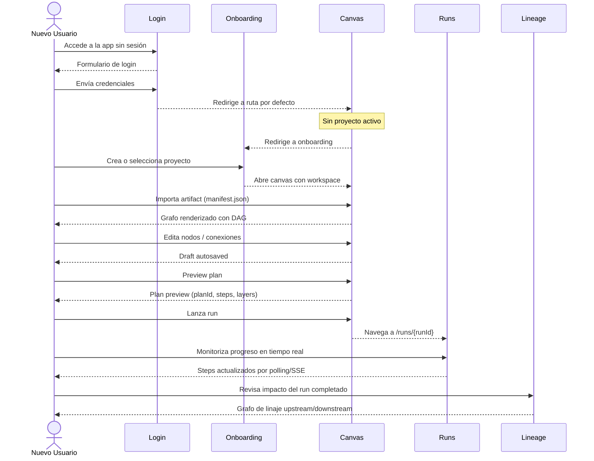

# DVT+ Web — Historias de Usuario (Mayo 2026)

**Plan-driven. Outcome-agnostic.**

Este documento recoge las historias de usuario resultantes de una revisión
completa del front-end de DVT+ (`apps/web/src`) realizada el 30 de mayo de
2026. Cada historia describe lo que un usuario esperaría que funcionase, anclada
al código fuente real de las vistas existentes.

Complementa el documento previo `web-user-stories-20260429.md` poniendo el
foco en:

1. El **viaje completo** del usuario desde login hasta ejecución.
2. El **estado actual real** de cada vista (implementado vs. mock/gap).
3. Las áreas menos cubiertas en el documento anterior: login, onboarding de
   proyecto, templates, workbench tabs del canvas y playground.

Formato Connextra ampliado:

> **Como** `<persona>` **quiero** `<capacidad>` **para** `<resultado>`.

Cada historia incluye criterios de aceptación y una etiqueta de prioridad:
`MVP` / `P1` / `P2`. Las etiquetas de estado indican si la funcionalidad está
`[Implementado]`, `[Parcial]` o `[Gap]` respecto al código revisado.

---

## Personas

| ID | Persona               | Descripción                                                          |
| -- | --------------------- | -------------------------------------------------------------------- |
| NU | Nuevo Usuario         | Primera vez que accede; necesita ser guiado hasta el canvas activo.  |
| DE | Data Engineer         | Construye modelos; crea plans; lanza runs.                           |
| DA | Data Analyst          | Consume linaje, costes y resultados sin modificar el grafo.          |
| TL | Tech Lead / Reviewer  | Revisa plans, diffs y aprueba cambios entre entornos.                |
| PA | Platform Admin        | Gestiona tenants, roles, capabilities y auditoría.                  |

---

## 1. Autenticación y sesión

**Anclaje:** `apps/web/src/app/views/LoginView.tsx`,
`apps/web/src/app/bootstrap/AuthRouteGate.tsx`

### S1.1 — Acceso por login con redirección post-auth `[Implementado]`

**Como** NU **quiero** acceder a la URL de la aplicación y ser redirigido al
login si no tengo sesión activa **para** no llegar a una pantalla en blanco o
a un error 401 confuso.

**Criterios:**

- La ruta `/login` es pública; no requiere bootstrap de capabilities ni platform
  health.
- Tras autenticarme correctamente soy redirigido a la ruta de entrada
  (`defaultCoreViewPath`), no siempre a `/canvas`.
- Si llego directamente a una URL protegida sin sesión, tras login soy
  redirigido a la URL original, no a la raíz.
- El estado de login no muestra pantalla de carga de capabilities (no aplica a
  rutas públicas).

**Prioridad:** MVP

### S1.2 — Sesión expirada sin pérdida de contexto `[Parcial]`

**Como** DE **quiero** que si mi sesión expira mientras trabajo el sistema me
lo indique y me devuelva al mismo punto tras re-autenticarme **para** no perder
el contexto de lo que estaba haciendo.

**Criterios:**

- Un 401 en cualquier query muestra un banner/overlay "Sesión expirada — clic
  para re-autenticar", no un error genérico.
- El draft del canvas local (IndexedDB / sessionStorage) no se borra al
  expirar la sesión.
- Tras re-autenticar, el draft se recupera y el usuario vuelve al canvas en
  el mismo estado.

**Prioridad:** P1

---

## 2. Onboarding de proyecto

**Anclaje:** `apps/web/src/app/views/ProjectOnboardingView.tsx`,
`apps/web/src/app/services/projectOnboarding/projectOnboardingService.ts`

### S2.1 — Crear un proyecto desde cero `[Implementado]`

**Como** NU **quiero** crear mi primer proyecto eligiendo tenant y nombre
**para** abrir el canvas con un workspace respaldado por el backend.

**Criterios:**

- El formulario lista los tenants disponibles; desactiva el campo de nombre si
  el tenant seleccionado no tiene permiso de creación (`canCreateProject:
  false`).
- Si `canCreateProject` es `false`, se muestra un aviso amber en lugar de
  ocultar el formulario.
- El botón de envío está deshabilitado si el nombre está vacío o el tenant no
  permite creación; nunca causa un error de red evitable.
- Errores de la API se muestran inline en el formulario, no como toast.
- Tras crear el proyecto, se navega automáticamente al canvas del proyecto
  recién creado.

**Prioridad:** MVP

### S2.2 — Seleccionar un proyecto existente `[Implementado]`

**Como** NU **quiero** ver la lista de proyectos a los que tengo acceso y abrir
uno con un click **para** no tener que crear uno si ya existe.

**Criterios:**

- El panel lateral muestra: nombre, projectId (truncado), botón "Abrir".
- El botón "Actualizar" (RefreshCw) recarga la lista sin recargar la página.
- Si no hay proyectos, se muestra "No hay proyectos disponibles" en lugar de
  lista vacía sin explicación.
- Abrir un proyecto redirige al canvas con el contexto correcto
  (tenantId + projectId + environmentId por defecto).

**Prioridad:** MVP

### S2.3 — Error al cargar el catálogo de proyectos `[Implementado]`

**Como** NU **quiero** ver un mensaje de error claro si el backend no devuelve
los proyectos **para** saber si es un problema mío o de la plataforma.

**Criterios:**

- El estado de error muestra el mensaje recibido del backend (no "algo fue
  mal").
- El formulario de creación permanece deshabilitado mientras el catálogo está
  en estado `failed`.
- Hay un mecanismo de reintento (botón de recarga o reintento automático).

**Prioridad:** MVP

---

## 3. Shell, bootstrap y navegación global

**Anclaje:** `apps/web/src/app/Root.tsx`, `shell/`, `bootstrap/`, `routes.ts`

### S3.1 — Pantalla de carga progresiva con pasos visibles `[Implementado]`

**Como** DE **quiero** ver qué está pasando durante el arranque de la aplicación
**para** no pensar que la app está rota cuando está inicializando.

**Criterios:**

- El bootstrap publica tres pasos: `capabilities`, `health`, `route`.
- Cada paso muestra estado `pending` / `complete` / `failed` con un mensaje
  descriptivo.
- Si un paso falla, no se muestran pasos posteriores como completados.
- El spinner desaparece al completar el último paso; nunca queda atascado.

**Prioridad:** MVP

### S3.2 — Banner de degradación de plataforma `[Implementado]`

**Como** DE **quiero** ver un banner persistente cuando el backend está
degradado o desconectado **para** no actuar sobre datos que pueden estar
obsoletos.

**Criterios:**

- El banner aparece cuando el platform health probe detecta degradación.
- Indica qué componente está degradado (API, Temporal, DB) con el nivel de
  severidad.
- No bloquea la navegación a rutas que no dependen del componente degradado.
- El banner desaparece automáticamente al restaurarse el servicio.

**Prioridad:** MVP

### S3.3 — Navegación lateral con indicación de ruta activa `[Implementado]`

**Como** DE **quiero** navegar entre las distintas secciones de la app
(Canvas, Runs, Artifacts, Diff, Lineage, Cost, Plugins, Admin) **para** acceder
a mis herramientas sin usar el historial del navegador.

**Criterios:**

- La ruta activa está visualmente destacada en la navegación lateral.
- Las rutas para las que el plugin no está habilitado redirigen a
  `defaultCoreViewPath` en lugar de mostrar un error 404.
- Cambiar de ruta cierra los modales abiertos en la ruta anterior (sin
  zombies).

**Prioridad:** MVP

### S3.4 — Gestión de capabilities en tiempo real `[Parcial]`

**Como** PA **quiero** que la UI refleje cambios de capabilities sin recargar
la app **para** activar o desactivar features sin interrupciones.

**Criterios:**

- `useCapabilitiesQuery` refresca periódicamente o vía SSE.
- Si una capability desaparece (plugin deshabilitado), la UI gatea la acción
  correspondiente y muestra un tooltip explicativo.
- Nunca se lanza una acción que el backend va a rechazar por falta de
  capability.

**Prioridad:** P1

---

## 4. Canvas — editor visual de grafo

**Anclaje:** `apps/web/src/app/views/Canvas.tsx`,
`apps/web/src/app/views/canvas/` (~160 archivos)

### S4.1 — Carga del canvas con draft existente `[Implementado]`

**Como** DE **quiero** que al entrar al canvas mi último draft se recupere
automáticamente **para** continuar donde lo dejé sin pasos manuales.

**Criterios:**

- La secuencia de arranque sigue: check de draft remoto → compare con local →
  aplicar política de hidratación (`canvasDraftLayoutHydrationPolicy`).
- Si el draft remoto es más reciente, se muestra un banner con opción
  "Usar remoto" / "Mantener local".
- Si no hay draft previo, el canvas arranca vacío y listo para importar.
- El estado del canvas no parpadea durante la hidratación (no renders
  intermedios con datos parciales).

**Prioridad:** MVP

### S4.2 — Paleta de nodos para añadir al grafo `[Implementado]`

**Como** DE **quiero** ver una paleta de nodos disponibles y añadirlos al
canvas con drag & drop o doble-click **para** construir el grafo sin recordar
la sintaxis de dbt.

**Criterios:**

- La paleta (`CanvasAddNodePalette`) agrupa nodos por tipo: sources, models,
  seeds, snapshots, tests, exposures.
- Filtro de búsqueda en la paleta.
- Al soltar en el canvas, el nodo aparece en la posición de drop y el grafo
  actualiza el layout si `auto-layout` está activado.
- Nodos no soportados por el plugin activo están deshabilitados con tooltip.

**Prioridad:** MVP

### S4.3 — Conexión de nodos con validación semántica `[Implementado]`

**Como** DE **quiero** conectar dos nodos con una arista y recibir feedback
inmediato si la conexión viola las reglas semánticas **para** no crear grafos
inválidos.

**Criterios:**

- Las reglas de conexión están gobernadas por
  `transformationConnectionGuard.ts`; las conexiones inválidas se rechazan
  con un mensaje específico, no genérico.
- Conexiones permitidas (source→model, model→model, etc.) se crean sin
  confirmación adicional.
- Aristas duplicadas se rechazan silenciosamente (no duplicados).
- Los ciclos son detectados y bloqueados antes de persistir la arista.

**Prioridad:** MVP

### S4.4 — Inspector de nodo con detalles `[Implementado]`

**Como** DE **quiero** seleccionar un nodo y ver su SQL compilado, dependencias
y configuración en el panel inspector **para** entender qué hace sin salir del
canvas.

**Criterios:**

- El panel inspector (`CanvasInspectorPanel`) se muestra al seleccionar un
  nodo único; se oculta al deseleccionar.
- Contenido mínimo: nombre, tipo, SQL compilado (Monaco read-only), lista de
  dependencias directas.
- Las dependencias son clickeables y centran el viewport en el nodo destino.
- Para múltiples nodos seleccionados, el inspector muestra resumen de
  selección, no detalle de un nodo arbitrario.

**Prioridad:** MVP

### S4.5 — Herramientas de la toolbar (layout, zoom, overlays) `[Implementado]`

**Como** DE **quiero** aplicar auto-layout, hacer zoom a la selección y
activar el overlay de impacto desde la toolbar **para** mantener el grafo
ordenado y legible.

**Criterios:**

- Toolbar (`CanvasToolbar`) contiene: auto-layout, fit-view, zoom in/out,
  impact overlay toggle, undo/redo (si implementado).
- El estado del draft (guardado / con cambios sin guardar) es visible en la
  toolbar (`CanvasToolbarDraftStatus`).
- Las acciones de mutación están deshabilitadas en modo read-only.
- Los controles de vista (zoom, fit) funcionan aunque no haya permiso de
  escritura.

**Prioridad:** MVP

### S4.6 — Conflicto de draft con otro usuario `[Implementado]`

**Como** DE **quiero** ser notificado si otro usuario modificó el draft del
mismo scope que estoy editando **para** no sobrescribir su trabajo sin saberlo.

**Criterios:**

- El banner de recuperación (`CanvasRecoveryBanner`) aparece cuando el backend
  detecta un conflicto de versión.
- Las opciones son: "Usar la versión del servidor" / "Mantener la mía" /
  "Ver diff".
- La resolución del conflicto queda en el audit log del draft.
- Resolver el conflicto no borra el historial local de cambios no sincronizados.

**Prioridad:** MVP

### S4.7 — Tabs del workbench canvas (Lineage, Diff, Code, Artifacts) `[Implementado]`

**Como** DE **quiero** abrir vistas complementarias (linaje, diff, código) en
tabs dentro del workbench del canvas **para** no perder el contexto del grafo
al consultar información relacionada.

**Criterios:**

- Las tabs del workbench (`CanvasWorkbenchTabStrip`) muestran solo las
  habilitadas por capabilities del runtime.
- La tab activa se refleja en la URL (`/canvas/:workbenchTab`) y es
  compartible.
- Cambiar de tab no resetea el estado del grafo principal.
- Las tabs deshabilitadas por falta de capability muestran tooltip con motivo.

**Prioridad:** P1

### S4.8 — Playground del canvas `[Implementado]`

**Como** DE **quiero** un área de playground para experimentar con el grafo
sin afectar al draft productivo **para** probar estructuras antes de
comprometerse.

**Criterios:**

- El playground (`CanvasPlaygroundHost`) tiene su propio estado desacoplado
  del draft guardado.
- Las acciones en playground no se persisten en el backend.
- Un badge o indicador visual distingue claramente el modo playground del modo
  draft real.
- El playground soporta las mismas operaciones de grafo que el modo normal
  (conexiones, paleta, inspector).

**Prioridad:** P2

### S4.9 — Duplicar un nodo `[Implementado]`

**Como** DE **quiero** duplicar un nodo existente en el canvas **para** crear
variantes sin configurar desde cero.

**Criterios:**

- Acción "Duplicate" en el menú contextual del nodo o en la toolbar de
  selección.
- El nodo duplicado aparece próximo al original con un nombre que indica
  copia (e.g., sufijo `_copy`).
- El duplicado hereda la configuración del original pero es independiente
  (cambiar uno no afecta al otro).
- La duplicación queda en el undo stack del draft.

**Prioridad:** P1

### S4.10 — Previsualizar plan antes de ejecutar `[Implementado]`

**Como** DE **quiero** obtener un preview del plan de ejecución resultante del
grafo actual **para** verificar el orden topológico y los steps antes de gastar
capacidad de warehouse.

**Criterios:**

- Botón "Preview Plan" en la toolbar del canvas, habilitado solo si el grafo
  es válido y el usuario tiene la capability necesaria.
- El panel de preview muestra: planId, número de steps, número de layers,
  estimación de coste si está disponible.
- Si el planner detecta ciclos, dependencias rotas o configuraciones inválidas
  muestra el error específico, no un modal genérico.
- El preview es determinístico: mismo grafo → mismo planId.

**Prioridad:** MVP

### S4.11 — Lanzar run desde el canvas `[Implementado]`

**Como** DE **quiero** lanzar un run del plan previsualizado con un click
**para** pasar de diseño a ejecución sin cambiar de herramienta.

**Criterios:**

- El botón "Run" solo está habilitado si el preview fue exitoso y el usuario
  tiene `run:start`.
- Al lanzar, se navega a `/runs/{runId}` con el run en estado `PENDING`.
- Si la admisión rechaza el run (backpressure, capability denegada) se muestra
  el motivo concreto, no "Error al lanzar".
- El `runId` queda asociado al draft activo para trazabilidad.

**Prioridad:** MVP

---

## 5. Runs — ejecuciones

**Anclaje:** `apps/web/src/app/views/RunsView.tsx`,
`apps/web/src/app/views/runs/`

### S5.1 — Lista de runs con estados diferenciados `[Implementado]`

**Como** DE **quiero** ver la lista de runs con su estado (PENDING, RUNNING,
COMPLETED, FAILED, CANCELLED) claramente diferenciado visualmente **para**
identificar de un vistazo qué está fallando.

**Criterios:**

- Cada run muestra: runId (corto), status con color, environment, startTime,
  duración.
- Los estados terminales (`COMPLETED`, `FAILED`, `CANCELLED`) tienen colores
  distintos y consistentes.
- El empty state diferencia "aún no hay runs" de "no hay runs que coincidan
  con tu filtro".
- La lista tiene paginación o carga incremental; no se carga todo el historial
  de golpe.

**Prioridad:** MVP

### S5.2 — Detalle de run con progreso en tiempo real `[Implementado]`

**Como** DE **quiero** abrir un run y ver el estado de cada step actualizándose
en tiempo real **para** saber dónde está atascada la ejecución sin recargar.

**Criterios:**

- Vista detalle con resumen global y lista de steps.
- Cada step muestra: status, intentos, tiempo de inicio, duración.
- El estado se actualiza por polling o SSE hasta que el run alcanza un estado
  terminal.
- Si el snapshot del run no está disponible, se muestra un overlay explícito
  "reconstruyendo estado" en vez de datos vacíos.

**Prioridad:** MVP

### S5.3 — Run no encontrado con guidance `[Implementado]`

**Como** DE **quiero** que si navego a un `runId` que no existe el sistema me
lo indique claramente **para** no pensar que el run simplemente está cargando.

**Criterios:**

- `RunMissingState` muestra: "Run `{runId}` no encontrado".
- Incluye un enlace para volver a la lista de runs.
- No se muestra spinner indefinido si el runId no existe.

**Prioridad:** MVP

### S5.4 — Error al cargar runs con mensaje descriptivo `[Implementado]`

**Como** DE **quiero** ver el mensaje de error específico cuando falla la carga
de la lista o del detalle **para** distinguir un problema de red de un problema
de permisos.

**Criterios:**

- `RunsErrorState` y `RunDetailErrorState` muestran el mensaje del error, no
  solo "Error al cargar".
- Hay un botón de reintento que no recarga la página entera.
- Si el error es 403, el mensaje indica "Sin permiso para ver runs".

**Prioridad:** P1

---

## 6. Lineage — linaje de nodos y columnas

**Anclaje:** `apps/web/src/app/views/LineageView.tsx`,
`apps/web/src/app/views/lineage/`

### S6.1 — Vista de linaje con grafo de dependencias `[Implementado]`

**Como** DA **quiero** ver el linaje upstream y downstream de un modelo en un
grafo visual **para** entender de dónde viene la data y a dónde va.

**Criterios:**

- La vista muestra el grafo de dependencias centrado en el nodo seleccionado.
- El conteo de nodos upstream, downstream y exposures se muestra en el resumen
  de impacto (`LineageImpactSummary`).
- La búsqueda filtra nodos por nombre con soporte fuzzy.

**Prioridad:** MVP

### S6.2 — Linaje a nivel columna `[Implementado]`

**Como** DA **quiero** ver cómo se transforma una columna específica a través
del linaje **para** trazar el origen de un campo hasta su fuente.

**Criterios:**

- Toggle `column-level` activa la vista de columnas (`LineageColumnPanel`).
- Si el nodo no tiene metadatos de columnas, se muestra
  `LineageMetadataMissingStateView` con el nombre del nodo, no un error 500.
- Las columnas muestran las transformaciones intermedias en las aristas
  cuando están disponibles.

**Prioridad:** P1

### S6.3 — Breadcrumb de navegación persistente `[Implementado]`

**Como** DA **quiero** una breadcrumb que recuerde los nodos que visité
**para** volver a un punto anterior sin usar el botón "atrás" del navegador.

**Criterios:**

- El `LineageBreadcrumb` muestra el path de nodos visitados en la sesión.
- Click en un item de la breadcrumb restaura el estado del nodo.
- La breadcrumb no crece indefinidamente; muestra los últimos N nodos.

**Prioridad:** P2

### S6.4 — Estado vacío de lineage con guidance `[Implementado]`

**Como** DA **quiero** ver un estado vacío informativo si no hay datos de
linaje disponibles **para** saber si necesito importar un artifact o si hay
un problema de backend.

**Criterios:**

- `LineageEmptyStateView` indica por qué no hay datos (no importado, sin
  snapshot, error de carga).
- El mensaje diferencia "no hay snapshot" de "error al cargar snapshot".
- Incluye un CTA apropiado ("Importa un artifact", "Reintentar").

**Prioridad:** P1

---

## 7. Diff — comparación entre versiones

**Anclaje:** `apps/web/src/app/views/DiffView.tsx`,
`apps/web/src/app/views/diff/`

### S7.1 — Comparar cambios entre dos versiones del grafo `[Implementado]`

**Como** TL **quiero** seleccionar dos versiones (Git SHAs o runs) y ver un
resumen de los cambios **para** saber qué modelos se añadieron, eliminaron o
modificaron.

**Criterios:**

- `DiffHeader` permite seleccionar el modo de comparación (Git SHA vs. Run)
  y filtrar por severidad.
- `DiffSummaryCards` muestra contadores: añadidos, eliminados, modificados.
- `DiffTabs` ofrece pestañas: Changes (lista), Compare (grafo), SQL (diff de
  código compilado).
- El estado vacío indica si no hay cambios o si los datos aún se están
  cargando.

**Prioridad:** P1

### S7.2 — Diff de SQL compilado entre versiones `[Implementado]`

**Como** TL **quiero** ver el diff del SQL compilado de un modelo entre dos
versiones **para** revisar exactamente qué cambió en la lógica.

**Criterios:**

- La pestaña SQL usa `MonacoDiffViewer` con highlighting de diferencias.
- Si no hay contenido de fichero disponible, se muestra un estado de error
  específico con el motivo (snapshot no disponible, sin permisos).
- El viewer es read-only; no permite editar directamente.

**Prioridad:** P1

### S7.3 — Filtrar cambios por severidad `[Implementado]`

**Como** TL **quiero** filtrar los cambios del diff por nivel de severidad
(breaking, non-breaking, info) **para** priorizar qué revisar.

**Criterios:**

- El selector de severidad en `DiffHeader` filtra la lista de cambios.
- Los cambios breaking tienen un indicador visual diferenciado (color rojo o
  icono de advertencia).
- El filtro se preserva al cambiar entre pestañas del diff.

**Prioridad:** P1

---

## 8. Code — visor de código

**Anclaje:** `apps/web/src/app/views/CodeView.tsx`,
`apps/web/src/app/views/code/`

### S8.1 — Navegar el árbol de ficheros del workspace `[Implementado]`

**Como** DE **quiero** ver el árbol de ficheros del workspace y abrir cualquier
fichero en el editor **para** revisar código sin clonar el repo localmente.

**Criterios:**

- `FileTreePanel` muestra el árbol con expand/collapse por carpeta.
- Click en un fichero lo carga en el editor Monaco central.
- El fichero seleccionado se mantiene resaltado en el árbol.
- El empty state del árbol indica "No hay ficheros en el workspace" cuando no
  hay ficheros disponibles.

**Prioridad:** P1

### S8.2 — Vista de código con Monaco read-only `[Implementado]`

**Como** DE **quiero** ver el contenido de un fichero con syntax highlighting
**para** revisar SQL, YAML u otros assets sin necesitar un editor local.

**Criterios:**

- El editor Monaco se inicializa con `readOnly: true`.
- El lenguaje se detecta automáticamente por extensión del fichero.
- Mientras el fichero carga, se muestra un mensaje de carga, no un editor vacío.
- Si hay un error al cargar el fichero, se muestra el error específico, no
  un editor vacío.

**Prioridad:** P1

### S8.3 — Historial de cambios de un fichero `[Implementado]`

**Como** DE **quiero** ver el historial de commits de un fichero seleccionado
**para** entender cuándo y por qué cambió.

**Criterios:**

- El panel derecho (`CodeFileHistoryPanel`) muestra el historial del fichero
  activo.
- Cada entrada muestra: SHA corto, mensaje de commit, autor, fecha.
- El historial tiene estado de carga y error explícitos.
- Si el fichero no tiene historial (nuevo o sin commits), se muestra lista
  vacía con mensaje explicativo.

**Prioridad:** P1

### S8.4 — Buffer editable local con advertencia `[Parcial]`

**Como** DE **quiero** ser advertido claramente si el buffer local tiene
cambios no sincronizados con el backend **para** no confundir mis ediciones
locales con el estado productivo.

**Criterios:**

- `WorkbenchDegradedState` muestra un banner "Buffer local" cuando el
  contenido del editor diverge del estado del backend.
- El banner incluye nota explicando que los cambios no se guardan
  automáticamente en el backend.
- El banner desaparece cuando el buffer vuelve a coincidir con el servidor.

**Prioridad:** P1

---

## 9. Cost — costes y observabilidad

**Anclaje:** `apps/web/src/app/views/CostView.tsx`,
`apps/web/src/app/views/cost/`

> ⚠️ **Estado actual:** La vista está implementada pero los datos de coste
> real dependen de un contrato backend que aún está en desarrollo. En ausencia
> de datos reales, la vista muestra KPIs en cero o empty state.

### S9.1 — KPIs de coste por entorno `[Parcial]`

**Como** TL **quiero** ver el coste total, número de runs, coste medio y
número de alertas activas en un dashboard **para** detectar tendencias de
gasto anómalas.

**Criterios:**

- `CostStatGrid` muestra cuatro KPIs: total spend, runs count, avg cost per
  run, cost alerts count.
- Los valores se actualizan al cambiar el run enfocado (`currentRun`).
- El run enfocado activo se muestra en el header con su `runId`.
- Si no hay datos, los KPIs muestran "–" o "0", no valores vacíos sin formato.

**Prioridad:** P1

### S9.2 — Gráficos de coste por run y por modelo `[Parcial]`

**Como** TL **quiero** ver gráficos de coste por run y por warehouse model
**para** identificar visualmente qué runs o modelos son más costosos.

**Criterios:**

- `CostCharts` renderiza: coste por run (línea o barras) y duración por
  modelo (horizontal bar).
- Los gráficos muestran empty state informativo cuando no hay datos.
- Hover en un punto muestra el runId y el valor exacto.

**Prioridad:** P1

### S9.3 — Lista de alertas de coste `[Parcial]`

**Como** PA **quiero** ver las alertas de coste activas con su motivo y
severidad **para** priorizar acciones de control de gasto.

**Criterios:**

- `CostAlertsList` muestra cada alerta con: tipo, descripción, threshold y
  valor actual.
- Las alertas tienen indicadores visuales de severidad (warning / critical).
- El estado vacío de alertas indica explícitamente "No hay alertas activas".

**Prioridad:** P1

### S9.4 — Cobertura de cost attribution `[Parcial]`

**Como** PA **quiero** saber qué porcentaje de nodos y runs tienen datos de
coste atribuidos **para** valorar la fiabilidad de los KPIs.

**Criterios:**

- `CostCoverageCard` muestra el ratio nodos con coste / total y la duración
  total.
- Si la cobertura es baja (< 50%), se muestra una advertencia.

**Prioridad:** P2

---

## 10. Artifacts — gestión de artifacts de dbt

**Anclaje:** `apps/web/src/app/views/ArtifactsView.tsx`,
`apps/web/src/app/views/artifacts/`

### S10.1 — Importar manifest.json por drag & drop `[Implementado]`

**Como** DE **quiero** importar un `manifest.json` de dbt soltándolo en la
vista de artifacts **para** cargar el grafo del proyecto sin configuración
manual.

**Criterios:**

- `ManifestImportPanel` acepta drag & drop y file picker.
- La validación del schema ocurre antes de persistir; errores se muestran
  inline con contexto (`ArtifactsInvalidImportStateView`).
- Tras importar, se muestran estadísticas del artifact: # nodos, # sources,
  # tests.
- El artifact importado aparece en la `ArtifactsList` con metadatos.

**Prioridad:** MVP

### S10.2 — Ver preview del artifact importado `[Implementado]`

**Como** DE **quiero** ver un preview del contenido del artifact (JSON con
syntax highlighting) **para** confirmar que importé el archivo correcto.

**Criterios:**

- `ArtifactPreviewTabs` muestra pestañas para cada artifact disponible
  (manifest, run_results, catalog).
- El JSON se muestra con Monaco en modo read-only con syntax highlighting.
- Artefactos grandes se cargan de forma lazy; no se bloquea la UI.

**Prioridad:** P1

### S10.3 — Estado de workspace artifacts `[Implementado]`

**Como** DE **quiero** ver los artifacts activos en el workspace del backend
**para** saber con qué versión estoy trabajando.

**Criterios:**

- La vista muestra los artifacts del workspace (remote) y los importados
  localmente en la misma `ArtifactsList`.
- Cada artifact muestra: tipo, gitSha (cuando disponible), fecha de import.
- Si hay un error al cargar los artifacts del workspace se muestra
  `ArtifactsErrorStateView` con el mensaje específico.

**Prioridad:** P1

---

## 11. Admin — gestión de plataforma y RBAC

**Anclaje:** `apps/web/src/app/views/AdminView.tsx`,
`apps/web/src/app/views/admin/`

### S11.1 — Dashboard de salud de plataforma `[Implementado]`

**Como** PA **quiero** un panel con el estado de salud de los componentes de
la plataforma **para** detectar problemas antes de que los usuarios los
reporten.

**Criterios:**

- `AdminPlatformTab` muestra: estado de API, estado de conexión, capabilities
  cargadas, estado del health snapshot.
- Errores de capabilities (`capabilitiesError`) se muestran con un indicador
  visual claro.
- El estado de conexión (`connectionStatus`) es actualizado en tiempo real.

**Prioridad:** MVP

### S11.2 — Gestión de roles `[Implementado]`

**Como** PA **quiero** ver la lista de roles definidos en el sistema **para**
entender qué permisos tiene cada actor.

**Criterios:**

- `AdminRolesTab` muestra la lista de roles con sus acciones.
- Cada rol muestra el scope al que aplica (tenant / project / environment).

**Prioridad:** P1

### S11.3 — Matriz de permisos `[Implementado]`

**Como** PA **quiero** ver la matriz de permisos de todos los roles en una
visualización tabular **para** entender quién puede hacer qué de un vistazo.

**Criterios:**

- `AdminPermissionsTab` muestra roles como columnas y acciones como filas (o
  viceversa).
- Los permisos concedidos están marcados visualmente (check / color).
- La matriz es filtrable por acción o rol.

**Prioridad:** P1

### S11.4 — Audit log con búsqueda `[Implementado]`

**Como** PA **quiero** buscar en el audit log por actor, acción o rango
temporal **para** investigar incidentes post-mortem.

**Criterios:**

- `AdminAuditTab` muestra el log filtrado por `searchQuery`.
- La búsqueda aplica sobre las entradas del log en tiempo real (client-side
  filtering o server-side según el tamaño).
- Cada entrada muestra: timestamp, actor, acción, scope, resultado.
- El log tiene un empty state diferenciado: "No hay entradas" vs. "Tu búsqueda
  no tiene resultados".

**Prioridad:** P1

### S11.5 — Navegación entre tabs por URL `[Implementado]`

**Como** PA **quiero** poder compartir un link que abra directamente la tab
correcta del admin (platform, roles, permissions, audit) **para** enviar un
link directo a un compañero.

**Criterios:**

- La tab activa se refleja en el query param `?tab=<tabId>`.
- La URL es shareable: abrir el link abre la misma tab.
- El fallback al tab por defecto (`platform`) es robusto ante valores de tab
  inválidos en la URL.

**Prioridad:** P1

---

## 12. Plugins — gestión y descubrimiento

**Anclaje:** `apps/web/src/app/views/PluginsView.tsx`,
`apps/web/src/app/views/plugins/`

### S12.1 — Estado de capabilities de la plataforma `[Implementado]`

**Como** PA **quiero** ver qué capabilities están disponibles en la plataforma
actual **para** entender qué features están activas.

**Criterios:**

- `PluginsViewHeader` muestra el resumen de capabilities cargadas.
- `PluginsPrimarySurface` muestra el estado del probe de capabilities:
  loading, disponible o error.
- Si el probe falla, se muestra el error (`capabilitiesError`) con opción de
  reintento.

**Prioridad:** P1

### S12.2 — Feedback de estado del probe de capabilities `[Implementado]`

**Como** PA **quiero** saber si el probe de capabilities está activo, en
error o sin datos **para** diagnosticar problemas de configuración del
runtime.

**Criterios:**

- `probeStatus` distingue: loading, ready, error.
- El estado de error indica si el problema es de red o de respuesta inválida
  del servidor.
- El estado ready muestra cuántas capabilities están activas.

**Prioridad:** P1

---

## 13. Templates — plantillas de ejecución

**Anclaje:** `apps/web/src/app/views/TemplatesView.tsx`,
`apps/web/src/app/views/templates/`

> ⚠️ **Estado actual:** La vista de templates existe con datos locales
> (sin conexión al backend). Los templates disponibles son estáticos
> (`resolveExecutionTemplateSelection`). Esta es un área con gap de integración.

### S13.1 — Seleccionar una plantilla de ejecución `[Parcial]`

**Como** DE **quiero** seleccionar una plantilla de ejecución predefinida
(e.g., Snowflake Task) **para** configurar rápidamente un run sin conocer
todos los parámetros de bajo nivel.

**Criterios:**

- La lista de templates muestra: nombre, descripción, parámetros requeridos.
- Al seleccionar una template, los campos de parámetros se pre-rellenan con
  valores por defecto (`createDefaultExecutionTemplateValues`).
- Cambiar de template preserva los valores ya rellenados de templates
  anteriores (no se borran).

**Prioridad:** P1

### S13.2 — Editar parámetros de una plantilla `[Parcial]`

**Como** DE **quiero** editar los valores de los parámetros de una plantilla
**para** ajustar la ejecución a mi contexto (entorno, warehouse, configuración
de retry).

**Criterios:**

- Cada parámetro tiene: label, tipo (string, número, booleano, selector),
  descripción y valor actual.
- Los cambios de parámetros se preservan por template en la sesión.
- Un botón de "Resetear a defaults" restaura los valores por defecto.

**Prioridad:** P1

### S13.3 — Integración de templates con plan/run `[Gap]`

**Como** DE **quiero** lanzar un run usando la template configurada desde el
canvas o desde la propia vista de templates **para** usar la configuración
personalizada sin repetirla manualmente.

**Criterios:**

- La selección de template en la vista de Templates se propaga al momento de
  lanzar un plan desde el Canvas.
- El planId o runId resultante hace referencia a la template utilizada.
- Si el backend no soporta templates aún, se muestra un estado explícito
  "Templates: pendiente de integración backend" en lugar de un flujo que
  falla silenciosamente.

**Prioridad:** P1

---

## 14. Gaps identificados en la revisión

Esta sección recoge los gaps observados entre el estado actual de la UI y lo
que un usuario esperaría que funcionase.

| ID    | Vista       | Gap                                                                  | Impacto |
| ----- | ----------- | -------------------------------------------------------------------- | ------- |
| G-01  | Canvas      | Source import wizard deshabilitado en modo `api` (backend pendiente) | Alto    |
| G-02  | Canvas      | Undo/redo del draft no está expuesto en la toolbar                   | Medio   |
| G-03  | Canvas      | Selección de subgrafo para run parcial no está implementada          | Medio   |
| G-04  | Runs        | Sin filtros de runs por status, env o rango temporal                 | Alto    |
| G-05  | Runs        | Cancelar/pausar/reanudar pendiente de integración backend            | Alto    |
| G-06  | Runs        | Streaming de logs por step no disponible                             | Medio   |
| G-07  | Cost        | Datos reales de coste pendientes de contrato backend                 | Alto    |
| G-08  | Lineage     | Linaje de columna dependiente de metadata de OpenLineage disponible  | Medio   |
| G-09  | Diff        | Diff visual sobre el grafo (overlay verde/rojo) no implementado      | Medio   |
| G-10  | Templates   | Templates son estáticas; no hay integración con backend              | Alto    |
| G-11  | Admin       | Asignación/revocación de roles no disponible en la UI                | Alto    |
| G-12  | Admin       | Rebuild snapshot action no expuesta en la UI                         | Medio   |
| G-13  | Shell       | Cambio de tenant/project/env no implementado en el scope selector    | Alto    |

---

## Apéndice — viaje completo del usuario tipo

---

*Documento generado a partir de revisión de código del 30 de mayo de 2026.
Anclado a `apps/web/src/app/views/` en el estado de la rama `main`.
Complementa `web-user-stories-20260429.md` sin sustituirlo.*
