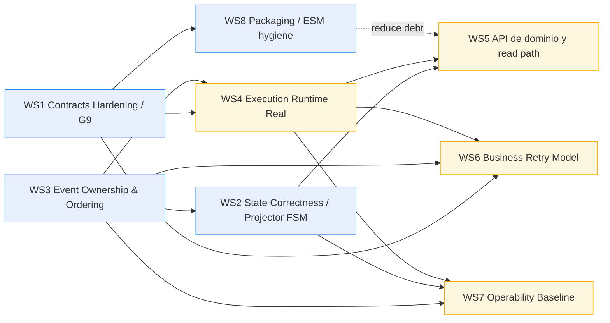

# DVT+ — Plan de trabajo paralelo, dependencias y puntos abiertos

## 1. Objetivo

Traducir el review `20260314 Review` a un plan operativo que permita:

1. cerrar los huecos estructurales más peligrosos,
2. organizar trabajo en paralelo sin crear acoplamiento nuevo,
3. dejar explícitas las dependencias reales entre frentes,
4. separar implementación inmediata de decisiones aún abiertas.

Este documento asume como invariantes:

- **La UI no ejecuta.**
- **El engine no decide.**
- **El planner no persiste estado.**
- **El state store sigue siendo la fuente de verdad.**
- **Temporal sigue siendo la primera implementación real; Conductor no debe arrastrar el roadmap inmediato.**

---

## 2. Lectura ejecutiva del review

### 2.1 Qué está validado

La base conceptual sigue siendo válida:

- separación Planner / Engine / State / UI,
- `IWorkflowEngine` pequeño y correcto,
- `PlanRef` como transporte, no el plan completo,
- estado persistido como truth source,
- idempotencia como invariante.

### 2.2 Qué bloquea el valor real

Los bloqueos reales no son de “visión”, sino de **correctness, contratos y operabilidad**:

1. `stepTypeConfig` sigue siendo un blob opaco.
2. `SnapshotProjector` no valida transiciones de estado.
3. El ownership de eventos está partido y ambiguo.
4. `executeStep` sigue siendo stub; el engine aún no ejecuta valor real.
5. La API no tiene endpoints de dominio mínimos.
6. No existe modelo cerrado de retry funcional a nivel de negocio.
7. No hay base operativa mínima seria: retention, circuit breaker, SLA/backpressure.

### 2.3 Conclusión operativa

El siguiente avance del proyecto no debe ser “más arquitectura”, sino **cerrar el núcleo ejecutable y consistente**.

---

## 3. Principios de ejecución del plan

### 3.1 Qué no vamos a hacer ahora

- No abrir plugin runtime real.
- No perseguir paridad con Conductor.
- No construir cost dashboards avanzados.
- No ampliar `IWorkflowEngine`.
- No aceptar más extensibilidad sobre contratos opacos.

### 3.2 Qué sí vamos a forzar

- contratos tipados y validados,
- state transitions legales y auditables,
- ownership explícito de eventos,
- engine realmente ejecutable,
- API de dominio mínima,
- base operativa suficiente para no engañarnos con un “MVP” que no aguanta.

---

## 4. Workstreams paralelos

> Regla: se puede trabajar en paralelo solo si el workstream no rompe invariantes del resto y si sus salidas están definidas por contrato.

## WS1 — Contracts Hardening / G9

**Objetivo**

Cerrar el hueco de `stepTypeConfig: Record<string, unknown>`.

**Tareas**

- Definir `StepKind` y catálogo inicial cerrado.
- Crear `StepTypeRegistry` con schema por kind.
- Introducir validación compartida planner ↔ adapter.
- Eliminar lecturas ad hoc de blobs desde `adapter-temporal`.
- Definir shape explícita para:
  - timeout,
  - retry/backoff,
  - concurrency,
  - custom config validada.
- Añadir tests negativos por config inválida.

**Salida esperada**

- contrato fuerte por step kind,
- fallo temprano en parse/validation,
- desaparición del riesgo de drift planner/adapter.

**Bloquea**

- WS4 Execution Runtime,
- WS8 Plugin/Extension groundwork.

**Puede arrancar ya**

- Sí.

---

## WS2 — State Correctness / Projector FSM

**Objetivo**

Evitar corrupción silenciosa del snapshot.

**Tareas**

- Definir máquina de estados explícita para run y step.
- Formalizar tabla de transiciones legales.
- Rechazar o marcar como inválidos eventos fuera de secuencia.
- Definir política ante eventos duplicados o tardíos.
- Añadir tests:
  - positivos,
  - negativos,
  - replay,
  - ordering conflict.
- Decidir si el evento inválido:
  - se ignora,
  - falla el projector,
  - va a dead-letter / quarantine.

**Salida esperada**

- snapshot coherente,
- transición ilegal detectable,
- base segura para polling/UI.

**Bloquea**

- WS5 API/Read Models fiables,
- WS7 Operability parcial.

**Puede arrancar ya**

- Sí.

---

## WS3 — Event Ownership & Ordering

**Objetivo**

Cerrar la ambigüedad de quién emite qué y por qué.

**Tareas**

- Redactar ADR corto de ownership de eventos.
- Clasificar eventos por origen:
  - engine-originated,
  - adapter-originated,
  - domain-originated,
  - system/reconciliation-originated.
- Definir el orden semántico mínimo esperado.
- Decidir si se mantiene dual producer o se unifica el write path.
- Revisar implicaciones sobre outbox, projector y snapshots.
- Definir contrato de idempotencia por cada tipo de evento.

**Salida esperada**

- ownership explícito,
- menor riesgo de race conditions conceptuales,
- base clara para reconciliación y observabilidad.

**Bloquea**

- WS2 FSM final,
- WS4 Runtime,
- WS7 Outbox/Operability.

**Puede arrancar ya**

- Sí.

---

## WS4 — Execution Runtime Real

**Objetivo**

Sustituir el scaffold por ejecución útil.

**Tareas**

- Implementar `executeStep` real.
- Cerrar al menos el camino MVP:
  - `DBT_COMPILE`,
  - `DBT_RUN`,
  - `DBT_TEST`.
- Garantizar emisión de eventos y outputs reales.
- Alinear retries/timeouts con el contrato endurecido.
- Definir policy de step failure.
- Añadir integration tests end-to-end con state assertions.

**Salida esperada**

- runs con valor real,
- step lifecycle real,
- base para demo interna y pruebas de API/UI.

**Bloquea**

- WS5 API funcional útil,
- cualquier validación seria de operabilidad.

**Depende de**

- WS1 obligatorio,
- WS3 en versión mínima.

---

## WS5 — API de dominio y read path

**Objetivo**

Hacer usable el sistema desde fuera del core.

**Tareas**

- Implementar endpoints mínimos:
  - `POST /runs`,
  - `GET /runs`,
  - `GET /runs/:id`,
  - `POST /runs/:id/signal`.
- Definir DTOs versionados.
- Exponer snapshots y detalles de run de forma estable.
- Añadir SSE o canal de live updates mínimo.
- Definir errores de dominio consumibles por UI/CLI.
- Añadir authz y tenant scoping desde el principio.

**Salida esperada**

- camino API → state → UI/CLI real,
- desacople del frontend respecto a mocks,
- superficie mínima de producto.

**Depende de**

- WS2 para confiar en snapshots,
- WS4 para que haya runs de verdad.

**Puede arrancar parcialmente ya**

- Sí, en diseño de contratos y handlers; no en cierre final.

---

## WS6 — Business Retry Model

**Objetivo**

Cerrar el hueco funcional de “re-run desde fallo / desde step N”.

**Tareas**

- Elegir modelo exacto de retry funcional:
  - rerun completo,
  - rerun desde step fallido,
  - rerun desde subgrafo afectado,
  - create-new-run vs new-attempt-same-run.
- Definir semántica de `logicalAttemptId`.
- Definir impacto en lineage, audit y state history.
- Definir API/command model.
- Alinear con planner selection model.

**Salida esperada**

- feature de retry con semántica estable,
- no solo retry técnico del engine.

**Depende de**

- WS1,
- WS3,
- WS4.

**Puede arrancar ya**

- Sí, a nivel de diseño y ADR.

---

## WS7 — Operability Baseline

**Objetivo**

Evitar un sistema “demoable” pero inoperable.

**Tareas**

- Definir retention tiers para:
  - `run_events`,
  - `run_snapshots`,
  - `outbox`,
  - `outbox_dead_letter`.
- Implementar circuit breaker / degradación para `enrichRunStatus`.
- Definir backlog thresholds y backpressure mínimo del outbox.
- Introducir alertas mínimas:
  - run stuck,
  - outbox backlog,
  - snapshot lag,
  - adapter timeout ratio.
- Definir defaults operativos seguros:
  - `continueAsNewAfterLayerCount`,
  - polling interval,
  - max batch size.

**Salida esperada**

- baseline de operación real,
- menor riesgo de crecimiento ciego y timeouts encadenados.

**Depende de**

- WS2,
- WS3,
- parcialmente WS4.

**Puede arrancar ya**

- Sí, en diseño y métricas; no todo en implementación final.

---

## WS8 — Packaging / ESM hygiene

**Objetivo**

Eliminar deuda estructural transversal de packaging.

**Tareas**

- Migrar `@dvt/contracts` a ESM limpio.
- Revisar exports y imports internos.
- Eliminar workarounds con dynamic import.
- Validar consumo desde apps y packages ESM.
- Añadir checks de CI para evitar regresión CJS/ESM.

**Salida esperada**

- menos fricción de integración,
- menos deuda invisible en bootstrap y consumers.

**Bloquea**

- no bloquea el núcleo funcional,
- pero reduce deuda recurrente.

**Puede arrancar ya**

- Sí, como workstream independiente.

---

## 5. Mapa de paralelismo y dependencias

### Lectura del mapa

- **WS1 + WS2 + WS3 + WS8** son los cuatro frentes que pueden abrirse ya.
- **WS4** arranca en paralelo en parte, pero no debe cerrarse hasta tener WS1 y un mínimo de WS3.
- **WS5** no debe darse por “hecho” hasta que WS2 y WS4 estén razonablemente cerrados.
- **WS6** no debe implementarse a ciegas; primero necesita contratos y runtime real.
- **WS7** puede diseñarse en paralelo, pero su implementación final depende de haber cerrado la semántica de eventos y snapshots.

---

## 6. Matriz de dependencias resumida

| Workstream          | Puede empezar ya | Dependencia dura        | Entregable clave                | Desbloquea              |
| ------------------- | ---------------: | ----------------------- | ------------------------------- | ----------------------- |
| WS1 Contracts / G9  |               Sí | Ninguna                 | StepTypeRegistry + schemas      | WS4, WS6                |
| WS2 Projector FSM   |               Sí | WS3 parcial recomendado | State machine + tests           | WS5, WS7                |
| WS3 Event ownership |               Sí | Ninguna                 | ADR + taxonomy + ordering model | WS2, WS4, WS7           |
| WS4 Runtime real    |          Parcial | WS1 + WS3 mínimo        | `executeStep` real              | WS5, WS6, WS7           |
| WS5 API dominio     |          Parcial | WS2 + WS4               | endpoints + live updates        | UI/CLI real             |
| WS6 Business retry  |        Diseño sí | WS1 + WS3 + WS4         | retry model estable             | producto real           |
| WS7 Operability     |        Diseño sí | WS2 + WS3 + WS4 parcial | retention + CB + alerting base  | producción interna      |
| WS8 ESM hygiene     |               Sí | Ninguna                 | `@dvt/contracts` ESM            | menos deuda transversal |

---

## 7. Propuesta de lanes de trabajo en paralelo

## Lane A — Contracts & semantics

Incluye:

- WS1 Contracts / G9
- WS3 Event ownership
- parte de WS6 (solo diseño)

**Perfil**

Arquitectura + core contracts.

**Riesgo si no se cierra**

Todo lo demás se construye sobre tipos débiles y ownership ambiguo.

---

## Lane B — State correctness

Incluye:

- WS2 Projector FSM
- parte de WS7 (snapshot lag / event invalidation)

**Perfil**

Core state / event sourcing / correctness.

**Riesgo si no se cierra**

El sistema parecerá funcionar mientras degrada snapshots silenciosamente.

---

## Lane C — Runtime execution

Incluye:

- WS4 Runtime real
- soporte mínimo a signals/cancel si es necesario para el MVP

**Perfil**

Engine + adapter Temporal + dbt integration.

**Riesgo si no se cierra**

No hay producto, solo scaffolding.

---

## Lane D — Surface usable product

Incluye:

- WS5 API de dominio
- wire-up mínimo con frontend/CLI

**Perfil**

API / application services / transport contracts.

**Riesgo si no se cierra**

No existe recorrido de usuario real.

---

## Lane E — Platform hygiene

Incluye:

- WS8 ESM hygiene
- parte de WS7 operability baseline

**Perfil**

Platform / dev experience / packaging / runtime protection.

**Riesgo si no se cierra**

Se arrastran bugs estructurales y deuda invisible.

---

## 8. Orden recomendado de ejecución

## Fase 0 — Arranque inmediato

Abrir en paralelo:

- WS1
- WS2
- WS3
- WS8

## Fase 1 — Cierre del núcleo ejecutable

Abrir y cerrar después:

- WS4

## Fase 2 — Camino de usuario real

Después de tener WS2 + WS4 suficientemente cerrados:

- WS5
- WS6

## Fase 3 — Operabilidad mínima seria

Con semántica y runtime ya cerrados:

- WS7

---

## 9. Definición de “done” por bloque

## WS1 Done

- no existe `Record<string, unknown>` como contrato operativo de step config,
- cada `StepKind` tiene schema validado,
- planner y adapter consumen el mismo contrato,
- tests negativos pasan.

## WS2 Done

- existe máquina de estados explícita,
- transición ilegal no corrompe snapshot,
- replay y ordering tests pasan.

## WS3 Done

- ADR aprobado,
- ownership de eventos documentado,
- cada evento tiene origen, semántica e idempotency scope definidos.

## WS4 Done

- `executeStep` deja de ser stub,
- pipeline mínimo compile/run/test funciona,
- genera eventos reales y outputs reales,
- integration tests green.

## WS5 Done

- se pueden crear runs, consultar runs, consultar un run y enviar signal,
- la UI/CLI deja de depender de mocks,
- tenant scoping mínimo está aplicado.

## WS6 Done

- existe un único modelo de business retry,
- `logicalAttemptId` tiene semántica inequívoca,
- el API lo expone de forma coherente.

## WS7 Done

- retention policy definida y aplicada al menos en baseline,
- circuit breaker/degraded mode existe,
- hay alertas básicas y thresholds definidos.

## WS8 Done

- `@dvt/contracts` exporta ESM limpio,
- no quedan workarounds de import dinámico,
- CI protege contra regresión.

---

## 10. Puntos abiertos pendientes de discutir

## A. Ownership exacto de eventos

1. ¿`RunStarted` debe seguir siendo adapter-originated o pasar al engine/application layer?
2. ¿Qué eventos deben ser estrictamente persistidos antes de notificar downstream?
3. ¿Aceptamos dual producer con reglas explícitas o se fuerza un único camino de escritura?

## B. Política ante eventos inválidos

1. ¿Evento ilegal = ignore, fail, quarantine o dead-letter?
2. ¿Qué severidad operacional tiene una transición ilegal?
3. ¿Debe bloquear lectura del snapshot o solo marcarlo como sospechoso?

## C. Business retry model

1. ¿Retry crea nuevo run o nuevo attempt del mismo run?
2. ¿Se permite retry desde un step o desde un subgrafo?
3. ¿Qué semántica tiene en audit trail y lineage?
4. ¿Cómo se refleja en UI y API?

## D. Temporal vs Conductor

1. ¿Conductor queda formalmente como `degraded mode`?
2. ¿Se congela fuera de Phase 2 real?
3. ¿Se exige capability matrix explícita por adapter?

## E. Modelo de snapshots y lag

1. ¿Qué SLA aceptamos para snapshot freshness durante runs activos?
2. ¿La UI lee solo snapshot o mezcla snapshot + tail events?
3. ¿Qué política hay cuando el snapshot está atrasado respecto al event log?

## F. Operability baseline

1. ¿Qué retention tiering queremos exactamente?
2. ¿Cuál es el threshold de outbox backlog que debe alertar?
3. ¿Dónde vive el circuit breaker: adapter, service wrapper o engine?
4. ¿Qué defaults operativos son obligatorios y no configurables a cero?

## G. Packaging / ESM

1. ¿La migración a ESM se hace de una vez o con compat intermedia?
2. ¿Qué packages del monorepo siguen siendo candidatos a drift CJS/ESM?

## H. Plugin system

1. ¿Se congela totalmente hasta cerrar WS1, WS2, WS3 y WS4?
2. ¿Qué boundary exacto tendrán los plugins respecto a runtime y state?
3. ¿Se prohíbe explícitamente cualquier ejecución de plugin dentro del workflow deterministic path?

---

## 11. Decisiones que conviene congelar ya

1. **No ampliar `IWorkflowEngine`.**
2. **No reabrir `PlanRef` como transporte.**
3. **No tocar el modelo de idempotency key salvo causa excepcional.**
4. **No abrir plugins ni marketplace antes de cerrar contratos y sandbox.**
5. **No gastar tiempo en cost attribution avanzado antes del camino API/run real.**

---

## 12. Recomendación final

Si hay que priorizar sin dispersión:

### Ahora

- WS1
- WS2
- WS3
- WS8

### Inmediatamente después

- WS4

### Cuando el núcleo sea real

- WS5
- WS6

### Después, sin autoengaño de “producción”

- WS7

La secuencia correcta no es “hacer más piezas”. Es **cerrar semántica, luego ejecución real, luego superficie de producto, y solo después operabilidad seria**.
