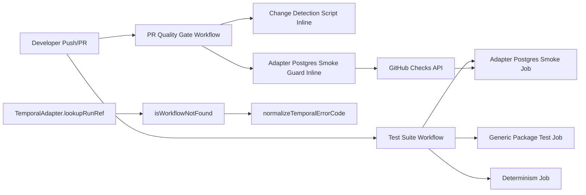
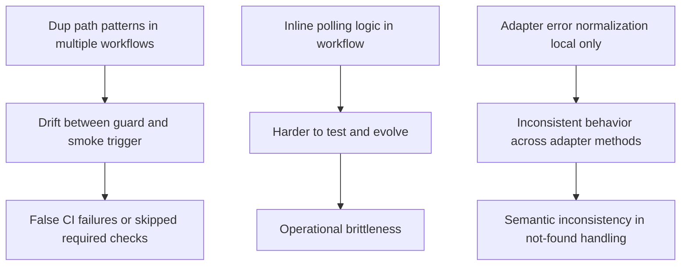
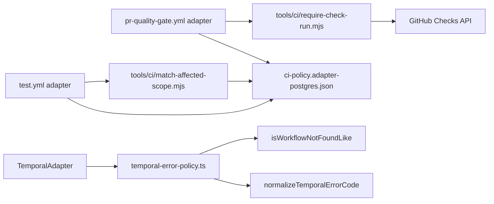
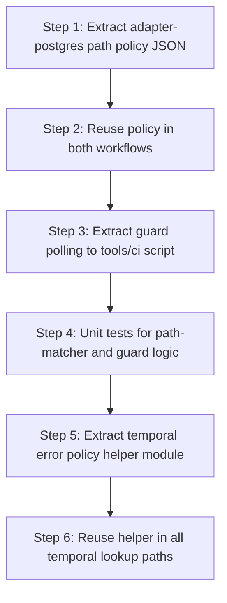

# 20260323 SOLID DDD Hexagonal CI and Adapters Review

## Scope

Files reviewed for improvement opportunities:

- `.github/workflows/test.yml`
- `.github/workflows/pr-quality-gate.yml`
- `packages/@dvt/adapter-temporal/src/TemporalAdapter.ts`
- `packages/@dvt/adapter-temporal/test/TemporalAdapter.lookupRunRef.test.ts`

## Executive Summary

The recent changes improve robustness and CI coverage, but there are structural
opportunities to better align with SOLID, DDD, and Hexagonal architecture.

Main opportunities:

1. Extract CI policy logic out of YAML into versioned scripts/config.
2. Remove duplicated path-matcher knowledge across workflows.
3. Treat workflow files as adapters and domain-like policy checks as
   application services.
4. Consolidate Temporal error-code normalization as reusable adapter utility.

## Current Architecture Map

## Findings By Principle

### SOLID

- SRP opportunity: `pr-quality-gate.yml` contains both orchestration and
  business-like validation logic (path policy + polling strategy).
- OCP opportunity: path pattern changes require editing multiple YAML files.
- DIP opportunity: workflow jobs depend directly on GitHub API call details
  instead of a single repository script abstraction.

### DDD

- Ubiquitous language drift risk: CI policy concepts (`adapter_postgres_relevant`
  vs `adapter_postgres_changed`) can diverge if not centrally modeled.
- Temporal adapter language is improving; normalization belongs to an explicit
  adapter error-policy artifact, not only inside one function.

### Hexagonal

- Workflow files are currently mixed adapter + policy.
- Better separation: YAML as adapter, script module as policy port implementation.

## Risk Topology

## Proposed Target Design

## Refactor Plan (Incremental)

## Actionable Improvements

1. Create `tools/ci/policy/adapter-postgres-relevance.json` and load it from
   both workflows.
2. Move check-run polling into `tools/ci/require-check-run.mjs`.
3. Add unit tests:
   - policy matcher test suite
   - guard timeout/conclusion matrix test suite
4. Introduce `packages/@dvt/adapter-temporal/src/temporalErrorPolicy.ts` and
   export classifier helpers.
5. Keep `test.yml` job split (smoke + full tests) but derive both from one
   relevance matcher.

## SOLID / DDD / Hexagonal Acceptance Conditions

- Single source of truth for adapter-postgres relevance patterns.
- No inline duplicated path policy across CI workflows.
- Guard behavior testable without editing workflow YAML.
- Temporal not-found classification reusable and centrally named.
- Workflow YAML reduced to orchestration and wiring only.

## Expected Benefits

- Lower CI drift probability.
- Easier future scope expansion (new adapters, new mandatory checks).
- Clearer boundary between policy and platform adapter code.
- More consistent adapter error semantics.
