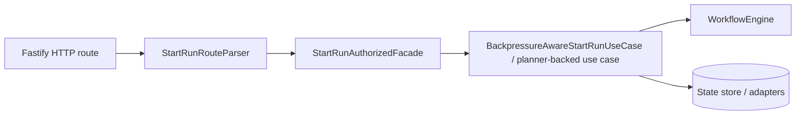

# 20260323 StartRun Route Parser QA Review

- Reviewed change: `split-start-run-engine` slice for `startRunRoute` parser hardening, boundary alignment, and start-run orchestration
- Review type: hard QA / contract compliance review
- Verdict: **Accept**

## 1. Governing sources used

- [AGENTS.md](../../../AGENTS.md)
- [Governance Document And Rule Inventory](../status/governance-document-rule-inventory.md)
- [Execution Workboard](../state/execution-workboard.md)
- [Open Task Route](../state/open-task-route.md)
- [ExecutionPlan.v2 / PlannerInputEnvelopeV2](../../../packages/@dvt/contracts/src/contracts/planner/ExecutionPlan.v2.ts)
- [Planner Input Envelope Validator](../../../packages/@dvt/planner/src/domain/InputEnvelopeValidator.ts)
- [StartRun route](../../../apps/api/src/entrypoints/http/startRunRoute.ts)
- [StartRun planner-backed use case](../../../apps/api/src/application/services/PlannerBackedStartRunUseCase.ts)
- [Workflow engine](../../../packages/@dvt/engine/src/core/WorkflowEngine.ts)
- [StartRun route tests](../../../apps/api/test/entrypoints/http/startRunRoute.test.ts)

## 2. Executive summary

The slice now has the right negative coverage:

- empty `selection`
- whitespace-only `selection`
- invalid `planRef` shape
- `planRef` exclusivity against `graphSource`, `manifestRef`, `manifest`, and `nodes`

The API parser is deterministic and the tests close the regression gaps that were called out in the earlier QA pass.

The parser now aligns the API boundary with the planner contract:

- `startRunRoute` accepts `selection: []`
- `PlannerInputValidator` accepts `selectedNodeIds: []`

That removes a boundary-specific invariant that did not belong in the HTTP adapter.

## 3. Findings

### 3.1. `startRunRoute` now mirrors the planner contract for empty selection

The route parser no longer invents a stricter `selection` rule than the planner boundary.

That is the right hexagonal outcome:

- planner boundary: empty `selectedNodeIds` is accepted
- API boundary: empty `selection` is also accepted and forwarded unchanged

Severity: **Resolved in this slice**

### 3.2. Coverage is now complete for the previously missing parser edges

The added tests cover the right failure modes and close the regression gaps:

- `selection: []`
- `selection: ['   ']`
- `planRef` object shape corruption
- `planRef` plus all planner-source variants

Severity: **Resolved in this slice**

### 3.3. No type drift found in the start-run orchestration path

`PlannerBackedStartRunUseCase` still maps the command into `PlannerInputEnvelopeV2` without introducing new ad hoc types.
`WorkflowEngine` remains the execution boundary and does not leak planner parsing logic into the core.

Severity: **None**

## 4. Risks

- **Medium**: public API and planner contract are not aligned on empty selection handling.
  - Impact: valid planner-compatible inputs may be rejected at the HTTP boundary.
  - Probability: moderate, because the rule is now locked by tests but not documented in the contract layer.

## 5. Tests reviewed

- `apps/api/test/entrypoints/http/startRunRoute.test.ts`
- `packages/@dvt/planner/test/unit/input-envelope-validator.test.ts`
- `apps/api/test/application/services/PlannerBackedStartRunUseCase.test.ts`
- `apps/api/test/application/services/engineStartRunUseCase.test.ts`

## 6. QA verdict

**Accept**

## 7. Boundary diagram

The route is now a thin adapter:

- HTTP concern: parse and map the request
- application concern: decide admission, idempotency, and command execution
- core concern: run lifecycle and intent consistency

This is the target shape for the current slice.
